# 人工智能—机器学习中的数学（七月在线出品） - P8：偏度和峰度 📊

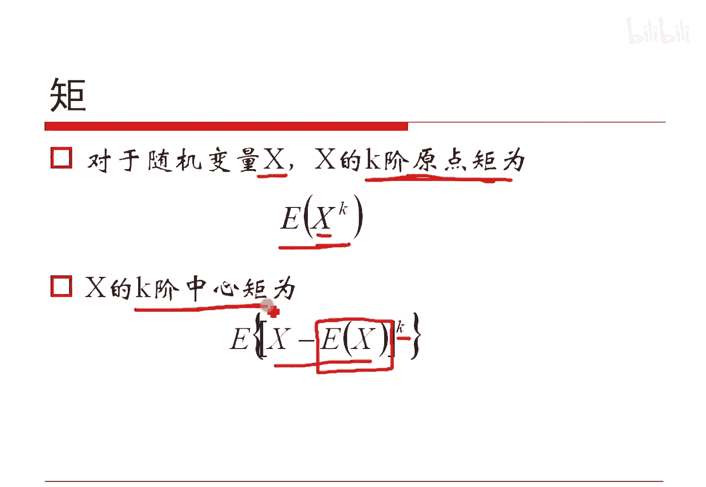

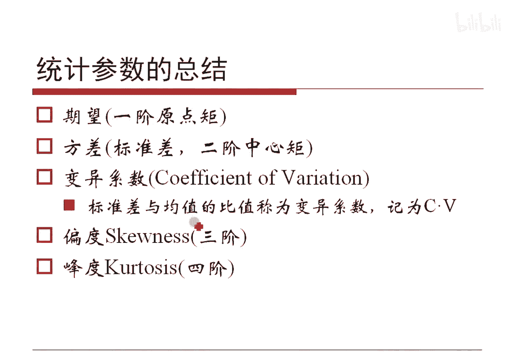

在本节课中，我们将要学习两个重要的统计量：偏度和峰度。它们是期望和方差的延伸，能够帮助我们更深入地理解数据分布的形状特征，例如分布的不对称性和陡峭程度。

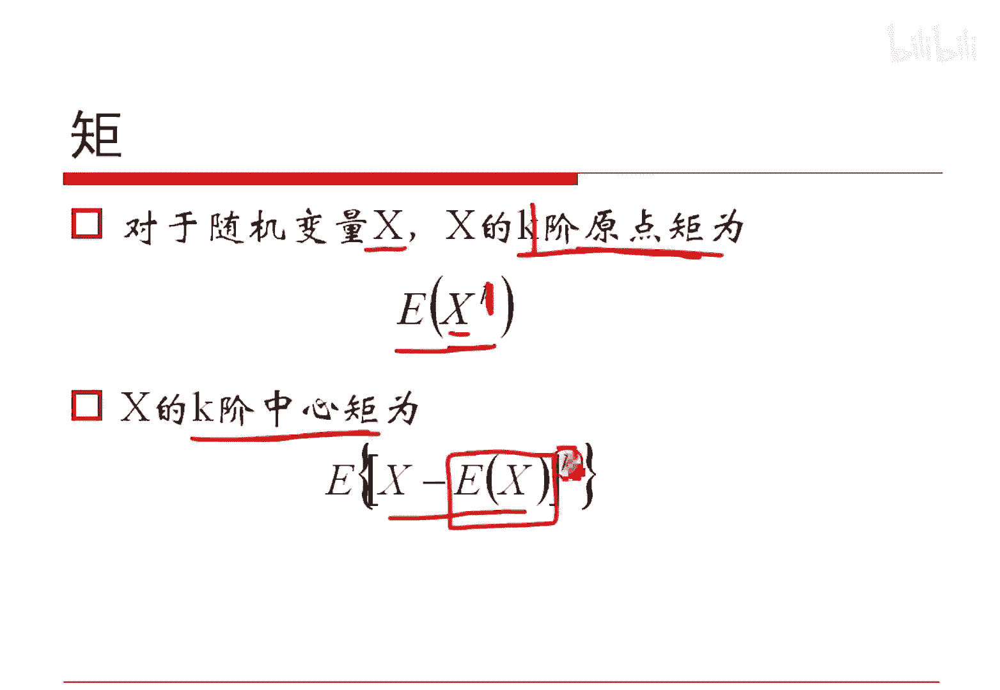

## 矩的概念 📐

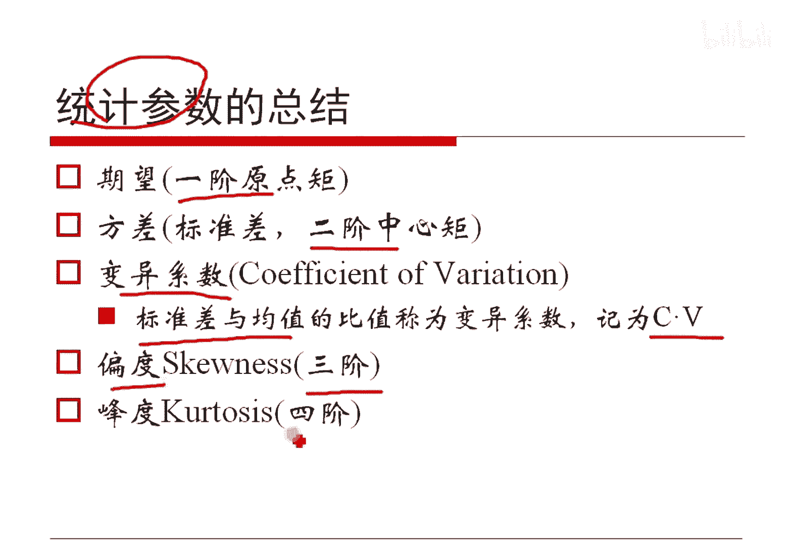

上一节我们介绍了期望和方差，本节中我们来看看更一般的“矩”的概念。矩的概念来源于物理学中的力矩，在统计学中，它被用来描述随机变量的分布特征。

对于一个随机变量X，我们定义两种矩：

*   **K阶原点矩**：定义为随机变量X的K次幂的期望，即 **E[X^K]**。
*   **K阶中心矩**：定义为随机变量X减去其期望后的K次幂的期望，即 **E[(X - E[X])^K]**。

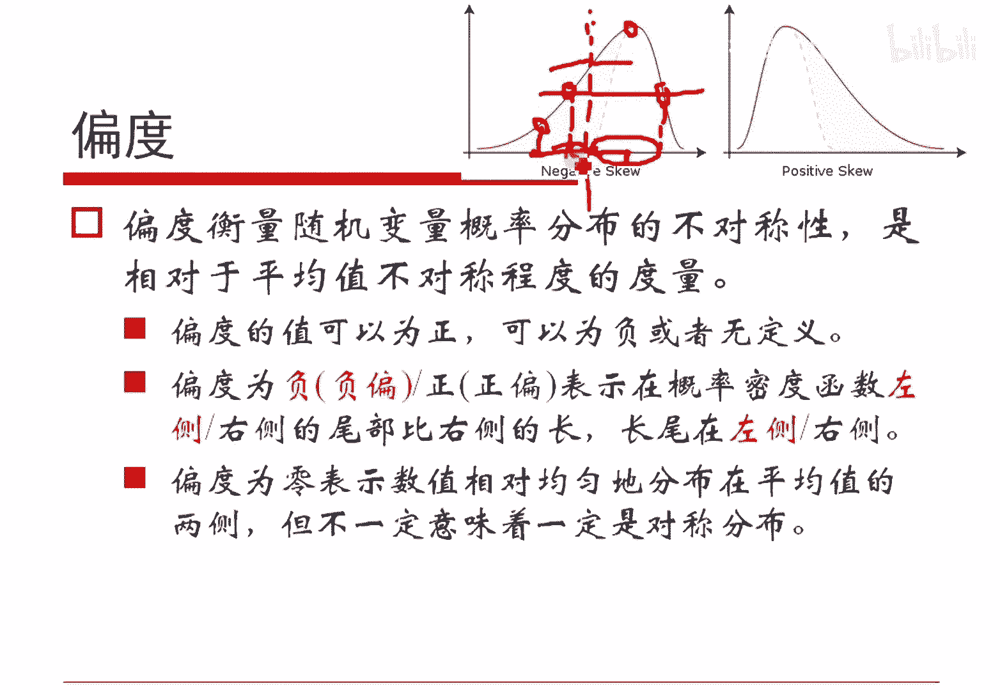

从这个定义出发，我们可以发现：
*   期望（一阶矩）其实就是 **K=1时的一阶原点矩**。
*   方差（二阶矩）其实就是 **K=2时的二阶中心矩**。

因此，期望和方差是矩的特例。我们还可以构造更高阶的矩来刻画分布的其他特性。

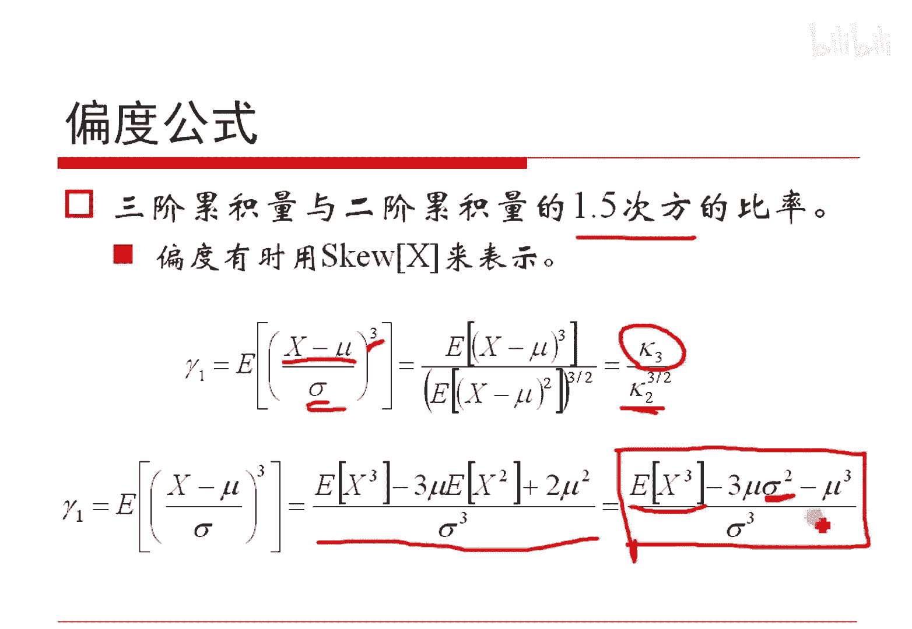

## 偏度：衡量分布的不对称性 ⚖️

偏度用于衡量概率分布的不对称性，即数据围绕其均值（期望）的对称程度。

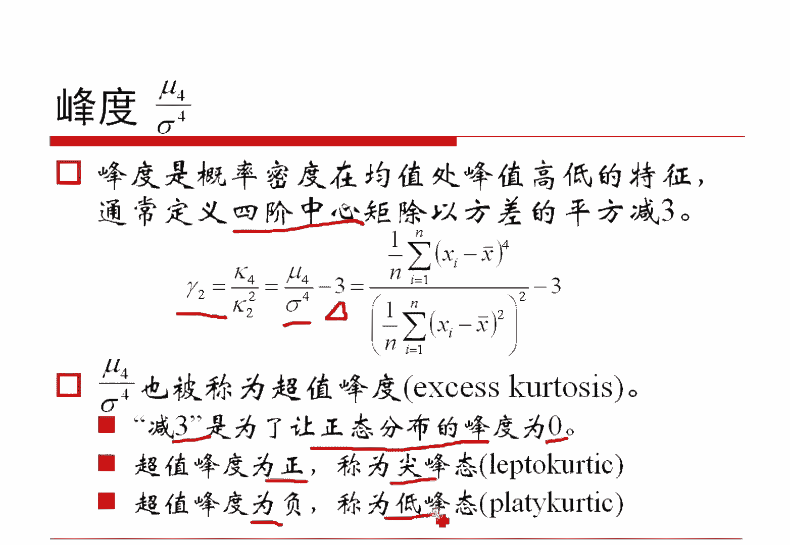

以下是偏度的几种情况：
*   **偏度为负（左偏）**：分布的左尾较长，数据集中在右侧。均值通常位于众数左侧。
*   **偏度为零**：分布大致对称，数据均匀分布在均值两侧（但不一定完全对称）。
*   **偏度为正（右偏）**：分布的右尾较长，数据集中在左侧。均值通常位于众数右侧。

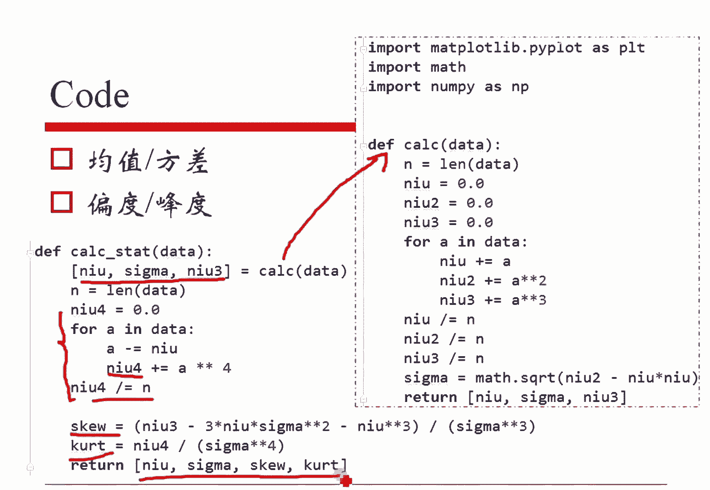

偏度的计算公式如下，它基于三阶中心矩，并进行了标准化以消除量纲影响：
**偏度 = E[(X - μ)^3] / σ^3**
其中，μ是期望，σ是标准差。

在实践中，为了计算方便，我们常使用以下等价公式：
**偏度 = (E[X^3] - 3μE[X^2] + 2μ^3) / σ^3**

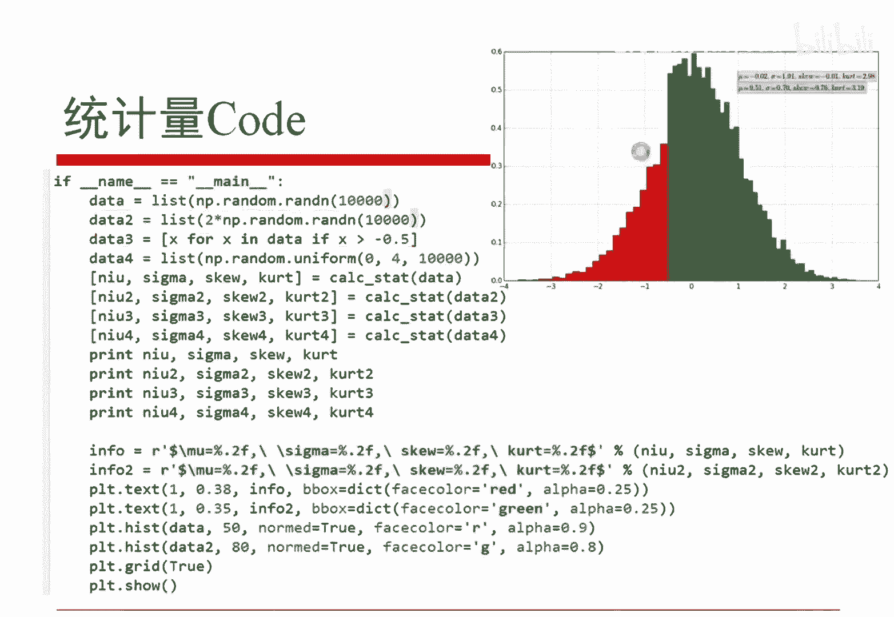

## 峰度：衡量分布的陡峭程度 🏔️

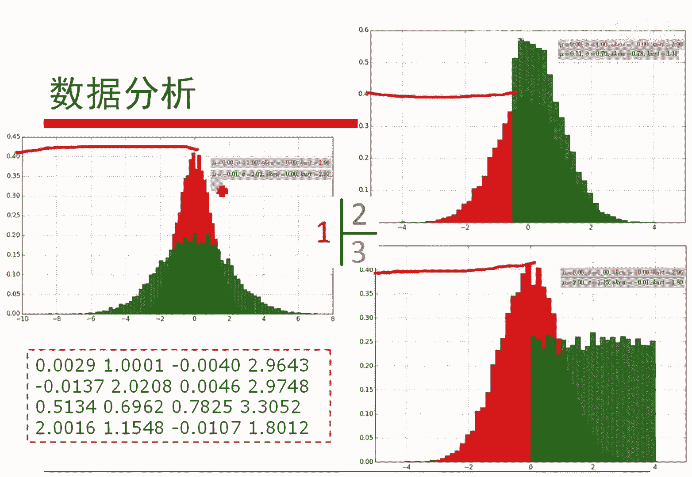

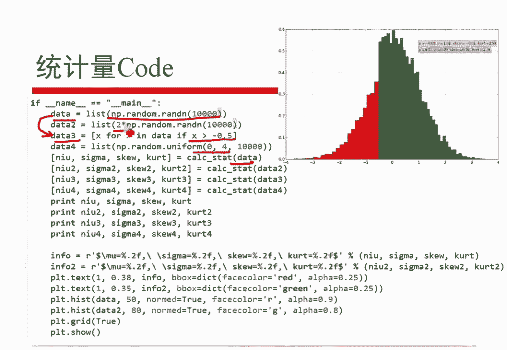

峰度用于衡量概率分布的陡峭程度，即数据在均值附近的集中程度和尾部的厚度。

以下是峰度的几种情况（通常指超额峰度，即原始峰度减3）：
*   **峰度 > 0（尖峰）**：分布比正态分布更陡峭，尾部更厚。
*   **峰度 = 0**：分布的陡峭程度与正态分布相同。
*   **峰度 < 0（低峰）**：分布比正态分布更平缓，尾部更薄。

峰度的计算公式基于四阶中心矩：
**峰度 = E[(X - μ)^4] / σ^4**
由于正态分布的峰度值为3，为了便于比较，我们常使用“超额峰度”：
**超额峰度 = E[(X - μ)^4] / σ^4 - 3**
这样，正态分布的超额峰度就为0。

## 实例分析：不同分布的偏度与峰度 🔬

为了直观理解偏度和峰度，我们通过代码生成几种不同的数据分布并进行分析。

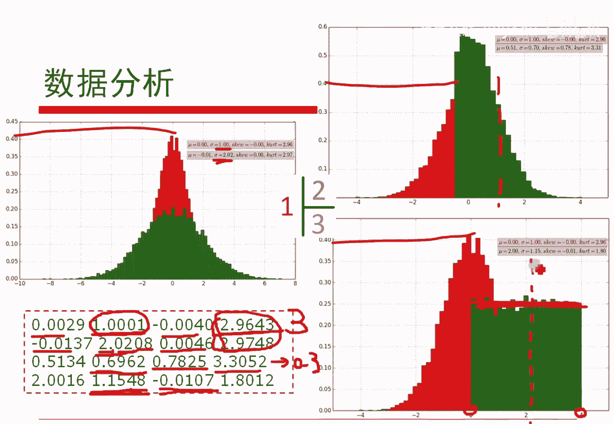

以下是生成和分析数据的核心步骤：
1.  生成数据：标准正态分布、方差放大的正态分布、截断的正态分布（取右半部分）、均匀分布。
2.  计算统计量：分别计算每个数据集的均值、标准差、偏度和峰度。
3.  可视化比较：绘制各数据分布的直方图，并标注计算出的统计量。

通过对比分析，我们可以观察到：
*   标准正态分布及其方差放大版：偏度接近0，峰度接近3（超额峰度接近0），说明它们是对称且陡峭程度与正态分布一致的。
*   截断的正态分布（右半部分）：偏度为正，峰度大于3，说明分布右偏且更加陡峭。
*   均匀分布：偏度接近0，峰度远小于3（超额峰度为负），说明分布对称但非常平缓。

这个实验表明，偏度和峰度需要结合其他统计量（如方差）一起分析，才能全面描述数据的分布形态。例如，方差不同的两个正态分布可能有相同的峰度。

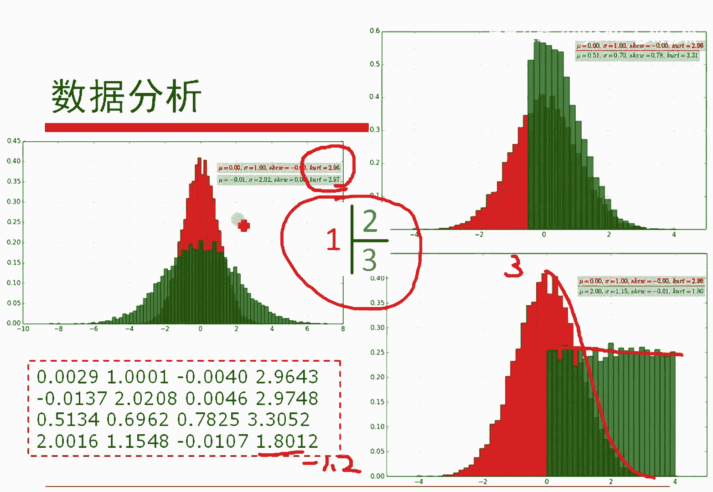

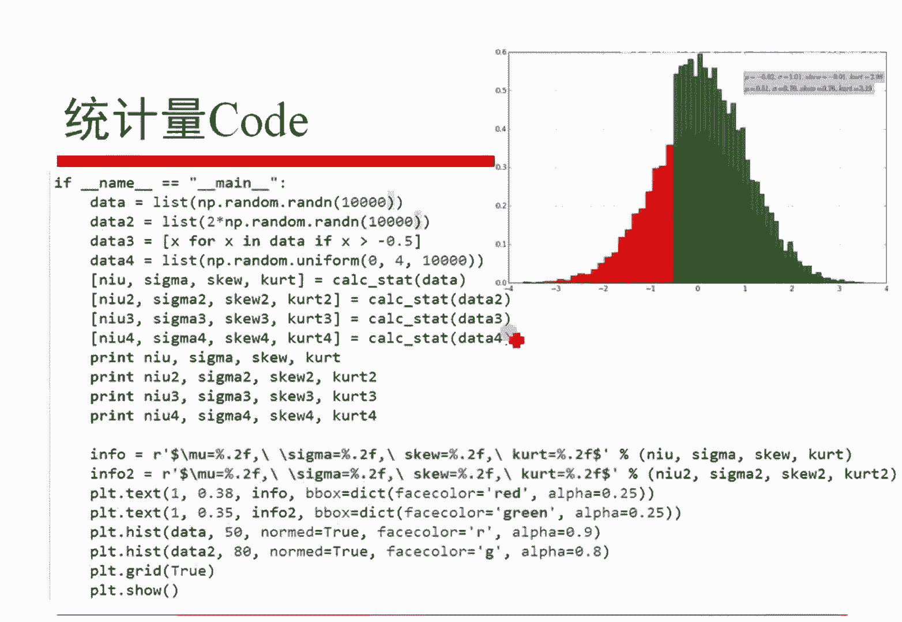

## 切比雪夫不等式：方差的实际意义 📉

最后，我们探讨一个与方差紧密相关的重要不等式——切比雪夫不等式。它揭示了方差的物理意义：方差越小，随机变量的取值越集中在期望附近。

对于任意随机变量X（期望为μ，方差为σ²）和任意正数ε，切比雪夫不等式指出：
**P(|X - μ| ≥ ε) ≤ σ² / ε²**
其等价形式为：
**P(|X - μ| < ε) ≥ 1 - σ² / ε²**

这个不等式说明，X的取值落在期望μ附近ε范围内的概率至少为 `1 - σ²/ε²`。方差σ²越小，这个概率的下界就越大，意味着X越可能集中在期望附近。

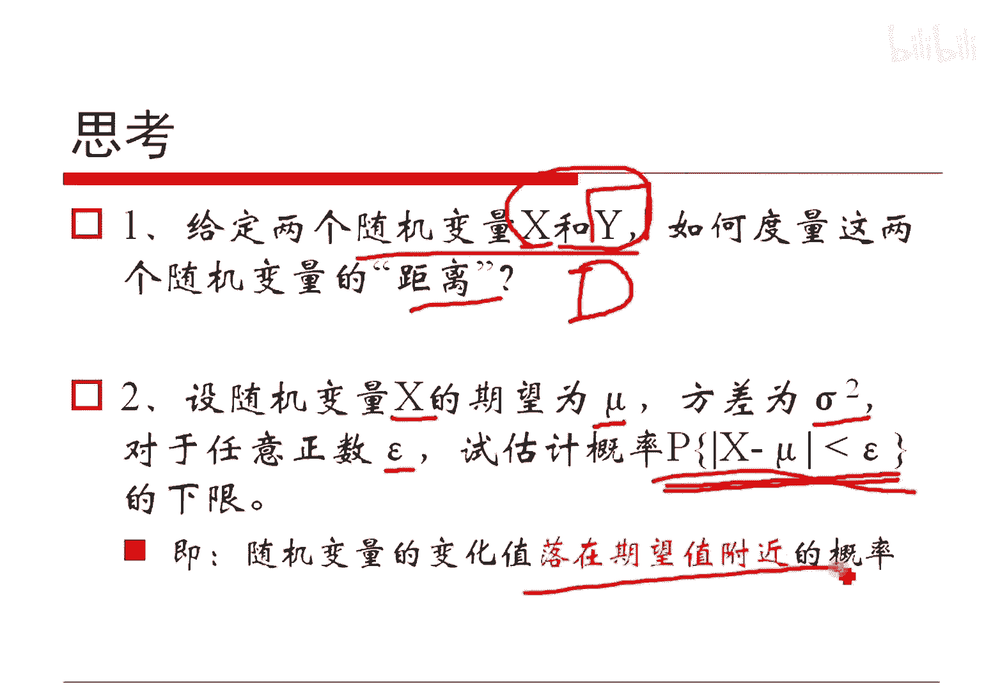

## 总结 📝

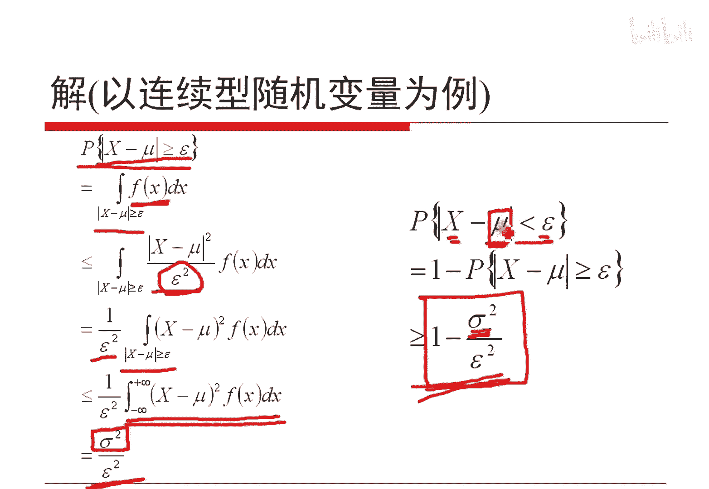

本节课中我们一起学习了：
1.  **矩的概念**：理解了K阶原点矩和中心矩的定义，并认识到期望和方差是矩的特例。
2.  **偏度**：学习了如何用三阶中心矩衡量分布的不对称性（左偏、对称、右偏）。
3.  **峰度**：学习了如何用四阶中心矩衡量分布的陡峭程度（尖峰、常峰、低峰），并引入了超额峰度的概念。
4.  **实例分析**：通过编程实践，观察了不同分布下偏度和峰度的表现，加深了对这两个统计量的理解。
5.  **切比雪夫不等式**：了解了该不等式的含义，它从概率上严格阐述了方差越小，数据越集中在期望附近的这一直观认识。

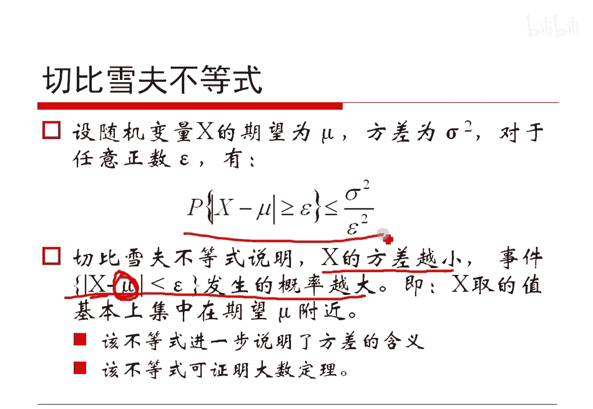

掌握偏度和峰度，能帮助我们在进行数据分析时，超越均值和方差，对数据分布的形状有更精细的把握。