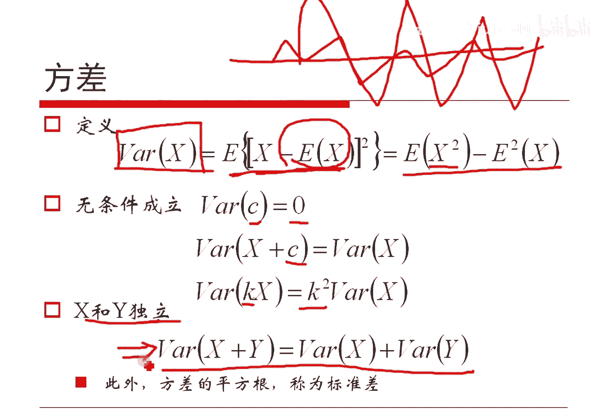

# 人工智能—机器学习中的数学（七月在线出品） - P9：期望和方差 📊

在本节课中，我们将学习概率论中的两个核心概念：期望与方差。我们将从定义出发，理解其直观含义，并通过具体的面试题来应用这些知识，最后总结方差与标准差的关系。

## 期望的定义与性质 📈

上一节我们介绍了概率分布的基本概念，本节中我们来看看如何描述一个随机变量的“平均水平”，这就是期望。

期望是概率加权下的平均值。对于一个离散型随机变量 \(X\)，其期望 \(E(X)\) 定义为：
\[
E(X) = \sum_{i} x_i p_i
\]
其中 \(x_i\) 是 \(X\) 可能的取值，\(p_i\) 是 \(X\) 取值为 \(x_i\) 的概率。

对于一个连续型随机变量，其期望定义为：
\[
E(X) = \int_{-\infty}^{\infty} x f(x) dx
\]
其中 \(f(x)\) 是 \(X\) 的概率密度函数。加和与积分在本质上是相同的操作。

我们可以将期望理解为用概率作为权重的均值。如果去掉概率权重 \(p_i\)，对所有取值简单平均，就是普通的算术平均；加上 \(p_i\)，就是以概率为权重的加权平均。

根据期望的定义，我们可以推导出一些无条件成立的公式。

以下是期望的几个基本性质：
*   **线性性质**：若 \(a\) 和 \(b\) 是常数，则 \(E(aX + b) = aE(X) + b\)。证明可以直接由定义得出。
*   **可加性**：对于任意两个随机变量 \(X\) 和 \(Y\)，有 \(E(X + Y) = E(X) + E(Y)\)。这个性质无条件成立，无论 \(X\) 与 \(Y\) 是否独立。
*   **独立变量的乘积**：如果随机变量 \(X\) 和 \(Y\) 相互独立，那么有 \(E(XY) = E(X)E(Y)\)。需要注意的是，这个性质是有条件成立的（需要独立性）。由 \(E(XY) = E(X)E(Y)\) 可以推出 \(X\) 与 \(Y\) 不相关，但反之不成立，即“不相关”不能推出“独立”。

## 期望的应用：一道面试题解析 💡

上一节我们介绍了期望的基本性质，本节中我们来看看如何利用这些性质解决一个实际问题。

题目如下：给定100个数，分别是1, 2, 3, ..., 99 和 2015。从这100个数中任意选取若干个数（可以全选、全不选或选一部分），对选出的所有数进行按位异或（XOR）操作，求这个异或结果的期望值。

首先，我们需要理解“异或”操作。对于单个比特位，异或的规则是：相同为0，不同为1。也可以理解为不考虑进位的二进制加法。一个关键特性是：奇数个1进行异或，结果为1；偶数个1进行异或，结果为0。

解题思路是**按位计算**。因为期望具有可加性，整个数的异或期望等于其每一位的异或期望之和。2015是这100个数中最大的，其二进制形式决定了我们只需要考虑11个比特位（因为 \(2^{10}=1024, 2^{11}=2048\)）。

我们考察第 \(i\) 位（记该位的值为随机变量 \(X_i\)）。在这100个数的第 \(i\) 位上，假设有 \(N\) 个1和 \(M\) 个0。题目条件保证了对于这11位中的任何一位，\(N \ge 1\)（即至少有一个1）。

对于某一次抽样，我们在第 \(i\) 位上抽到了 \(k\) 个1。根据异或特性，只有当 \(k\) 为奇数时，该位的异或结果 \(X_i\) 才为1。因此，计算 \(X_i\) 的期望，等价于计算抽到奇数个1的概率。

以下是计算该概率的过程：
1.  从 \(N\) 个1中抽取 \(k\) 个（\(k\) 为奇数），取法有 \(\sum_{k\ odd} C_N^k\) 种。
2.  对于 \(M\) 个0，可以任意选取（每个0都可选可不选），因此有 \(2^M\) 种取法。
3.  总的可能选取方式（从 \(N+M\) 个数中任选若干）有 \(2^{N+M}\) 种。
4.  因此，抽到奇数个1的概率为：\(\frac{(\sum_{k\ odd} C_N^k) \cdot 2^M}{2^{N+M}} = \frac{\sum_{k\ odd} C_N^k}{2^N}\)。

根据二项式定理的性质，奇数项系数之和等于偶数项系数之和，都等于 \(2^{N-1}\)。因此，上述概率为：
\[
\frac{2^{N-1}}{2^N} = \frac{1}{2}
\]
这意味着，对于任何 \(N \ge 1\) 的位，其异或结果为1的概率恒为 \(1/2\)，即 \(E(X_i) = 1/2\)。

现在计算总的期望 \(E(X)\)。设第 \(i\) 位的权重为 \(2^i\)，则：
\[
E(X) = E(\sum_{i=0}^{10} 2^i X_i) = \sum_{i=0}^{10} 2^i E(X_i) = \sum_{i=0}^{10} 2^i \cdot \frac{1}{2} = \frac{1}{2} \sum_{i=0}^{10} 2^i
\]
这是一个等比数列求和，其和为 \(2^{11} - 1 = 2047\)。因此，最终期望为：
\[
E(X) = \frac{2047}{2} = 1023.5
\]
通过程序模拟抽样验证，实验结果与理论值高度吻合。

**思考**：如果将题目中的2015换成1024（二进制为10000000000），期望值会改变吗？答案是会的。因为对于最高位（第10位），1024提供了唯一的1，即 \(N=1\)，公式仍然适用，期望为 \(1/2\)。但对于其他某些低位，可能所有数在该位上都是0（即 \(N=0\)），那么抽到奇数个1的概率为0，该位的期望就是0。因此需要重新逐位计算。

## 方差与标准差 📊

上一节我们利用期望解决了问题，本节中我们来看看如何度量随机变量的波动程度，这就是方差。

方差衡量的是随机变量取值与其期望的偏离程度的平均值。随机变量 \(X\) 的方差 \(Var(X)\) 定义为：
\[
Var(X) = E[(X - E(X))^2]
\]
即“偏差平方”的期望。

根据期望的性质，可以推导出方差的一个常用计算公式：
\[
Var(X) = E(X^2) - [E(X)]^2
\]
一个随机变量的方差等于其平方的期望减去其期望的平方。

方差具有以下性质：
*   **常数的方差**：常数的方差为0。
*   **缩放性质**：\(Var(aX + b) = a^2 Var(X)\)，其中 \(a, b\) 为常数。方差对平移不敏感（加 \(b\) 无影响），对缩放敏感（乘 \(a\) 则方差变为 \(a^2\) 倍）。
*   **独立变量的和**：如果随机变量 \(X\) 和 \(Y\) 相互独立，那么 \(Var(X + Y) = Var(X) + Var(Y)\)。注意，这个性质的前提是 \(X\) 与 \(Y\) 独立。

直观上理解，如果所有数据都紧密聚集在期望值附近，则方差小；如果数据分布分散，波动大，则方差大。

方差的算术平方根称为标准差，记作 \(\sigma_X\)：
\[
\sigma_X = \sqrt{Var(X)}
\]
标准差与原始随机变量具有相同的量纲，在实际中更常被用来表示数据的离散程度。

## 总结 🎯

本节课中我们一起学习了概率论的核心工具——期望与方差。
*   **期望**描述了随机变量平均可能取到的值，是概率加权下的均值。它具有线性和可加性。
*   我们通过一道复杂的异或期望面试题，实践了**按位计算**和**利用期望可加性**的解题思路。
*   **方差**描述了随机变量围绕其期望的波动或离散程度。方差小意味着数据集中，方差大意味着数据分散。
*   **标准差**是方差的平方根，与数据单位一致，便于直接比较。

理解并熟练运用期望与方差，是学习概率论、统计学以及后续机器学习算法的重要基础。