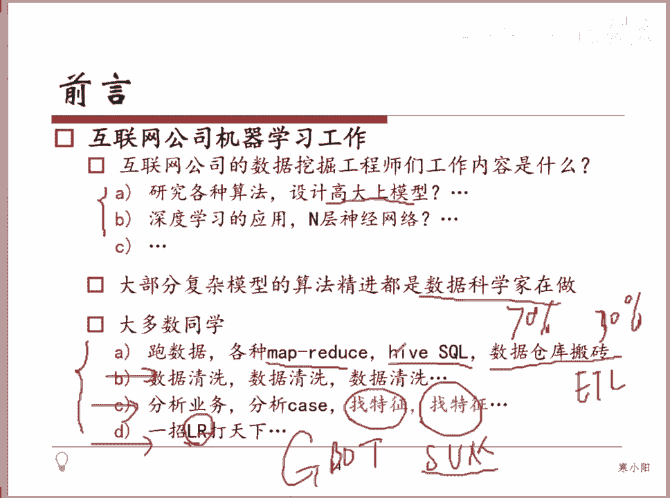

# 人工智能—机器学习公开课（七月在线出品） - P1：机器学习从业者在公司都做些啥 👨‍💻

## 概述

在本节课中，我们将了解机器学习从业者在互联网公司的实际工作内容。课程将澄清一些常见的误解，并详细介绍从业者日常工作的核心组成部分。

## 工作内容剖析

我不太清楚在座的这些同学有多少是实际在互联网公司从事相关工作的同学。

如果你从事的是数据相关的工作，并且与机器学习团队的同事交流过，你应该知道大部分互联网公司的机器学习工作并不像大家想象的那样，是去研究各种各样高大上的模型。

当然，像百度的IDL或者滴滴的研究院等大公司的研究院里，确实存在一些相对偏研究性质的岗位。

但是，大部分实际落地的应用，并非专注于研究诸如深度学习或多层神经网络这类复杂模型。

大部分情况下，你是在和数据打交道。

## 时间分配与核心任务

我们今天提到的这些内容，是大部分时间可能会花费的地方。

我们简单估算一下，可能有70%的时间是在处理数据，后面的30%的时间会用于建模、模型状态评估、模型融合等工作。

大部分复杂模型的算法精进，都是由一些数学科班出身的数据科学家，或者顶级实验室（如CMU）的同学在跟进。

大部分人只是将这些现成的算法包拿过来使用。

既然大家都在使用这些算法包，谁能用得更好？这在很大程度上取决于我们接下来要提到的、非常通用的数据处理能力。

## 数据处理与工程技能

大部分时候，你会处理各种各样的数据相关任务。

有很多同学会问，做机器学习是否需要具备Hadoop或Spark这类大数据处理框架的知识或背景。

实际上，如果你真的进入这样的团队，你一定会具备这个技能。

这些技能本身并不太难，只是因为数据量大到单机无法处理，所以你必然需要掌握在大规模数据上进行处理的相关方法。

例如，你可能需要编写一些MapReduce任务。

如果你对此不熟悉，但熟悉SQL，你也可以编写类似Hive SQL的查询，来完成数据仓库中各种“搬砖”性质的工作，我们称之为ETL（抽取、转换、加载）。

## 数据清洗与特征工程

你会花费大量时间进行各种各样的数据清洗工作。

因为你拿到手的数据，不一定可信，也不一定是按照真实分布展现给你的。

所以你需要处理数据中的离群点、缺失值等问题，确保拿到手的数据是可信的。

之后，会有一些工作专注于分析业务、寻找特征。

即使在技术非常精湛的团队，例如阿里的团队或百度做广告的团队，也确实有同学专门负责特征工程相关的工作。

我们组之前就有同学专门研究特征的组合、变换和映射，以探索是否能带来实际效果的提升。

## 模型选择：简单与复杂

学习了诸如GBDT、SVM（带有RBF核或多项式核）等算法后，你可能会觉得像逻辑回归这样简单的算法不太想用，而更倾向于使用高级算法。

但我要告诉大家，实际上，如果你去观察像阿里或百度这样真正核心的、使用机器学习的部门，它们一定会有一个逻辑回归模型作为基线模型。

因为这个模型非常可控。

我们组之前也上线过一些深度学习模型。

但正如我们后面会讲到的，深度学习模型是一个“黑盒”，它能产生好的结果，但一旦它表现不佳或出现问题，你很难定位原因——究竟是哪些样本导致了它做出这样的判定，或是哪部分特征出了问题。

我们需要有一个模型能够稳住当前的性能，使其不至于太差，这时使用的就是逻辑回归。

SVM模型严格意义上来说是这样的：我的理解是，SVM在小型数据集上可以取得非常好的效果，通过各种核函数映射能获得优秀表现。

但在特别大的数据集上，你很少会看到它被广泛使用，例如像电商这种一天能产生数亿数据的场景。

## 总结

本节课中，我们一起学习了机器学习从业者在公司的实际工作内容。

我们了解到，大部分时间（约70%）花在了数据处理、清洗和特征工程上，而非研究复杂模型。

掌握大数据处理工具（如Hadoop/Spark）和扎实的数据处理能力是必备技能。

在模型选择上，简单、可控的模型（如逻辑回归）常被用作重要的基线模型，而复杂模型（如深度学习）虽然强大，但也存在可解释性差的挑战。

理解这些实际工作流程，有助于大家建立对机器学习职业更清晰、更务实的认识。