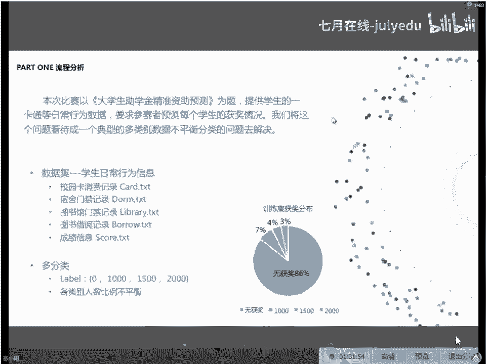

# 人工智能—机器学习公开课（七月在线出品） - P10：机器学习完成数据科学比赛案例精讲 🎯

在本节课中，我们将学习如何运用机器学习技术解决一个实际的数据科学问题：大学生助学金精准资助预测。我们将通过一个真实的比赛案例，从数据理解、特征工程、模型构建到结果优化，完整地走一遍数据科学比赛的流程。

## 背景介绍

近期有新闻报道，中国科学技术大学尝试利用大数据方法辅助大学生助学金的发放。其思路是统计学生在食堂的每餐消费金额，例如男生每餐消费低于4元，则可能被识别为贫困生。但这并非纯自动化方法，仍需人工介入核实。

随着校园一卡通的普及，学生的消费、借阅、门禁等行为数据被集中记录。这些数据涵盖了学生的生活轨迹，理论上可以用于推断其生活水准，从而实现助学金的精准、个性化资助。

本节课的案例正是基于这一愿景。数据来源于企业与数据科学平台联合发起的一场比赛，旨在利用校园大数据预测学生获得助学金的情况。

## 数据说明

本案例利用2014年9月至2015年9月的数据，预测学生在2015年获得助学金的情况。数据分为训练集和测试集，每组约1万名学生记录，且ID无交集。

数据主要包括以下几类（均已脱敏处理）：

*   **图书馆借阅数据** (`borrow_train.txt` / `borrow_test.txt`)
    *   字段：学生ID、借阅日期、图书名称、图书编号。
    *   部分图书编号缺失。
*   **一卡通消费数据** (`card_train.txt` / `card_test.txt`)
    *   字段：学生ID、消费类型、消费地点、消费方式、消费时间、消费金额、卡内剩余金额。
*   **宿舍门禁数据** (`dorm_train.txt` / `dorm_test.txt`)
    *   字段：学生ID、进出时间。
*   **图书馆门禁数据** (`library_train.txt` / `library_test.txt`)
    *   字段：学生ID、进出时间。
*   **学生成绩数据** (`score.txt`)
    *   字段：学生ID、学院编号、成绩排名。
*   **助学金标签数据** (`subsidy_train.txt`)
    *   字段：学生ID、助学金金额（0元、1000元、1500元、2000元）。此标签由辅导员等人根据多种因素人工评定得出。

所有数据表可通过“学生ID”这一关键字段进行关联。

## 核心挑战与思路

这是一个典型的多分类且样本不均衡的问题。从标签分布看，绝大多数学生（约86%）未获得助学金。

数据科学比赛是一个需要长期迭代和分析的过程，不同于即时编程竞赛。其核心流程包括：数据探索、特征构造、模型预测、分析bad case、补充特征、再次迭代。特征工程的质量往往比模型选择更能决定成绩的上限。

上一节我们介绍了案例背景和数据概况，本节中我们来看看如何从最基础的模型开始，一步步构建解决方案。

## 基础建模流程演示

我们将从简单的逻辑回归模型开始，逐步尝试更复杂的模型，包括集成学习和神经网络。请注意，以下演示侧重于流程，特征工程较为基础。

### 第一步：数据读取与初步清洗

我们首先读取一卡通消费数据和成绩数据，并进行初步处理。

```python
import pandas as pd

# 1. 读取一卡通数据
card_columns = ['sid', 'consume_type', 'consume_location', 'consume_category', 'time', 'amount', 'remainder']
card_train = pd.read_csv('card_train.txt', names=card_columns)
card_test = pd.read_csv('card_test.txt', names=card_columns)

# 合并训练集和测试集，便于统一处理
card_all = pd.concat([card_train, card_test], ignore_index=True)

# 2. 读取成绩数据
score = pd.read_csv('score.txt', names=['sid', 'dept_id', 'rank'])

# 3. 处理缺失值（示例：粗暴地用众数‘食堂’填充消费地点缺失值）
card_all['consume_location'].fillna('食堂', inplace=True)
```

### 第二步：特征构造

基于直观理解，学生的经济消费状况是判断其是否需要助学金的重要依据。我们构造以下基础特征：

1.  **学生总消费金额**：按学生ID分组，对消费金额求和。
2.  **分消费类别的金额统计**：按学生ID和消费方式（如食堂、超市、洗衣房）分组，统计在各处的消费总额。缺失类别填充为0。
3.  **成绩排名归一化**：按学院分组，对成绩排名进行标准化处理，以消除学院间差异。

```python
# 1. 计算总消费
total_consume = card_all.groupby('sid')['amount'].sum().reset_index()
total_consume.columns = ['sid', 'total_amount']

# 2. 计算分消费类别的金额（以消费方式‘consume_category’为例）
category_consume = card_all.groupby(['sid', 'consume_category'])['amount'].sum().unstack(fill_value=0)
category_consume.columns = ['category_' + str(col) for col in category_consume.columns]

# 3. 成绩排名归一化（按学院）
score['rank_normalized'] = score.groupby('dept_id')['rank'].transform(lambda x: (x - x.mean()) / x.std())

# 4. 合并特征
features = pd.merge(total_consume, category_consume, on='sid', how='left')
features = pd.merge(features, score[['sid', 'rank_normalized']], on='sid', how='left')
features.fillna(0, inplace=True) # 填充合并产生的缺失值
```

### 第三步：数据分割与预处理

将处理好的特征与标签数据关联，并分割为训练集和测试集。

```python
# 读取标签
label = pd.read_csv('subsidy_train.txt', names=['sid', 'subsidy'])

# 关联特征与标签
data = pd.merge(features, label, on='sid', how='inner') # 训练集取交集
X_train = data.drop(['sid', 'subsidy'], axis=1)
y_train = data['subsidy']

# 对于测试集，只取特征
test_data = features[~features['sid'].isin(label['sid'])] # 假设测试集ID不在训练标签中
X_test = test_data.drop(['sid'], axis=1)

# 对于线性模型和神经网络，需要进行特征缩放（例如归一化）
from sklearn.preprocessing import MinMaxScaler
scaler = MinMaxScaler()
X_train_scaled = scaler.fit_transform(X_train)
X_test_scaled = scaler.transform(X_test)
```

### 第四步：模型构建与评估

我们将尝试多种模型。**注意**：由于样本不均衡，评估指标不能使用准确率(Accuracy)，而应使用F1-score（特别是加权平均F1）等。

**1. 逻辑回归 (Logistic Regression)**
```python
from sklearn.linear_model import LogisticRegression
from sklearn.model_selection import GridSearchCV
from sklearn.metrics import f1_score, classification_report

# 由于是多分类，使用 multinomial
lr = LogisticRegression(multi_class='multinomial', solver='lbfgs', max_iter=1000)
param_grid = {'C': [0.01, 0.1, 1, 10]}
grid_search = GridSearchCV(lr, param_grid, cv=5, scoring='f1_weighted')
grid_search.fit(X_train_scaled, y_train)
print(f"Best LR F1: {grid_search.best_score_:.4f}")
y_pred = grid_search.predict(X_test_scaled)
```

**2. 随机森林 (Random Forest)**
树模型通常不需要特征缩放。
```python
from sklearn.ensemble import RandomForestClassifier
rf = RandomForestClassifier()
param_grid_rf = {
    'n_estimators': [50, 200, 500],
    'max_depth': [5, 10, None]
}
grid_search_rf = GridSearchCV(rf, param_grid_rf, cv=5, scoring='f1_weighted')
grid_search_rf.fit(X_train, y_train) # 使用未缩放的X_train
print(f"Best RF F1: {grid_search_rf.best_score_:.4f}")
```

**3. 梯度提升树 (GBDT - XGBoost示例)**
```python
from xgboost import XGBClassifier
xgb = XGBClassifier(eval_metric='mlogloss', use_label_encoder=False)
param_grid_xgb = {
    'n_estimators': [100, 200],
    'learning_rate': [0.01, 0.05, 0.1],
    'max_depth': [3, 5]
}
grid_search_xgb = GridSearchCV(xgb, param_grid_xgb, cv=5, scoring='f1_weighted')
grid_search_xgb.fit(X_train, y_train)
print(f"Best XGB F1: {grid_search_xgb.best_score_:.4f}")
```

**4. 浅层神经网络 (TensorFlow/Keras示例)**
神经网络必须使用缩放后的特征。
```python
import tensorflow as tf
from tensorflow import keras
model = keras.Sequential([
    keras.layers.Dense(12, activation='relu', input_shape=(X_train_scaled.shape[1],)),
    keras.layers.Dense(8, activation='relu'),
    keras.layers.Dense(4, activation='softmax') # 4个输出类别
])
model.compile(optimizer='adam',
              loss='sparse_categorical_crossentropy',
              metrics=['accuracy'])
# 注意：为处理不均衡，可以在fit中设置class_weight
model.fit(X_train_scaled, y_train, epochs=50, batch_size=32, validation_split=0.2, verbose=0)
# 预测需要取概率最大的类别
y_pred_proba = model.predict(X_test_scaled)
y_pred_nn = y_pred_proba.argmax(axis=1)
```

通过以上流程，我们完成了从数据到基础模型的构建。然而，正如之前所述，基础特征下的模型性能（F1分数）可能并不理想。接下来，我们来看看冠军团队是如何通过精湛的特征工程大幅提升模型表现的。

## 冠军方案特征工程精粹

该比赛冠军团队的成绩远超第二名，其成功的关键在于极其深入和创造性的特征工程。他们的工作流程可以概括为：**地毯式特征抽取 -> 多人脑暴设计 -> 多轮迭代优化**。

以下是他们部分特征构造的思路，极具启发性：

**第一轮：基础特征（约200个特征）**
*   **图书馆借阅**：是否借书、借书总数、借阅考研/编程/托福等特定类型书籍的次数。
*   **门禁数据**：不同时间段（如早晨、晚上、周末）进出图书馆/宿舍的次数、在馆/在舍天数、最早/最晚离开时间。

**第二轮：统计与维度切分特征（增至约500个特征）**
*   **消费地点分析**：统计消费金额最高的前N个地点、最常去的N个地点。
*   **消费时间分析**：按24小时、是否节假日/周末/寒暑假、三餐时间等维度切分，统计各时段消费次数与金额。
*   **消费模式**：针对12种消费方式（食堂、超市、洗衣等），分别统计次数、金额、频率。

**第三轮：高级组合与统计特征（增至约1151个特征）**
*   **比率特征**：`总消费金额 / 活跃天数`、`某时段消费金额 / 活跃天数`。
*   **交叉特征**：`本学院消费排名 * 成绩排名`。
*   **行为序列特征**：`过完年后的第一笔消费日期`（反映返校早晚）。
*   **统计特征**：`日均消费在0-10元区间的天数`、`单笔消费最高金额`、`消费金额的方差`等。

**第四轮：特征选择与优化（约1200个特征）**
*   使用随机森林评估特征重要性。
*   通过实验验证（删除特征后看模型在验证集上的表现）来筛选特征。

**特征重要性洞察**
冠军团队发现，最重要的特征并非直观的消费总额，而是：
1.  **是否曾更换校园卡**（可能反映了卡片丢失或损坏情况，间接关联经济习惯）。
2.  **日均低消费（0-10元）的频率**。
3.  **早晨（7-8点）的平均消费额**（反映作息规律性）。
4.  **消费排名与成绩排名的组合特征**。

此外，他们还针对样本不均衡问题，采用了**分层抽样**构建交叉验证集，并为不同类别**设置权重**。在模型上，他们主要使用了**GBDT（如LightGBM）和随机森林**，并通过**多模型集成（投票/堆叠）** 来进一步提升效果。

## 总结与启示

本节课中我们一起学习了如何用机器学习解决“大学生助学金预测”这一数据科学比赛案例。

我们首先了解了案例背景与数据构成，然后演示了从数据清洗、基础特征构造到应用逻辑回归、随机森林、GBDT及神经网络进行建模的完整流程。最后，我们深入剖析了冠军团队的解决方案，其核心启示在于：

1.  **特征工程是灵魂**：在结构化数据比赛中，对业务的深刻理解与创造性的特征构造，其价值远大于选择复杂的模型。冠军团队通过上千个精心设计的特征显著提升了预测能力。
2.  **样本不均衡需妥善处理**：必须使用合适的评估指标（如F1-score），并采用分层抽样、类别权重调整等方法。
3.  **迭代与分析是关键**：数据科学比赛是不断“假设-验证-改进”的循环过程，需要耐心分析bad case，持续优化特征。
4.  **模型融合锦上添花**：在拥有强特征的基础上，模型集成可以进一步提升性能。




希望本课程能帮助你理解数据科学比赛的基本方法论，并激发你在特征工程上的创造力。记住，从业务中来，到业务中去，是解决此类问题的根本。