# 人工智能—机器学习公开课（P11）：机器学习项目实施方法论 🧠


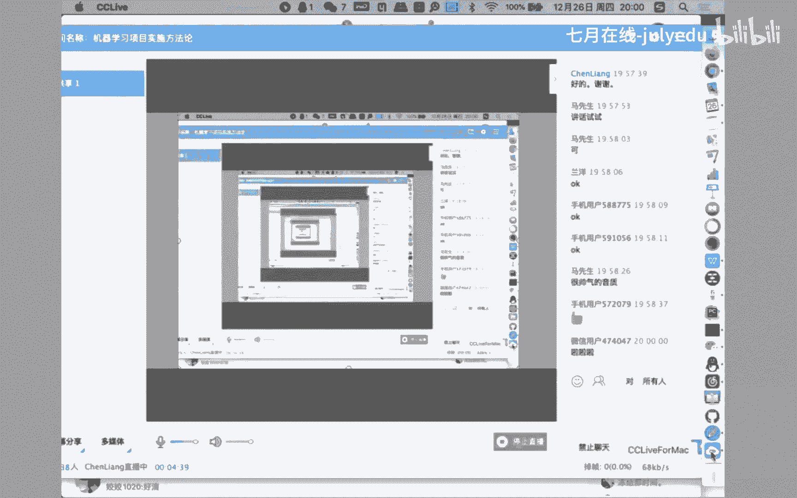


在本节课中，我们将要学习机器学习项目的实施方法论。随着机器学习技术的成熟，其在项目中的应用越来越广泛。然而，技术的应用效果会因人员素质、项目情况和约束条件的不同而产生巨大差异。因此，建立一套规范化的实施步骤和方法论至关重要。本节课将借鉴软件工程的思想，探讨如何将工程化的方法应用于机器学习项目，以确保项目高效、规范地推进。


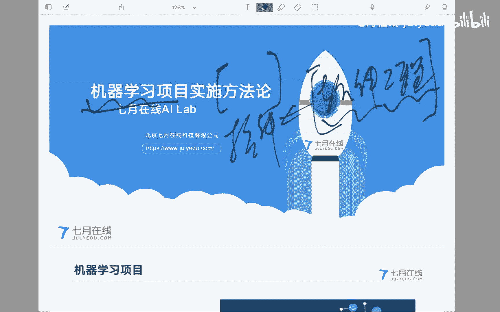

## 一、机器学习项目的定义与本质

上一节我们介绍了课程的主题，本节中我们来看看如何定义和理解机器学习项目。

机器学习项目是在有限的资源（如时间、人员）约束下，为了满足客户的业务分析需求，综合运用机器学习技术，分析挖掘数据中蕴含的规律，为商业决策提供支撑的过程。

**核心公式**可以概括为：
`项目目标 = 在约束条件下，使用机器学习技术分析数据，以支撑业务决策`

这个定义强调了几个关键点：
1.  **有限资源约束**：项目必须在给定的时间、人力等条件下完成。
2.  **服务业务需求**：最终目标是满足客户的业务分析需求，技术是服务于此目标的手段。
3.  **数据驱动**：核心工作是分析数据、挖掘规律。
4.  **提供决策支撑**：成果是为商业或业务决策提供依据，而非替代决策本身。


### 项目的核心挑战：跨领域映射

机器学习项目实施的核心困难在于需要在两个不同的问题域之间进行工作与映射。

1.  **业务问题域**：你需要深入理解所要解决的具体业务问题（例如，气象领域的延伸期预报）。必须搞懂该领域的业务逻辑、现有技术方法、面临的困难及未来方向。
2.  **技术能力域**：你需要判断现有的机器学习技术、模型和方法能否以及如何解决抽象出来的业务问题。

**关键映射过程**：
`业务问题 -> 抽象 -> 技术问题（如回归、分类、聚类）`

这就要求项目人员（尤其是算法应用工程师）不仅是技术专家，还需要具备快速学习新业务领域知识的能力，成为能够沟通业务与技术的复合型人才。对业务领域保持敬畏之心，在充分理解问题之前，避免做出过度承诺。


### 项目中的角色与利益相关方

在项目推进中，理解各方角色有助于更好地协调与沟通。

**乙方（项目承接方）常见角色：**
*   **算法应用工程师**：核心角色，负责应用现有算法构建模型。
*   **数据工程师**：负责协调、获取、整理和提供高质量的数据。
*   **开发工程师**：负责将训练好的模型集成到业务系统中上线。
*   **数据科学家**：凭借经验，指导业务问题抽象、模型选型和实验方向。
*   **项目经理/产品经理**：负责项目整体管理、协调各方、控制需求、推进落地。目前该角色在机器学习项目中非常稀缺，是算法工程师一个重要的成长方向。

**甲方（客户方）常见角色：**
*   **项目决策者**：高层领导，决定项目做与否及最终验收。
*   **业务专家**：精通具体业务，为决策者提供专业建议，是评估项目成果的关键人物。
*   **业务工程师**：一线业务人员，掌握具体的业务细节和技巧。
*   **数据工程师**：管理业务系统数据，是获取数据的主要接口人。

处理与不同角色的关系，特别是管理甲方期望并有效沟通，是项目成功的重要因素。


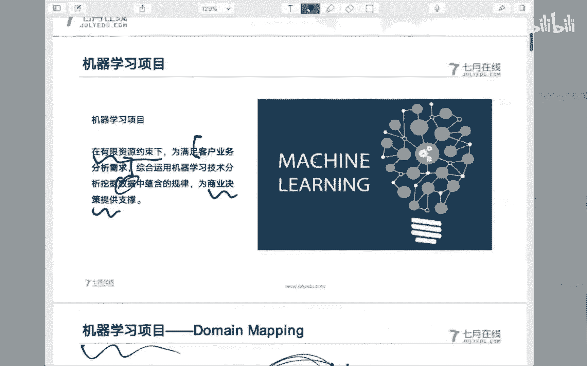

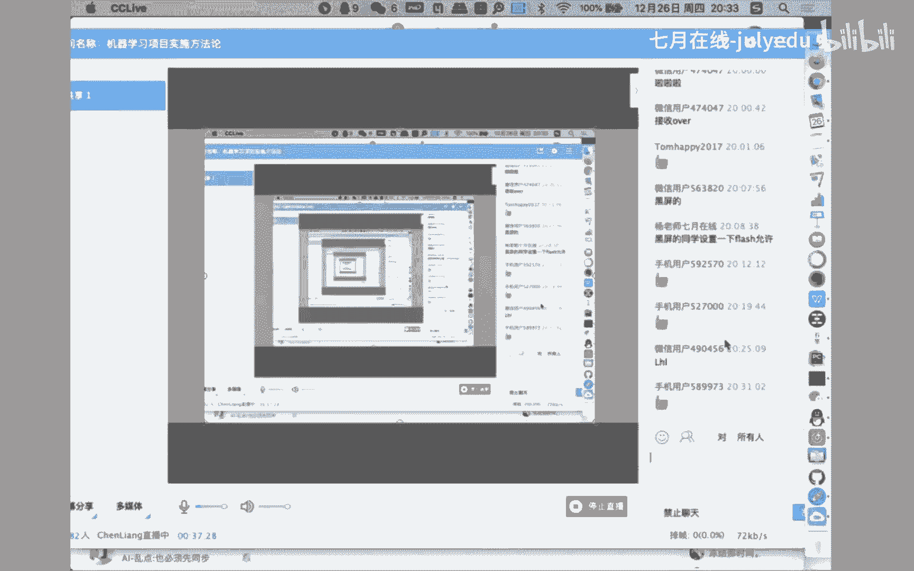

## 二、核心方法论：CRISP-DM模型 🔄

上一节我们分析了项目的定义与角色，本节中我们来看看一个可供借鉴的成熟方法论。

目前，机器学习领域缺乏像软件工程中“敏捷开发”那样被广泛认可的标准方法论。一个可行的借鉴是来自数据挖掘领域的 **CRISP-DM（跨行业数据挖掘标准流程）**。考虑到数据挖掘本质上是机器学习技术在商业分析领域的应用，其方法论具有很高的参考价值。

CRISP-DM模型具有**行业无关性**、**工具无关性**和**应用无关性**，是一个抽象层次较高的通用流程。

以下是该模型的核心阶段图示及详解：


### 各阶段详解

以下是CRISP-DM模型六个阶段的核心工作：

**1. 商业理解**
这是项目的起点，也是决定性的环节。目标是深入理解业务背景、目标和需求。你需要：
*   向业务专家学习或研读领域文献，使自己能用“行话”沟通。
*   准确定义商业目标，评估项目环境、资源、约束与风险。
*   **输出**：明确的项目目标文档，获得甲方确认。

**2. 数据理解**
在业务理解基础上，聚焦支持业务的数据。
*   收集数据，识别数据源。
*   探索数据，理解每个字段的业务含义。
*   评估数据质量，发现数据问题。
*   **输出**：数据探索报告，与甲方确认数据现状。

**3. 数据准备**
从原始数据构造出最终用于建模的数据集。
*   进行数据清洗、转换、集成。
*   构造特征工程，生成衍生变量。
*   **输出**：干净、可用于建模的数据集。

**4. 建模**
应用各种机器学习算法构建模型。
*   选择建模技术（如回归、分类、聚类）。
*   进行模型训练、调参和优化。
*   **输出**：训练好的模型及其技术评估报告（如准确率、F1值）。

**5. 评估**
**此阶段评估并非技术指标评估，而是业务价值评估。** 核心是将模型结果转化为业务语言，让业务专家理解和认可其价值。
*   评估模型结果是否满足商业目标。
*   与业务专家沟通，解释模型逻辑和结论（可解释性至关重要，有时需为此牺牲部分精度）。
*   若未通过业务评估，则需返回前面阶段（商业理解、数据理解等）进行迭代。
*   **输出**：由业务专家认可的项目结论报告。

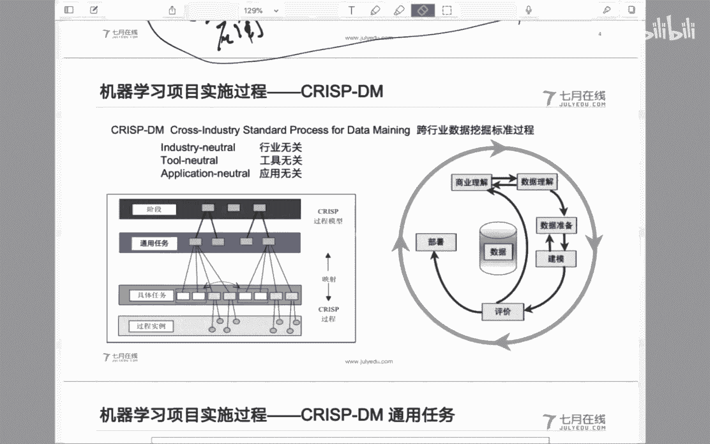

**6. 部署**
将评估通过的模型投入实际使用。
*   将模型集成到现有业务流程或系统中。
*   生成最终报告，总结项目。
*   规划模型监控与维护，为下一轮迭代做准备。


### 文档化与沟通

方法论的有效执行离不开严格的文档化和有效沟通。
*   **每个阶段都应有明确的输入和输出文档**。例如，商业理解阶段的需求文档，数据理解阶段的数据质量报告。
*   文档是与甲方确认需求、划定责任、管理变更的重要依据。
*   在“评估”阶段，沟通技巧至关重要。你需要用业务语言（如规则、概率）而非技术术语（如神经网络层数）向业务专家解释模型。


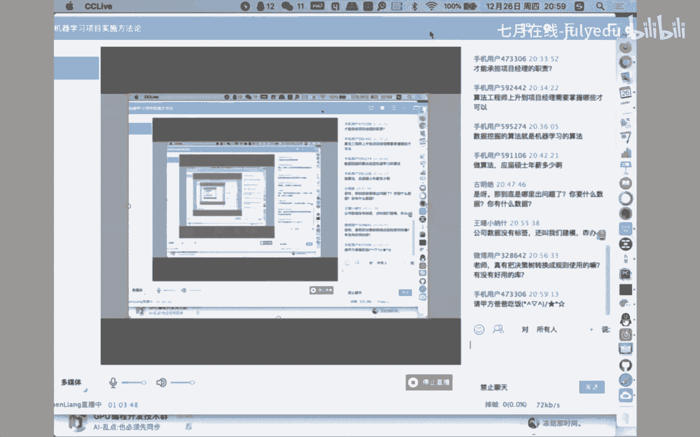

### 业务问题的抽象映射

将模糊的业务需求准确抽象为可解决的技术问题，是方法论成功的关键。以下是一些常见的映射：

*   **数据描述/总结** -> 基本统计分析（同比、环比、百分比）。
*   **用户/市场细分** -> **聚类分析**（如K-Means）。注意，甲方常称之为“分类”，但技术上可能是无监督的聚类。
*   **预测趋势** -> **回归分析**（如线性回归、时间序列预测）。
*   **发现关联** -> **关联规则分析**（如Apriori算法）。
*   **规则归纳** -> **分类模型**（如决策树），其产生的规则易于解释。


## 三、案例实践：延伸期降水预报项目 🌧️

上一节我们介绍了理论方法论，本节中我们通过一个真实案例来看其具体应用。

项目背景：为某省气象部门构建“延伸期”（未来10-30天）降水预报模型。

**1. 商业理解**
*   **行动**：通过查阅专业书籍、文献，向气象专家请教，深入理解“延伸期降水预报”的业务定义、现有方法和难点。
*   **发现**：现有主流方法采用“基于主成分分析的多元滞后回归模型”，本质是一个**线性回归模型**。其存在非线性拟合能力不足、未利用空间特征、所用气象特征单一等问题。
*   **结论**：业务上存在改进空间，技术上我们具备用更复杂模型（非线性、多特征）尝试的能力。

**2. 数据理解与准备**
*   **行动**：分析气象站点数据（空间分布、时间序列）、探空气象数据（多高度层特征）等。
*   **发现**：站点空间分布较均匀，适合提取空间特征；历史数据连续，适合提取时间特征；可用特征远多于文献所用。
*   **准备**：将站点数据网格化（视为图像），准备多时间尺度的序列切片，整合多维气象特征。

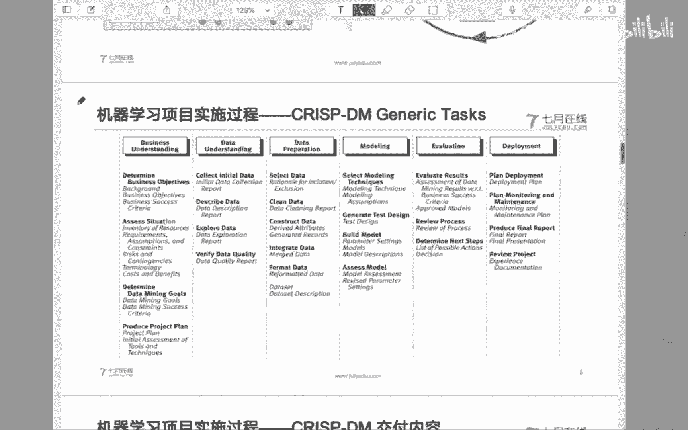

**3. 建模**
*   **技术方案**：
    1.  使用**卷积神经网络（CNN）** 提取网格数据的**空间特征**。
    2.  使用**循环神经网络（RNN）** 提取不同时间切片（近期、中期、远期）的**时间特征**。
    3.  将其他气象特征输入**全连接神经网络**。
    4.  对多个子模型的输出进行**集成学习**（如加权平均）。
*   **代码示意（核心思路）**：
    ```python
    # 伪代码，展示多模型融合思路
    spatial_feat = CNN_Net(grid_data)
    temporal_feat = RNN_Net(time_series_data)
    other_feat = Dense_Net(other_features)
    
    combined_feat = concatenate([spatial_feat, temporal_feat, other_feat])
    final_output = Final_Dense_Net(combined_feat)
    # 训练并融合多个此类模型
    ```

**4. 评估与部署**
*   **行动**：将技术方案和初步结果向气象业务专家汇报，重点解释我们如何改进了传统方法的不足（引入了空间、时间特征，使用了非线性模型）。
*   **结果**：虽然模型绝对精度仍有提升空间，但业务专家认可该技术思路的价值和先进性，认为这是未来改进的正确方向。项目通过评审。
*   **部署**：使用Docker容器化技术，将多个子模型部署在云平台上，便于集成和扩展。


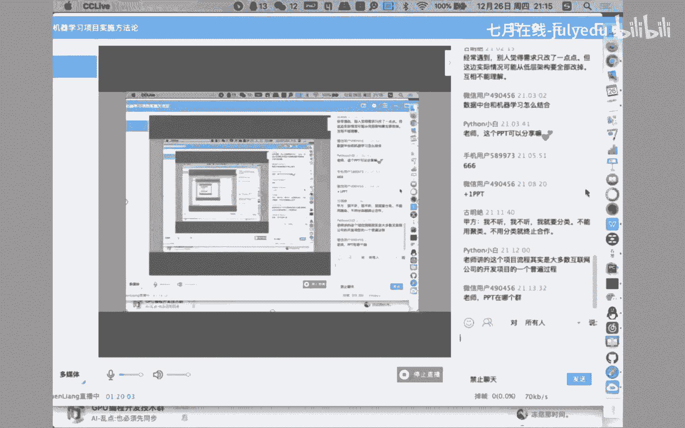

## 四、总结与建议 📝

本节课中我们一起学习了机器学习项目的实施方法论。

我们首先明确了机器学习项目的定义：**在资源约束下，利用机器学习技术分析数据以支撑业务决策**。其核心挑战在于完成**业务问题域**到**技术能力域**的映射，这要求项目人员成为复合型人才。

接着，我们详细介绍了可借鉴的 **CRISP-DM 方法论**，它包含六个阶段：
1.  **商业理解**（奠定基础）
2.  **数据理解**（熟悉原料）
3.  **数据准备**（加工原料）
4.  **建模**（核心生产）
5.  **评估**（业务验收——最关键也最易被忽视）
6.  **部署**（交付上线）

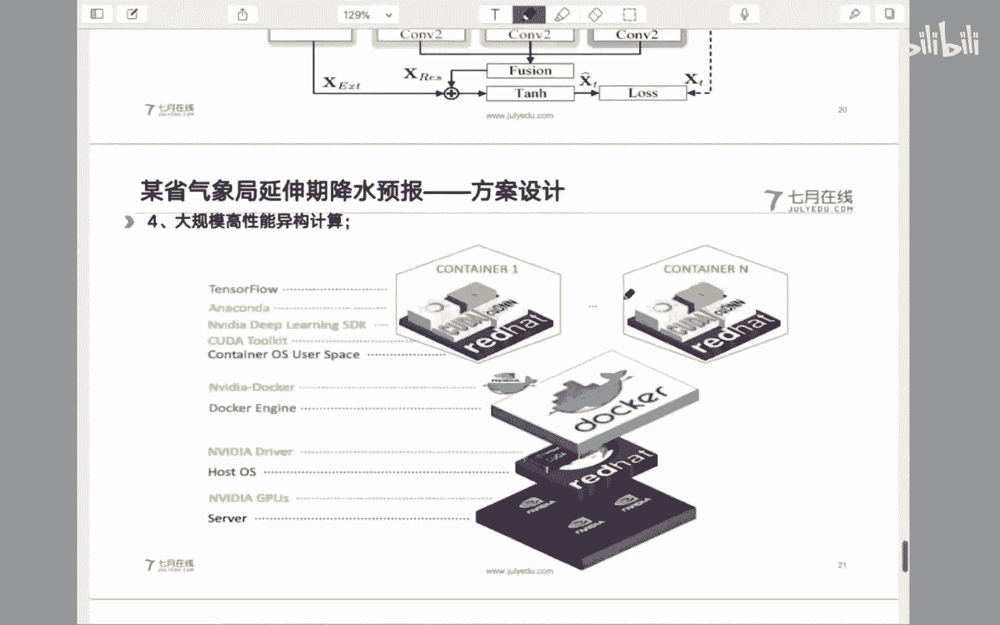

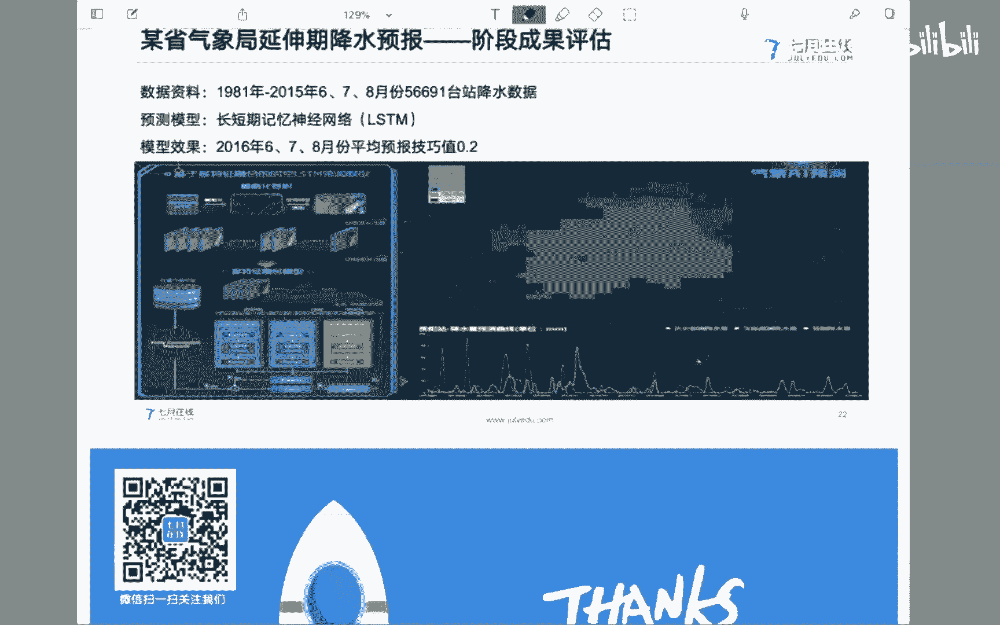

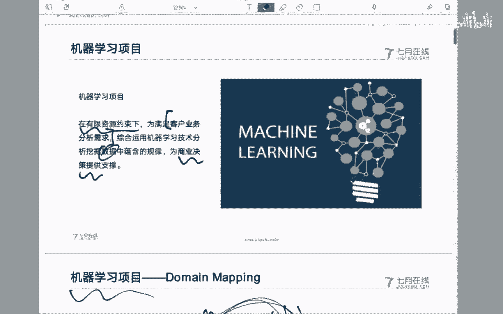

我们强调了**文档化**和**以业务语言沟通**的重要性，特别是在“评估”阶段，模型的可解释性往往比单纯的精度提升更重要。

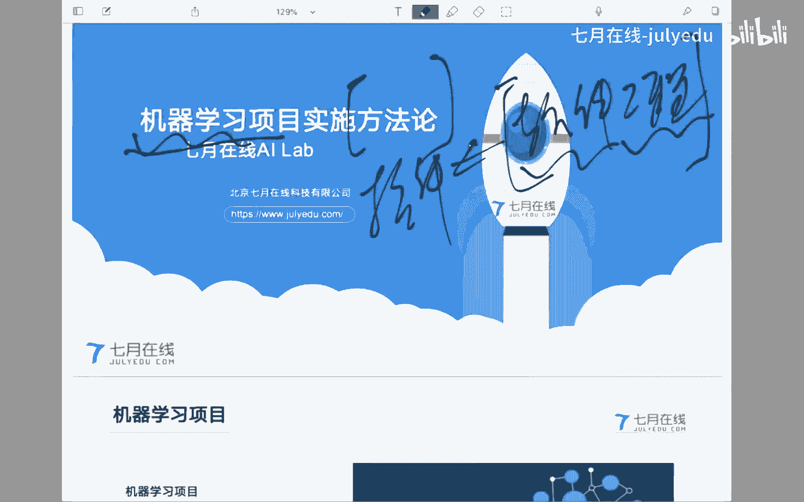

最后，通过一个气象预报的案例，我们看到了该方法论从业务理解、问题抽象、技术方案设计到业务沟通的全过程应用。

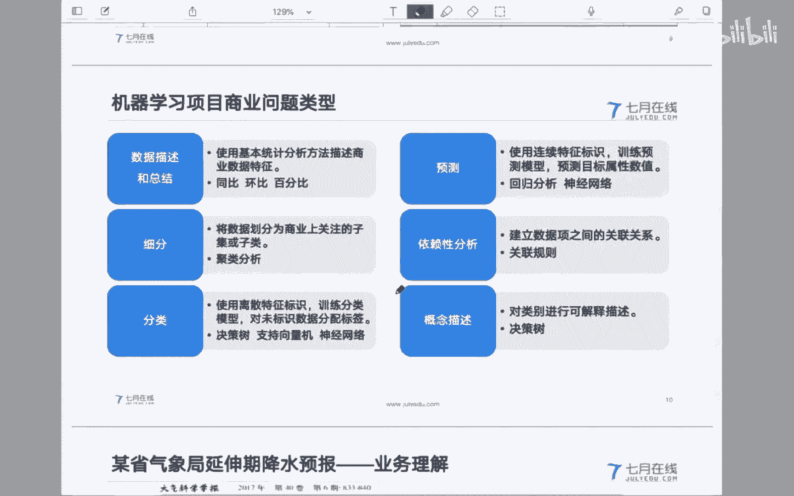

**给初学者的建议**：
*   **摆正位置**：技术是支撑，业务是目标。保持谦逊，深入学习业务知识。
*   **重视流程**：遵循规范的方法论步骤，避免盲目跳入模型构建。
*   **学会沟通**：练习将复杂的技术结论转化为业务专家能听懂的语言。
*   **拓展视野**：在精通技术的同时，有意识地培养项目协调、管理和沟通能力，向数据科学家或项目经理等复合角色发展。

机器学习项目实施既是科学，也是艺术。希望这套方法论能为你提供一张有价值的“地图”，帮助你在实际项目的复杂地形中更稳健地前行。

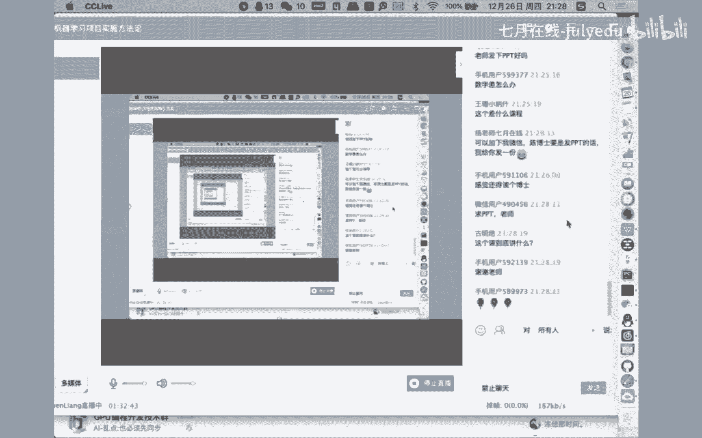


