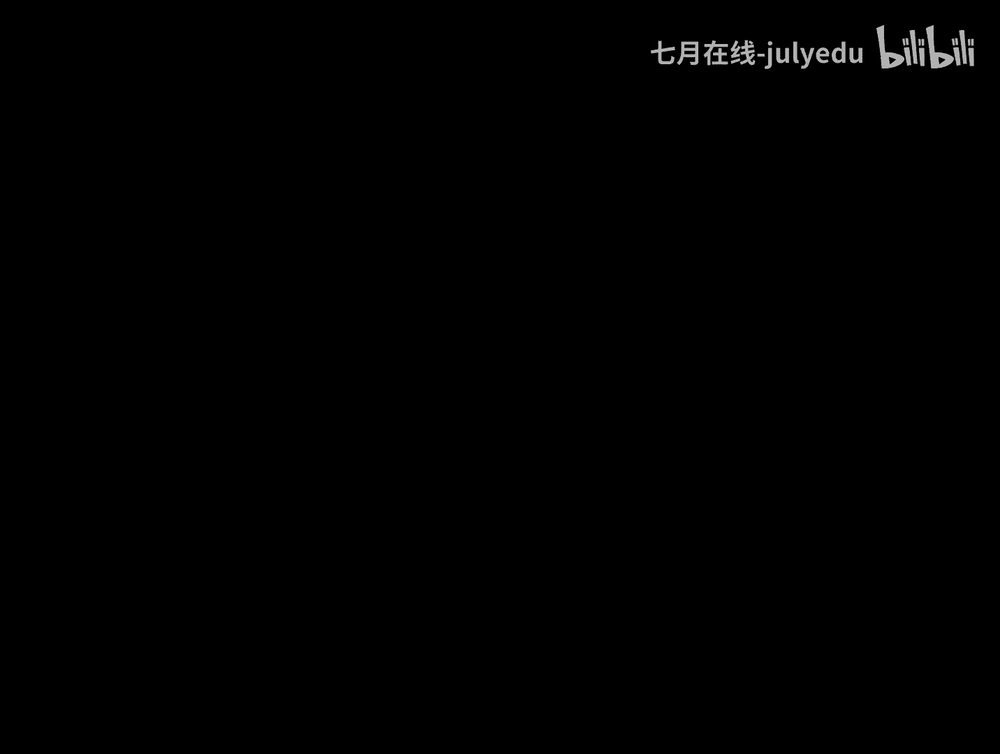
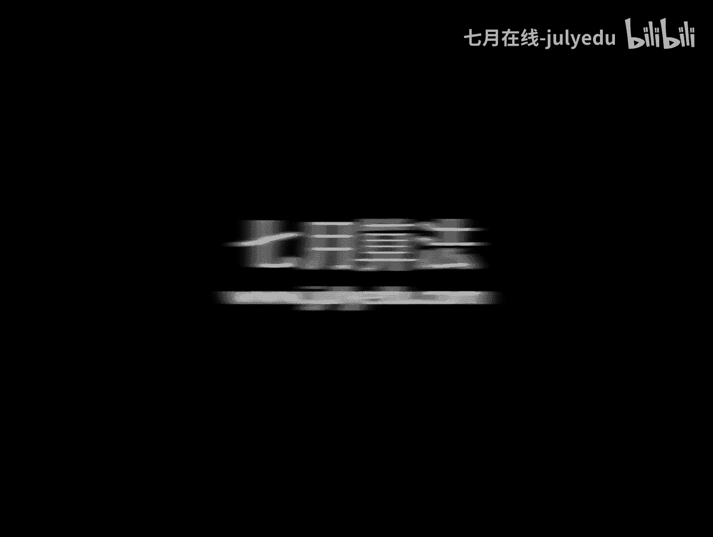

# 人工智能—机器学习公开课（七月在线出品） - P13：极大似然估计 📊

在本节课中，我们将要学习参数估计的一种核心方法——极大似然估计。我们将从贝叶斯公式出发，理解其思想来源，并通过具体例子掌握其计算过程，最终推导出正态分布参数的极大似然估计结果。

---

## 从贝叶斯公式到估计思想 🤔

上一节我们介绍了矩估计，本节中我们来看看另一种更常用的参数估计方法。

给定样本数据 \( D \)，在 \( D \) 发生的条件下，结论 \( A \) 发生的概率可以写成贝叶斯公式的形式：
\[
P(A|D) = \frac{P(D|A) P(A)}{P(D)}
\]
其中，\( P(D) \) 是归一化因子，可以忽略。如果我们假设各种可能结论 \( A_i \) 的先验概率 \( P(A_i) \) 相等或近似，那么 \( P(A|D) \) 就正比于 \( P(D|A) \)。

换句话说，我们想做的事是：给定这组样本数据 \( D \) 后，看哪个参数 \( A_i \) 对应的 \( P(D|A_i) \) 概率值最大，我们就认为总体最有可能取那个参数。即，哪个参数能使观测到的数据出现的可能性最大，我们就取谁。这种“像那个样子”的可能性在文言文中称为“似然”，让似然达到极大的估计方法就是极大似然估计。

---

## 似然函数的定义与构建 🔨

上一节我们介绍了极大似然估计的思想，本节中我们来看看如何将其数学化。

设总体分布为 \( f(x; \theta) \)，其中 \( \theta \) 是未知参数。\( X_1, X_2, ..., X_n \) 是从该总体中独立抽取的样本。由于样本独立同分布，其联合概率密度（或概率质量）函数为各样本点概率的乘积：
\[
L(\theta) = L(\theta; X_1, ..., X_n) = \prod_{i=1}^{n} f(X_i; \theta)
\]
这个关于参数 \( \theta \) 的函数 \( L(\theta) \) 就称为**似然函数**。在样本 \( X_i \) 已知的情况下，似然函数只与未知参数 \( \theta \) 有关。我们的目标是找到能使 \( L(\theta) \) 取得极大值的 \( \hat{\theta} \)，即：
\[
\hat{\theta}_{MLE} = \arg \max_{\theta} L(\theta)
\]
这种方法就是极大似然估计。

---

## 一个具体例子：估计硬币正面概率 🪙

理解了似然函数的概念后，我们通过一个简单例子来掌握计算过程。

假设抛一枚硬币10次，得到结果：正，正，反，正，正，正，反，反，正，正。设每次抛掷得到正面的概率为未知参数 \( p \)。

以下是构建似然函数并求解的步骤：
1.  每次抛掷是独立的伯努利试验。出现正面的概率为 \( p \)，出现反面的概率为 \( 1-p \)。
2.  根据观测序列，其似然函数为：
    \[
    L(p) = p \times p \times (1-p) \times p \times p \times p \times (1-p) \times (1-p) \times p \times p = p^7 (1-p)^3
    \]
3.  直接对 \( L(p) \) 求导找极值较复杂，通常对其取自然对数，得到**对数似然函数** \( l(p) = \ln L(p) \)。
    \[
    l(p) = 7\ln p + 3\ln(1-p)
    \]
4.  对 \( l(p) \) 关于 \( p \) 求导并令其为零：
    \[
    \frac{dl(p)}{dp} = \frac{7}{p} - \frac{3}{1-p} = 0
    \]
5.  解方程得到 \( p = 0.7 \)。可以验证该点为极大值点。
因此，硬币正面概率 \( p \) 的极大似然估计值为 \( \hat{p} = 0.7 \)。

---

## 核心应用：正态分布的参数估计 📈

上一节我们通过一个离散例子熟悉了流程，本节中我们来看一个极其重要的连续分布例子——估计正态分布的参数。

假设样本 \( X_1, X_2, ..., X_n \) 来自正态分布 \( N(\mu, \sigma^2) \)，其中均值 \( \mu \) 和方差 \( \sigma^2 \) 未知。我们的目标是利用极大似然估计求出 \( \hat{\mu} \) 和 \( \hat{\sigma}^2 \)。

以下是详细的推导过程：
1.  **写出似然函数**：正态分布的概率密度函数为 \( f(x; \mu, \sigma^2) = \frac{1}{\sqrt{2\pi\sigma^2}} \exp\left(-\frac{(x-\mu)^2}{2\sigma^2}\right) \)。因此似然函数为：
    \[
    L(\mu, \sigma^2) = \prod_{i=1}^{n} \frac{1}{\sqrt{2\pi\sigma^2}} \exp\left(-\frac{(X_i-\mu)^2}{2\sigma^2}\right)
    \]
2.  **取对数得到对数似然函数**：
    \[
    l(\mu, \sigma^2) = \ln L(\mu, \sigma^2) = -\frac{n}{2}\ln(2\pi) - \frac{n}{2}\ln(\sigma^2) - \frac{1}{2\sigma^2}\sum_{i=1}^{n}(X_i-\mu)^2
    \]
3.  **分别对 \( \mu \) 和 \( \sigma^2 \) 求偏导并令为零**：
    *   对 \( \mu \) 求偏导：
        \[
        \frac{\partial l}{\partial \mu} = \frac{1}{\sigma^2}\sum_{i=1}^{n}(X_i-\mu) = 0 \quad \Rightarrow \quad \sum_{i=1}^{n}(X_i-\mu)=0
        \]
        解得：
        \[
        \hat{\mu} = \frac{1}{n}\sum_{i=1}^{n} X_i
        \]
    *   对 \( \sigma^2 \) 求偏导（将 \( \sigma^2 \) 视为整体）：
        \[
        \frac{\partial l}{\partial \sigma^2} = -\frac{n}{2\sigma^2} + \frac{1}{2(\sigma^2)^2}\sum_{i=1}^{n}(X_i-\mu)^2 = 0
        \]
        将 \( \hat{\mu} \) 代入，解得：
        \[
        \hat{\sigma}^2 = \frac{1}{n}\sum_{i=1}^{n} (X_i - \hat{\mu})^2
        \]

**结论**：对于正态分布，其均值 \( \mu \) 的极大似然估计是样本均值，方差 \( \sigma^2 \) 的极大似然估计是样本二阶中心矩（即未修正的样本方差）。这个结果直观且与矩估计的结果在均值上一致，但在方差上有所不同（矩估计的样本方差分母是 \( n-1 \)）。

---

## 总结与思考 🎯

本节课中我们一起学习了参数估计的核心方法——极大似然估计。
*   我们从贝叶斯公式出发，理解了“选择使观测数据出现概率最大的参数”这一核心思想。
*   我们定义了似然函数 \( L(\theta) \)，并通过取对数简化求导过程。
*   我们通过估计硬币正面概率的例子，掌握了极大似然估计的基本计算步骤。
*   最后，我们完整推导了正态分布参数的极大似然估计结果，得到了 \( \hat{\mu} = \bar{X} \) 和 \( \hat{\sigma}^2 = \frac{1}{n}\sum (X_i - \bar{X})^2 \) 的重要结论。

极大似然估计是机器学习中许多模型（如逻辑回归、高斯混合模型）的基础。其思想虽然简单，但威力强大，是连接概率模型与观测数据的关键桥梁。