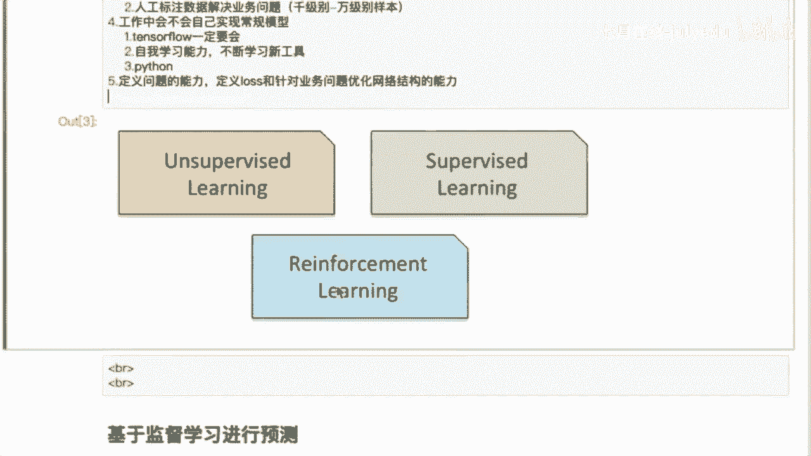

# 人工智能—机器学习公开课（七月在线出品） - P14：来自工业界的经验分享：机器学习基本流程 👨‍💻

在本节课中，我们将要学习机器学习在工业界应用的基本流程、核心概念以及一些实用的经验分享。我们将从宏观的机器学习分类讲起，深入到监督学习的具体应用，并探讨算法工程师在实际工作中需要具备的核心能力。

## 机器学习概述与分类 🤖

上一节我们介绍了课程的整体目标，本节中我们来看看机器学习的宏观分类。

在2016年之前，机器学习主要分为两大类：**非监督学习**和**监督学习**。

*   **非监督学习**：例如聚类算法，包括K-Means（硬聚类）和高斯混合模型（软聚类）。但在工业界实际应用中，这类工作相对较少。
*   **监督学习**：这是工业界应用最广泛的部分。例如，广告点击率预估模型、商品购买预测模型等，都属于有标签数据的监督学习问题。

2016年之后，**强化学习**开始兴起。它通过智能体与环境的交互进行学习，门槛较高，目前在工业界落地相对困难。

对于初学者和大多数实际工作而言，学习的重点应集中在**监督学习**上。

## 监督学习的工业应用实例 🎯

上一节我们了解了监督学习的重要性，本节中我们来看看它在工业界的具体应用。

一个典型的例子是**点击率预估模型**。其流程可以概括为：
`用户行为数据 -> 特征工程 -> 模型训练（如DNN, DeepFM） -> 点击概率预估 -> 排序 -> 展示给用户`

以下是监督学习中两个常见的任务：
*   **点击率模型**：预测用户点击某个广告或商品的概率。数据相对稠密，容易获取。
*   **转化率模型**：预测用户点击后是否会产生购买等转化行为。数据更稀疏，难度更大。

另一个重要应用是**搜索推荐中的相关性模型**。例如，用户搜索“七月在线”，系统需要从海量候选结果中筛选出最相关的内容。这里的挑战在于，相关性的**标签数据**无法像点击行为那样自动获取，通常需要通过**人工标注（众包）** 来获得。

## 算法工程师的核心能力与避坑指南 ⚙️

上一节我们看了具体的应用，本节中我们来探讨从事这项工作需要具备哪些核心能力。

在工业界从事机器学习，**定义和理解业务问题**的能力比推导复杂公式或调参更为核心。技术指标（如AUC）的提升必须与**业务指标**的提升对齐，否则工作价值会大打折扣。

除了扎实的理论基础，算法工程师必须具备强大的**自主学习能力**。这包括：
*   **持续阅读顶会论文**：关注NeurIPS, KDD, ICML, CVPR, ACL等顶级会议，跟踪前沿技术。
*   **掌握核心工具**：不仅要会用Scikit-learn这类封装好的库快速上手，更要深入掌握像**TensorFlow**或PyTorch这样的深度学习框架，以便灵活定制模型结构和损失函数来解决特定业务问题。

关于工具和模型的选择，有以下经验分享：
*   **Scikit-learn**：适合快速入门和原型验证，封装了大多数经典算法。
*   **TensorFlow/PyTorch**：是进行深度学习研究和解决复杂工业问题的必备工具，提供了极大的灵活性。
*   **关于模型**：像SVM这类模型在当前的工业界主流场景中已较少使用。逻辑回归也被更强大的模型所取代。当前的主流是树模型（如XGBoost, LightGBM）和深度学习模型。

## 总结 📝

本节课中我们一起学习了机器学习在工业界的基本面貌。我们了解到监督学习是当前应用的核心，并通过点击率预估和相关性模型等例子看到了理论如何落地。更重要的是，我们认识到一个合格的算法工程师，其核心竞争力在于**将业务问题转化为机器学习问题的能力**、**技术指标与业务效果结合的意识**以及**通过阅读论文和掌握核心工具来实现持续自我迭代的自主学习能力**。希望这些来自工业界的经验能帮助大家在学习和职业道路上方向更清晰。