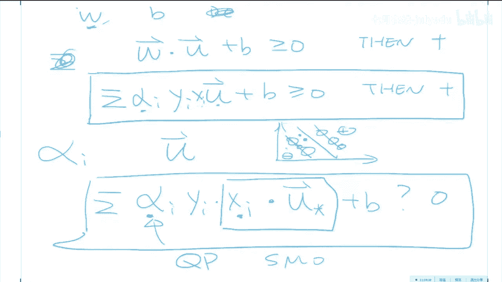

# 人工智能—机器学习公开课（七月在线出品） - P15：老冯经典之作：纯白板手推SVM 🧠

在本节课中，我们将要学习支持向量机（SVM）的核心思想与数学推导过程。SVM不仅是机器学习中一个强大的“开箱即用”工具，其背后的数学原理和推导过程本身也具有极高的价值。我们将从最基础的直觉出发，一步步推导出SVM的优化目标，并揭示其背后关键的“核方法”思想。

---

## 概述：什么是SVM？🤔

SVM是一种用于分类（和回归）的监督学习模型。它的核心思想非常直观：在众多能将正负样本分开的决策边界中，寻找一个“最宽”的边界。这个“宽度”被称为“间隔”（Margin）。SVM认为，间隔最大的决策边界具有最好的鲁棒性，对噪声的容忍度更高。

上一节我们介绍了SVM的基本目标和直觉，本节中我们来看看如何用数学语言精确地描述这个目标。

---

## 第一步：用数学描述决策边界 📐

假设我们有一个线性可分的二分类问题，样本特征为向量 **x**，标签 **y** ∈ {+1, -1}。我们的目标是找到一个线性决策函数。

**决策规则**可以描述为：对于一个新样本点 **u**，如果满足以下条件，则预测为正类（+1）。
```
决策规则: w · u + b ≥ 0 => 预测为 +1
```
其中 **w** 是决策边界的法向量，**b** 是偏置项。我们的任务就是确定 **w** 和 **b**。

在**训练集**中，因为我们知道每个样本的真实标签，我们可以提出更强的要求。我们希望所有正样本离决策边界足够“远”，所有负样本也离决策边界足够“远”。为了数学上的方便，我们将这个“足够远”的距离定义为1。

以下是训练集中的约束条件：
*   对于正样本（y_i = +1）：**w · x_i + b ≥ 1**
*   对于负样本（y_i = -1）：**w · x_i + b ≤ -1**

我们可以利用标签 **y_i** 将这两个不等式巧妙地合并成一个统一的约束条件：
```
统一约束: y_i (w · x_i + b) ≥ 1, 对于所有训练样本 i
```
这个公式是我们推导的基石。

---

## 第二步：定义并计算“间隔”（Margin） 📏

“间隔”是指决策边界到其两侧最近样本的垂直距离之和，也就是分类“道路”的宽度。

假设在决策边界两侧各有一个最近的样本点 **x_+**（正类侧）和 **x_-**（负类侧），它们都恰好落在间隔边界上，即满足 `y_i (w · x_i + b) = 1`。那么，间隔的宽度可以通过向量 **（x_+ - x_-）** 在法向量 **w** 方向上的投影来计算。

间隔宽度公式推导如下：
```
间隔宽度 = (x_+ - x_-) · (w / ||w||)
```
由于 **x_+** 和 **x_-** 满足边界条件，我们可以代入计算：
```
∵ y_+ = +1, ∴ w · x_+ + b = 1  => w · x_+ = 1 - b
∵ y_- = -1, ∴ w · x_- + b = -1 => w · x_- = -1 - b
```
将上述关系代入间隔宽度公式：
```
间隔宽度 = [(1 - b) - (-1 - b)] / ||w|| = 2 / ||w||
```
这是一个关键的发现：**最大化间隔等价于最小化法向量 w 的模长 ||w||**。

---

## 第三步：构建优化问题 ⚙️

根据上面的推导，我们的目标变得清晰：在满足所有训练样本约束的前提下，让间隔 `2 / ||w||` 最大。

这等价于以下优化问题：
```
最小化: (1/2) ||w||^2
约束条件: y_i (w · x_i + b) ≥ 1, 对于所有 i
```
这里将目标函数写为 `(1/2) ||w||^2` 是为了后续求导的数学方便，它与最小化 `||w||` 是等价的。

---

## 第四步：引入拉格朗日乘子法 🔗

这是一个带约束的优化问题，我们使用拉格朗日乘子法将其转化为无约束问题。为每个约束引入一个非负的拉格朗日乘子 α_i ≥ 0。

构建拉格朗日函数 **L(w, b, α)**：
```
L(w, b, α) = (1/2) ||w||^2 - Σ_i α_i [ y_i (w · x_i + b) - 1 ]
```
接下来，我们分别对 **w** 和 **b** 求偏导数，并令其为零。

**对 w 求偏导：**
```
∂L/∂w = w - Σ_i α_i y_i x_i = 0
=> w = Σ_i α_i y_i x_i
```
这个结果非常美妙：最优的决策边界法向量 **w**，是训练样本 **x_i** 的线性组合！

**对 b 求偏导：**
```
∂L/∂b = - Σ_i α_i y_i = 0
=> Σ_i α_i y_i = 0
```

---

## 第五步：对偶问题与关键发现 💎

我们将上面得到的两个关系式代回拉格朗日函数 **L**。经过一系列代入和化简（详细过程见课程推导），**L** 函数可以完全用拉格朗日乘子 **α** 和样本数据表示，并且消去了原始参数 **w** 和 **b**。

最终得到所谓的**对偶问题**：
```
最大化: L(α) = Σ_i α_i - (1/2) Σ_i Σ_j α_i α_j y_i y_j (x_i · x_j)
约束条件: α_i ≥ 0, 且 Σ_i α_i y_i = 0
```
观察这个目标函数 **L(α)**，它揭示了一个至关重要的现象：优化过程以及最终模型，**只依赖于训练样本两两之间的点积 (x_i · x_j)**，而不直接依赖于样本 **x_i** 本身的具体值。

同时，我们最初的决策规则也可以重写：
```
决策规则: Σ_i α_i y_i (x_i · u) + b ≥ 0 => 预测为 +1
```
这意味着，无论是训练还是预测，我们只需要计算样本之间的点积。

---

## 第六步：支持向量与核方法 🌟

求解上述对偶问题后，大部分 **α_i** 会等于0。那些 **α_i > 0** 所对应的训练样本 **x_i**，被称为**支持向量**。它们就是位于间隔边界上的点，决定了最终的决策边界。

**核方法（Kernel Method）的诞生**：由于模型只依赖于点积 `(x_i · x_j)`，我们可以利用一个巧妙的“核技巧”。如果原始数据线性不可分，我们可以通过一个映射函数 **Φ** 将其映射到更高维的特征空间，使其在那个空间里线性可分。在高维空间中的计算可能非常复杂，但核技巧允许我们直接计算映射后向量的点积，而无需显式地进行映射：
```
核函数: K(x_i, x_j) = Φ(x_i) · Φ(x_j)
```
例如，使用高斯核 `K(x_i, x_j) = exp(-γ ||x_i - x_j||^2)`，等价于将数据映射到了一个无限维的空间。这样，我们就能在原始空间中处理非线性决策边界。核方法的思想不仅限于SVM，也可以应用到线性回归、岭回归等模型中，形成它们的“核化”版本。

---

## 总结 🎯

本节课中我们一起学习了支持向量机的核心推导过程：
1.  **核心思想**：寻找最大间隔的决策边界以获得最佳鲁棒性。
2.  **数学建模**：将最大化间隔问题转化为最小化 `||w||^2` 的带约束优化问题。
3.  **拉格朗日对偶**：通过引入拉格朗日乘子，将原问题转化为对偶问题，并发现最优的 **w** 是训练样本的线性组合。
4.  **关键洞察**：对偶问题的目标函数和决策规则**只依赖于样本间的点积**。
5.  **核方法**：基于点积这一特性，通过引入核函数，可以隐式地将数据映射到高维空间，从而高效地处理非线性问题。




SVM的推导过程完美体现了统计学习理论、凸优化和泛函分析的结合，其价值与模型性能同等重要。理解这一推导，是灵活应用和扩展SVM乃至其他核方法模型的基础。