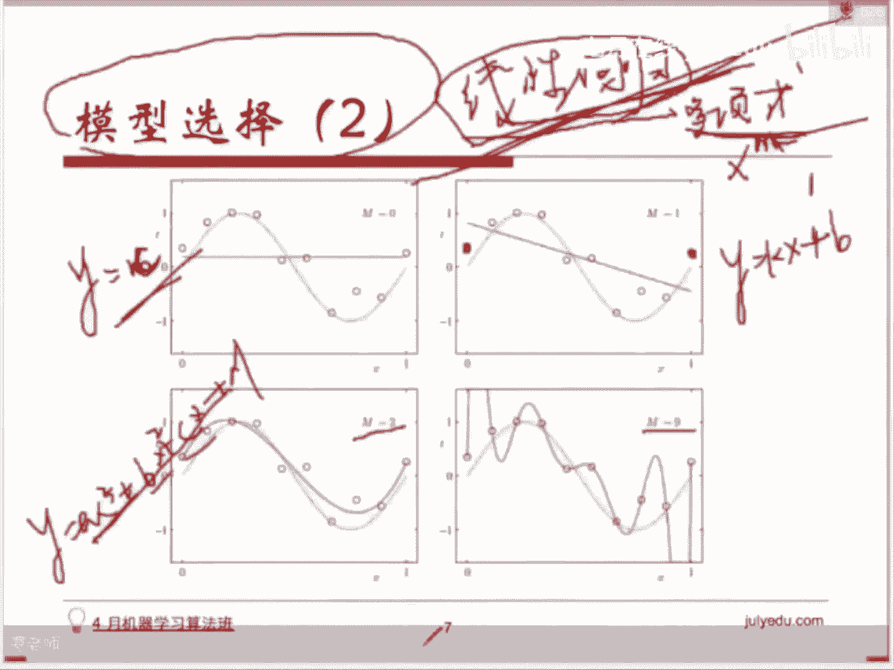

# 人工智能—机器学习公开课（七月在线出品） - P16：模型选择 🧠

在本节课中，我们将要学习机器学习中一个至关重要的环节：模型选择。我们将从两个层面来理解它：一是如何根据问题类型和数据特点选择最合适的算法模型；二是在选定模型后，如何通过调整其参数来获得最佳性能。理解并掌握模型选择的方法，是构建有效机器学习解决方案的关键一步。

## 模型选择的第一种含义：选择算法模型

上一节我们介绍了模型选择的概念，本节中我们来看看它的第一种常见含义：如何根据具体问题和数据，从众多机器学习算法中选择一个合适的模型。

通常，没有一种模型是万能的，能适用于所有场景。模型的选择往往依赖于特定的数据特征和问题背景。不过，存在一些通用的准则可以帮助我们进行初步筛选。

以下是基于 `scikit-learn` 库的一个常用模型选择流程图，它为我们提供了一个大致的决策路径：

1.  **判断样本量**：首先评估你的数据样本量是否充足。机器学习通常需要大量样本来训练出具有良好泛化能力的模型。
    *   如果样本量非常少，建议要么采集更多数据，要么考虑使用人工规则而非机器学习模型。

2.  **区分问题类型**：在样本量充足的前提下，确定你要解决的问题是**连续值预测**（回归问题）还是**离散类别判定**（分类问题）。
    *   **回归问题**：例如预测房价、股价。
    *   **分类问题**：例如判定交易是否欺诈、用户是否会点击广告。

3.  **针对分类问题的路径选择**：
    *   如果样本量不是特别大，可以考虑线性支持向量机（Linear SVC）或逻辑回归（Logistic Regression）。
    *   如果数据是**文本类型**，朴素贝叶斯（Naive Bayes）是一个经典且有效的选择。
    *   如果样本量**非常大**，使用传统SVM可能训练缓慢，此时可考虑使用随机梯度下降（SGD）相关的分类器。

4.  **针对回归问题的路径选择**：
    *   如果样本量适中，可以考虑线性回归、支持向量回归（SVR）或梯度提升回归树（GBRT）等。
    *   如果样本量非常大，同样需要考虑使用随机梯度下降（SGD）来优化训练过程。
    *   如果数据**维度非常高**，通常需要先进行降维处理（如使用PCA算法），以节省计算资源。

5.  **无监督学习场景**：如果你的数据没有标签（即不知道目标值 `y`），目标是发现数据内在的结构或关联，则应使用**聚类算法**（如K-Means）。

> **注意**：此流程图是一个通用的参考指南。在实际应用中，根据具体数据和特征工程的结果，可能需要进行调整。例如，分类问题在维度很高时同样可能需要先进行降维。

## 模型选择的第二种含义：选择模型参数

上一节我们讨论了如何选择算法，本节中我们来看看模型选择的第二种含义：在选定某个具体模型后，如何为其选择最优的超参数。

即使确定了使用某个算法（例如多项式回归），模型内部仍有参数需要确定。以多项式回归为例，其核心参数是多项式的最高次数 `n`。

*   如果 `n=0`，模型退化为常数函数 `y = c`，无法拟合复杂数据。
*   如果 `n=1`，模型为线性函数 `y = kx + b`，可能无法很好地拟合非线性关系。
*   如果 `n=3`，模型为三次函数 `y = ax³ + bx² + cx + d`，拟合能力更强。
*   如果 `n=9`，模型为九次函数，它可能在训练数据上拟合得非常好，甚至穿过每一个点，但这容易导致**过拟合**，即在新的、未见过的数据上表现很差。

因此，我们需要一种方法来评估不同参数下模型的好坏，并选择泛化能力最强的那个。这就是**交叉验证**的目的。

## 交叉验证：模型参数选择的利器

为了解决参数选择问题，我们引入交叉验证方法。标准的做法是将数据集分为三部分，而不仅仅是训练集和测试集。

以下是数据集的典型划分方式及其作用：

1.  **训练集**：用于构建和训练模型。
2.  **交叉验证集**：用于进行模型选择和参数调优。
3.  **测试集**：仅在最终模型确定后，用于评估模型的泛化性能。

最经典的交叉验证方法是 **K折交叉验证**。其流程如下：

假设我们进行5折交叉验证（K=5）：
*   首先，将**训练集**随机、均匀地分成5个子集（称为5折）。
*   然后进行5轮训练与验证。在每一轮中：
    *   选取其中一折作为**交叉验证集**。
    *   使用剩余的4折数据作为**训练集**来训练模型。
    *   用训练好的模型在当轮的交叉验证集上评估性能（如计算准确率）。
*   最后，计算这5轮评估结果的平均值，作为该组参数下模型性能的估计。

通过这种方式，我们充分利用了有限的训练数据，减少了因单次数据划分不合理而带来的偏差，从而更可靠地比较不同参数组合的优劣。从所有参数组合中，我们选择在交叉验证集上平均性能最好的那一组。

最终，我们使用从未参与过模型选择和训练的**测试集**，对选定参数的模型进行最终的性能评估。

## 课程总结

本节课中我们一起学习了机器学习中的模型选择。我们首先从宏观层面了解了如何根据问题类型（回归/分类）、数据规模和数据形式（如文本）来选择合适的算法模型。接着，我们深入到微观层面，探讨了在选定算法后，如何通过**交叉验证**这一关键技术来为模型选择最优的超参数，并介绍了**K折交叉验证**的标准流程。理解这两个层面的模型选择，是构建稳健、高效机器学习模型的基础。