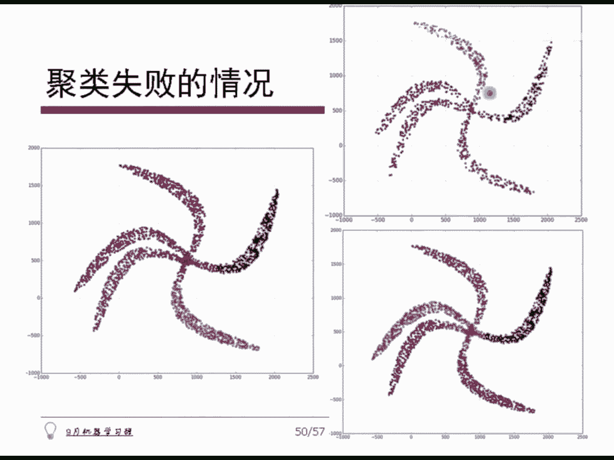

# 人工智能—机器学习公开课（七月在线出品） - P17：谱聚类

## 📚 课程概述

在本节课中，我们将要学习一种基于图论的聚类方法——谱聚类。我们将从“谱”的概念讲起，逐步介绍如何构建相似度图、计算拉普拉斯矩阵，并最终利用特征向量完成聚类。整个过程将结合公式和代码进行说明，力求简单直白，让初学者能够看懂。

---

## 🎼 什么是“谱”？

所谓“谱”，指的是一个方阵所有特征值的全体。对于一个线性算子（矩阵）**A**，其作用 **A** × **x** 仍然是一个线性变换。这个矩阵的“谱”就是它的特征值集合。

其中，最大的特征值被称为该谱的“半径”。在计算中，我们常常通过计算 **A<sup>T</sup>A** 这个方阵的最大特征值来求得谱半径。

---

## 🧩 谱聚类的基本思想

上一节我们介绍了“谱”的概念，本节中我们来看看什么是谱聚类。

谱聚类本质上是一种基于图论的聚类方法。其核心流程可以概括为以下三步：
1.  根据样本数据构建一张图（相似度图）。
2.  计算该图的拉普拉斯矩阵。
3.  对该矩阵进行特征分解，利用得到的特征向量对样本进行聚类。

接下来，我们将详细展开每一步。

---

## 🗺️ 第一步：构建相似度图

给定 N 个样本点 **X<sub>1</sub>** 到 **X<sub>N</sub>**，我们需要构建一个图来表示它们之间的关系。以下是构建相似度图的关键步骤和常见方法。

### 相似度矩阵 **W**

首先，我们需要计算任意两点之间的相似度 **s<sub>ij</sub>**。相似度与距离成反比，值越大表示两点越相似。由此，我们得到一个 N×N 的相似度矩阵 **W**。

**注意**：我们通常强制规定 **W** 矩阵对角线上的元素 **W<sub>ii</sub> = 0**（即自己与自己的相似度为0）。这样做是为了方便后续计算度矩阵。

### 相似度度量函数

实践中，常用的相似度度量函数是高斯核函数（Radial Basis Function, RBF），其公式如下：

**s<sub>ij</sub> = exp(-||x<sub>i</sub> - x<sub>j</sub>||² / (2σ²))**

其中，**σ** 是一个带宽参数，控制函数的衰减速度。

### 图的稀疏化

得到稠密的相似度矩阵后，我们通常需要将其稀疏化，即只保留重要的连接。以下是三种常见方法：

1.  **ε-邻近图**：设定一个阈值 **ε**。如果 **s<sub>ij</sub> < ε**，则将 **W<sub>ij</sub>** 置为0；否则保留。阈值 **ε** 可以选取所有相似度的均值或图的最小生成树中最大边的权重。
2.  **k-近邻图**：对于每个点 **i**，只保留与它相似度最高的 **k** 个点的连接，其他连接置0。注意，这种方式构建的图可能不是对称的。
3.  **互k-近邻图**：在k-近邻图的基础上，要求连接是双向的。即点 **i** 和点 **j** 必须互为对方的k近邻之一，才保留连接。

**实践建议**：如果不确定如何选择，通常直接使用 **k-近邻图** 即可。

---

## 🔢 第二步：计算拉普拉斯矩阵

在构建好图（即得到矩阵 **W**）之后，我们需要计算其拉普拉斯矩阵。这是谱聚类的核心。

### 度矩阵 **D**

首先计算度矩阵 **D**。它是一个对角矩阵，对角线上的元素 **D<sub>ii</sub>** 表示第 **i** 个节点的“度”，即与该节点相连的所有边的权重之和：

**D<sub>ii</sub> = Σ<sub>j=1</sub><sup>N</sup> W<sub>ij</sub>**

### 拉普拉斯矩阵 **L** 及其变种

最基本的拉普拉斯矩阵是**非规范化拉普拉斯矩阵**，定义为：

**L = D - W**

这个矩阵 **L** 具有一些重要性质：它是对称且半正定的。这意味着它的所有特征值都是非负实数，并且至少有一个特征值为0。

此外，还有两种常用的拉普拉斯矩阵变种：

1.  **对称拉普拉斯矩阵**：**L<sub>sym</sub> = D<sup>-1/2</sup> L D<sup>-1/2</sup> = I - D<sup>-1/2</sup> W D<sup>-1/2</sup>**
2.  **随机游走拉普拉斯矩阵**：**L<sub>rw</sub> = D<sup>-1</sup> L = I - D<sup>-1</sup> W**

**随机游走拉普拉斯矩阵** 的名称来源于其概率解释。**D<sup>-1</sup>W** 的每一行元素之和为1，可以看作一个转移概率矩阵，描述了在图上随机游走的模型。

**实践建议**：如果不知道选择哪一种，**优先选择随机游走拉普拉斯矩阵**。

---

## 🧮 第三步：特征分解与聚类

本节我们将看到如何利用拉普拉斯矩阵的特征向量来完成最终的聚类。

### 算法步骤

假设我们希望将数据聚成 **K** 类，以下是谱聚类的标准步骤：

1.  计算相似度矩阵 **W** 和度矩阵 **D**。
2.  计算拉普拉斯矩阵 **L**（或 **L<sub>sym</sub>**、**L<sub>rw</sub>**）。
3.  计算 **L** 的**前 K 个最小的特征值**及其对应的特征向量 **u<sub>1</sub>, u<sub>2</sub>, ..., u<sub>K</sub>**。
    *   每个特征向量是 N 维的（N 为样本数）。
4.  将这 K 个特征向量按列排列，形成一个 N×K 的矩阵 **U**：**U = [u<sub>1</sub> u<sub>2</sub> ... u<sub>K</sub>]**。
5.  将矩阵 **U** 的每一行看作一个新的 **K** 维空间中的样本点 **y<sub>i</sub>**（**i = 1, ..., N**）。
6.  对这 N 个新的样本点 **{y<sub>i</sub>}** 使用传统的 **K-Means** 算法进行聚类，得到 K 个簇。
7.  将 **K-Means** 输出的簇标签映射回原始样本点，即完成谱聚类。

**物理意义**：这个过程可以看作一种降维。我们通过提取拉普拉斯矩阵的前K个特征向量，将原始数据转换到一个新的、更能体现其内在结构的低维空间（K维），然后在这个空间中进行聚类。

### 如何选择聚类数目 K？

如果事先不知道 K 值，可以通过观察拉普拉斯矩阵的特征值来估计。将特征值从小到大排列，寻找相邻特征值之间“跳跃”最大的位置，跳跃点之前的特征值个数可以作为 K 的参考值。

---

## 💻 谱聚类代码实践

理论清晰后，实现起来就非常简单了。以下是谱聚类（以随机游走拉普拉斯矩阵为例）的核心代码逻辑概述：

```python
# 伪代码流程
1. 输入：数据点 X，聚类数 K，近邻数 k
2. 计算相似度矩阵 W (使用k-近邻+高斯核)
3. 计算度矩阵 D (D_ii = sum_j W_ij)
4. 计算拉普拉斯矩阵 L_rw = I - D^(-1) * W
5. 计算 L_rw 的前 K 个最小特征值对应的特征向量，构成矩阵 U (N x K)
6. 将 U 的每一行作为新特征 y_i
7. 对 {y_i} 使用 K-Means 算法，聚类成 K 类
8. 输出聚类结果
```

可以看到，谱聚类的代码实现主要依赖于矩阵运算和特征值求解，聚类部分直接调用成熟的 K-Means 算法。

---

## ⚠️ 注意事项与失败案例

谱聚类并非万能，其效果严重依赖于参数的选择（如高斯核的带宽 **σ**、近邻数 **k**、聚类数 **K**）。参数选择不当会导致聚类失败。

以下是几种常见的失败情况：
*   **带宽 σ 过大或过小**：会导致相似度度量失真，可能将所有点聚成一类，或产生不合理的分割。
*   **近邻数 k 选择不当**：可能破坏数据的局部结构，导致无法正确识别簇。
*   **聚类数 K 选择错误**：显然会得到不符合数据真实分布的聚类结果。

因此，在实际应用中，调参是一个必要且重要的步骤。

---

## 📝 课程总结

本节课中，我们一起学习了谱聚类这一强大的基于图论的聚类方法。

我们首先了解了“谱”的概念，然后逐步学习了谱聚类的三个核心步骤：
1.  **建图**：通过计算样本间相似度（如使用高斯核），并利用k-近邻等方法构建稀疏的相似度图。
2.  **计算拉普拉斯矩阵**：介绍了度矩阵 **D**、非规范化拉普拉斯矩阵 **L = D - W** 及其两种常用变体（对称型和随机游走型）。
3.  **特征分解与聚类**：通过计算拉普拉斯矩阵前K个最小特征值对应的特征向量，将原始数据映射到新空间，再用K-Means算法完成聚类。

我们还讨论了如何自适应选择聚类数目 **K**，并简要看了代码实现逻辑。最后，我们指出了谱聚类对参数敏感的特点，需要通过调参来获得最佳效果。




谱聚类与主成分分析在思想上有异曲同工之妙，都是通过提取矩阵的特征向量来发现数据的主要结构。掌握谱聚类，为你处理复杂形状的数据聚类问题提供了一个有力的工具。