# 人工智能—机器学习公开课（七月在线出品） - P18：世界杯数据分析案例 🏆

在本节课中，我们将学习如何利用Python进行一场真实世界杯比赛的数据分析。我们将从原始数据出发，通过数据清洗、特征工程、统计分析和可视化，一步步揭示比赛背后的故事。

## 概述与数据准备

上一节我们介绍了数据分析的基本流程，本节中我们来看看如何将其应用到一个具体的体育赛事案例中。

首先，我们需要准备好分析所需的数据和工具。数据来源于2014年世界杯决赛（德国 vs 阿根廷）的JSON格式比赛记录。我们需要将其转换为更易处理的`DataFrame`格式。

以下是分析前需要完成的准备工作：

```python
import pandas as pd
import numpy as np
import matplotlib.pyplot as plt
```

同时，为了更直观地展示球场上的事件，我们预先封装了两个自定义函数：
*   `draw_pitch()`: 用于绘制一个标准足球场的背景图，包括禁区、中场线等。
*   `draw_event()`: 用于在球场图上用箭头等形式绘制具体事件（如传球、射门）。

## 数据预处理与特征工程

在开始分析之前，我们需要对原始数据进行处理，并创建一些有助于分析的新特征。

我们从CSV文件中读取比赛数据，并基于足球场的实际尺寸进行坐标缩放，确保可视化时的比例正确。

以下是我们在原始数据基础上创建的一些核心特征：

*   **`distance`**: 计算事件发生位置到球门的距离。公式为 `distance = sqrt(x**2 + y**2)`。
*   **`to_box` / `from_box`**: 计算事件发生位置到己方或对方禁区的距离。
*   **`on_offense`**: 判断球队是否处于进攻阶段。这是一个二值特征，当球员位置越过中场线进入对方半场时，值为1（进攻），否则为0（防守）。

这些特征将帮助我们量化球队的攻势、控球优势以及威胁程度。

## 上半场比赛分析

现在，让我们聚焦于上半场的比赛情况。我们首先通过可视化来直观感受双方的攻防态势。

我们绘制了上半场的攻势分布图。图中，纵坐标大于0的区域代表德国队的进攻时段，小于0的区域代表阿根廷队的进攻时段，并用箭头标记了所有射门事件。

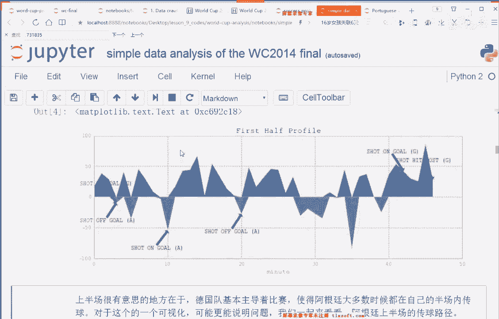

从图中可以清晰地看到，上半场蓝色区域（德国进攻）占据了绝对主导，表明德国队大部分时间都将比赛压制在阿根廷的半场。

为了用数据证实这一观察，我们进行以下统计：

以下是德国与阿根廷在上半场的关键数据对比：


1.  **进攻时长占比**：对 `on_offense` 特征求平均值，得到各队处于进攻状态的概率。
    *   德国队：**61.6%**
    *   阿根廷队：**27.3%**
2.  **传球成功率**：对传球事件的 `outcome`（成功为1，失败为0）求平均值。
    *   德国队：**83.5%**
    *   阿根廷队：**69.4%**

数据证实了德国队在上半场拥有显著的控球和进攻优势。

我们还可以通过绘制传球事件图来获得更细致的洞察。下图展示了上半场所有的传球，箭头方向代表传球方向。

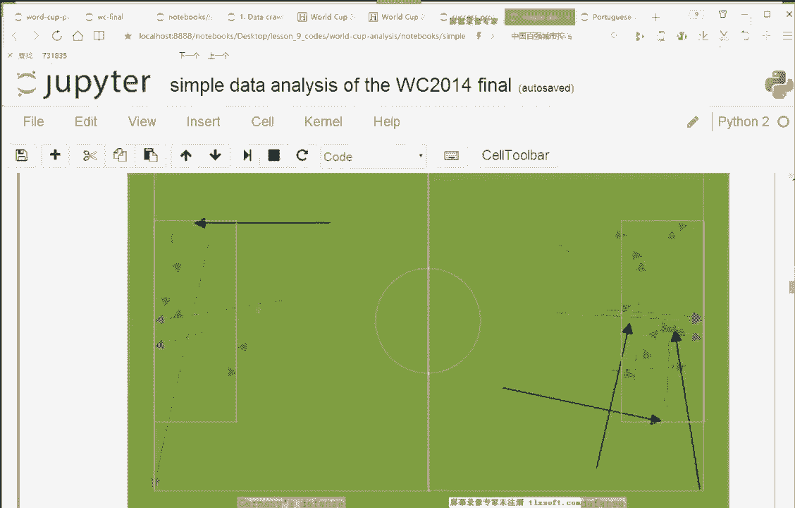

从图中可见，绝大多数传球（箭头）都发生在阿根廷的半场（右侧），且德国队有多次传球深入阿根廷禁区，而阿根廷队则很难将球传入德国队的危险区域。

## 关键事件深度分析：克拉默受伤的影响

数据分析不仅在于描述现象，更在于挖掘原因。上半场中段，德国队球员克拉默受伤，但直到约12分钟后才被换下。我们通过数据来探究这期间的影响。

我们提取了克拉默受伤前后个人事件的数据表，并绘制了其活动统计柱状图。


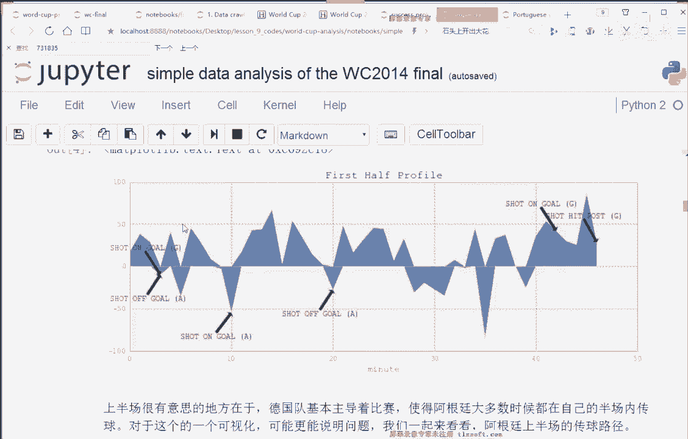
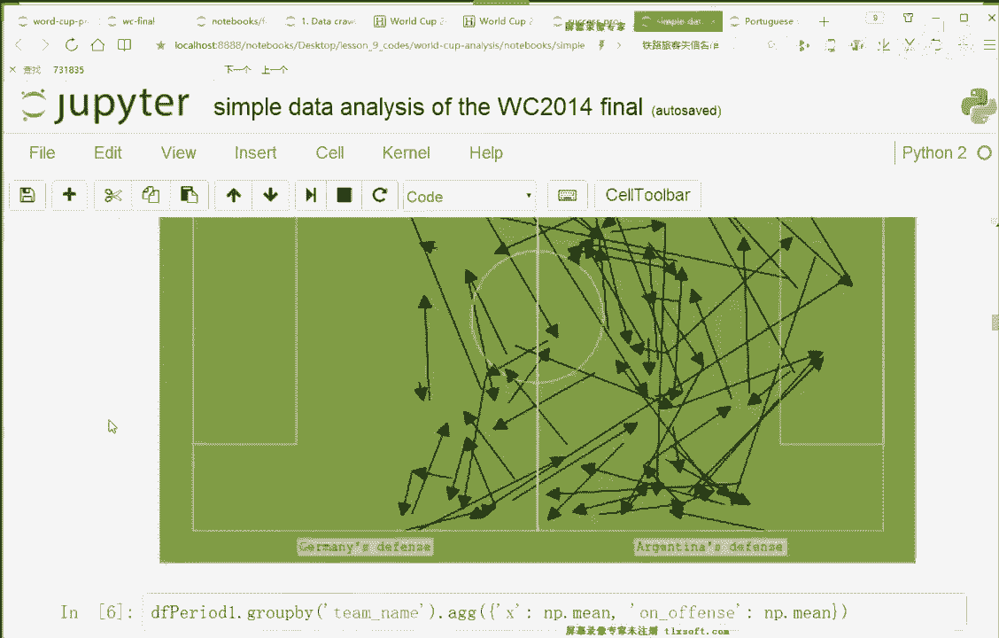

数据显示，在受伤后的12分钟里，克拉默仅有一次传球且以丢失球权告终，其活动频率急剧下降。这导致德国队在该时段内相当于少打一人，攻势受挫，这与整体攻势图中出现的短暂“低谷期”相吻合。


## 下半场及加时赛分析

接下来，我们以同样的方法分析下半场和加时赛。

下半场的攻势分布图显示，双方态势趋于均衡，阿根廷队有了更多攻入德国半场的机会。

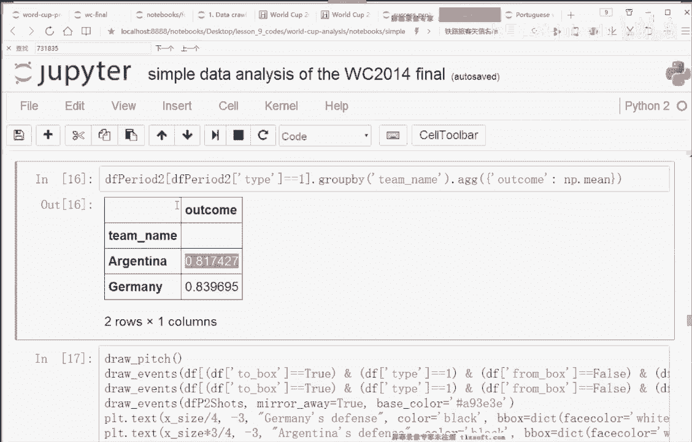

统计数据也支持这一观察：
*   进攻时长占比：德国 59.1%，阿根廷 40.9%。
*   传球成功率：德国 83.0%，阿根廷 81.1%。

进入加时赛后，局势又有新的变化。下图展示了加时赛阶段的传球与射门事件。


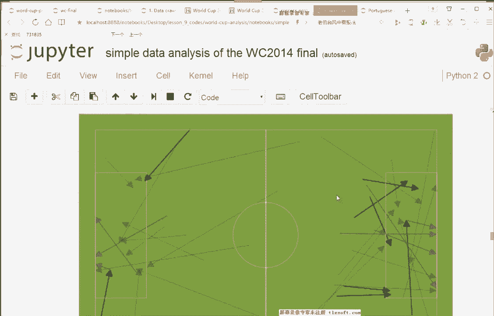

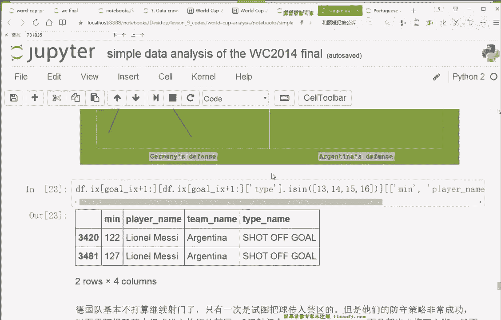
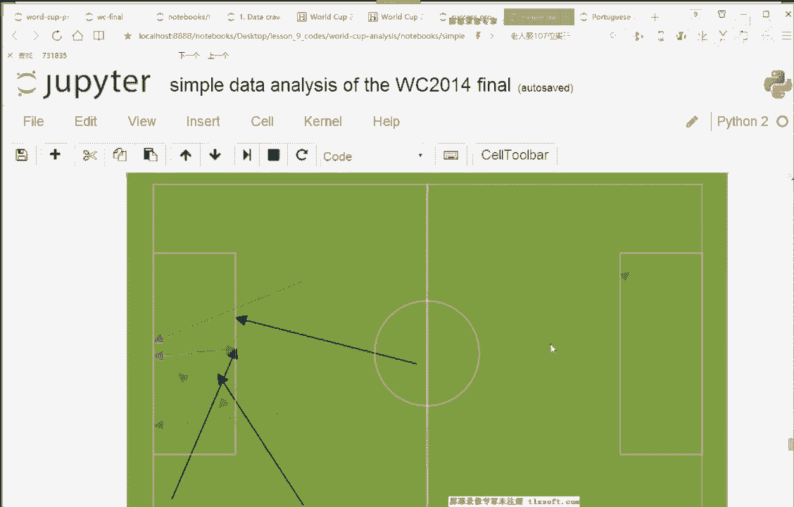

分析发现，德国队在加时赛进球后，明显减少了进攻尝试和向禁区的传球，转而采取控制节奏、消耗时间的策略。而阿根廷队虽奋力反扑，但仅有的两次射门（图中红色箭头）均来自禁区外，未能构成绝对威胁，最终未能扳平比分。

## 球员个人表现统计


最后，我们可以对球员的个人表现进行汇总分析。


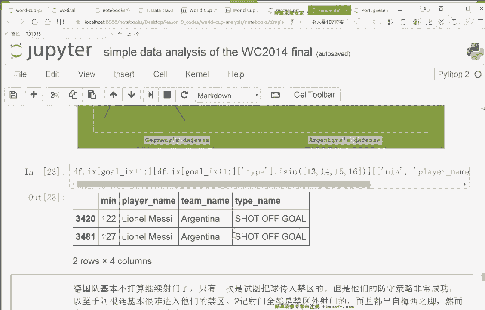

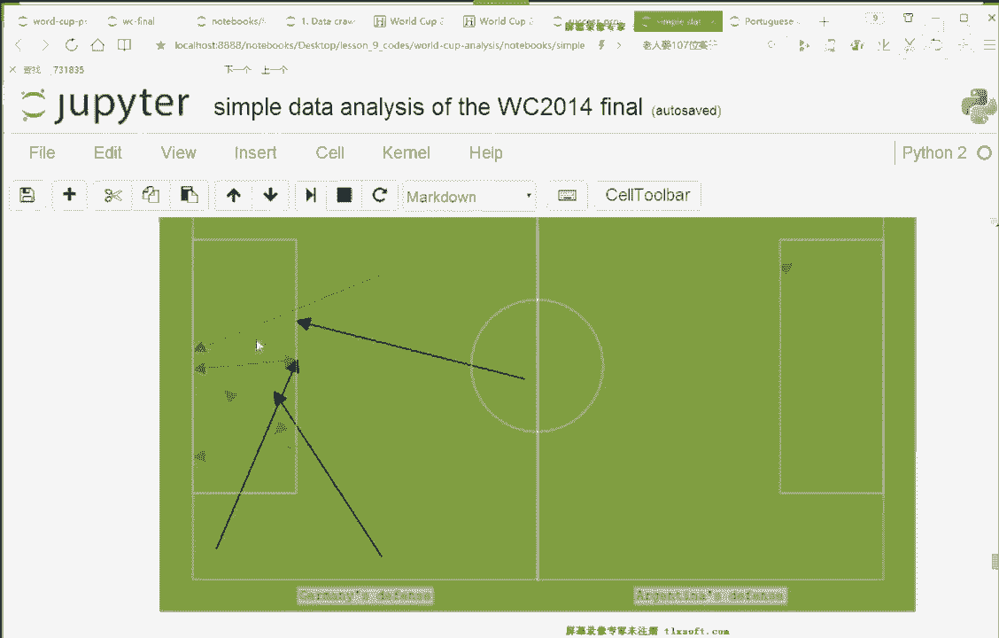

以下是生成球员数据统计表的方法：

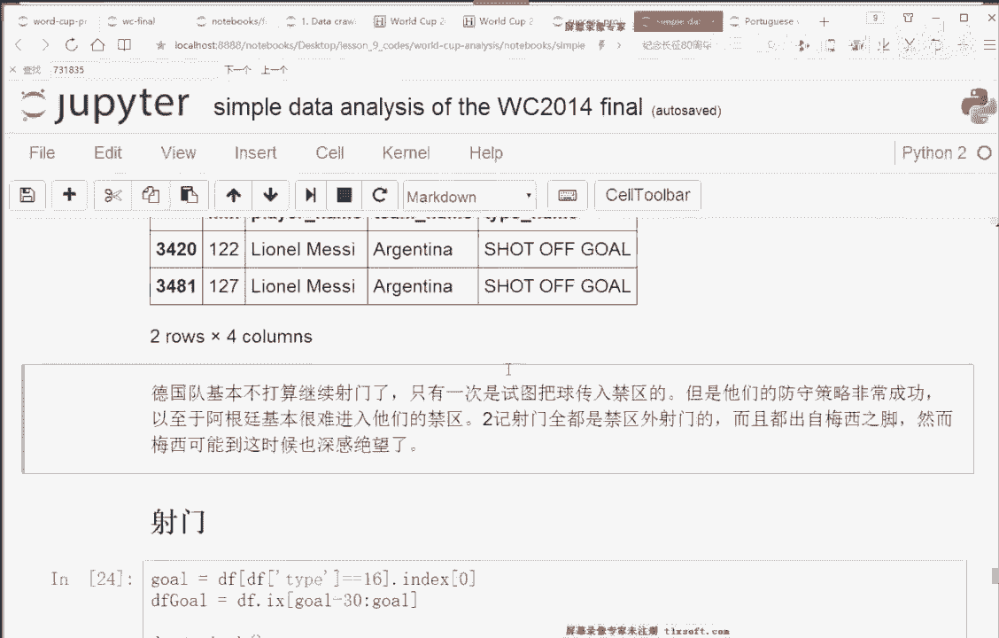

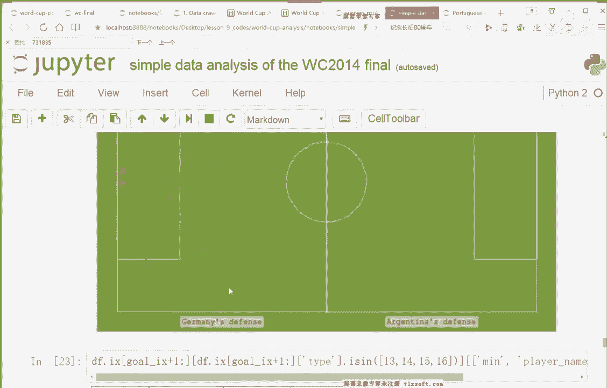

1.  按球员姓名对数据进行分组 (`groupby`)。
2.  聚合计算每个球员的总事件数、传球次数、成功率、射门次数等指标。
3.  将结果以表格形式呈现，便于横向比较各球员的贡献和效率。

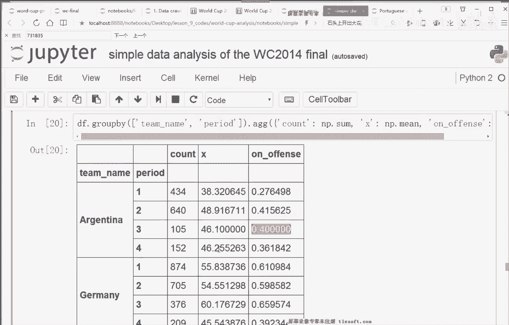

这种分析可以帮助识别关键球员、评估战术执行效果，或为未来的比赛部署提供参考。

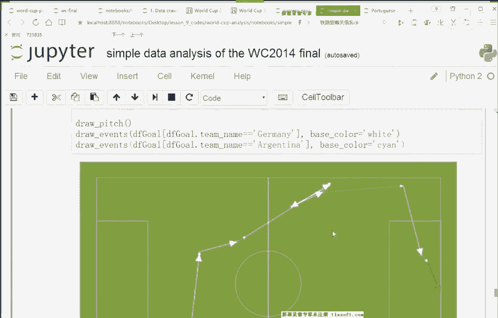

## 总结

本节课中我们一起学习了如何对一个完整的体育赛事数据集进行端到端的分析。

我们从数据预处理和特征工程开始，创建了用于量化比赛态势的特征。接着，我们通过绘制**攻势时序图**和**事件散点图**进行可视化探索，直观揭示了德国队在上半场的压倒性优势。然后，我们利用分组统计验证了视觉观察，并**通过深挖关键事件（球员受伤）的数据，展示了如何结合背景知识进行归因分析**。最后，我们将分析方法应用于比赛的其他阶段，并扩展到球员个人表现的评估。

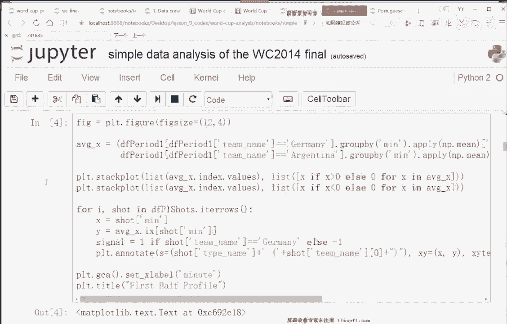


这个案例表明，数据分析不仅仅是冰冷的数字，结合领域知识和恰当的可视化，它能够生动地讲述数据背后的故事，为决策提供有力支持。