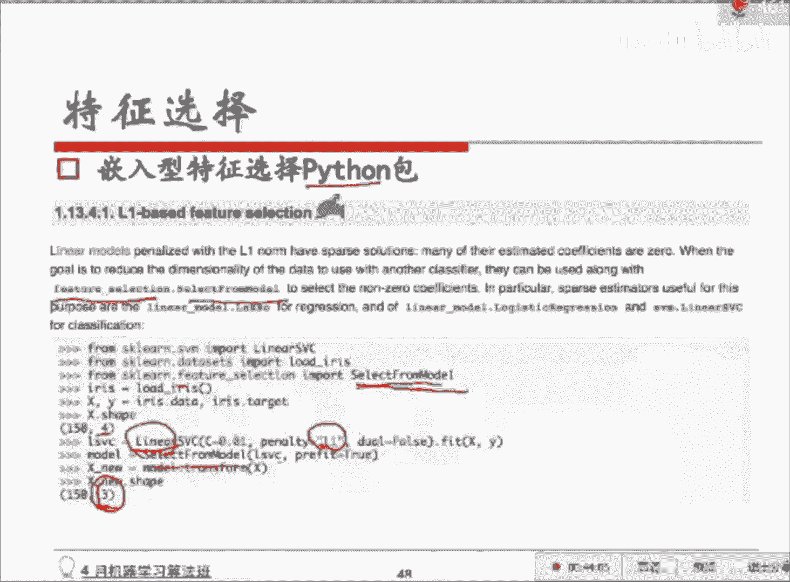

# 人工智能—机器学习公开课（P19）：特征处理与特征选择 🧠


在本节课中，我们将要学习特征工程中的核心环节：特征处理与特征选择。我们将探讨如何从原始数据中提取、构造和筛选出对模型最有价值的特征，以提升机器学习模型的性能与效率。

## 概述 📋

特征工程是机器学习项目成功的关键。原始数据通常不能直接用于模型训练，需要通过一系列处理转化为模型能够理解的有效特征。本节课将系统介绍统计特征的构造、组合特征的生成以及特征选择的方法。

上一节我们介绍了特征的基本概念与类型，本节中我们来看看如何具体处理和选择这些特征。

## 统计特征 📊

统计特征是在各类数据竞赛和工业界业务中贴合度非常高的特征。它们通过对原始数据进行统计计算得到，能够有效反映数据的内在规律。

以下是几种常见的统计特征类型：

*   **加减平均**：例如，用户购买商品价格高于全体用户平均价格的差值，可以衡量其消费能力。
*   **分位数**：例如，商品价格处于售出商品价格序列的某个分位点，可以体现购买力。`20%分位数`意味着20%的商品价格低于此值。
*   **排序型**：例如，商品在类别中的热度排名。
*   **比例型**：例如，用户某项行为数占总行为数的比例。

### 实例分析：电商推荐大赛

在一个电商推荐算法大赛中，参赛者基于用户行为表和商品属性表构造了大量有效的统计特征。

以下是他们构造的部分特征示例：

*   **用户维度统计特征**：例如，`用户购物车购买转化率`、`用户日均行为数`。
*   **商品维度统计特征**：例如，`商品热度（点击/收藏/加购/购买次数）`、`商品曝光购买转化率`。
*   **时间窗口统计特征**：例如，`最近7天用户行为数与平均行为数的比值`、`商品近期销量变化趋势`。
*   **比值型特征**：例如，`用户对某品牌购买数除以收藏数`、`商品行为数除以同类商品平均行为数`。

这些特征从连续值、离散值、时间维度等多个角度对数据进行刻画，为模型提供了丰富的信息。

## 组合特征 🔗

单一特征有时信息有限，将多个特征组合起来能产生更强的表达能力。组合特征主要分为两类。

### 1. 拼接型组合特征

这是最简单直接的方式，尤其在逻辑回归等线性模型中使用。它将两个或多个离散特征的值直接拼接，作为一个新的特征。

例如，将用户ID和商品品类ID拼接：
`特征 = 用户ID_品类ID`
如果用户10001购买了女士裙装，则该特征值为1，否则为0。模型学习到的权重直接反映了用户对该品类组合的偏好。

### 2. 基于模型的特征组合

以Facebook提出的`GBDT + LR`方法为例。首先使用梯度提升树模型自动进行特征组合与筛选。

```python
# 概念性伪代码
# GBDT模型会生成多棵决策树
tree_path = GBDT.predict_path(X)
# 每一条从根到叶子的路径代表一种特征组合规则
# 例如：规则 = (性别=男) AND (城市=上海) AND (设备=手机)
# 将该规则编码为一个新特征
new_feature = encode(tree_path)
# 将所有新特征输入逻辑回归模型
lr_model.fit(new_feature, y)
```

GBDT模型学习到的每一条决策路径，都代表了一种有效的特征交叉组合。将这些路径作为新的离散特征输入逻辑回归，能显著提升模型效果。

## 特征选择 🎯

特征过多会导致计算效率下降、模型复杂度过高，并可能引入噪声。特征选择的目标是从原始特征集中筛选出一个最优子集。

### 特征选择 vs. 降维

*   **特征选择**：从N个特征中挑选出K个特征，不改变特征原始含义。例如，从50个特征中选出30个最重要的。
*   **降维**：通过数学变换将N个特征转换为M个新特征，通常会改变原始特征的含义和解释性。例如主成分分析。

### 特征选择方法

#### 1. 过滤法

过滤法独立于任何机器学习模型，它根据特征的统计指标（如与目标变量的相关性）进行排序和选择。

以下是两种常用的过滤法函数：

*   **SelectKBest**：选择与目标变量相关性最高的K个特征。
    ```python
    from sklearn.feature_selection import SelectKBest
    selector = SelectKBest(k=2)
    X_new = selector.fit_transform(X, y)
    ```
*   **SelectPercentile**：选择与目标变量相关性最高的前百分之N的特征。
    ```python
    from sklearn.feature_selection import SelectPercentile
    selector = SelectPercentile(percentile=50) # 选择前50%
    X_new = selector.fit_transform(X, y)
    ```

**优点**：计算快，易于理解。
**缺点**：未考虑特征间的相互关系，可能漏选有组合价值的特征。

#### 2. 包裹法

包裹法将特征选择过程与模型训练相结合，通过评估不同特征子集对模型性能的影响来进行选择。递归特征消除是常用方法。

**递归特征消除步骤**：
1.  用全部特征训练模型。
2.  根据模型系数（如线性模型的权重）排序，移除权重最小的一个或一组特征。
3.  用剩余的特征重复步骤1和2。
4.  直到特征数量达到预设值，或模型性能出现显著下降。

```python
from sklearn.feature_selection import RFE
from sklearn.linear_model import LogisticRegression
model = LogisticRegression()
selector = RFE(estimator=model, n_features_to_select=5)
X_new = selector.fit_transform(X, y)
```

**优点**：考虑特征组合效应，选出的特征子集通常性能更优。
**缺点**：计算开销大，尤其对于特征数量多的情况。

#### 3. 嵌入法

嵌入法将特征选择作为模型训练过程的一部分。最常见的是在线性模型中使用L1正则化。

*   **L1正则化**：在损失函数中加入模型权重的绝对值之和作为惩罚项。这会导致不重要的特征对应的权重被压缩为**精确的0**，从而实现特征选择。
    `损失函数 = 原始损失 + λ * Σ|权重|`
*   **L2正则化**：惩罚项是权重的平方和。它会使权重整体缩小，但**很少恰好为0**。

```python
from sklearn.feature_selection import SelectFromModel
from sklearn.svm import LinearSVC
# 使用带有L1正则化的线性模型作为基评估器
lsvc = LinearSVC(C=0.01, penalty="l1", dual=False).fit(X, y)
model = SelectFromModel(lsvc, prefit=True)
X_new = model.transform(X)
```

**优点**：在模型训练的同时完成特征选择，效率高于包裹法。
**缺点**：依赖于特定的模型（通常是线性模型）。

## 总结 🎓

本节课中我们一起学习了特征处理与特征选择的核心内容。

我们首先介绍了如何从业务角度构造**统计特征**，包括均值、分位数、比值等，这些是构建有效特征的基础。接着，我们探讨了**组合特征**的威力，无论是简单的特征拼接还是利用GBDT等模型自动发现特征交叉，都能显著提升模型表现。

最后，我们深入讲解了**特征选择**的三大方法：**过滤法**快速但粗糙，**包裹法**精确但耗时，**嵌入法**（特别是结合L1正则化）则在效率和效果之间取得了很好的平衡，是工业界常用的方法。




特征工程是一门艺术，需要结合领域知识、数据洞察和反复实验。掌握这些方法，能帮助你从数据中提炼出黄金，为构建强大的机器学习模型奠定坚实的基础。