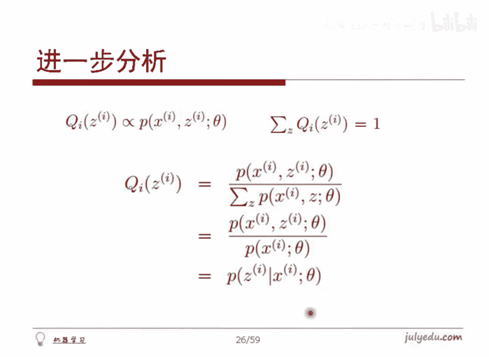

# 人工智能—机器学习公开课（七月在线出品） - P2：18分钟理解EM算法

在本节课中，我们将要学习EM算法的核心思想与推导过程。EM算法是一种用于处理含有隐变量的概率模型参数估计的有效方法。我们将从基本概念出发，逐步推导其数学原理，并最终理解其迭代框架。

## 🎼 EM算法的基本思路

上一节我们介绍了EM算法要解决的问题。本节中我们来看看它的基本思路。

EM算法处理的是含有隐变量 `Z` 的模型参数估计问题。例如，在身高数据中，`X` 是观测到的身高，`Z` 是未观测到的性别。我们的目标是找到模型参数 `θ`，使得观测数据 `X` 的似然函数 `P(X|θ)` 最大。

由于直接最大化包含隐变量的似然函数 `P(X|θ)` 很困难，EM算法采用了一种迭代优化的策略。其核心思想是：如果能找到一个函数，它是原对数似然函数的下界，并且这个下界函数更容易求极大值，那么通过不断优化这个下界函数，就能间接地提升原对数似然函数的值，最终收敛到一个局部最优解。

## 📈 数学推导：构建下界函数

上一节我们了解了EM算法的优化思路。本节中我们通过数学推导来具体实现它。

首先，我们写出包含 `M` 个独立样本的对数似然函数：
`L(θ) = Σ_{i=1}^{M} log P(x_i | θ)`

由于 `P(x_i | θ)` 是边缘分布，我们引入隐变量 `Z` 将其写成联合分布的形式：
`P(x_i | θ) = Σ_{z} P(x_i, z | θ)`

因此，对数似然函数变为：
`L(θ) = Σ_{i=1}^{M} log [ Σ_{z} P(x_i, z | θ) ]`

直接优化这个式子很困难。EM算法的关键一步是为第 `i` 个样本的隐变量 `z` 引入一个分布 `Q_i(z)`。我们可以在对数内部乘除 `Q_i(z)`：
`L(θ) = Σ_{i=1}^{M} log [ Σ_{z} Q_i(z) * (P(x_i, z | θ) / Q_i(z)) ]`

现在，我们将 `Σ_{z} Q_i(z) * [P(x_i, z | θ) / Q_i(z)]` 看作随机变量 `P/Q` 在分布 `Q_i(z)` 下的期望。根据Jensen不等式，由于 `log` 函数是凹函数，我们有：
`log( E[·] ) ≥ E[ log(·) ]`

应用此不等式：
`L(θ) = Σ_{i=1}^{M} log( E_{z~Q_i}[P(x_i, z | θ) / Q_i(z)] )`
`≥ Σ_{i=1}^{M} E_{z~Q_i}[ log( P(x_i, z | θ) / Q_i(z) ) ]`
`= Σ_{i=1}^{M} Σ_{z} Q_i(z) log( P(x_i, z | θ) / Q_i(z) )`

我们定义这个下界函数为 `J(Q, θ)`：
`J(Q, θ) = Σ_{i=1}^{M} Σ_{z} Q_i(z) log( P(x_i, z | θ) ) - Σ_{i=1}^{M} Σ_{z} Q_i(z) log( Q_i(z) )`

这样，我们就成功地将难以优化的 `L(θ)` 转换为了相对容易处理的下界函数 `J(Q, θ)`。

## 🔍 何时取等号与Q的选择

上一节我们构建了下界函数 `J(Q, θ)`。本节中我们探讨如何选择分布 `Q` 以使这个下界尽可能紧。

根据Jensen不等式，等号成立的条件是随机变量 `P(x_i, z | θ) / Q_i(z)` 为常数。这意味着：
`P(x_i, z | θ) / Q_i(z) = C` （`C` 为常数）

由此可得 `Q_i(z)` 与 `P(x_i, z | θ)` 成正比。同时，`Q_i(z)` 是一个概率分布，需要满足 `Σ_{z} Q_i(z) = 1`。结合这两个条件，我们可以解出 `Q_i(z)`：
`Q_i(z) = P(x_i, z | θ) / Σ_{z} P(x_i, z | θ) = P(x_i, z | θ) / P(x_i | θ) = P(z | x_i, θ)`

这个结果具有清晰的统计意义：**最优的 `Q_i(z)` 就是在给定观测样本 `x_i` 和当前参数 `θ` 的条件下，隐变量 `z` 的后验概率分布**。

因此，EM算法中的 **E步（期望步）** 就是固定参数 `θ`，计算隐变量的后验分布 `Q_i(z) = P(z | x_i, θ)`。

## 🔄 EM算法的完整迭代框架

上一节我们确定了E步中 `Q` 函数的选择。本节中我们来看完整的EM算法迭代流程。

以下是EM算法的标准步骤：

**1. 初始化参数 `θ`**

随机或根据先验知识初始化模型参数 `θ^{old}`。

**2. E步（Expectation）**

固定参数 `θ^{old}`，对于每一个样本 `i`，计算隐变量 `z` 的后验分布：
`Q_i(z) = P(z | x_i, θ^{old})`
这步计算的是在当前参数下，每个观测数据对应的隐变量的“责任”或“期望”。

**3. M步（Maximization）**

固定分布 `Q_i(z)`，最大化下界函数 `J(Q, θ)` 以更新参数：
`θ^{new} = argmax_{θ} J(Q, θ) = argmax_{θ} Σ_{i=1}^{M} Σ_{z} Q_i(z) log P(x_i, z | θ)`
注意，在最大化时，`J(Q, θ)` 中与 `θ` 无关的项 `-ΣΣ Q_i(z) log Q_i(z)` 可以忽略。M步的目标是找到使“完全数据” `(x, z)` 的期望对数似然最大的新参数。

**4. 检查收敛**

比较 `θ^{new}` 与 `θ^{old}`，或者比较对数似然函数 `L(θ)` 的变化。如果未收敛，则令 `θ^{old} = θ^{new}`，返回第2步（E步）继续迭代。

## 🏁 总结

本节课中我们一起学习了EM算法的核心原理。

*   **问题**：EM算法用于解决含有隐变量的概率模型参数估计问题。
*   **思路**：通过引入隐变量的分布 `Q`，构建原对数似然函数的一个下界 `J(Q, θ)`，然后通过交替优化 `Q` (E步) 和 `θ` (M步) 来间接优化原目标。
*   **E步**：固定 `θ`，计算隐变量的后验分布 `Q(z) = P(z|x, θ)`，这使下界 `J(Q, θ)` 紧贴原函数。
*   **M步**：固定 `Q`，最大化下界函数 `J(Q, θ)` 来更新参数 `θ`。
*   **流程**：初始化参数后，循环执行E步和M步，直至收敛。

EM算法通过这种巧妙的“坐标上升”法，将复杂的含隐变量问题分解为两个可求解的子步骤，是机器学习中一个非常重要且强大的工具。

---

