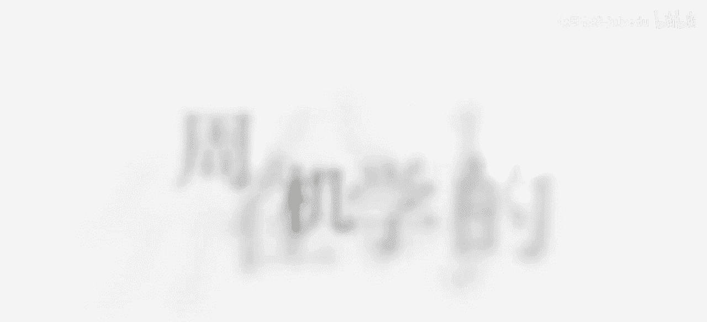
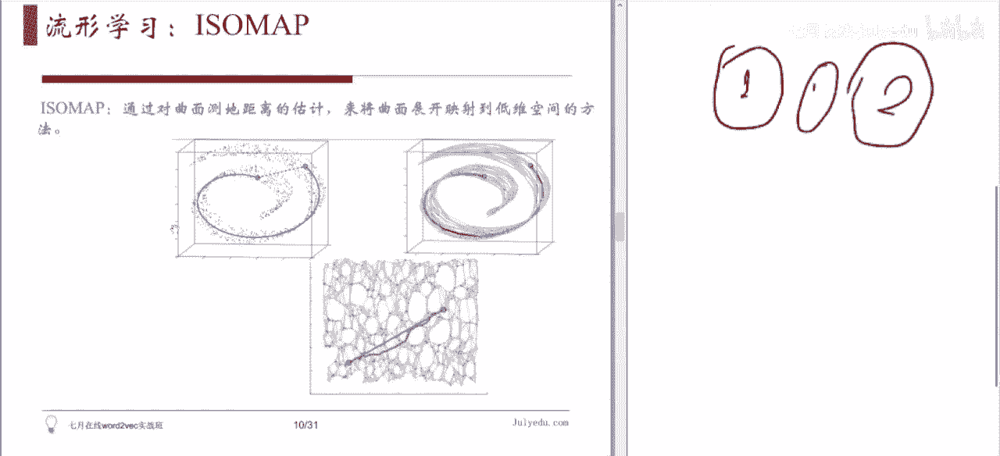
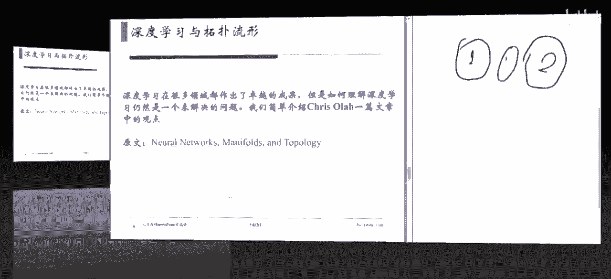
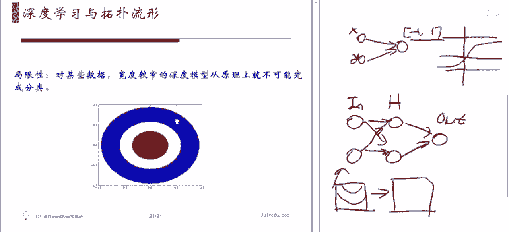
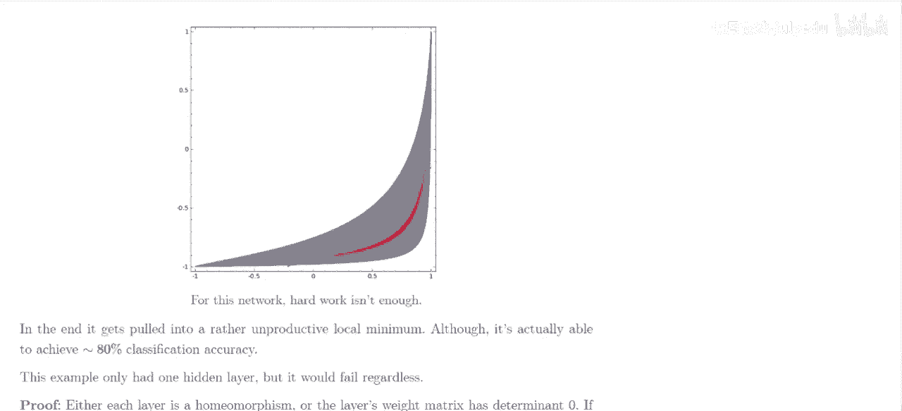
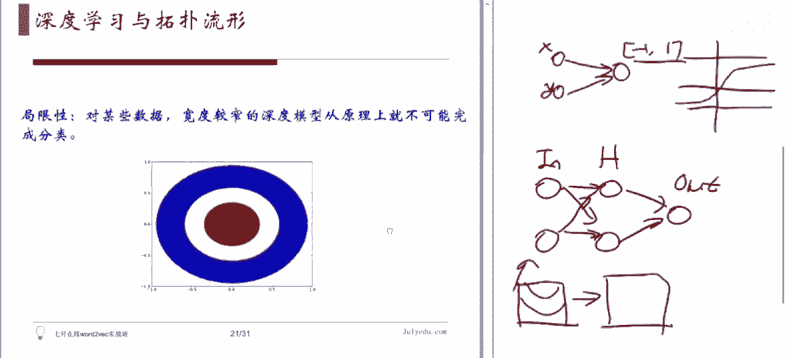
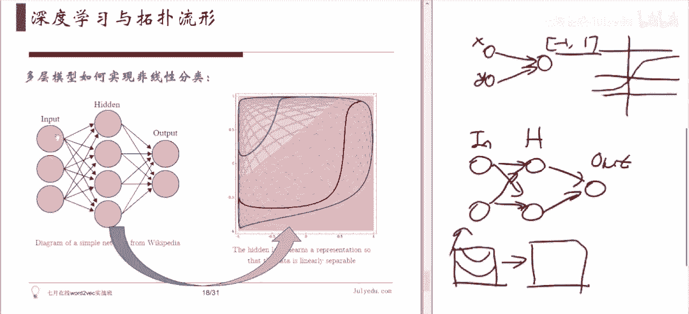
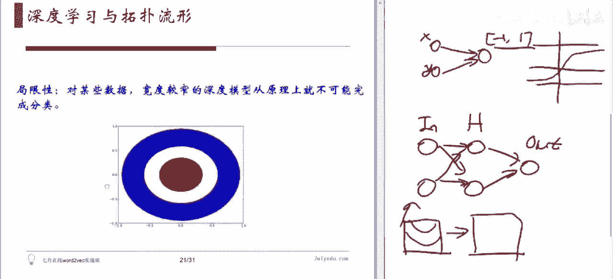
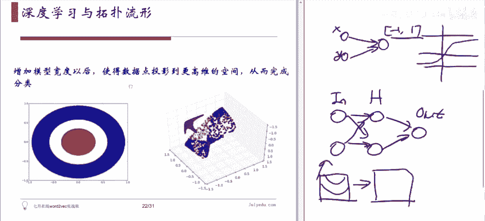
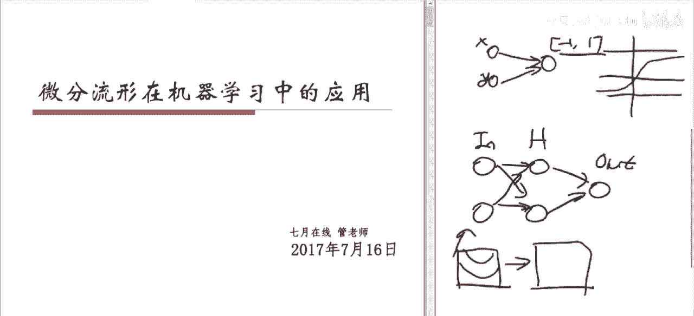

# 人工智能—机器学习公开课（七月在线出品） - P20：微分流形在机器学习中的应用 👨‍🏫

在本节课中，我们将要学习微分流形在机器学习中的应用。主要内容包括流行学习的基本概念、传统方法，以及从拓扑学角度理解深度学习的工作原理与局限性。

---

## 第一部分：线性降维方法回顾 📉

上一节我们介绍了课程概述，本节中我们来看看最常见的线性降维方法。

我们通常输入的数据是每个数据点包含多个特征（features）的向量。输入的数据矩阵通常有N个数据点，每个数据点是一个高维向量。主成分分析（PCA）是常用的降维方法。

PCA的核心思想是利用数据的协方差矩阵来寻找数据中最重要的方向（主成分）。它将每个高维数据点投影到选出的前K个主成分所张成的低维子空间上，从而得到降维后的数据表示。

以下是PCA的简要步骤：
1.  计算数据集的协方差矩阵。
2.  计算协方差矩阵的特征值和特征向量。
3.  选取前K个最大特征值对应的特征向量作为主成分。
4.  将原始数据投影到这K个主成分上，得到降维后的数据。

然而，PCA是一种线性方法，它难以揭示数据中可能存在的非线性结构。

---

## 第二部分：流行学习简介 🌀

上一节我们介绍了线性降维的局限性，本节中我们来看看非线性降维方法——流行学习。

流行学习基于一个核心假设：我们观测到的高维数据点，实际上集中在一个嵌入在高维空间中的、维数更低的子流形上。这个“流行假设”认为，数据的内在结构是低维的。

例如，手写数字的所有可能图像构成了所有可能图像空间中的一个子集，这个子集更接近于一个流形，而非随机散点。流行学习的目标就是揭示数据背后的这个低维流形结构。

---

### 等距映射（Isomap）

第一个要介绍的方法是等距映射（Isomap）。它的核心思想是利用流形上的测地距离（即流形表面两点间的最短路径长度），而非高维空间中的欧氏距离，来重构流形结构。

以下是Isomap算法的流程：
1.  **构建邻域图**：对每个数据点，找到其邻近点（例如K近邻或ε-邻域），并在邻近点之间连接边，边的权重为欧氏距离，从而形成一个邻域图。
2.  **计算测地距离**：在邻域图上，使用图论中的最短路径算法（如Dijkstra算法）计算图中任意两点间的最短路径长度，以此作为测地距离的近似。
3.  **多维缩放（MDS）**：将上一步得到的测地距离矩阵作为输入，应用MDS算法，寻找一个低维嵌入，使得嵌入空间中的点间欧氏距离尽可能接近输入的测地距离。

Isomap通过局部邻域信息来估计全局的流形结构，但最后一步的MDS计算复杂度较高。

---

### 局部线性嵌入（LLE）

第二个方法是局部线性嵌入（LLE）。它的思想与Isomap不同，不是基于距离，而是基于局部线性关系。

LLE假设流形在局部是近似线性的，即一个数据点可以由其邻近点的线性组合来重构。算法目标是保持这种局部线性重构关系在降维后不变。

以下是LLE算法的核心步骤：
1.  **寻找邻域**：与Isomap类似，为每个数据点确定其K个最近邻。
2.  **计算局部重构权值矩阵**：对每个点，计算其如何由其邻域点线性表出的权值系数，使得重构误差最小。这通过求解一个局部最小二乘问题完成。
3.  **计算低维嵌入**：在低维空间中寻找一组点，使得它们能用同样的权值系数从其低维邻域点重构出来，即保持第二步计算出的权值矩阵不变。

---

### 拉普拉斯特征映射（Laplacian Eigenmaps）

第三个方法是拉普拉斯特征映射。它从另一个角度出发，基于流形上的拉普拉斯算子的特征函数来寻找低维表示。

其核心思想是：在降维后，希望保留数据点之间的局部邻近关系。关系紧密的点在低维空间中也应该靠近。

以下是该方法的简要过程：
1.  **构建邻域图**：同样先构建一个邻域图（如K近邻图）。
2.  **构建图拉普拉斯矩阵**：根据邻域图构建拉普拉斯矩阵。
3.  **特征值分解**：求解广义特征值问题，选取最小的几个非零特征值对应的特征向量，这些特征向量就构成了数据在低维空间中的坐标。

---

## 第三部分：深度学习与拓扑学视角 🔗

上一节我们介绍了多种流行学习方法，本节中我们来看看如何从拓扑学角度理解深度学习。

深度学习模型，如多层感知机（MLP），通过叠加“线性变换+非线性激活函数”的层来工作。一个没有隐藏层的单层网络等价于一个线性分类器。

当我们增加网络层数（深度）时，模型引入了非线性，从而能够学习更复杂的决策边界。从拓扑视角看，深度网络的前几层可以被视为对输入空间进行一系列“同胚变换”（连续且可逆的形变，如拉伸、压缩、弯曲，但不撕裂或粘连）。

这种变换的目的是将原本在输入空间中线性不可分的不同类别数据所对应的流形，逐步“解套”或展开，使得在最后一个隐藏层的输出空间中，这些类别变得线性可分。然后，输出层只需一个简单的线性分类器即可完成完美分类。

然而，这种基于窄宽度网络的同胚变换方法存在根本性局限。对于某些拓扑结构复杂的数据（例如一个点被一个环包围，或两个类别像纽结一样纠缠在一起），无论如何进行同胚变换，都无法将它们变为线性可分。

解决此局限性的一个方法是增加网络的宽度。通过将数据映射到更高维的空间（例如从二维映射到三维），有可能找到一个新的视角，使得原本纠缠的类别变得线性可分。

---

## 开放性问题与总结 💡

本节课中我们一起学习了微分流形在机器学习中的应用。我们回顾了线性降维的不足，介绍了流行学习的核心思想与几种经典方法（Isomap, LLE, Laplacian Eigenmaps）。接着，我们从拓扑学角度探讨了深度学习的工作原理及其在窄宽度下的局限性。

这引发出一些开放性问题：
*   能否结合流行学习来改进现有的深度学习架构，使其更高效或更容易训练？
*   能否借助流行学习来增强深度学习模型的可解释性，例如理解生成模型的内部表示？
*   能否利用强大的深度学习模型来改进流行学习的效果？
*   基于这些理解，我们能否设计出全新的、更强大的机器学习模型架构？

对这些问题的探索，将有助于我们更深入地理解智能的本质，并推动人工智能技术的进一步发展。