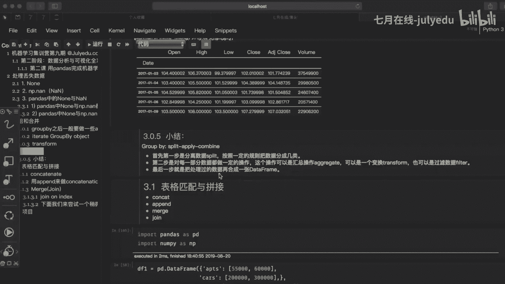
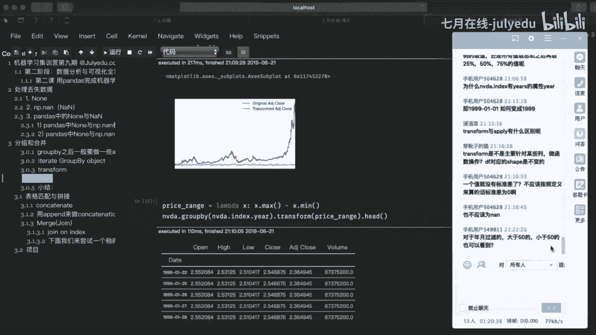
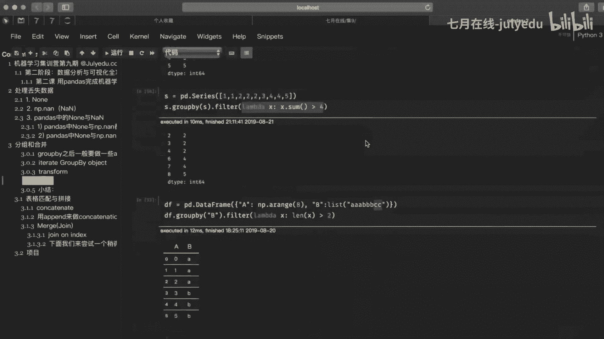

# 人工智能—机器学习公开课（七月在线出品） - P21：用pandas完成机器学习数据预处理与特征工程 🛠️


在本节课中，我们将要学习如何使用pandas库进行数据预处理与特征工程，重点掌握数据的分组与合并操作。这些操作是数据分析和机器学习流程中整理、汇总数据的关键步骤。

## 数据分组与合并 📊

上一节我们介绍了数据的基本操作，本节中我们来看看如何对数据进行分组与合并。分组与合并是针对包含多行多列的数据表进行的操作。

你可以简单地理解为，当我们有一个很大的数据表格，数据量过多时，可以先将数据拆分成组进行处理，这类似于SQL中的`GROUP BY`操作。处理完成后，最终需要将结果合并成一个新的DataFrame。

以下是创建一个示例DataFrame的代码：

```python
import pandas as pd

data = {
    'name': ['老王', '老王', '老王', '老王', '老宋', '老宋', '老宋', '容妹'],
    'year': [2016, 2016, 2017, 2017, 2016, 2016, 2017, 2017],
    'salary': [10000, 12000, 11000, 13000, 9000, 9500, 10000, 15000],
    'bonus': [2000, 2500, 2200, 2300, 1800, 1900, 2000, 3000]
}
df = pd.DataFrame(data)
print(df)
```

当我们拿到这样的数据时，通常需要进行统计。例如，我们想计算“老王”在2016年和2017年的总工资。这时，我们可以先按姓名进行分组。

### 使用groupby进行分组

分组操作非常简单，直接调用`groupby()`函数即可。如果你了解SQL，`groupby`相当于对某一列进行汇总。

以下是按`name`列进行分组的代码：

```python
grouped = df.groupby('name')
print(type(grouped))  # 输出：<class 'pandas.core.groupby.generic.DataFrameGroupBy'>
```

这行代码创建了一个`DataFrameGroupBy`对象，它将相同姓名的数据聚合在一起，不同姓名的数据分开。单纯的分组对象没有太多意义，我们需要在此基础上进行后续操作。

### 分组后的聚合操作

分组后，我们可以进行各种聚合计算，例如求和。

以下是按姓名分组后求和的代码：

```python
sum_result = grouped.sum()
print(sum_result)
```

调用`sum()`方法会对分组后各列的数据进行累加。但请注意，像`year`这样的列进行累加可能没有实际意义，此处仅为演示。

`groupby`函数内部有许多参数。例如，默认情况下分组后会排序，你可以通过设置`sort=False`来取消排序。

除了`sum()`，还可以使用`aggregate()`函数（或其简写`agg()`）进行聚合，这个函数功能非常强大。

以下是使用`aggregate()`进行求和的代码：

```python
sum_result_agg = grouped.aggregate('sum')
print(sum_result_agg)
```

`aggregate()`的第一个参数`func`非常灵活，可以是函数名、字符串、列表或字典。例如，传入字符串`'sum'`与直接调用`sum()`函数效果相同。

以下是使用不同聚合函数的示例：

```python
# 求平均值
mean_result = grouped.aggregate(np.mean)
print(mean_result)

# 求标准差
std_result = grouped.aggregate(np.std)
print(std_result)
```

### 查看分组详情

我们可以查看分组对象的一些属性来了解数据。

以下是查看分组详情的方法：

```python
# 查看每个姓名对应的原始行索引位置
print(grouped.groups)

# 查看有多少个不同的组（即有多少个不同的姓名）
print(len(grouped))
```

`describe()`方法可以快速提供每个组的描述性统计摘要，这在数据分析初期非常有用。

以下是使用`describe()`的代码：

```python
desc_result = grouped.describe()
print(desc_result)
```

`describe()`会显示计数（count）、平均值（mean）、标准差（std）、最小值（min）、最大值（max）以及四分位数（25%， 50%， 75%）。

### 按多列分组与迭代分组对象

分组不仅可以基于单列，还可以基于多列。

以下是按`name`和`year`两列进行分组的代码：

```python
grouped_multi = df.groupby(['name', 'year'])
sum_multi = grouped_multi.sum()
print(sum_multi)
```

我们也可以迭代分组对象，对每个组进行单独处理。

以下是迭代分组对象的代码：

```python
for name, group in df.groupby('name'):
    print(f"姓名: {name}")
    print(group)
    print("-" * 20)
```

通过`get_group()`方法可以获取指定的组，每个组本身都是一个DataFrame。

以下是获取特定组的代码：

```python
laosong_group = grouped.get_group('老宋')
print(laosong_group)
print(type(laosong_group))  # 输出：<class 'pandas.core.frame.DataFrame'>
```

### 对特定列进行聚合操作

我们可以选择只对DataFrame中的特定列进行聚合操作。

以下是对`salary`和`bonus`列求和的代码：

```python
agg_specific = grouped.agg({'salary': 'sum', 'bonus': 'sum'})
print(agg_specific)
```

如果想在结果中保留`year`列（但不聚合），可以使用匿名函数。

以下是保留`year`列第一项的代码：

```python
agg_with_year = grouped.agg({
    'salary': 'sum',
    'bonus': 'sum',
    'year': lambda x: x.iloc[0]  # 取该组第一个年份
})
print(agg_with_year)
```

### transform 操作

`transform`方法非常灵活，它返回一个与原始数据形状相同的对象，对每个组内的所有记录应用相同的转换规则。

假设我们有一个股票数据集`nvda.csv`，包含日期（`Date`）、开盘价（`Open`）、最高价（`High`）、最低价（`Low`）、收盘价（`Close`）等。

以下是读取数据并按年份计算平均收盘价的代码：

```python
nvda_df = pd.read_csv('nvda.csv', index_col='Date', parse_dates=['Date'])
nvda_df['Year'] = nvda_df.index.year
yearly_avg = nvda_df.groupby('Year')['Close'].mean()
print(yearly_avg)
```

使用`transform`可以计算每个数据点与其所在年份平均值的Z-score（标准化分数）。

Z-score的公式为：
\[
Z = \frac{x - \mu}{\sigma}
\]
其中，\(x\)是原始值，\(\mu\)是组内均值，\(\sigma\)是组内标准差。

以下是使用`transform`计算Z-score的代码：

```python
def z_score(x):
    return (x - x.mean()) / x.std()

nvda_df['Close_Z'] = nvda_df.groupby('Year')['Close'].transform(z_score)
print(nvda_df[['Close', 'Close_Z']].head())
```

`apply`是一个更通用的方法，自由度很高，但`transform`在组内转换时更常用。

### filter 操作

`filter`方法用于过滤分组。它根据自定义的条件判断是否保留整个组。

以下是一个简单的过滤示例，保留总和大于4的组：

```python
s = pd.Series([1, 2, 2, 3, 4, 4, 5])
grouped_s = s.groupby(s)
filtered = grouped_s.filter(lambda x: x.sum() > 4)
print(filtered)
```

对于DataFrame，我们可以根据组的某些属性进行过滤。例如，过滤出股票数据中年平均收盘价超过100的年份的所有数据。

以下是过滤股票数据的代码：

```python
def filter_func(group):
    # 判断该年份的平均收盘价是否大于100
    return group['Close'].mean() > 100



filtered_df = nvda_df.groupby('Year').filter(filter_func)
print(filtered_df['Year'].unique())  # 打印出哪些年份被保留了
```

## 总结 📝

本节课中我们一起学习了pandas中数据分组与合并的核心操作。



我们掌握了如何使用`groupby`将数据拆分成组，这是“拆分”步骤。接着，我们学习了多种“应用”操作：
*   `aggregate`/`agg`: 用于对组进行聚合计算（如求和、求平均）。
*   `transform`: 用于对组内每个元素进行转换，并保持原始形状。
*   `filter`: 用于根据条件过滤整个组。




最后，pandas会自动将处理后的结果“组合”起来，形成新的数据结构。理解并熟练运用“拆分-应用-组合”这一模式，是进行高效数据预处理和特征工程的关键。