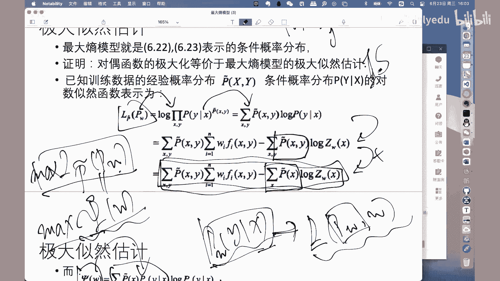
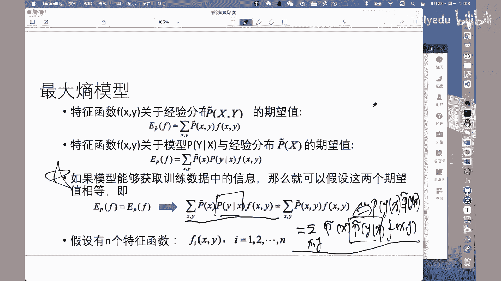

# 人工智能—机器学习公开课（七月在线出品） - P22：最大熵模型原理推导

## 📚 课程概述

在本节课中，我们将要学习最大熵模型的基本原理和数学推导过程。最大熵模型是一种基于最大熵原理的概率模型，它在满足给定约束条件的模型集合中，选择熵最大的模型作为最优模型。我们将从基本概念出发，逐步推导出其数学形式，并理解其背后的优化思想。

## 🔗 模型关联与预备知识

最大熵模型在模型关联图中占有特定位置，主要用于后续条件随机场（CRF）模型的学习问题。在开始之前，我们需要回顾两个重要的概率计算规则。

### 加法规则与乘法规则

以下是两个在概率计算中频繁使用的基础规则。

*   **加法规则**：边缘概率与联合概率的关系。公式为 `P(X) = Σ_Y P(X, Y)`。它有两个使用方向：一是将边缘概率展开为联合概率的求和形式；二是将联合概率通过求和“还原”为边缘概率。
*   **乘法规则**：联合概率与条件概率、边缘概率的关系。公式为 `P(X, Y) = P(Y|X) * P(X)`。它同样有两个使用方向：一是将联合概率分解为条件概率和边缘概率的乘积；二是将条件概率和边缘概率的乘积“吸收”为联合概率。

## 🧠 最大熵原理与模型定义

上一节我们介绍了基础的概率规则，本节中我们来看看最大熵模型的核心思想——最大熵原理。

最大熵原理是一种方法论或价值观，它为如何选择“最优”概率模型提供了指导原则。该原理认为：在所有满足已知约束条件的概率模型中，**熵最大的模型是最好的模型**。

### 熵的定义

在信息论中，对于一个离散随机变量 `X`，其概率分布为 `P(X)`，该分布的熵 `H(P)` 定义为：
`H(P) = - Σ_X P(x) log P(x)`
熵的取值范围是 `0 ≤ H(P) ≤ log |X|`，其中 `|X|` 是 `X` 可能取值的个数。当 `X` 在所有取值上等概率分布时，熵取得最大值 `log |X|`，此时随机变量的不确定性最大。

### 最大熵模型的形式化

有了熵的概念，我们可以形式化地定义最大熵模型。

*   **输入与输出**：设 `X` 和 `Y` 分别代表输入和输出的集合。
*   **模型形式**：模型以条件概率 `P(Y|X)` 的形式给出，表示在给定输入 `X` 的条件下，输出 `Y` 的概率。
*   **训练数据**：设有训练数据集 `T = {(x1, y1), (x2, y2), ..., (xN, yN)}`。
*   **经验分布**：我们可以从数据集中得到经验（频率）分布。
    *   联合经验分布：`˜P(X=x, Y=y) = count(x, y) / N`
    *   边缘经验分布：`˜P(X=x) = count(x) / N`
*   **特征函数**：特征函数 `f(x, y)` 是一个二值函数，用于描述 `x` 和 `y` 之间满足的某一事实。如果满足，则 `f(x, y)=1`；否则为 `0`。
*   **约束条件——期望相等**：如果模型能够从训练数据中学习到信息，那么特征函数 `f` 关于模型分布 `P(Y|X)` 和经验分布 `˜P(X)` 的期望，应该等于 `f` 关于经验联合分布 `˜P(X, Y)` 的期望。
    *   模型期望：`E_P(f) = Σ_{x,y} ˜P(x) P(y|x) f(x, y)`
    *   经验期望：`E_˜P(f) = Σ_{x,y} ˜P(x, y) f(x, y)`
    *   约束条件：`E_P(f) = E_˜P(f)`

通常我们有 `n` 个特征函数 `f_i (i=1,2,...,n)`，每个特征函数都对应一个上述的期望相等约束。

## ⚖️ 约束优化问题

上一节我们定义了模型和约束条件，本节中我们来看看如何将最大熵模型表述为一个约束优化问题。

所有满足这 `n` 个约束条件的条件概率分布 `P(Y|X)` 构成一个集合，记作 `C`。集合 `C` 中的模型通常不止一个。

根据最大熵原理，我们从集合 `C` 中选择熵最大的模型作为最优模型。条件分布的熵定义为：
`H(P) = - Σ_{x,y} ˜P(x) P(y|x) log P(y|x)`

因此，最大熵模型等价于求解以下带约束的最优化问题：
**最大化**：`H(P) = - Σ_{x,y} ˜P(x) P(y|x) log P(y|x)`
**约束条件**：
1.  `E_P(f_i) = E_˜P(f_i), i=1,2,...,n`
2.  `Σ_y P(y|x) = 1` （概率归一化条件）

为了方便求解，我们通常将最大化问题转化为等价的最小化问题，即最小化 `-H(P)`。

## 🧮 拉格朗日乘子法求解

面对带约束的优化问题，我们使用拉格朗日乘子法进行求解。其步骤分为三步：构建拉格朗日函数、求极小、求极大。

### 第一步：构建拉格朗日函数

我们为 `n` 个特征函数约束和1个概率归一化约束分别引入拉格朗日乘子 `w_1, w_2, ..., w_n` 和 `w_0`。
拉格朗日函数 `L(P, w)` 定义为原目标函数 `-H(P)` 加上所有约束项（乘以各自的乘子）：
`L(P, w) = -H(P) + w_0 (1 - Σ_y P(y|x)) + Σ_{i=1}^n w_i (E_˜P(f_i) - E_P(f_i))`
将 `H(P)` 和期望展开后，得到具体表达式。

### 第二步：对模型 `P` 求极小

我们将拉格朗日函数对 `P(y|x)` 求偏导，并令其等于 `0`。
`∂L / ∂P(y|x) = 0`
经过详细的求导和化简（过程涉及对数求导和乘法规则），我们可以解出最优条件概率分布 `P_w(y|x)` 具有如下形式：
`P_w(y|x) = exp( Σ_{i=1}^n w_i f_i(x, y) ) / Z_w(x)`
其中，`Z_w(x) = Σ_y exp( Σ_{i=1}^n w_i f_i(x, y) )` 是归一化因子，称为配分函数。

这个形式非常重要，它表明最大熵模型是指数族分布的一种。

### 第三步：对乘子 `w` 求极大

将第二步得到的最优 `P_w(y|x)` 代回拉格朗日函数 `L(P, w)`，此时函数仅是关于 `w` 的函数，记作 `Ψ(w)`。
`Ψ(w) = L(P_w, w)`
原问题转化为求解 `Ψ(w)` 的极大值：
`max_w Ψ(w)`
求解此极大化问题，即可得到最终的模型参数 `w*`。通常使用改进的迭代尺度法（IIS）或拟牛顿法等数值优化方法进行求解。

## 🔄 与极大似然估计的等价性

一个关键的结论是：**对偶函数 `Ψ(w)` 的极大化，等价于最大熵模型的极大似然估计**。

证明思路是构造模型 `P_w(y|x)` 的对数似然函数 `L_˜P(P_w)`，并证明 `Ψ(w) = L_˜P(P_w)`。
对数似然函数为：
`L_˜P(P_w) = Σ_{x,y} ˜P(x, y) log P_w(y|x)`
通过代入 `P_w(y|x)` 的表达式并进行推导，可以证明 `Ψ(w)` 与 `L_˜P(P_w)` 具有完全相同的数学形式。

因此，求解最大熵模型参数 `w` 的问题，最终转化为求解该模型在训练数据上的极大似然估计问题。这为使用成熟的优化算法（如IIS）提供了理论依据。

## 📝 课程总结

本节课中我们一起学习了最大熵模型的完整原理推导。

1.  **核心思想**：我们首先学习了最大熵原理，即在所有满足已知约束的模型中，选择不确定性最大（熵最大）的模型作为最优模型。
2.  **问题形式化**：我们将该思想形式化为一个带约束（特征函数期望相等）的优化问题。
3.  **求解过程**：通过拉格朗日乘子法，我们将约束优化问题转化为先对模型求极小、再对乘子求极大的对偶问题。求解极小值得到了模型优美的指数形式 `P_w(y|x) = exp( Σ w_i f_i ) / Z_w(x)`。
4.  **最终求解**：极大化对偶函数 `Ψ(w)` 以获得参数 `w`，并证明了该过程等价于对模型的极大似然估计，从而可以通过IIS等优化算法求解。

最大熵模型为概率模型学习提供了一个清晰的原则性框架，也是理解更复杂模型（如条件随机场）的重要基础。其推导过程中综合运用了概率论、信息论和最优化理论，是机器学习中一个经典而优美的模型。