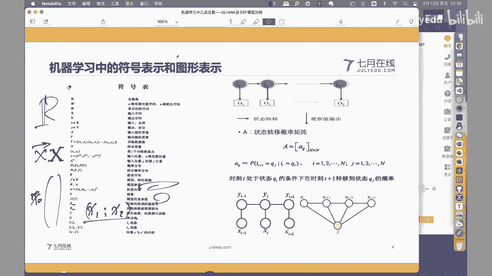

# 人工智能—机器学习公开课（七月在线出品） - P23：机器学习中的几点注意事项——以HMM及CRF模型为例

## 📘 课程概述

在本节课中，我们将探讨机器学习学习过程中的几个关键注意事项。我们将以隐马尔可夫模型（HMM）和条件随机场（CRF）为例，但重点不在于讲解模型本身，而在于分享学习复杂模型时的方法论。课程内容将分为三个部分：符号与图形表示、概率模型与基本规则、以及模型间的脉络关系。

---

## 🧮 第一部分：符号表示与图形表示

在机器学习中，随着模型越来越复杂，我们需要使用大量无歧义的数学符号来表示计算逻辑。同时，将复杂的符号逻辑映射为直观的图形表示，能帮助我们更好地理解模型。

### 符号表示的重要性

符号表示即模型的数学化、函数化表示形式。每个数学符号都有其明确的标准含义，对其理解不能出错。数学本身要求无歧义性，但不同教材或场景下，同一符号的使用可能存在细微差别，这会给学习者带来困惑。

以下是解决此矛盾的一个关键方法：

**查看符号表**：许多经典教材会在书的前面或后面附上符号表，说明本书中使用的每个符号的具体含义。建议在学习一本新专著时，先查看其符号表，即使99%的符号与你之前的理解一致，那1%的不同也可能导致后续学习的重大困惑。

例如，在李航老师的《统计学习方法》中，实数集 **R** 使用了黑体 **R** 表示，这与一些材料中使用普通 *R* 的惯例不同。向量表示也需注意：在该书中，默认所有向量为列向量，但为书写方便，常以行向量加转置 **x^T** 的形式表示。

### 图形表示的辅助作用

图形表示能将抽象的数学逻辑形象化。以隐马尔可夫模型（HMM）为例，其模型参数 λ 由三元组 (A, B, π) 组成，分别代表状态转移概率矩阵、观测概率矩阵和初始状态概率向量。

状态转移矩阵 **A** 是一个 N×N 的矩阵，元素 **a_{ij}** 表示在时刻 t 处于状态 **q_i** 的条件下，在时刻 t+1 转移到状态 **q_j** 的概率，即：
`P(i_{t+1} = q_j | i_t = q_i) = a_{ij}`

仅从数学公式理解可能不够直观。我们可以用图形表示：用两个相邻的圆圈分别代表时刻 t 的状态 **i_t** 和时刻 t+1 的状态 **i_{t+1}**，用箭头表示转移关系，并在箭头上标注概率 **a_{ij}**。这样，复杂的条件概率关系就变成了直观的前后状态跳转图。

同样，观测概率矩阵 **B** 和初始概率 **π** 也可以在图中找到对应位置。将数学符号与图形元素一一对应，能极大地降低理解复杂模型的难度。对于条件随机场（CRF），图形表示也能清晰地区分条件（输入 **X**）和输出（随机变量序列 **Y**），以及节点特征和边特征。

**核心要点**：面对复杂模型，先厘清数学符号的含义，再尝试将其转化为图形表示，建立“数形结合”的理解，是高效学习的关键。

---

## 🎲 第二部分：概率模型与基本规则

上一节我们介绍了如何通过符号和图形理解模型结构。本节中，我们来看看另一种重要的模型表示形式——概率模型，以及支撑其推导的基本概率规则。

### 理解概率模型

我们最容易理解的模型是函数模型：`y = f(x)`，给定输入 **x**，直接得到输出 **y**。

概率模型则不同，它通常以条件概率的形式表示：`P(Y | X)`。给定输入 **X**，模型输出的是关于所有可能输出 **Y** 的一个概率分布，而不是一个确定值。例如，在分类任务中，对于输入 **X**，模型会给出它属于每个类别的概率 `P(Y=类别1 | X)`, `P(Y=类别2 | X)`... 我们最终选择概率最大的类别作为预测结果。

因此，概率模型的假设空间可以定义为条件概率的集合：`F = { P_θ(Y | X) }`，其中 **θ** 是参数向量。我们的学习目标就是在参数空间中找到最优的 **θ**。

### 两条基本概率规则

复杂的概率模型推导，如HMM中的前向概率计算，看似繁琐，实则反复依赖于两条最基本的概率规则：加法规则和乘法规则。

1.  **加法规则（求和规则）**：
    `P(X) = Σ_Y P(X, Y)`
    该规则用于边缘化（消去）随机变量。它允许我们将联合概率 `P(X, Y)` 中对 **Y** 的所有可能取值求和，从而得到只关于 **X** 的边缘概率 `P(X)`。

2.  **乘法规则（乘积规则）**：
    `P(X, Y) = P(Y | X) P(X)`
    该规则将联合概率分解为条件概率和边缘概率的乘积。这是贝叶斯定理的基础。

在HMM前向概率的推导中，每一步的变换几乎都是这两条规则的应用。例如，从 `α_t(i)` 推导 `α_{t+1}(j)` 时，会先引入新的状态变量（使用加法规则的思想，对上一时刻所有状态求和），再将联合概率分解为条件概率和边缘概率的乘积（使用乘法规则）。

**核心要点**：概率模型的核心是条件概率 `P(Y|X)`。再复杂的概率图模型推导，本质上都是加法规则和乘法规则在不同条件下的灵活运用。掌握这两条规则，是理解概率模型推导的钥匙。

---

## 🔗 第三部分：模型间的脉络关系

前面我们讨论了理解单个模型的方法。本节我们来看看不同模型之间的关系。机器学习中的模型并非孤立存在，它们之间存在清晰的发展脉络和演进关系。

理解模型间的脉络关系，能将看似繁杂的模型体系串联起来，降低学习复杂度。当你遇到一个新模型时，可以思考：它的前身是什么？它解决了原有模型的哪些不足？做了哪些改进？

以下是两个发展脉络的示例：

**示例一：从线性回归到深度神经网络**
*   **起点**：线性回归 `y = Wx + b`，是最基础的回归模型。
*   **关键演变**：在线性回归的输出上增加一个 **Sigmoid** 函数，将输出压缩到 (0,1) 区间，就得到了逻辑回归，用于二分类。逻辑回归单元可以看作一个“神经元”。
*   **结构扩展**：将多个神经元并排，形成一层；将多层神经元堆叠，前一层输出作为后一层输入，就构成了基本的前馈神经网络。
*   **领域特化**：在神经网络基础上，引入卷积操作和池化，形成了卷积神经网络（CNN），专精于图像处理；引入循环连接，形成了循环神经网络（RNN），专精于序列数据。这些构成了深度学习的基础。

**示例二：从决策树到XGBoost**
*   **起点**：决策树（如ID3, C4.5, CART），是一种基础的非线性模型。
*   **集成学习**：将多个决策树模型组合起来，就进入了集成学习领域。通过Bagging策略得到了随机森林；通过Boosting策略（如AdaBoost）顺序地训练多个弱学习器（通常是决策树桩）。
*   **梯度提升**：Gradient Boosting Decision Tree (GBDT) 使用梯度下降的思想来指导Boosting过程，用决策树来拟合当前模型的负梯度（残差）。
*   **工程优化**：XGBoost在GBDT的基础上，引入了二阶导数信息（Hessian矩阵）进行更精确的优化，并加入了正则化项来控制模型复杂度，同时在工程实现上做了大量优化，成为非常强大的模型。

**核心要点**：学习新模型时，主动探寻其与前序模型的关系。了解一个模型是在什么背景下、针对什么痛点、从哪个基础模型改进而来，能帮助你更深刻地理解其设计思想，并将知识融会贯通。

---

## 📝 课程总结

本节课我们一起学习了机器学习学习过程中的三个重要注意事项：

1.  **符号与图形结合**：重视教材中的符号表，确保对数学符号的理解准确无误。学会将复杂的符号逻辑转化为直观的图形表示，建立数形结合的理解方式。
2.  **概率模型与基本规则**：理解概率模型以条件概率 `P(Y|X)` 为核心的本质。掌握加法规则和乘法规则这两条基本概率工具，它们是解析复杂概率模型推导的基石。
3.  **模型的脉络关系**：认识到模型之间存在发展演进关系。学习新模型时，尝试将其置于模型发展的脉络中，理解其来源、改进与创新，从而构建系统化的知识体系。

希望这些方法能帮助大家在机器学习的道路上更高效地学习和探索。