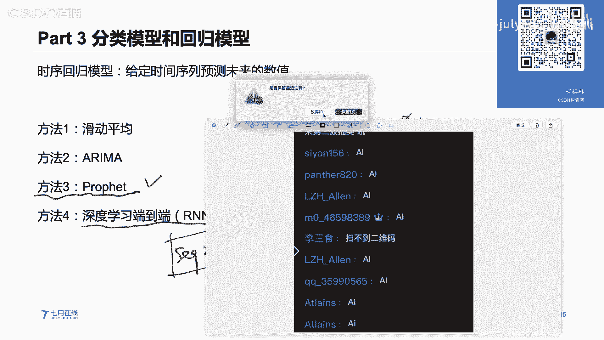
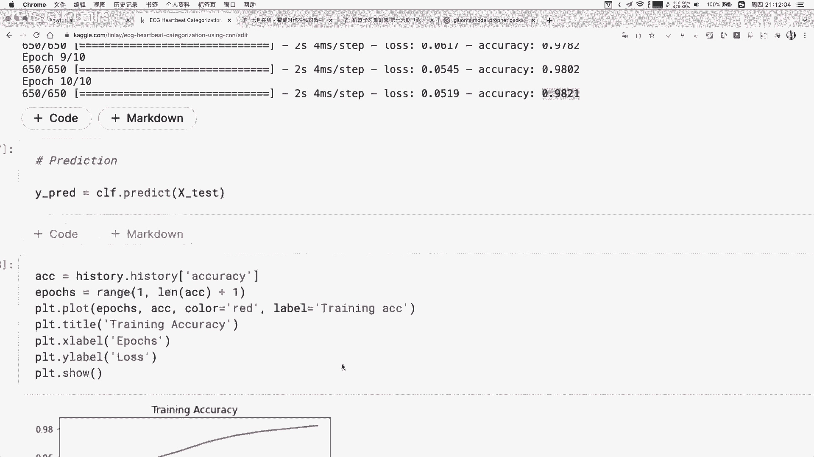
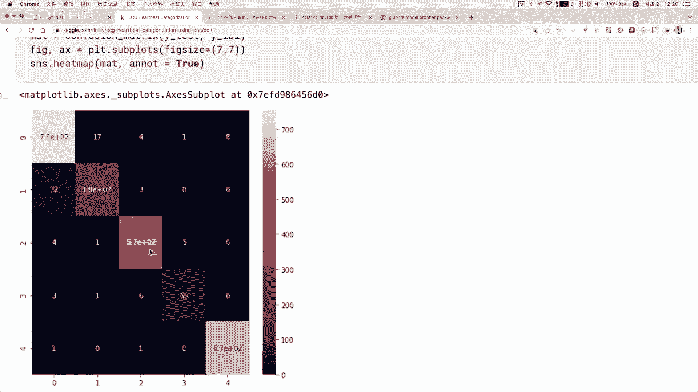
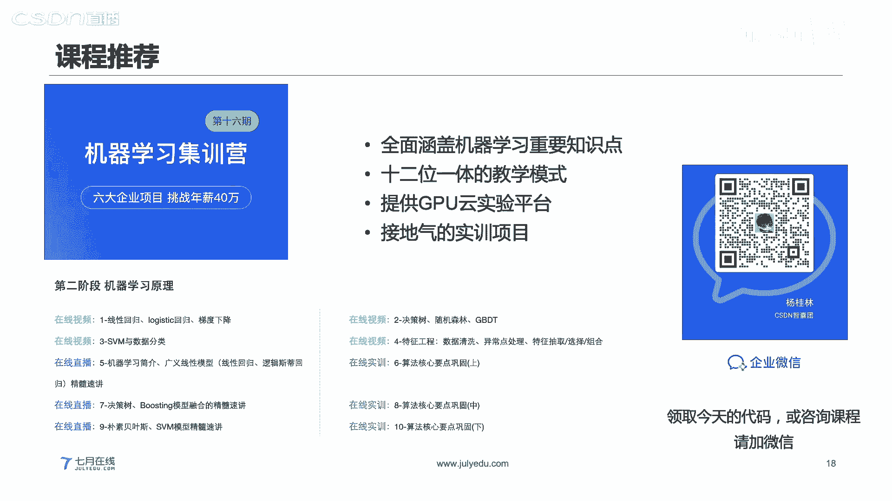
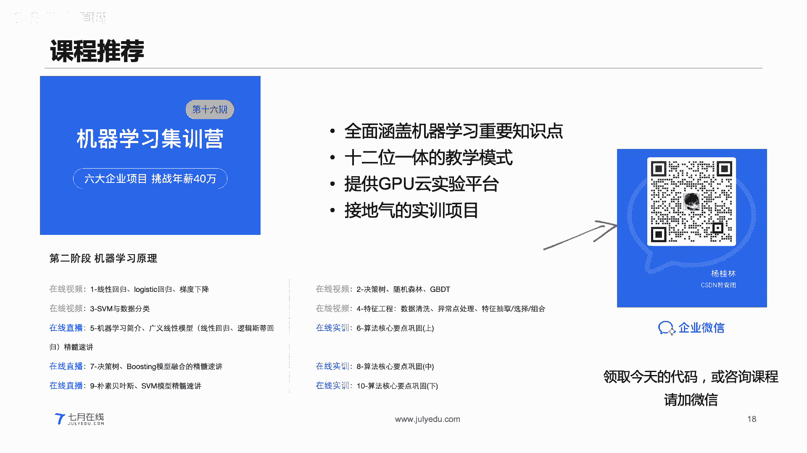
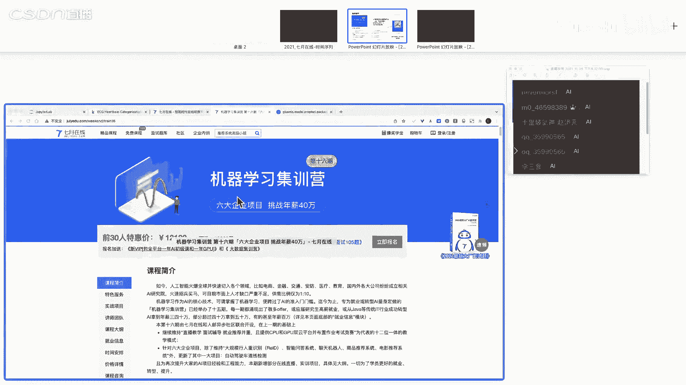
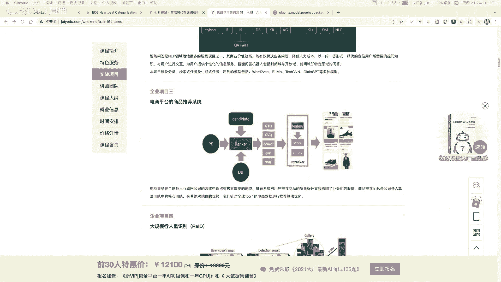
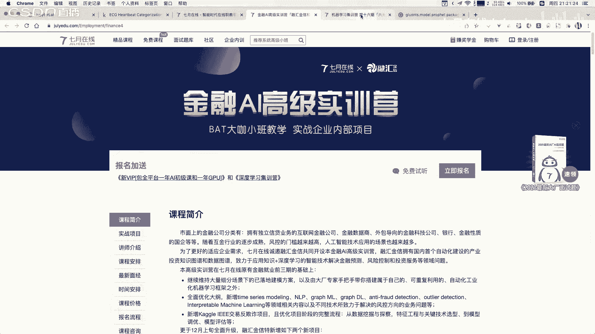
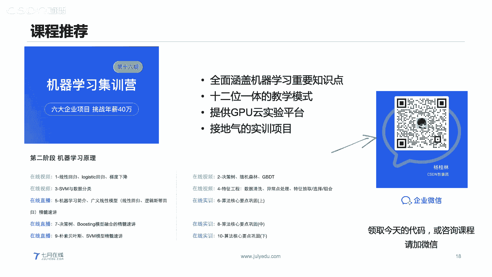

# 人工智能—机器学习公开课（七月在线出品） - P24：时间序列分类实战：心电图疾病识别 📈


在本节课中，我们将要学习时间序列数据的基本概念、特征工程方法，以及如何构建一个用于心电图疾病识别的分类模型。我们将从基础理论出发，逐步过渡到代码实践，确保初学者能够理解并掌握核心内容。

## 第一部分：时间序列数据介绍 📊

上一节我们介绍了课程的整体安排，本节中我们来看看什么是时间序列数据。

时间序列数据是数据挖掘领域中非常重要的一类数据，它无处不在。例如，经济领域的股票、黄金价格走势，电商领域的用户每日浏览量，工业领域的传感器温度记录等，都属于时间序列。

时间序列数据通常由两列组成：一列是时间戳（`time`），另一列是该时刻对应的值（`value`）。其特点是数据点按时间顺序排列，并且记录通常具有等间隔性（例如每秒、每天记录一次）。

**时间序列数据与结构化数据的区别：**
*   **结构化数据**：以行（样本）和列（特征）的二维形式组织，样本之间通常是独立的。
*   **时间序列数据**：数据点之间存在时间上的先后次序和依赖关系，整体构成一个序列（`sequence`）。

时间序列主要有两大用途：
1.  **挖掘内在规律**：分析序列的周期、趋势、变化幅度等。
2.  **预测与监控**：基于历史数据预测未来走势，或监控数据是否出现异常（例如工业设备温度异常飙升）。

一个时间序列通常可以分解为以下三项：
*   **趋势项（Trend）**：描述序列长期的、缓慢的变化方向。
*   **季节项/周期项（Seasonal）**：描述序列中固定周期的波动。
*   **残差项（Residual）**：去除趋势和周期后剩余的随机波动，可视为噪音。

根据这些成分的组合方式，可以构建两种基础模型：
*   **加法模型**：`序列值 = 趋势项 + 季节项 + 残差项`。适用于季节性和残差与趋势强弱无关的情况。
*   **乘法模型**：`序列值 = 趋势项 × 季节项 × 残差项`。适用于季节性波动幅度随趋势水平变化的情况。

## 第二部分：时间序列的特征工程 ⚙️

理解了时间序列的构成后，本节中我们来看看如何从中提取有用的特征，以便用于机器学习模型。

由于不同时间序列样本的长度可能不一致，而大多数机器学习模型要求输入维度固定，因此需要进行特征工程。以下是几种常见的特征提取方法：

**以下是基于日期时间的特征：**
可以直接从时间戳中提取丰富的信息，例如年份、月份、日、周数、星期几、小时、分钟等。在Python中，利用`datetime`模块可以轻松提取这些特征。

**以下是滞后特征（Lag Features）：**
将历史时刻的值作为当前时刻的特征。例如，`lag1`表示上一时刻的值，`lag2`表示上上时刻的值。这类似于一个滑动的历史窗口。

**以下是滑动窗口聚合特征（Rolling Window Statistics）：**
对某个固定时间窗口内的值进行统计计算，如计算平均值、最大值、最小值、标准差等。例如，计算最近7个时间点的值的移动平均。

**以下是扩展窗口聚合特征（Expanding Window Statistics）：**
计算从序列起点开始到当前时刻所有数据的累计统计值，如累计平均值。

**以下是对比特征：**
将当前值与历史同期值（例如昨天同一时间、上周同一时间）进行比较，计算差值或比值。

## 第三部分：时间序列的分类与回归模型 🤖

提取了特征之后，本节中我们来看看有哪些模型可以用于时间序列任务。

**时间序列分类**：给定一个序列，判断其属于哪个类别（例如，心电图正常或异常）。主要方法有：
1.  **基于序列距离**：计算新序列与各类别代表序列的距离（如欧氏距离、DTW动态时间规整距离），距离最近的类别即为预测结果。
2.  **基于特征的传统机器学习**：先提取序列的统计特征（如均值、方差、波动性），然后将这些特征输入到分类模型（如逻辑回归、随机森林）中进行训练。
3.  **基于深度学习**：直接将原始序列输入深度学习模型（如一维卷积神经网络 `1D-CNN`）进行端到端的特征学习和分类。这种方法通常能获得较高的精度。



**时间序列回归（预测）**：基于历史序列预测未来值。常用方法包括：
*   滑动平均模型（MA）、自回归模型（AR）
*   整合移动平均自回归模型（ARIMA）
*   Facebook 提出的 Prophet 模型
*   深度学习模型，如循环神经网络（RNN）、长短时记忆网络（LSTM）以及 Seq2Seq 模型

## 第四部分：实战案例：心电图疾病识别 🫀

理论铺垫完毕，本节中我们将运用所学知识，实战构建一个心电图分类模型。

**问题背景**：心电图是诊断心脏健康状况的重要指标。本案例目标是构建一个机器学习模型，自动对心电图序列进行分类，判断其是否正常或属于何种异常类型。



**以下是实战步骤：**



1.  **数据读取与探索**：使用 `pandas` 和 `numpy` 读取数据。数据集中，每一行代表一个心电图序列，每一列代表一个时间点的测量值。所有序列已被填充或截断为相同长度（如188个时间点）。检查数据是否存在缺失值。
2.  **数据预处理**：观察数据标签分布。由于“正常”（类别0）的样本可能远多于其他类别，为避免模型偏差，可以对多数类样本进行**下采样**，使各类别样本量相对平衡。
3.  **数据可视化**：绘制不同类别的心电图序列，直观感受其形态差异（如波形的光滑度、振幅范围等）。
4.  **划分数据集**：将数据集按比例（如9:1）划分为训练集和验证集。
5.  **构建深度学习模型**：本例采用一维卷积神经网络（`1D-CNN`）作为特征提取器，后接全连接层进行分类。
    ```python
    # 示例模型结构（使用Keras）
    model = Sequential()
    model.add(Conv1D(filters=32, kernel_size=3, activation='relu', input_shape=(sequence_length, 1)))
    model.add(Conv1D(filters=64, kernel_size=3, activation='relu'))
    model.add(MaxPooling1D(pool_size=2))
    model.add(Flatten())
    model.add(Dense(100, activation='relu'))
    model.add(Dense(num_classes, activation='softmax')) # num_classes为类别数量
    ```
    模型的前几层`Conv1D`负责自动提取序列的局部特征，`Flatten`和`Dense`层负责将这些特征映射到具体的类别。
6.  **模型训练与评估**：使用分类交叉熵损失函数和Adam优化器编译模型，在训练集上进行训练。训练完成后，在验证集上评估模型性能，查看准确率和混淆矩阵。

通过以上步骤，我们能够构建一个高精度的心电图分类模型，验证集准确率可达96%以上，这展示了深度学习在时间序列分类任务上的强大能力。






**对于序列长度不一致的通用处理方法：**
*   **填充（Padding）**：将所有序列填充到同一长度（如用0填充尾部）。
*   **截断/分块（Truncating/Segmentation）**：将长序列截断为固定长度，或将长序列通过滑动窗口划分为多个等长的短序列。








## 总结 📝





本节课中我们一起学习了时间序列分析的基础知识。我们从时间序列的定义、与结构化数据的区别讲起，介绍了其分解方法（趋势、季节、残差）和模型（加法、乘法）。接着，我们深入探讨了时间序列的特征工程，包括日期特征、滞后特征、窗口统计特征等。然后，我们概述了用于时间序列的分类和回归模型。最后，通过一个心电图疾病识别的实战案例，完整演示了如何使用一维卷积神经网络（`1D-CNN`）对时间序列数据进行分类，涵盖了数据读取、预处理、模型构建、训练和评估的全流程。希望本课程能帮助你入门时间序列分析，并应用于实际项目中。