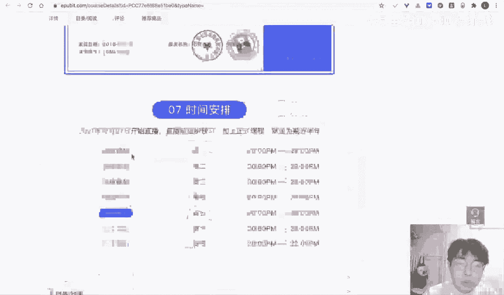
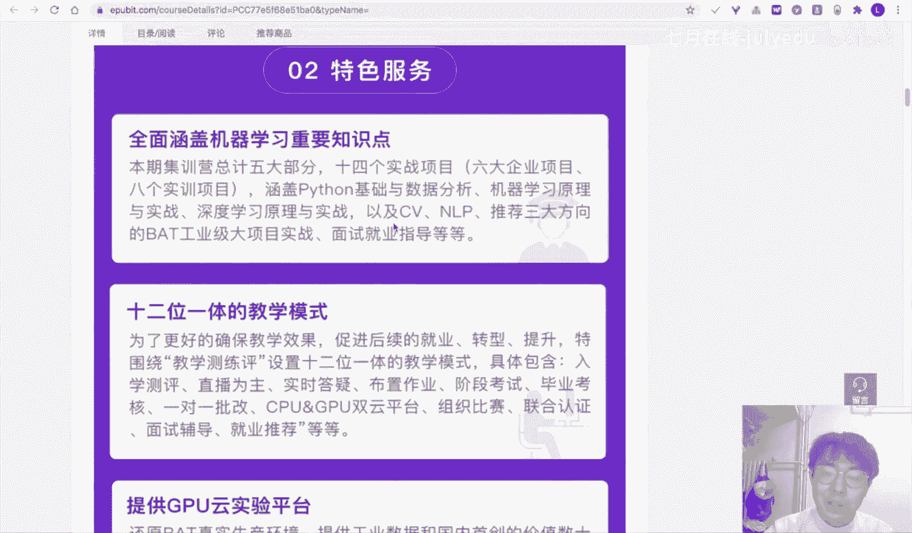

# 人工智能—机器学习公开课（七月在线出品） - P25：数据挖掘与机器学习基础 🎯

## 课程概述

在本节课中，我们将要学习数据挖掘与机器学习的基础知识。课程将涵盖从数据处理工具Pandas的使用，到机器学习的基本概念、常见模型，并通过一个实际案例演示完整的建模流程。本课程面向初学者，力求内容简单直白，帮助大家建立对数据科学领域的初步认识。

---

## 第一部分：数据处理工具Pandas 📊

在数据科学领域，Python因其强大的第三方库生态而成为首选语言。与C语言等需要手动编写大量代码处理文件不同，Python的库可以极大简化工作。

Pandas是Python环境下进行数据分析和统计的核心库。它非常适合处理**结构化数据**，即由**行**和**列**组成的二维表格数据，类似于Excel表格。

在Pandas中，`DataFrame`对象代表一个表格。`Column Names`是列名，`Index`是行索引，行列交叉处是具体的取值。Pandas可以高效处理包含数百万行的大型数据集，支持快速加载、索引和数据转换。

以下是Pandas的一些基础操作演示：

**1. 创建序列与表格**
Pandas可以方便地从Python字典创建数据表格。
```python
import pandas as pd
# 从字典创建DataFrame
df = pd.DataFrame({
    ‘A‘: [1, 2, 3, 4],
    ‘B‘: [5, 6, 7, 8],
    ‘C‘: [9, 10, 11, 12]
})
```

**2. 数据选择与赋值**
可以像索引矩阵一样，通过条件选择数据并进行赋值。
```python
# 选择A列大于2的行，并将其B列赋值为-1
df.loc[df[‘A‘] > 2, ‘B‘] = -1
```

**3. 分组聚合操作**
`groupby`功能可以方便地对数据进行分组统计，例如计算每个类别的平均值。
```python
# 按‘animal‘列分组，并计算‘age‘列的平均值
grouped = df.groupby(‘animal‘)[‘age‘].mean()
```

掌握Pandas是进行数据挖掘的第一步，它为我们后续的数据分析和模型训练奠定了基础。

---

## 第二部分：数据挖掘与机器学习流程 🔄

上一节我们介绍了数据处理工具，本节中我们来看看如何将处理好的数据用于挖掘知识。

数据挖掘是使用机器学习、统计和数据库方法从数据中挖掘模式和知识的过程。它更关注**整个分析流程**。机器学习是人工智能的一个分支，更侧重于**具体的建模算法**，即如何通过模型解决问题。数据挖掘常常借助机器学习模型来完成具体任务。

数据挖掘涉及的主要步骤包括：数据读取、数据预处理、模型训练、模型推断和结果可视化。

数据挖掘任务主要分为以下几类：
*   **异常检测**：识别数据中的异常点。
*   **关联分析**：发现数据项之间的关联规则。
*   **聚类**：将相似样本自动分组，无需预先标签。
*   **分类**：预测样本的离散类别标签（例如：是否患病）。
*   **回归**：预测连续的数值输出（例如：房屋价格）。

其中，**分类**和**回归**是监督学习中最常见的任务，区别在于预测的输出`Y`是类别型还是数值型。

一个完整的机器学习建模流程通常遵循以下步骤：
1.  **数据预处理**：清洗和准备原始数据。
2.  **特征编码与工程**：将数据转换为模型可接受的特征。
3.  **模型训练与验证**：使用训练数据训练模型，并用验证集评估。
4.  **模型预测与评价**：使用测试集进行最终预测，并分析模型性能。

---

## 第三部分：常见机器学习模型 🤖

了解了流程后，我们需要认识流程中核心的“工具”——机器学习模型。以下是几类基础且重要的模型。

**1. 线性模型**
线性模型试图用线性关系来拟合输入`X`和输出`Y`。其基本形式可表示为：
`Y = WX + b`
其中，`W`是权重，`b`是偏置。当`X`为多维向量时（例如房屋面积和楼层），`W`也相应为多维向量。逻辑回归是线性模型在分类问题上的一个扩展。

**2. 贝叶斯模型**
贝叶斯模型基于贝叶斯定理，利用先验概率和条件概率进行计算。其核心思想是通过计算在给定输入`X`的条件下，输出为某个类别`C`的后验概率来进行分类：
`P(C|X) = P(X|C) * P(C) / P(X)`

**3. 决策树模型**
决策树模拟人类决策过程，通过一系列的判断规则（树的分支）对数据进行划分，最终到达叶子节点得到预测结果。它直观易懂，适合处理具有清晰逻辑规则的问题。

**4. 支持向量机**
SVM的目标是找到一个最优的决策边界（超平面），使得不同类别的样本之间的间隔最大化。这个边界位于两类样本的“最中间”，从而期望在新的数据上具有更好的泛化能力。

**5. 深度学习模型**
深度学习模型受生物神经网络启发，由多层神经元连接构成。它包含输入层、隐藏层和输出层，能够自动学习数据的多层次抽象特征，在图像、语音等领域表现卓越。

学习机器学习，本质就是学习每类算法的原理、应用场景及其优缺点。

---

## 第四部分：实战案例：泰坦尼克号生存预测 🚢

理论需要结合实践。本节我们将通过一个经典案例——泰坦尼克号乘客生存预测，来串联之前所学的知识。

首先，我们使用Pandas读取数据并进行探索性数据分析。例如，我们可以分析不同性别乘客的生存率：
```python
import pandas as pd
import matplotlib.pyplot as plt
# 分组统计并可视化
survival_rate_by_sex = df.groupby(‘Sex‘)[‘Survived‘].mean()
survival_rate_by_sex.plot(kind=‘bar‘)
plt.show()
```
分析发现，女性乘客的生存率显著高于男性，这与历史背景相符。

接着进行特征工程。例如，从乘客姓名中提取称呼（如Mr., Miss., Dr.）作为一个新特征，这可能包含社会地位、婚姻状况等信息。

然后，进入建模阶段。我们使用`scikit-learn`库，它可以极大地简化建模过程。以下是使用逻辑回归模型的示例：
```python
from sklearn.linear_model import LogisticRegression
from sklearn.model_selection import train_test_split
# 划分训练集和验证集
X_train, X_val, y_train, y_val = train_test_split(X, y, test_size=0.2)
# 实例化并训练模型
model = LogisticRegression()
model.fit(X_train, y_train)
# 预测并评估
predictions = model.predict(X_val)
accuracy = (predictions == y_val).mean()
print(f“模型准确率： {accuracy:.2%}“)
```
我们还可以轻松尝试其他模型，如高斯朴素贝叶斯、SVM、决策树、K近邻等，并比较它们的性能。

整个实战代码遵循了标准流程：数据预处理、特征编码、模型训练验证和评价。完整的代码将在课程群中提供。

---

## 课程总结与互动环节 🎁

本节课中我们一起学习了数据挖掘与机器学习的基础。我们从数据处理利器Pandas入手，了解了数据挖掘的基本流程和常见任务，认识了线性模型、贝叶斯模型、决策树、SVM和深度学习等核心模型，最后通过泰坦尼克号案例完成了从数据分析到模型训练的完整实践。

**互动问题**：Pandas最适合对什么类型的数据集进行操作？

（答案：结构化数据或表格型数据）



对于初学者，建议的学习路径是：首先掌握Python基础，然后学习Pandas、NumPy、Matplotlib和Scikit-learn等核心库的使用。最好的学习方式是动手实践，通过具体的项目和案例来巩固知识。




如果想继续深入学习，可以关注系统的机器学习课程，从原理到实战，再到项目落地，进行体系化学习。代码和更多学习资料将在课程群中分享。


---


**请注意**：本教程根据提供的直播转录内容整理，删除了语气词，并按照要求进行了结构化、口语化处理及格式调整。核心概念已用加粗或代码块标示。