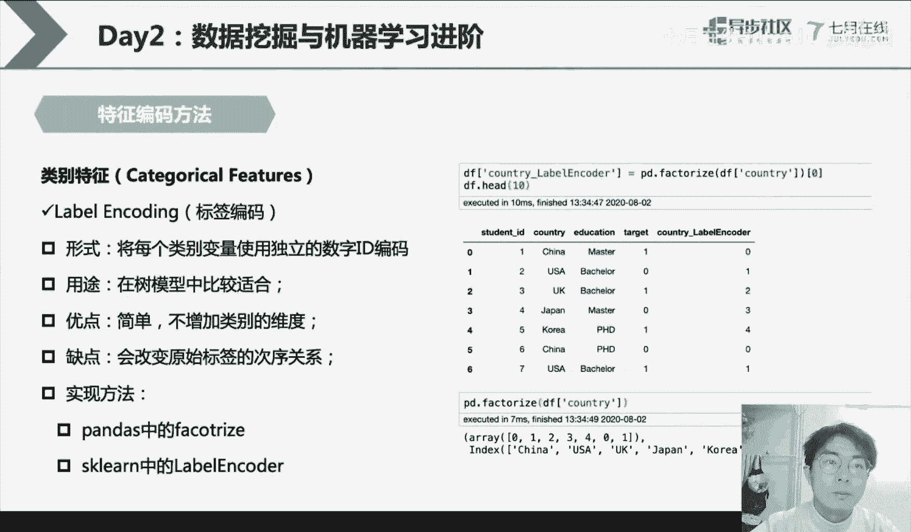
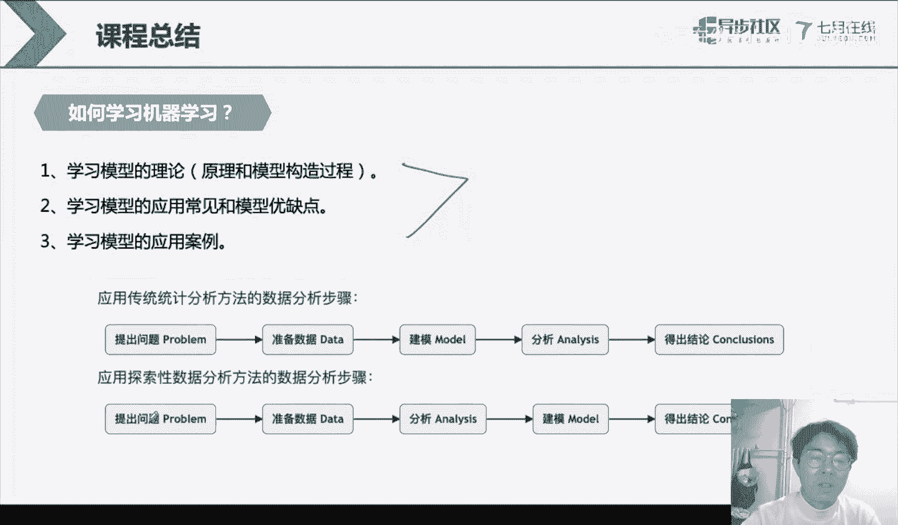
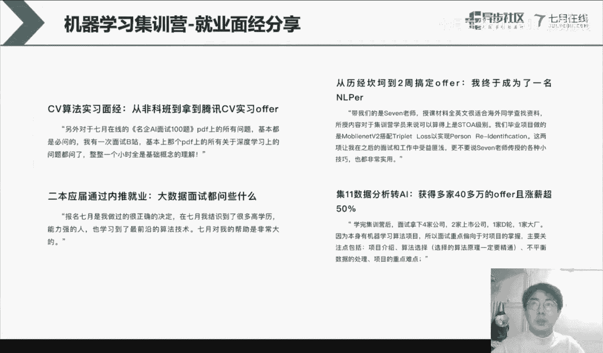
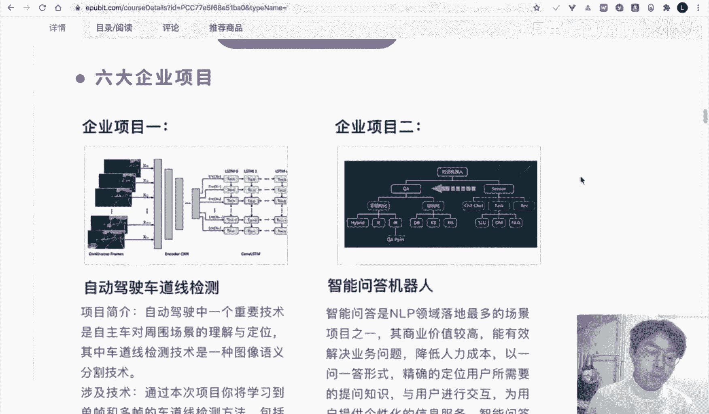

# 人工智能—机器学习公开课（七月在线出品） - P26：数据挖掘与机器学习进阶

## 📚 课程概述

在本节课中，我们将要学习数据挖掘与机器学习的进阶知识。我们将深入探讨如何处理不同类型的数据，特别是类别型和数值型特征，并了解集成学习的基本思想。通过本课，你将掌握在拥有数据的情况下，如何对数据集进行处理以获得更好的模型精度。

---

## 🗂️ 数据的类型

上一节我们介绍了机器学习的基本流程，本节中我们来看看数据本身。在现实生活和工业应用中，数据是多种多样的。

最常见的数据类型是**结构化数据**。结构化数据在英文中常被称为“tabular data”，其形式与我们上节课学习的pandas DataFrame类似。它有清晰的行和列结构。

*   **行**：通常代表一个具体的样本。
*   **列**：代表描述样本的字段或特征。

例如，一个关于NBA球员的数据集，每一行是一个球员，每一列是球员的球队、号码、位置、年龄等信息。

除了结构化数据，还有**半结构化数据**和**非结构化数据**。

*   **半结构化数据**：如XML、JSON、电子邮件或网页数据。它们具有一定的结构（如字段），但可能不规整，不同样本的字段数量可能不同。
*   **非结构化数据**：如音频、视频和文本。这类数据没有固定的格式，例如图片大小不一，文本长短不同。

一个关键点是：**所有机器学习模型的输入格式都必须是规整的**。这意味着每个输入样本的特征维度必须相同。例如，一个设计为接收两个特征（X1， X2）的线性回归模型，无法直接处理包含三个特征（X1， X2， X3）的样本。

---

## 🏷️ 类别型特征的处理

接下来，我们聚焦于特征处理。对于初学者，可以首先关注三类特征：**类别型**、**数值型**、**日期或时间型**。本节我们先讲解类别型特征。

类别型特征在我们的数据集中非常常见。例如，个人信息中的性别、城市、民族等字段都是类别型。它们通常以字符串形式存储，例如“男”、“女”、“北京”。

类别型特征可以进一步细分为**有序类别**和**无序类别**。

*   **有序类别**：类别之间存在大小或次序关系。例如，情感极性（正面、中性、负面）或教育程度（高中、本科、硕士、博士）。
*   **无序类别**：类别之间是平等的，没有次序关系。例如，动物种类（猫、狗、鸟）或颜色（红、白、黑）。

区分有序和无序很重要，因为这将影响我们后续选择哪种编码方式。

### 为什么需要处理类别型特征？

主要有两个原因：
1.  **所有机器学习模型的输入都需要是数值类型**。模型本质是数学计算，无法直接处理字符串。
2.  类别型特征容易引入**高基数**问题。如果一个类别特征的取值非常多（例如“用户ID”），就会产生大量离散值，给模型带来挑战。此外，类别特征的缺失值也很难填充。

以下是几种常见的类别型特征编码方法：

### 1. 独热编码

独热编码（One-Hot Encoding）是将一个类别特征转换为一个长度等于其取值空间大小K的向量。在这个向量中，只有对应原始类别的位置为1，其余位置均为0。

**公式**：如果某个特征的取值空间为 {`硕士`， `本科`， `博士`}，那么：
*   `硕士` 编码为 `[1， 0， 0]`
*   `本科` 编码为 `[0， 1， 0]`
*   `博士` 编码为 `[0， 0， 1]`

**优点**：能够简单有效地将类别特征转化为数值形式，且没有引入人为的次序关系。
**缺点**：会增加数据维度（一列变K列），可能导致维度爆炸和特征稀疏（矩阵中充满0）。

**实现方法**：可以使用pandas的 `get_dummies()` 函数或scikit-learn的 `OneHotEncoder`。

### 2. 标签编码

标签编码（Label Encoding）是使用一个具体的数字来替代原始的字符串。

**公式**：例如，对国家特征进行编码：`中国` -> `0`， `美国` -> `1`， `英国` -> `2`， `日本` -> `3`。

**优点**：没有增加数据维度。
**缺点**：引入了数字的大小关系（例如0<1<2<3），这可能误导模型。因此，它**仅适用于有序类别**或**高基数且无需考虑次序**的类别。

**实现方法**：可以使用pandas的 `factorize()` 方法或scikit-learn的 `LabelEncoder`。

### 3. 顺序编码

顺序编码（Ordinal Encoding）是手动根据已知的类别顺序进行编码。

**公式**：例如，已知教育程度的有序关系为 `本科` < `硕士` < `博士`，则可以编码为：`本科` -> `1`， `硕士` -> `2`， `博士` -> `3`。

**优点**：保留了类别间的次序信息，且没有增加维度。
**缺点**：需要人工先验知识来定义顺序。对于未在编码字典中出现的新类别不友好。

**实现方法**：通常通过Python字典（`dict`）建立映射关系来实现。

### 4. 计数编码

计数编码（Count Encoding）不是用数字代替类别，而是用该类别在整个数据集中出现的次数（或频率）来编码。

**公式**：例如，在数据集中“中国”出现了50次，则所有“中国”样本的该特征值都编码为50。

**优点**：简单，没有增加维度，并且从全局视角引入了分布信息。
**缺点**：编码结果严重依赖于当前数据集。如果数据分布有偏或存在误差，编码也会不准确。

---

## 🔢 数值型特征的处理

上一节我们介绍了类别型特征的编码，本节中我们来看看数值型特征。数值型特征同样常见，如年龄、成绩、经纬度等。

数值型特征的特点是：
1.  **有大小关系**：例如20岁大于19岁。
2.  **可进行数学运算**：例如可以计算年龄差，这个差值是有意义的。

数值型特征容易出现**异常值**和**离群点**。
*   **异常值**：明显错误的值，例如在年龄列中出现1000岁。
*   **离群点**：虽然可能不是错误，但远离主体分布的值，例如在一群18-30岁的学生中，出现一个5岁的样本。

### 为什么需要处理数值型特征？

对数值特征进行缩放（归一化/标准化）是常见的预处理步骤，主要原因是为了**优化模型训练**。

考虑一个线性模型：`y = w1*x1 + w2*x2 + b`
如果特征x1的范围是[0， 1]，而x2的范围是[0， 100]，那么权重w2的微小变化对结果y的影响将远大于w1。这会导致优化路径变得曲折（像椭圆），收敛缓慢且不稳定。

如果将特征缩放至相近的范围（例如都在[0，1]或均值为0、方差为1），优化路径会更接近圆形，训练会更稳定高效。

### 常见的数值特征处理方法

以下是两种最常用的缩放方法：

**1. 最小-最大归一化**
将特征缩放到一个固定的范围，通常是[0， 1]。

**公式**：`X_scaled = (X - X_min) / (X_max - X_min)`

**优点**：保留了原始数据的分布形状，适用于非高斯分布的数据。
**缺点**：对异常值非常敏感，因为异常值通常是最大值或最小值。

**2. 标准化**
将特征缩放为均值为0，标准差为1。

**公式**：`X_scaled = (X - μ) / σ` （其中μ是均值，σ是标准差）

**优点**：适用于假设数据呈高斯分布的场景，缩放后数据更接近标准正态分布。
**缺点**：计算均值和方差需要遍历全部数据。

---

## 🤝 集成学习简介

在学习了特征处理之后，我们简要了解一下提升模型性能的另一种强大思想——集成学习。

集成学习的核心思想是：**结合多个模型的预测结果，以获得比单一模型更好的性能**。俗话说“三个臭皮匠，顶个诸葛亮”，这就是集成思想的体现。

### 集成学习的主要分支

以下是两种主流的集成学习方法：

**1. Bagging**
Bagging的核心是**民主集中**。它并行训练多个相互独立的模型（通常是同质模型），每个模型在训练时使用从原始数据集中有放回抽样得到的子集。最终预测时，对于分类任务采用投票法，对于回归任务采用平均法。

**关键**：模型之间的**差异性**至关重要。通过行采样和列采样来制造不同的训练数据，是引入差异性的常用手段。
**代表算法**：随机森林。

**2. Boosting**
Boosting的核心是**串行增强**。它按顺序训练一系列模型，每一个新模型都更加关注前一个模型预测错误的样本。通过不断迭代修正错误，逐步提升整体性能。

**关键**：后一个模型学习的是前一个模型的“残差”或“不足”。
**代表算法**：AdaBoost， Gradient Boosting， XGBoost， LightGBM。

---

## 💻 实践与总结

### 代码实践要点
*   **特征编码**：可以使用pandas和scikit-learn库轻松实现One-Hot Encoding、Label Encoding等。
*   **集成模型**：scikit-learn的`ensemble`模块提供了随机森林、梯度提升树等算法的实现。训练后还可以查看模型的**特征重要性**，了解哪些特征对预测贡献最大。
*   **特征工程**：除了编码，还可以**构建新特征**。例如，有了房屋总价和卧室数量，可以创建“每卧室均价”这一新特征，这可能蕴含更有价值的信息。

### 课程总结

本节课中我们一起学习了数据挖掘与机器学习的进阶知识：

1.  **数据类型**：了解了结构化、半结构化和非结构化数据的区别，并明确了机器学习模型需要规整的数值输入。
2.  **特征处理**：
    *   **类别型特征**：学习了独热编码、标签编码、顺序编码和计数编码的原理、优缺点及适用场景。
    *   **数值型特征**：理解了进行归一化或标准化的必要性，以及最小-最大归一化和标准化两种方法。
3.  **集成学习**：介绍了Bagging和Boosting两种核心的集成思想，它们通过结合多个模型来提升预测性能。
4.  **学习路径建议**：机器学习的学习可以遵循“理论 -> 应用与优缺点 -> 项目实战”的路径，并按照“提出问题 -> 准备数据 -> 分析 -> 建模 -> 得出结论”的流程进行实践。

记住，**深度学习是机器学习的一个子领域**，两者并非对立。打好机器学习的基础，对后续学习深度学习大有裨益。