# 人工智能—机器学习公开课（七月在线出品） - P28：4.14【公开课】企业风险预测：特征工程与树模型实战


在本节课中，我们将学习如何利用特征工程和树模型解决一个实际问题——企业风险预测。我们将从结构化数据的基础知识开始，逐步深入到特征工程的核心概念，并讲解树模型的原理与实战应用，最后通过一个企业非法集资风险预测的案例，将所学知识融会贯通。

## 第一部分：结构化数据集基础

上一节我们介绍了课程的整体目标，本节中我们来看看什么是结构化数据。

结构化数据是指以非常规整的形式存储的数据集，最典型的形式是二维表格。这种形式类似于常见的数据库或Excel表格。

结构化数据由行和列组成。每一行代表一个样本（例如，一个学生、一家企业），每一列代表一个字段或特征（例如，年龄、性别、注册资本）。行与列的交叉位置，就是这个样本在该特征下的具体取值。

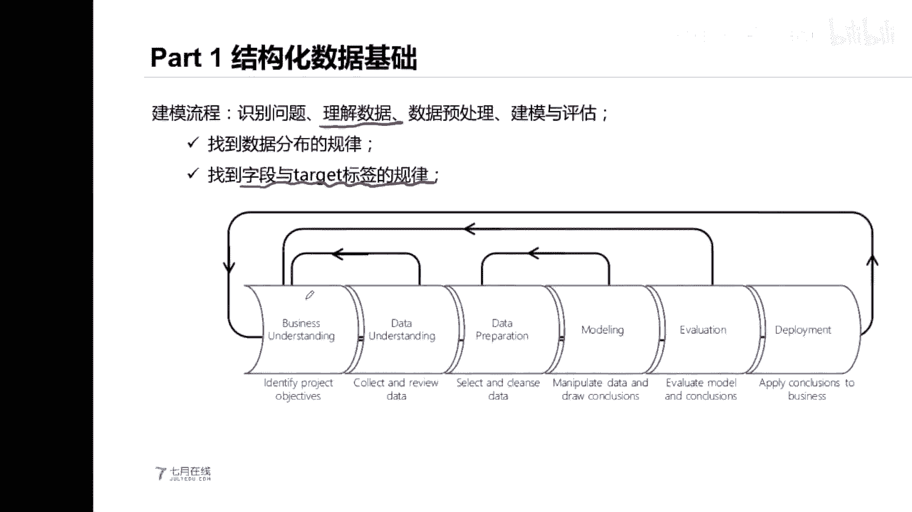


在机器学习中，许多基础算法都适用于处理结构化数据，例如预测用户是否违约、预测房价、识别道路行人等。选择合适算法的关键在于理解问题的类型（如分类或回归）以及数据的特性。

与结构化数据相对的是半结构化数据（如JSON格式）和非结构化数据（如图片、音频、文本）。这三类数据的主要区别在于**数据是否规整**，即每个样本是否能用一行规整的数据来表示。

一个完整的数据挖掘或建模流程通常包含以下步骤：
1.  识别问题
2.  理解数据
3.  数据预处理
4.  模型建模
5.  模型评估

每一部分的侧重点不同。例如，在理解数据阶段，我们更关注数据本身的规律及其与标签的关联。

## 第二部分：特征工程入门

理解了数据的基本结构后，本节我们将探讨如何对原始数据进行改造，使其更适合模型学习，这个过程就是特征工程。

在实际建模中，我们往往不是改进模型本身，而是改进输入模型的数据。原始数据中的字段可能包含多种类型（数值型、字符串型、日期型），但机器学习模型通常只能处理数值型输入。因此，我们需要将原始字段转换为模型可用的特征。

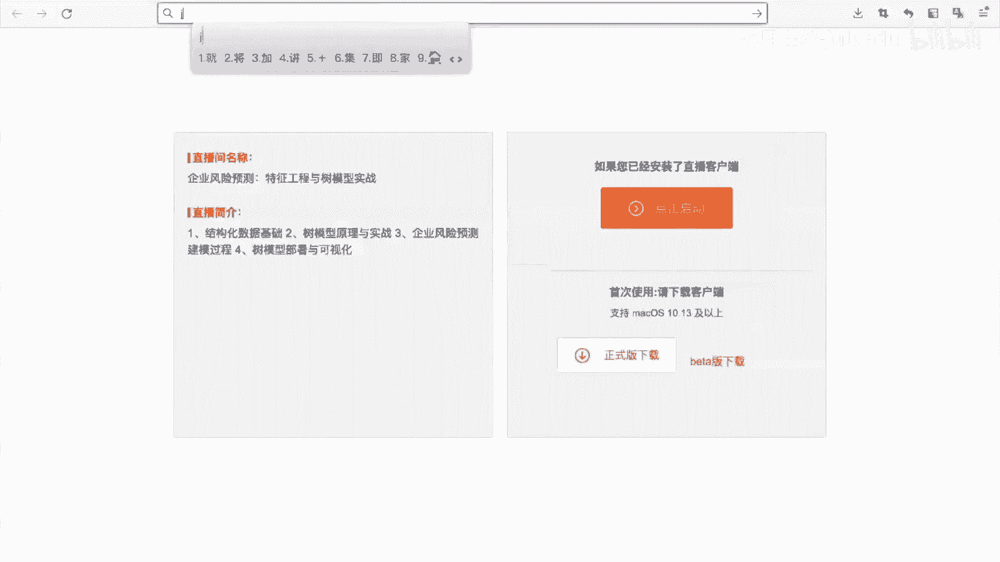


原始数据经过**预处理**和**特征工程**后，才能得到最终可送入模型的特征。字段不一定是特征，有些原始字段在建模时可能不需要。

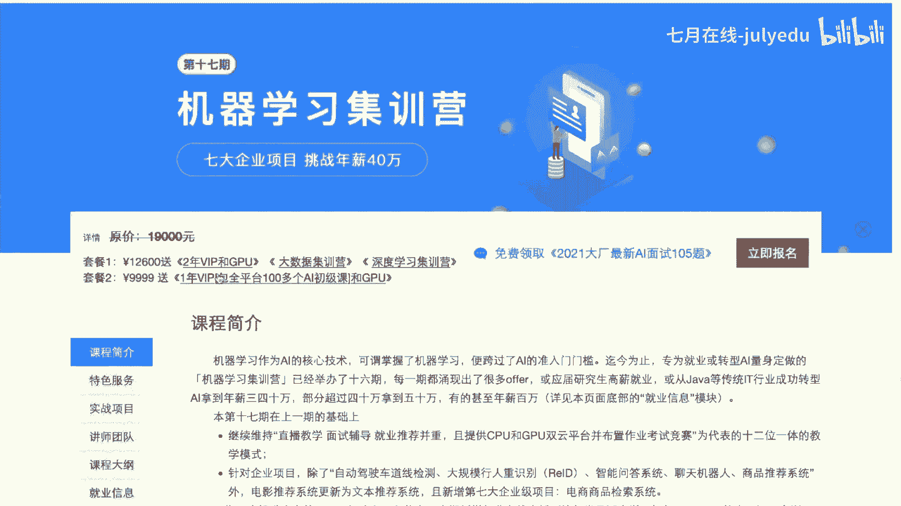

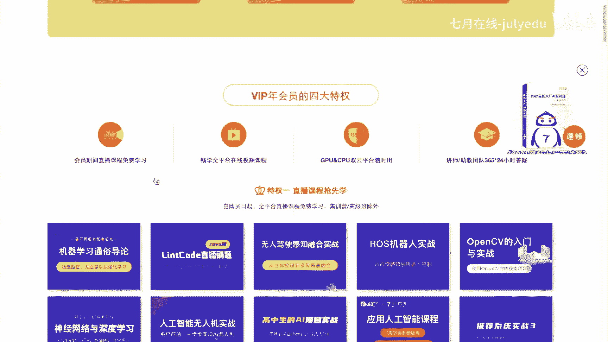

以下是数据处理的一些常见思路：
*   如果原始字段是数值类型，通常可以直接使用。
*   如果原始字段是字符串类型，则需要考虑进行编码，例如独热编码。

### 类别特征的处理

类别特征是指取值空间有限的离散特征，例如性别、城市、民族。这类特征通常以字符串形式存储，但无法直接参与模型计算，必须进行编码。

类别特征可分为两类：
*   **有序类别**：取值之间有大小或次序关系，例如年级（一年级、二年级）、情感程度（开心、非常开心）。
*   **无序类别**：取值之间相互平等，没有大小关系，例如动物种类、颜色。

处理类别特征时，需要根据其是有序还是无序来选择合适的编码方式。

以下是两种常见的类别特征编码方法：

**1. 独热编码**
独热编码将具有K个类别的特征转换为K个二进制特征。每个类别对应一个特征，属于该类别则标记为1，否则为0。
*   **优点**：简单有效，能平等对待所有类别，不引入人为的大小关系。
*   **缺点**：会增加特征维度，可能导致维度爆炸和特征稀疏。
*   **实现**：可使用Pandas的 `get_dummies` 函数或Scikit-learn的 `OneHotEncoder`。

**2. 标签编码**
标签编码为每个类别分配一个唯一的整数ID。
*   **优点**：简单，不增加特征维度。
*   **缺点**：引入了人为的整数大小关系，可能误导模型（例如，将“中国”编码为0，“美国”编码为1，模型可能误认为0<1有意义）。
*   **实现**：可使用Pandas的 `factorize` 函数或Scikit-learn的 `LabelEncoder`。

对于有序类别特征，也可以根据业务逻辑进行手动映射编码（例如，将“一年经验”映射为1，“两年经验”映射为2）。

## 第三部分：树模型原理与使用

完成了特征工程，我们得到了可供模型使用的数据。本节我们将介绍在本案例中表现优异的模型——树模型。

树模型是一种基础而强大的机器学习模型，其决策逻辑类似于 `if-else` 判断。满足某个条件则走左边分支，不满足则走右边分支，最终到达叶子节点得到预测结果。


单个树模型可以作为一个基础学习器。我们可以通过集成学习的方法，将多个基础学习器组合成更强大的模型。

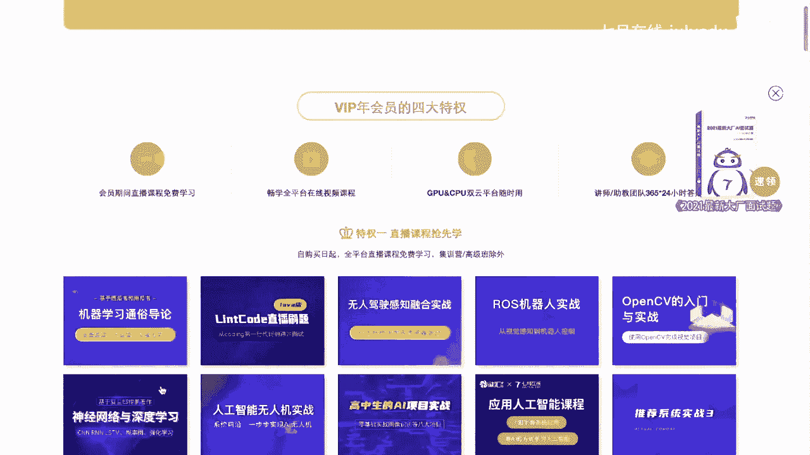

### 集成学习：Bagging 与 Boosting

**Bagging**
Bagging（自助聚合）采用并行训练的思路，类似于“民主投票”。
*   **流程**：从原始数据集中有放回地采样出多个子集，分别训练多个模型，然后将这些模型的预测结果进行投票（分类）或平均（回归）。
*   **优点**：可以有效降低模型的方差，提高稳定性。
*   **关键**：需要保证基模型之间的多样性。可以通过对数据行（样本）和列（特征）进行随机采样，或调整模型超参数来引入多样性。
*   **典型代表**：随机森林。

**Boosting**
Boosting采用串行训练的思路，类似于“精益求精”。
*   **流程**：依次训练多个模型，每个新模型都更关注前序模型预测错误的样本，通过不断修正错误来提升整体性能。
*   **优点**：可以有效降低模型的偏差。
*   **关键**：如何基于上一轮模型的结果调整学习重点。常见方法有调整样本权重或直接拟合上一轮模型的残差。
*   **典型代表**：GBDT, XGBoost, LightGBM。

### 高阶树模型（如LightGBM）的使用

像LightGBM这样的高阶模型，在工程实现上做了大量优化（如直方图算法加速分裂、特征捆绑等），使其速度更快、内存更省且性能更好。

学习使用一个树模型，通常需要掌握以下步骤：
1.  读取数据集
2.  训练模型
3.  保存与加载模型
4.  评估模型与计算特征重要性
5.  调整超参数
6.  模型部署

以LightGBM为例，它提供两种接口：
*   **原生接口**：`lgb.train`
*   **Scikit-learn API接口**：`LGBMClassifier` / `LGBMRegressor`
使用Scikit-learn接口可以更方便地利用其丰富的工具链，如网格搜索调参。

## 第四部分：企业风险预测实战

前面我们学习了特征工程和树模型的理论，现在我们将它们应用于一个真实案例：预测企业是否存在非法集资风险。

### 案例背景与数据

我们拥有约25000家企业的信息作为训练集，约15000家作为测试集。目标是根据企业信息判断其是否有非法集资风险。

数据的一个关键特点是**多表结构**。企业信息分散在多个表格中：
*   `base_info`: 企业基本信息（经营范围、行业类型、注册资本等）
*   `annual_report_info`: 企业年报信息（员工数、经营状态等）
*   `tax_info`: 企业纳税信息
*   `change_info`: 企业变更信息
*   `news_info`: 企业新闻舆论信息
*   ... 以及其他表格（商标、判决文书等）

### 实战流程

**第一步：多表数据读取与初步分析**
分别读取每一张表格。对于每张表，进行以下操作：
*   查看数据概览，了解字段含义和类型。
*   分析缺失值情况，可视化缺失值比例，考虑剔除缺失率过高的列。
*   分析字段的取值空间。

**第二步：单表特征工程与聚合**
由于某些表（如年报、纳税表）包含同一企业的多条记录，我们需要先进行单表内的特征聚合，将多行数据合并为一行。
*   **分组聚合**：使用 `groupby` 操作，按企业ID分组，然后使用 `agg` 函数进行统计（如求和、均值、最大值、最小值、种类数等）。
    ```python
    # 示例：对纳税信息按企业ID聚合，统计纳税总额、最大单笔纳税额等
    tax_agg = tax_df.groupby('id').agg({
        'tax_amount': ['sum', 'max', 'min', 'mean'],
        'tax_type': ['nunique']
    })
    ```
*   **特征提取**：从原始字段中提取新特征，例如从新闻日期中提取年份、月份，或计算最近新闻的时间间隔。

**第三步：多表合并**
将所有经过处理（清洗、聚合、特征提取）的表格，通过企业ID（主键）合并成一张宽表。
*   这张宽表的每一行代表一家企业的所有整合信息。
*   合并后的宽表即为最终用于建模的特征数据集。

**第四步：模型训练与预测**
1.  **数据准备**：将合并后的训练集拆分为特征 `X` 和标签 `y`。
2.  **使用树模型**：本例中使用LightGBM。
3.  **交叉验证**：采用K折交叉验证（如10折）来训练模型，以获得更稳健的评估结果，并配合早停机制防止过拟合。
4.  **预测与集成**：让交叉验证产生的多个模型分别对测试集进行预测，然后将这些预测结果取平均，作为最终的预测结果，这通常能提升预测的稳定性。

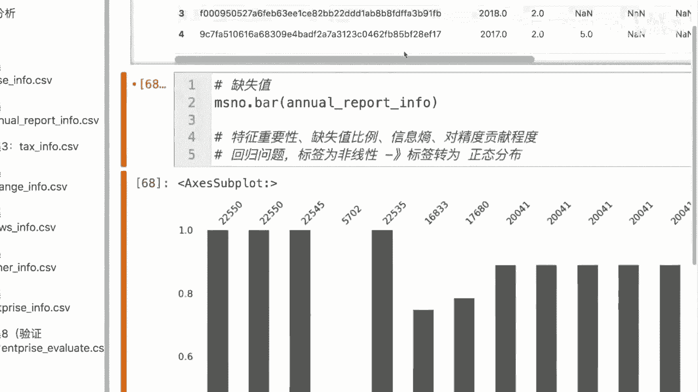


### 案例难点与总结

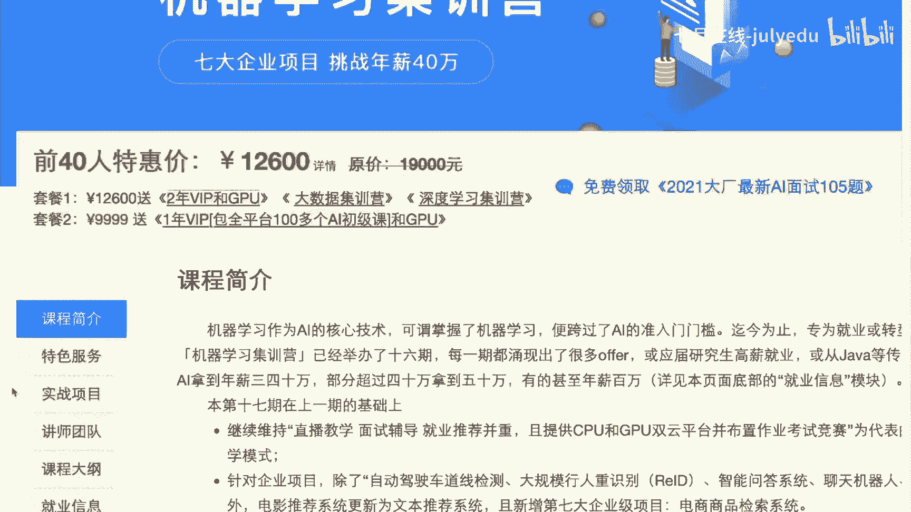

本案例的核心难点在于处理**多表关联数据**。解决方案是“先聚合，再合并”。必须先对包含多条记录的表格进行聚合，将其转换为“一个企业一行记录”的格式，才能与其他表格正确合并。

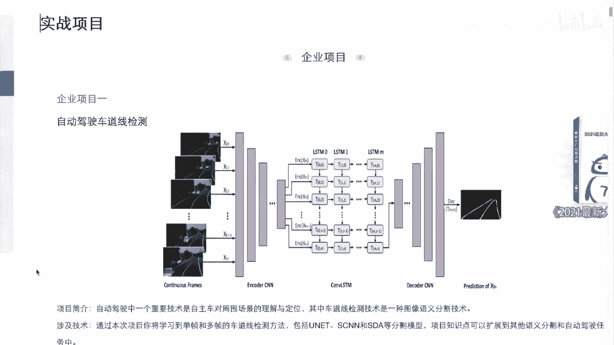

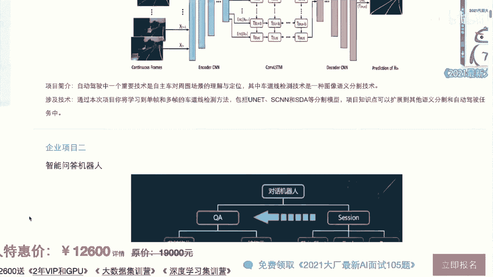

整个流程可以概括为：**多表读取 -> 单表分析与聚合 -> 多表合并 -> 特征工程 -> 模型训练与评估**。成功合并出一张高质量的宽表是后续建模成功的基础。

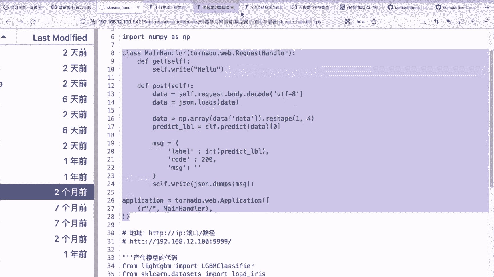

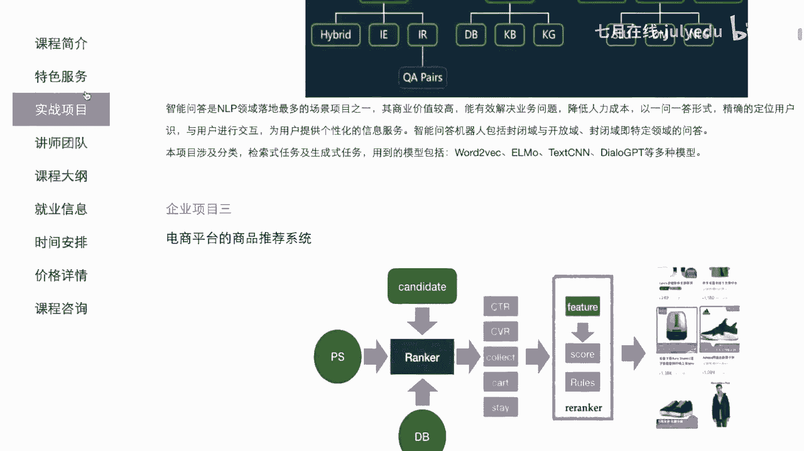

## 总结

本节课我们一起学习了企业风险预测的完整流程。
1.  我们首先了解了**结构化数据**是机器学习中最常见的数据形式。
2.  然后深入学习了**特征工程**，特别是如何处理类别特征，包括独热编码和标签编码。
3.  接着探讨了**树模型**的原理，包括基础的决策树以及通过Bagging和Boosting衍生的集成模型，并简要介绍了LightGBM的使用。
4.  最后，通过一个**企业非法集资风险预测**的实战案例，我们将理论应用于实践。案例重点演示了如何处理多表数据、进行特征聚合与合并，并利用树模型完成分类预测任务。

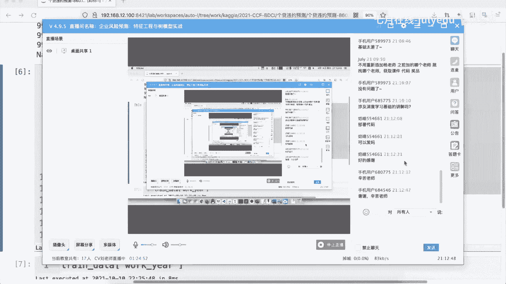


希望本课程能帮助你理解从原始数据到机器学习预测的完整链路，并掌握相关的核心技能。