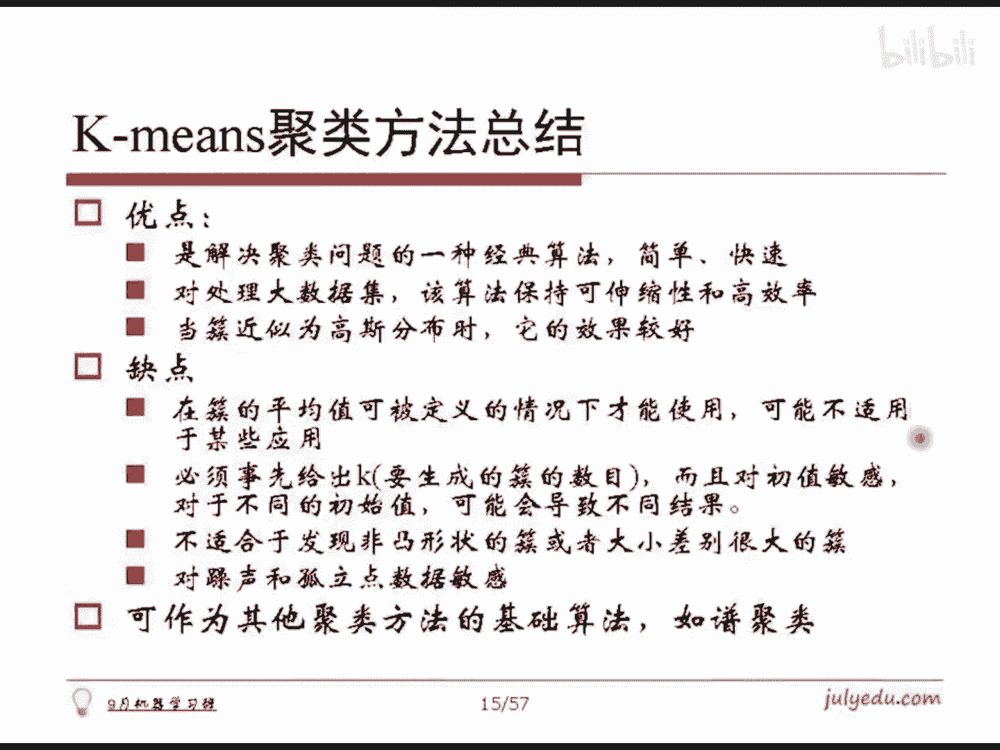

# 人工智能—机器学习公开课（七月在线出品） - P3：K-means聚类 👨‍🏫


在本节课中，我们将要学习一种经典且应用广泛的聚类算法——K-means。我们将从聚类的基本概念入手，探讨如何度量样本间的相似性，并详细讲解K-means算法的原理、步骤、优缺点及其实现。

## 概述：什么是聚类？🤔

聚类是一种无监督学习方法。它的目标是对大量没有标注的数据集，按照数据内在的相似性，将其划分成若干个类别。划分的结果需要使得类别内部的数据相似度较大，而类别之间的数据相似度较小。

因此，聚类涉及两个核心问题：第一，如何定义数据之间的“相似性”？第二，如何确定类别的数目（K值）？

## 第一部分：如何计算相似度？📏

上一节我们介绍了聚类的目标，本节中我们来看看如何度量数据点之间的相似性。在聚类中，我们通常用“距离”来度量“不相似度”。两个样本越相似，它们的距离就越近；反之，距离就越远。所以，距离和相似度是同一个问题的两个方面。

以下是几种常见的距离或相似度度量方法：

**1. 闵可夫斯基距离**
这是欧式距离的推广。给定两个n维向量X和Y，其距离公式为：
`distance(X, Y) = (∑|Xi - Yi|^p)^(1/p)`
当 `p=2` 时，即为经典的**欧式距离**。当 `p=1` 时，称为**曼哈顿距离**。当 `p` 趋近于无穷大时，距离由差值最大的维度决定。

**2. 杰卡德相似系数**
适用于集合数据。对于集合A和B，其相似度定义为它们交集与并集元素数量的比值：
`J(A, B) = |A ∩ B| / |A ∪ B|`
该度量在推荐系统中应用广泛。

**3. 余弦相似度**
通过计算两个向量夹角的余弦值来衡量其方向上的相似性，常用于文本数据：
`cosine_similarity(X, Y) = (X·Y) / (||X|| * ||Y||)`

**4. 皮尔逊相关系数**
衡量两个随机变量之间的线性相关程度，其值在-1到1之间。公式为相关系数的标准定义。

**5. KL散度（相对熵）**
用于衡量两个概率分布P和Q之间的差异，公式为：
`KL(P||Q) = ∑ P(i) * log(P(i)/Q(i))`
KL散度是非对称的。基于它可以构造对称的距离度量，例如海林格距离。

在文本处理中，我们常将文档转化为高维向量（如词袋模型），然后使用余弦相似度进行计算，这实质上等价于对去均值后的向量求相关系数。

## 第二部分：K-means聚类算法详解 ⚙️

了解了如何度量相似度后，我们正式进入K-means算法。K-means的核心思想是贪心迭代，通过不断优化样本点与聚类中心的隶属关系来达到聚类目的。

### 算法形式化描述
给定包含N个对象的数据集，目标是将其划分为K个簇（K个类别）。每个簇至少包含一个对象，且每个对象属于且仅属于一个簇。

### 算法步骤
以下是K-means算法的具体步骤：

1.  **初始化**：随机选择K个数据点作为初始的聚类中心（质心）。
2.  **分配阶段**：对于数据集中的每一个样本点，计算它与K个质心的距离（通常用欧式距离），并将其分配给距离最近的质心所属的簇。
3.  **更新阶段**：所有样本点分配完毕后，重新计算每个簇的质心。新的质心是该簇所有样本点的均值。
4.  **迭代**：重复步骤2和步骤3，直到满足终止条件（例如质心位置不再发生显著变化，或达到预设的最大迭代次数）。

### 代码实现示意
以下是一个简化的K-means算法核心步骤的伪代码描述：
```python
# 假设 data 是样本数据，k 是预设的簇数量
centroids = 随机选择k个样本点作为初始质心
for _ in range(最大迭代次数):
    clusters = 为每个样本点分配最近的质心，形成k个簇
    new_centroids = []
    for cluster in clusters:
        new_centroid = 计算cluster中所有点的均值
        new_centroids.append(new_centroid)
    if 质心变化很小:
        break
    centroids = new_centroids
```

## 第三部分：K-means的特点与挑战 🎯

上一节我们介绍了K-means的算法流程，本节中我们来看看它的优缺点以及实际应用中需要注意的问题。

### 优点
*   **简单高效**：原理和实现都相对简单，对于大数据集也有较好的伸缩性。
*   **适合凸形分布**：当簇的形状近似球形（类似高斯分布）时，效果很好。

### 缺点与挑战
1.  **需要预先指定K值**：这是聚类中最棘手的问题之一。通常需要基于业务先验知识，或通过肘部法则、轮廓系数等方法辅助选择。
2.  **对初始值敏感**：不同的初始质心可能导致不同的聚类结果。常用解决方案是多次运行算法，选择最优结果。
3.  **对噪声和离群点敏感**：由于使用均值更新质心，离群点会显著拉偏质心的位置。改进方法之一是使用K-medoids（以中位数代替均值）。
4.  **不适合非凸形状簇**：对于流形、环形等复杂形状的簇，K-means的划分效果往往不理想。

### 改进策略：二分K-means
为了缓解对初始值的敏感性问题，可以采用二分K-means算法。其基本思路是：先将所有点视为一个簇，然后选择误差最大的簇进行二分。之后，选择两个簇合并以使总体误差最小，如此反复，直到达到指定的K值。

## 总结 📚



本节课中我们一起学习了K-means聚类算法。我们从聚类的定义和相似度度量出发，详细讲解了K-means的迭代过程与实现原理。我们认识到，K-means因其简洁高效成为最基础的聚类方法，但它对K值选择、初始值和数据分布形态有特定要求。理解这些特点，能帮助我们在实践中更好地应用和改进该算法，例如通过二分K-means或转向更适合复杂形状的谱聚类等算法。