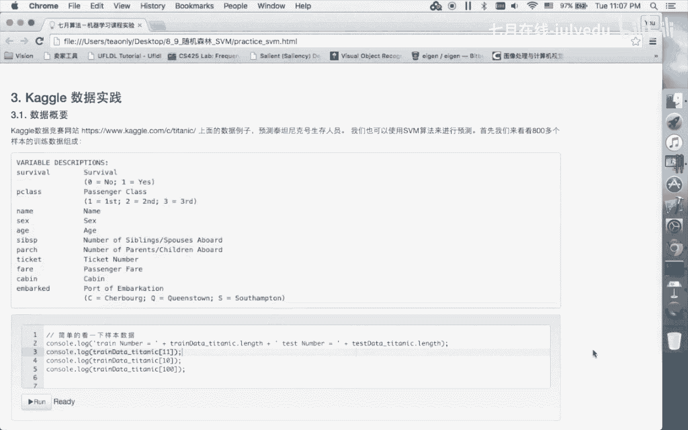

# 人工智能—机器学习公开课（七月在线出品） - P4：SVM数据试验 🧪

在本节课中，我们将通过一系列可视化实验，深入理解支持向量机（SVM）的核心概念，包括支持向量、核函数以及关键参数 `C` 和 `σ` 的影响。我们将从简单例子开始，逐步观察不同设置下决策边界和模型行为的变化。

## 1. 支持向量与拉格朗日乘子 α

上一节我们介绍了SVM的理论基础，本节中我们来看看拉格朗日乘子 `α` 在实际数据点上的表现。`α` 的值决定了哪些样本是支持向量。

我们首先观察一个线性可分的简单例子。根据KKT条件，`α` 的值被限制在 `0` 和参数 `C` 之间。
*   **α = 0**： 对应的样本点被正确分类，且位于间隔边界之外。
*   **0 < α < C**： 对应的样本点位于间隔边界上，是支持向量。
*   **α = C**： 对应的样本点可能被错误分类，或者恰好位于间隔边界上但被惩罚。

以下是我们在实验中观察到的 `α` 值与样本位置的关系：
*   位于间隔边界之外的样本，其 `α` 值接近或等于 `0`。
*   位于间隔边界上的样本，其 `α` 值在 `0` 和 `C` 之间。
*   被错误分类的样本，其 `α` 值等于 `C`。

## 2. 线性核与参数 C 的影响

接下来，我们使用线性核函数，并探讨惩罚参数 `C` 的作用。`C` 控制着模型对分类错误的容忍度。

我们通过增大 `C` 值进行实验。观察发现：
*   **C 值增大**： 间隔（Margin）的宽度会变窄。模型会尽可能减少分类错误，导致决策边界更贴近那些可能被误分的样本点。
*   **C 值减小**： 间隔的宽度会变宽。模型对分类错误的惩罚变小，允许更多的样本点被误分，以获得一个更“宽松”的决策边界。

**核心公式**： `C` 是软间隔SVM优化目标中的正则化参数。
`min 1/2 ||w||^2 + C * Σξ_i`

## 3. 高斯核（RBF核）与参数 σ

现在，我们换用高斯核（RBF核）来处理非线性数据。高斯核引入了一个新参数 `σ`（或 `γ`，`γ = 1/(2σ^2)`），它控制了单个样本的影响范围。

我们通过调整 `σ` 值进行实验：
*   **σ 值很大**： 高斯“钟形”曲线很平缓。每个样本点的影响范围很广，导致决策边界更加平滑，甚至接近线性。模型偏向于欠拟合。
*   **σ 值很小**： 高斯“钟形”曲线很尖锐。每个样本点只影响其周围极小区域。决策边界会变得非常复杂曲折，试图穿过所有样本点。模型偏向于过拟合。

**核心公式**： 高斯核函数。
`K(x_i, x_j) = exp(-||x_i - x_j||^2 / (2 * σ^2))`

## 4. C 与 σ 的协同作用与模型选择

在实验中，我们发现 `C` 和 `σ` 是紧密相关的。
*   `σ` 控制着决策边界的**弯曲程度**和复杂度。
*   `C` 控制着模型对个别样本的**重视程度**，影响间隔宽度。

正是因为这两个参数相互影响，且在高维空间中无法直观可视化，所以在实际工程中，我们必须采用系统化的方法进行参数选择。

以下是常用的参数寻优方法：
*   **网格搜索（Grid Search）**： 为 `C` 和 `σ` 设定一个候选值范围，遍历所有组合，通过交叉验证选择最佳组合。
*   **随机搜索（Random Search）**： 在指定的参数分布中随机采样组合，相比网格搜索有时效率更高。

## 5. 高斯核的强大能力与过拟合风险

我们通过构造一个复杂的“棋盘格”数据分布来展示高斯核的强大拟合能力。即使面对如此复杂的模式，高斯核也能找到决策边界将其分开。

这证明了高斯核对应的特征映射是无限维的，因此具有极强的表达能力。然而，能力越强，风险也越高：
*   **优点**： 可以建模非常复杂的非线性关系。
*   **缺点**： 极易导致过拟合，即模型在训练集上表现完美，但在未知数据上泛化能力很差。

因此，在使用高斯核时务必谨慎，必须配合严格的验证和正则化（通过 `C` 和 `σ` 控制）。

## 6. Kaggle竞赛简介

最后，我们简要介绍Kaggle。Kaggle是一个著名的数据科学竞赛平台。

以下是关于Kaggle的几个关键点：
*   它汇集了来自全球的数据科学家和机器学习爱好者。
*   平台提供多种类型的数据集（不仅仅是商业数据），涵盖分类、回归、计算机视觉、自然语言处理等任务。
*   在竞赛中取得高排名（如前10%）具有相当高的难度，是检验和实践机器学习技能的绝佳场所。
*   鼓励初学者前往探索和尝试，在实践中学习成长。

---

**本节课总结**：
本节课我们一起通过可视化实验，深入观察了SVM的核心机制。我们验证了拉格朗日乘子 `α` 与支持向量的关系，比较了线性核与高斯核的区别，并详细分析了惩罚参数 `C` 和高斯核带宽 `σ` 对模型性能（间隔宽度、边界形状、过拟合风险）的深刻影响。最后，我们认识到强大的高斯核需要谨慎使用，并介绍了Kaggle作为实践平台。理解这些概念对于正确应用和调优SVM模型至关重要。