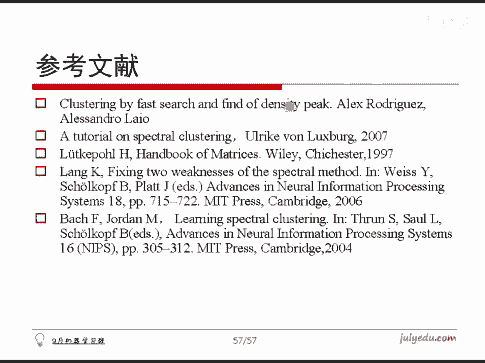

# 人工智能—机器学习公开课（七月在线出品） - P6：标签传递算法 📤


在本节课中，我们将要学习一种名为“标签传递算法”的半监督学习方法。该算法适用于数据集中只有少量样本带有标签，而大多数样本没有标签的场景。其核心思想是将已标记样本的标签信息，通过概率传递的方式扩散到未标记的样本上，从而完成对所有样本的分类。

---

## 算法背景与应用场景

上一节我们介绍了无监督分类。在实际问题中，有时只有部分样本带有标记，而大多数样本没有标记，这种场景被称为半监督学习。标签传递算法是处理此类问题最简单、最实用的思路之一。

该算法在实践中应用广泛。例如，对微博数据进行聚类，或对电影网站的用户评论进行情感分类，都可以使用这种方法。

## 算法核心思想

标签传递算法的想法很直观：将那些已标记样本的标签，通过一定的概率传递给那些没有标记的样本。最终，所有样本都会获得一个标签概率值，从而完成分类操作。

## 算法步骤详解

以下是标签传递算法的具体实现步骤。

1.  **数据与相似度矩阵**
    给定一个数据集 `data`，我们假设前 `l` 个样本是已标记的，后面的样本是未标记的。首先，需要计算一个转移概率矩阵 `P`。这个矩阵的计算方式与之前课程中提到的拉普拉斯矩阵构建过程几乎完全相同，它衡量的是样本 `i` 和样本 `j` 之间的相似度。

    **公式/代码示意**：`P[i][j] = similarity(data[i], data[j])`

2.  **初始化与迭代**
    计算出样本数目和维度后，设定一个迭代次数（例如100次）。然后，对每一个未标记的样本（从第 `l` 个到最后一个），计算它应该从哪个邻居样本那里获得标签。

3.  **标签传递函数**
    定义一个函数，用于决定将哪个邻居的标签传递给当前样本。其核心逻辑是：对于当前样本 `i`，根据其与所有邻居的转移概率，随机选择一个邻居 `j`。如果邻居 `j` 本身有标签（标签值不为零），则将这个标签传递给样本 `i`。

    **如何随机选择**：这类似于根据不同的权重随机选择一首歌。我们根据转移概率计算出一个累积概率分布，然后生成一个0到1之间的随机数，看这个随机数落在哪个概率区间，就选择对应的邻居。

    **代码逻辑示意**：
    ```python
    cumulative_prob = calculate_cumulative_prob(P[i])
    rand_num = random()
    selected_neighbor = find_interval(cumulative_prob, rand_num)
    if label[selected_neighbor] > 0:
        label[i] = label[selected_neighbor]
    ```

4.  **迭代可视化**
    标签传递是一个迭代扩散的过程。初始时，只有少数点有颜色（标签）。经过一次迭代后，标签开始向邻近点传播。迭代20次、30次、40次后，标签会逐渐扩散到整个数据集，最终所有样本都会获得一个标签。

    该算法代码简单，时间复杂度低，因此在实践中非常有用。

## 算法的影响因素与局限性

虽然算法简单有效，但其结果会受到参数设置的显著影响，主要是**带宽**和**邻域**的选择。

以下是通过两个环形数据叠加的例子，说明参数设置不当可能带来的问题。

*   **邻域过小**：如果设置的邻域特别小，可能导致标签无法在全局有效传递。例如，一个环全部被标记为蓝色，另一个环全部被标记为红色，而无法识别出它们其实是两个独立的结构。
*   **邻域过大**：如果设置的邻域特别大，又可能导致标签过度平滑。例如，在两个环的交界处会产生模糊的过渡地带，无法形成清晰的分类边界。

对于某些复杂结构的数据（如嵌套的环），单纯调整带宽和邻域参数可能无法得到理想的结果。因为从不同角度看，分类方式可能都有其合理性，这时就需要结合其他方法或更复杂的模型来处理。

## 参考文献

本课程中提到的方法，特别是之前介绍的“基于密度最大值距离”的算法，有对应的学术论文可供深入阅读。第一篇参考文献尤为重要，大家可以通过搜索引擎直接找到并下载其PDF版本。

---




本节课中，我们一起学习了标签传递算法。我们了解了它作为半监督学习方法的背景与核心思想，即通过概率扩散将少量标签传递至整个数据集。我们逐步拆解了算法的实现步骤，并讨论了带宽和邻域参数对结果的影响及其局限性。这是一个原理直观、实现简单且在实践中有广泛应用的高效算法。