# 人工智能—机器学习公开课（七月在线出品） - P7：分布式机器学习系统的设计与实现

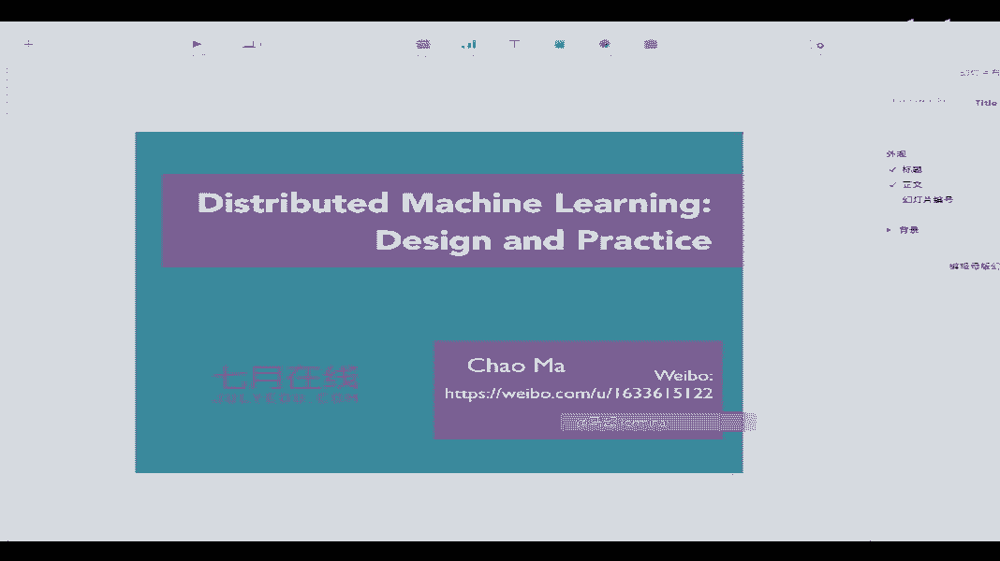

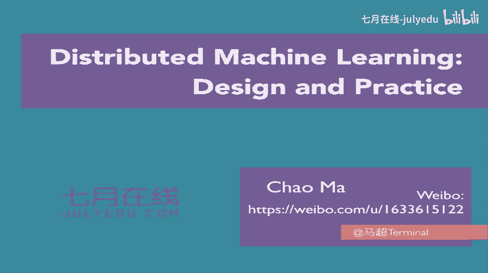

## 概述

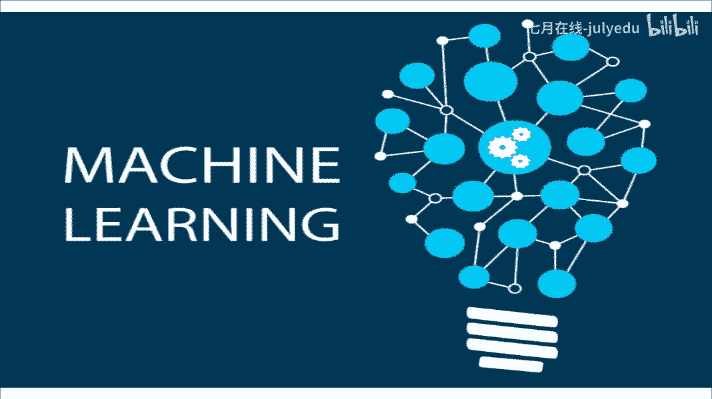

在本节课中，我们将要学习分布式机器学习系统的设计与实现。我们将从大数据时代对机器学习提出的挑战出发，探讨为何需要分布式系统，并沿着技术演进的脉络，从MapReduce、Spark到Parameter Server、数据流框架，系统地介绍分布式机器学习的核心范式、设计哲学与关键技术，特别是如何高效地进行模型同步。

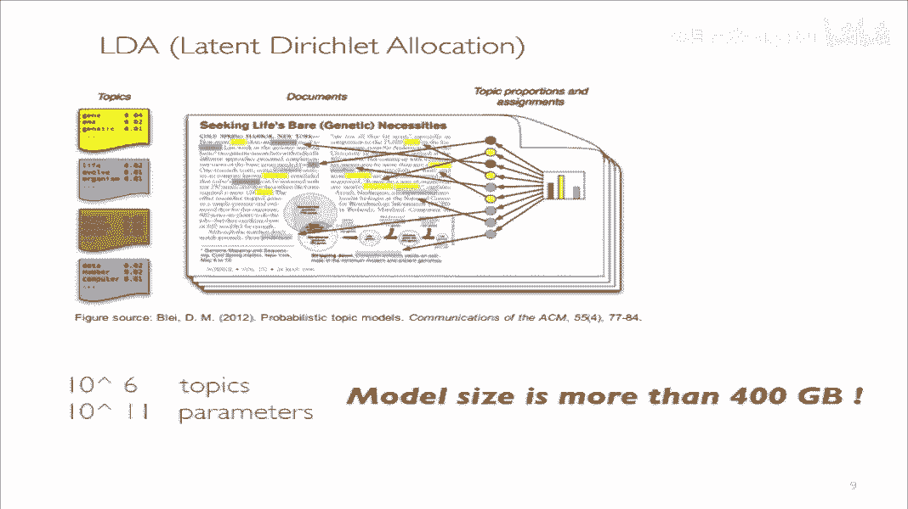

## 大数据时代的机器学习挑战

随着互联网的快速发展，我们已进入大数据时代。例如，Facebook每分钟处理近240万用户的分享，YouTube每分钟上传72小时的视频数据。这些海量数据使得机器学习算法能够发挥前所未有的效果。

然而，大数据和复杂模型也带来了巨大挑战。例如，在单张NVIDIA GPU上训练一个56层的ResNet网络在ImageNet数据集上达到收敛，可能需要长达14天的时间。这对于需要频繁调参的模型开发流程是不可接受的。

另一个挑战是模型规模巨大。例如，LDA主题模型可能需要处理10^11量级的参数，模型大小超过400GB。在线广告点击率预估中使用的FFM模型，其大小经常超过1TB，训练数据更是达到PB级别。

这些挑战表明，使用单台计算机处理工业级机器学习任务已不再可能，分布式训练已成为处理大规模机器学习问题的先决条件。

## 分布式机器学习的三个层次

学习分布式机器学习，我们可以从三个层次入手：

1.  **机器学习模型与优化方法**：从数学理论层面理解模型。
2.  **分布式机器学习范式**：理解系统设计所基于的计算模式。
3.  **系统设计与实现**：了解具体系统的设计哲学与实现细节。

我们将沿着这个思路，为大家梳理分布式机器学习的知识体系。

## 机器学习模型基础

对于一个机器学习模型，我们主要关注六个方面：

1.  **模型形式**：模型是如何定义的。
2.  **预测/推断**：模型如何对新数据进行预测。
3.  **评估指标**：如何衡量模型的好坏。
4.  **训练损失**：用于优化模型的目标函数。
5.  **正则化**：如何防止模型过拟合。
6.  **优化算法**：如何最小化训练损失。

以线性模型为例，其预测是将权重向量 **w** 与特征向量 **x** 做点积：`y_pred = w^T * x`。对于深度学习模型，虽然表达能力更强，但训练所需的计算力也大得多。

优化算法经历了漫长演变。以2010年为界，之前的算法多为确定性算法，每一步优化都精确计算；之后的算法则多为随机算法，如随机梯度下降，它更适合大数据场景，因为不需要在每一步都遍历全部数据。

核心的优化算法随机梯度下降的更新公式为：
`w_{t+1} = w_t - η * ∇L(w_t)`
其中 **η** 是学习率，**∇L(w_t)** 是损失函数在 **w_t** 处的梯度。

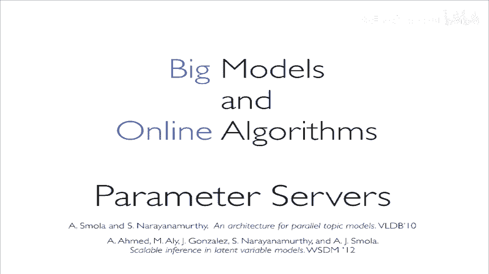

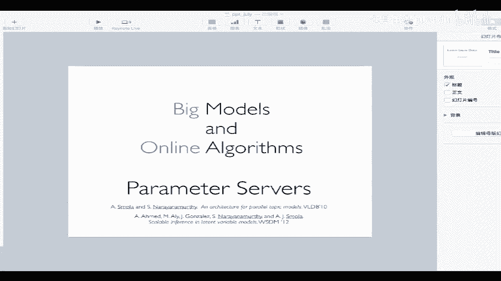

## 分布式机器学习核心：模型同步

分布式机器学习的核心思想是将任务分发给多台机器协同训练。这主要涉及两种并行模式：

*   **数据并行**：将训练数据划分到不同机器，每台机器拥有完整的模型副本，独立计算梯度，然后同步梯度以更新全局模型。
*   **模型并行**：将模型本身划分到不同机器，每台机器负责模型的一部分，通常需要处理同一份数据，并在机器间同步中间结果。

无论哪种模式，**核心挑战都在于如何高效地进行模型同步**。因为网络通信速度远慢于CPU/GPU计算速度，同步可能成为系统瓶颈。

## 系统架构演进

分布式机器学习系统的架构经历了一系列演进：

### 1. MapReduce 时代

MapReduce 是早期处理大数据的主要范式。在机器学习任务中，Map阶段计算梯度，输出 `(feature_id, gradient)` 键值对；Reduce阶段将相同feature_id的梯度相加。

然而，MapReduce 不适合迭代式机器学习任务。因为每一轮迭代都需要启动新的MapReduce作业，从磁盘重复加载数据和模型，I/O开销巨大，成为主要性能瓶颈。

### 2. Spark 的改进

Spark 的核心改进是将数据持久化在内存中，避免了每轮迭代的磁盘I/O，性能提升显著。

但是，Spark 采用同步计算和广播模型更新的方式。当模型非常大时，Driver节点广播模型会带来巨大的网络带宽压力。同时，同步计算要求所有Worker同时完成计算，速度受限于最慢的节点，资源利用率低。

### 3. Parameter Server 架构

为了解决Spark的瓶颈，Parameter Server架构被提出。它将模型参数集中存储在若干Server节点上，Worker节点异步地从Server拉取参数、计算梯度，再推送给Server更新。

这种异步执行提高了资源利用率，因为Worker无需相互等待。为了在收敛速度和系统效率间取得平衡，提出了SSP协议，允许最快的Worker比最慢的Worker最多快`B`步，`B`是一个可设置的边界值。

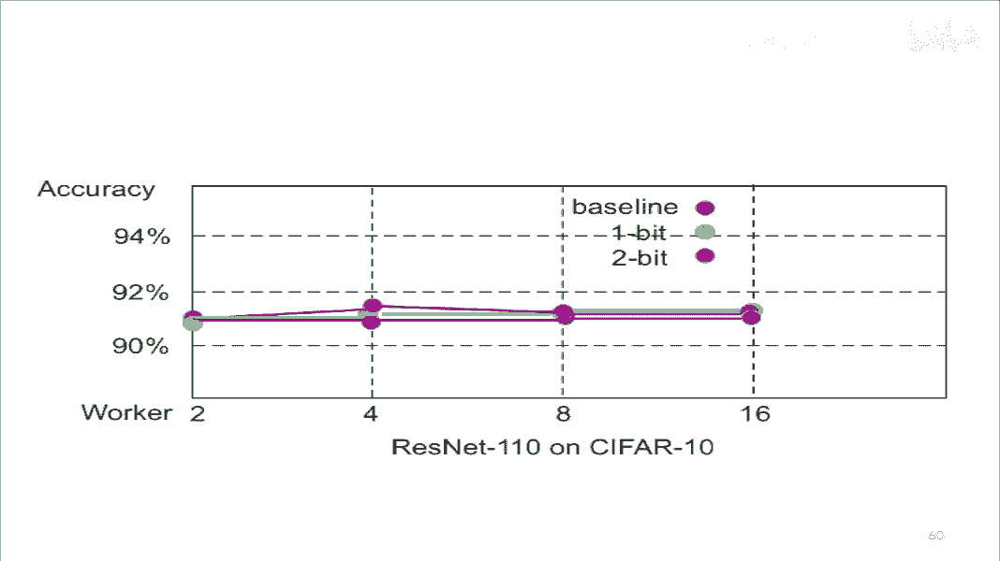

Parameter Server提供了`get`和`add`的编程抽象。Worker通过`get(key)`获取参数，计算后通过`add(key, delta)`推送更新。

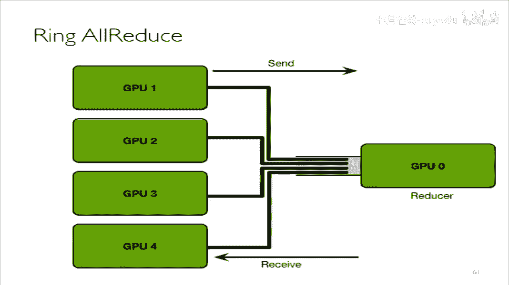

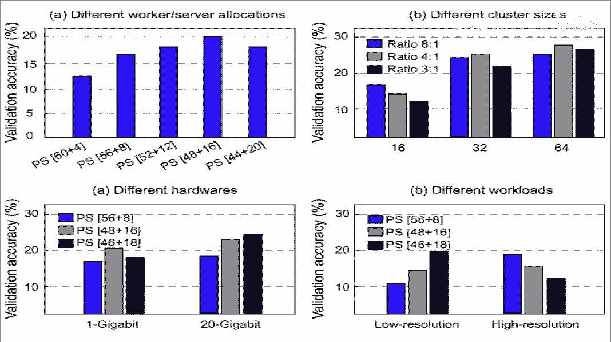

### 4. 数据流框架与深度学习

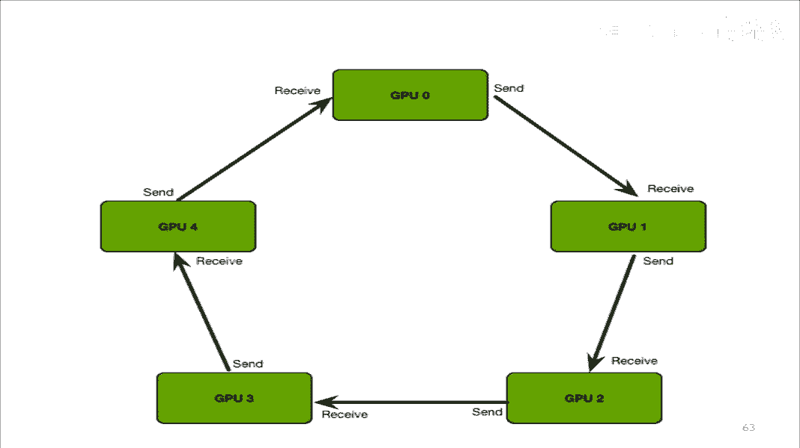

对于深度学习，像TensorFlow、MXNet这样的数据流框架提供了更直观的编程模型。它们能自动处理并行，例如通过计算与通信的重叠来隐藏通信开销。

一个关键优化是**梯度压缩**，用以减少通信量：
*   **1-bit量化**：将梯度正负值分别用其均值替代，然后用1个比特表示正负。
*   **2-bit量化**：设置阈值，将梯度值量化为`{-a, 0, +a}`三种，用2个比特表示。
为防止精度损失，采用了**残差累积**技术，将本轮未发送完的梯度残差累加到下一轮。

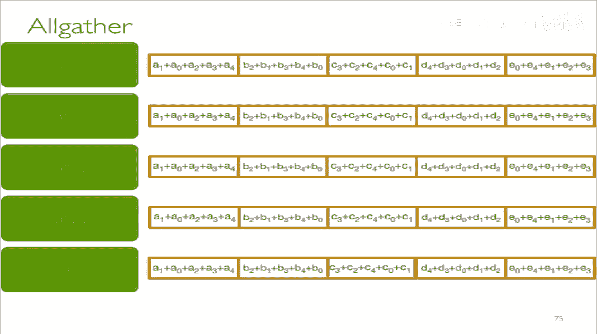

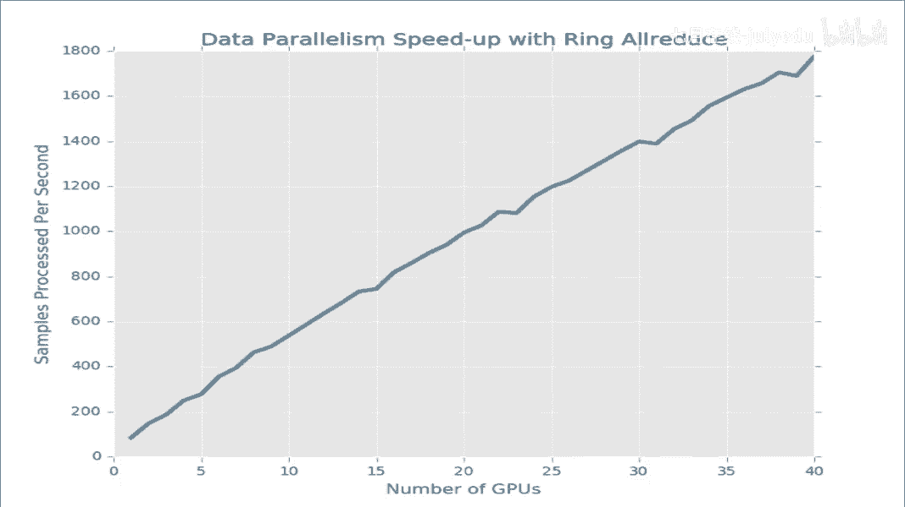

### 5. All-Reduce 与弹性同步

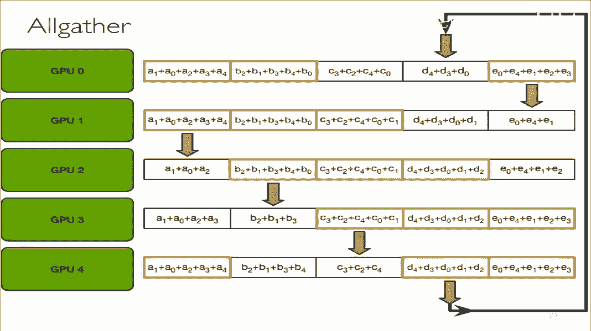

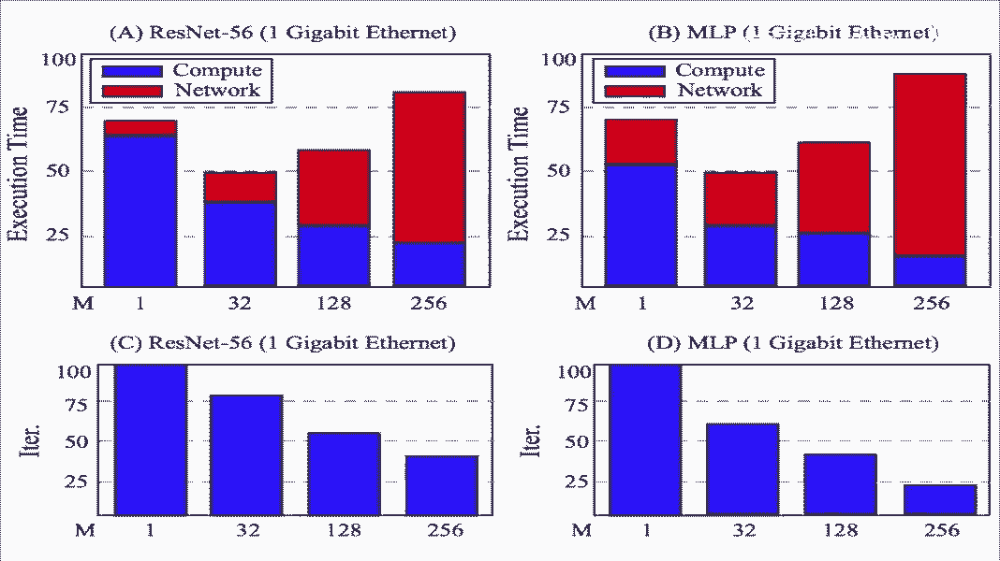

All-Reduce是一种集体通信操作，所有节点平等参与，最终每个节点都获得完整的聚合结果。它非常适合深度学习的数据并行同步，能充分利用网络带宽。

经典的All-Reduce算法如Ring All-Reduce，通过将数据分块并在节点间形成流水线进行传递和累加，高效完成同步。

为了进一步优化，提出了**弹性All-Reduce**。它允许在模型未完全同步前就开始下一轮计算，通过设置一个边界值`M`来控制同步程度，在延迟和带宽利用率之间进行权衡。

## 总结

本节课我们一起学习了分布式机器学习系统的设计与实现。我们从大数据带来的挑战出发，理解了分布式训练的必要性。随后，我们探讨了分布式机器学习的核心——模型同步，并沿着技术发展脉络，系统学习了从MapReduce、Spark到Parameter Server、数据流框架以及All-Reduce等核心架构的演进过程、设计原理与优缺点。

关键要点包括：
*   分布式机器学习解决的核心问题是**大规模数据与模型下的高效训练**。
*   **模型同步**是系统设计的关键挑战。
*   系统演进围绕**提高资源利用率**和**降低通信开销**展开。
*   现代深度学习框架通过**计算-通信重叠**和**梯度压缩**等技术来优化性能。

要深入这个领域，建议阅读优秀开源系统（如MXNet、XGBoost）的代码，并理解其背后的设计哲学。分布式机器学习是一个将理论、算法与系统工程紧密结合的领域，需要持续的学习和实践。