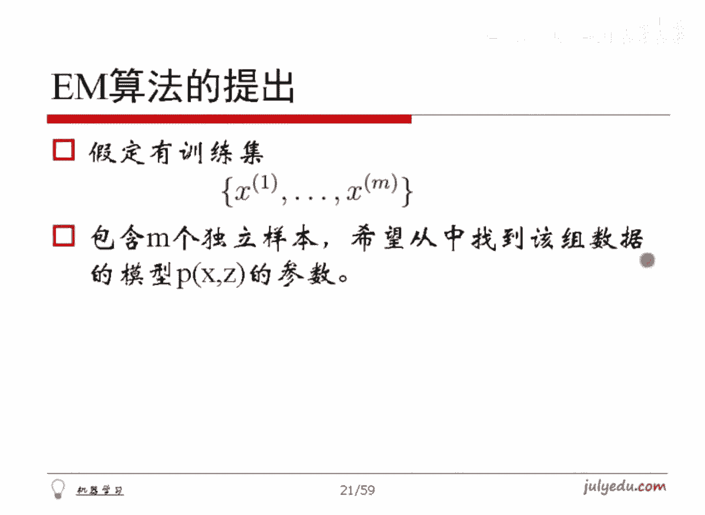

# 人工智能—机器学习公开课（七月在线出品） - P8：感性理解GMM 🧠

## 概述

在本节课中，我们将要学习高斯混合模型（GMM）及其核心求解算法——期望最大化（EM）算法。我们将从一个简单的例子出发，逐步理解如何从“不完全数据”中估计模型参数，并最终掌握EM算法的核心思想和计算步骤。

---

## 回顾：极大似然估计

上一节我们介绍了高斯混合模型的基本概念，本节中我们来看看其参数估计的核心思想——极大似然估计。

首先，我们回忆一下极大似然估计。举个例子，假设有10个硬币，我们抛硬币10次，记录结果为“正正反正正正反反正正”。我们想估计硬币正面朝上的概率P。

我们假定每次抛硬币结果为正的概率是P。由于每次抛硬币是独立的，看到这10次结果的概率就是每次结果概率的乘积。其中有7次正，3次反，因此总概率为 `P^7 * (1-P)^3`。

我们把这个总概率记作关于P的函数。极大似然估计的思想是：既然我们观测到了这个结果，那么就认为这个结果出现的可能性最大。因此，我们需要找到使这个概率函数值最大的P。

为了求解最大值，我们对函数取对数（因为乘积取对数后变为求和，便于求导），然后对P求导并令其为零，最终可以计算出P=0.7。

---

## 扩展到高斯分布

理解了离散分布的估计后，我们来看看连续分布的情况。

现在假设我们有N个样本 `X1, X2, ..., XN`，它们来自一个高斯分布总体。该分布的均值μ和标准差σ是未知的。我们需要根据这N个样本值来估计参数μ和σ。

我们仍然使用极大似然估计。首先写出高斯分布的概率密度函数。给定μ和σ时，样本Xi的概率密度是已知的。将所有样本的概率密度乘起来，就得到了似然函数。

为了求极值，我们同样先对似然函数取对数，得到对数似然函数。然后分别对μ和σ求偏导，并令偏导数为零，即可解出μ和σ的估计值。

计算后我们发现：
*   均值μ的估计值是样本的均值。
*   方差σ²的估计值是样本的“伪方差”（即除以N，而非N-1）。

这个结论与我们的直观是吻合的。

---

## 引入新问题：混合高斯模型

上一节我们处理了单一分布的情况，本节中我们来看看更复杂的场景——数据来自多个分布的混合。

现在考虑一个新问题：我们测量了1万名志愿者的身高，得到了1万个身高数据。这些志愿者中有男有女。假设男性的身高服从一个高斯分布（均值为μ1，标准差为σ1），女性的身高服从另一个高斯分布（均值为μ2，标准差为σ2）。

如果我们**知道**每个志愿者的性别，那么分别用男性数据和女性数据，就能直接套用上一节的公式估计出两组参数。但问题在于，我们**只有身高数据，没有性别数据**。这种数据被称为“不完全数据”。

我们的目标变成了：仅凭身高数据，估计出μ1, σ1, μ2, σ2，以及样本属于男性或女性的先验概率（记作π1和π2）。这就是**高斯混合模型**要解决的问题，而解决它的手段就是**EM算法**。

形式化地描述：假设观测数据X是由K个高斯分布混合而成。每个样本Xi来自第k个高斯分布的概率是πk。第k个高斯分布的均值为μk，标准差为σk。我们观测到了M个样本，需要估计所有πk, μk, σk。

---

## EM算法的核心思想

面对不完全数据，直接建立似然函数会非常复杂（因为对数内部有求和），难以求解。EM算法采用了一种分两步走的迭代策略。

它的核心思想是：既然我们不知道每个样本具体属于哪个分布，那就先“猜”一个。

**第一步（E步）：计算“属于”每个分布的概率**
首先，我们随机初始化所有参数（πk, μk, σk）。对于每一个样本Xi，我们计算它“属于”第k个分布的概率γik。这个概率可以通过以下方式理解：
*   分子：样本Xi来自第k个分布的可能性（πk）乘以在该分布下出现Xi的概率密度。
*   分母：对所有的K个分布做上述计算并求和，目的是进行归一化，使得对于同一个样本Xi，所有γik加起来等于1。

**公式：**
`γik = (πk * N(Xi | μk, σk)) / (∑(j=1 to K) πj * N(Xi | μj, σj))`

这个γik就是整个EM算法中最关键的桥梁。

**第二步（M步）：更新分布参数**
有了每个样本属于各个分布的“概率权重”γik后，我们就可以更新参数了。思路是：把每个样本Xi按照权重γik“拆分”到各个分布中去。

例如，一个身高1.9m的样本，计算出的γi1(男)=0.9，γi2(女)=0.1。那么在更新男性分布参数时，这个样本就以0.9的权重参与计算；更新女性分布时，以0.1的权重参与计算。

以下是更新公式的直观理解：
*   **更新πk**：所有样本属于第k类的权重之和，除以总样本数。`πk_new = (∑γik) / N`
*   **更新μk**：用权重γik加权后，所有样本的均值。`μk_new = (∑(γik * Xi)) / (∑γik)`
*   **更新σk**：用权重γik加权后，所有样本的（伪）方差。`σk_new = sqrt( (∑γik * (Xi - μk_new)²) / (∑γik) )`

**迭代过程**
用M步得到的新参数(πk_new, μk_new, σk_new)，替换掉旧的参数，然后回到E步重新计算γik。如此反复迭代，直到参数不再发生显著变化，算法收敛。

---

## 算法特点与注意事项

在应用EM算法时，有以下几点需要注意：

*   **局部最优**：EM算法只能保证收敛到局部最优解，而非全局最优。初始参数（“猜”的起点）的选择会影响最终结果。糟糕的初值可能导致得到不理想的模型。
*   **收敛条件**：通常当参数的变化小于某个阈值，或似然函数值不再明显增加时，停止迭代。
*   **应用范围**：我们讨论的是各组分均为高斯分布的混合模型。若组分是其他分布（如泊松分布），则更新公式会不同，但EM算法的两步走框架依然适用。

---

## 总结

本节课中我们一起学习了高斯混合模型及其求解算法——EM算法。

我们首先从简单的极大似然估计出发，理解了参数估计的基本思想。然后，我们将问题扩展到数据来源不明（不完全数据）的混合高斯模型。为了求解这个复杂问题，我们引入了EM算法，其核心是通过迭代的“猜测-更新”过程来逼近最优参数：
1.  **E步（期望步）**：基于当前参数，计算每个样本属于各个分布的概率权重γik。
2.  **M步（最大化步）**：利用计算出的权重γik，像处理“完全数据”一样，更新每个高斯分布的参数（πk, μk, σk）。

这个算法直观而强大，是无监督学习中处理隐变量问题的经典方法。