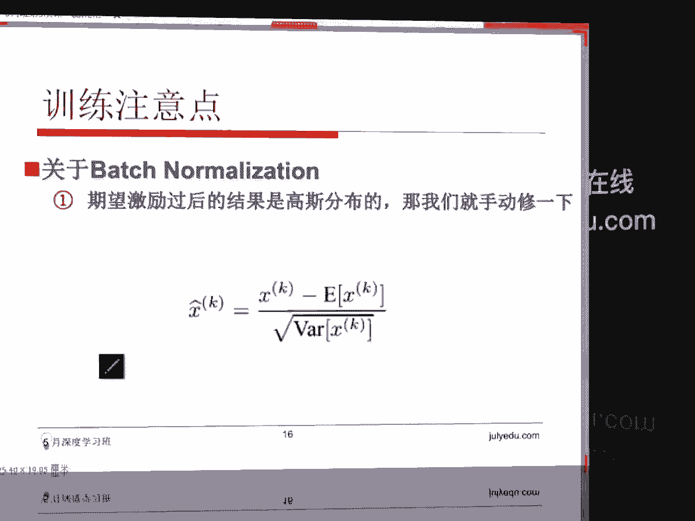

# 人工智能—深度学习公开课（七月在线出品） - P1：CNN训练注意事项 🧠


在本节课中，我们将要学习卷积神经网络训练中一个至关重要的环节：**权重初始化**。我们将探讨为什么初始化如此重要，以及不当的初始化方法如何导致训练失败。课程将介绍几种主流的初始化策略，并解释其背后的原理，帮助初学者理解如何为深度神经网络设置一个良好的起点。

## 早期深度神经网络的困境 😰

上一节我们介绍了CNN的基本概念，本节中我们来看看训练深度网络时遇到的一个经典难题。

早期神经网络的发展曾一度停滞，直到2012年AlexNet的出现才取得突破。AlexNet之后，各种深度神经网络模型如雨后春笋般涌现。这种爆炸式增长的一个关键原因是，AlexNet为后续模型的训练提供了一个**良好的初始值**。

在AlexNet的7层架构时代，训练更深层次的网络就变得异常困难。网络经常在训练中途“崩溃”。具体表现为：梯度在反向传播中消失，或者前向运算中的权重`W`全部变为零。例如，在激活层之后，输出可能全部变为零，或者反向传播回来的梯度变为零。这导致网络无法学习到任何有效信息。

深度网络训练失败的核心原因在于其**脆弱性**。如果初始权重设置不当，网络将无法进行有效的学习。因此，权重初始化成为了一个极其重要的研究课题。近年来的许多论文都在专门探讨如何初始化权重，以增强网络的**鲁棒性**，使其不会因为输入数据的微小变化而在训练中失败。

## 为什么不能将所有权重初始化为零？ 🚫

以下是关于全零初始化问题的分析。

在深度神经网络中，如果将所有权重`W`初始化为0，会导致一个严重问题：**对称性**。

第二层神经网络的输入，是由第一层的输出与权重`W`做线性组合得到的。当所有权重`W`都为零时，无论上一层的输出是什么，下一层所有神经元的输入都将变得完全相同。这种对称性会逐层传递。

在卷积神经网络中，我们希望每个滤波器能关注图像的不同特征，如颜色或纹理。对称的初始化使得所有神经元都在学习完全相同的东西，无法分化出不同的滤波器。无论是前向传播还是使用反向传播算法求梯度，所有参数的变化都会一模一样。这违背了我们希望神经网络具有**非对称性**的初衷，导致模型无法有效学习。

因此，将所有权重初始化为相同的值（包括全零）是不可取的。

## 尝试一：使用小随机数初始化 🔢

既然全零初始化不行，一个自然的想法是使用很小的随机数来初始化权重。

最常见的方法是从一个均值为0、方差很小（例如0.01）的高斯分布中随机采样数值来初始化权重`W`。在代码中，可以使用NumPy实现：
```python
W = np.random.randn(fan_in, fan_out) * 0.01
```
在这种方法中，我们通常希望权重中正数和负数的数量大致各占一半，以避免网络在初始化时就向某一侧过度倾斜，从而保持初始的非对称性。

然而，这种方法仅适用于层次不深的神经网络。如果只有一两个隐藏层，这种初始化方式通常能正常工作。但对于更深的网络，它仍然会导致问题。

## 深度网络中的激活值分析 📊

为了验证上述初始化方法在深层次网络中的效果，我们进行了一个实验。

我们构建了一个10层、每层500个神经元的深度神经网络，并使用`tanh`作为激活函数。我们监控网络在前向传播过程中，每一层激活输出的均值和方差。

实验发现，当使用小随机数初始化时：
*   **第一层**：激活输出的均值约为-0.000117，方差为0.21，表现正常。
*   **第二层**：均值急剧减小到约0.000001，方差也变得非常小。
*   **后续层**：均值和方差都迅速趋近于零。

这意味着，在深层次网络中，信号经过几层传递后，激活值几乎全部变为零。输出没有波动，导致反向传播时梯度消失，网络无法学习。因此，过小的初始化数值会导致**激活值消失**。

那么，使用较大的随机数初始化是否可行呢？实验表明，这会导致另一个极端问题：**激活值饱和**。对于`tanh`或`sigmoid`这类激活函数，过大的输入会使输出趋近于±1，进入梯度近乎为零的饱和区，同样阻碍了训练。

## 解决方案：Xavier/Glorot 初始化 ⚖️

上一节我们看到，过大或过小的初始化值都会有问题。本节介绍一种经典的解决方案。

为了解决上述问题，2010年的一篇论文提出了 **Xavier初始化**（也称Glorot初始化）。其核心思想是：**保持每一层激活输出的方差与输入方差大致相同**，从而避免信号在传播过程中过度放大或缩小。

具体公式为：从均值为0、方差为 `Var(W) = 1 / fan_in` 的高斯分布中采样来初始化权重`W`。其中，`fan_in`是该层的输入神经元数量。
在代码中通常实现为：
```python
W = np.random.randn(fan_in, fan_out) / np.sqrt(fan_in)
```
其数学推导基于一个假设：希望该层输出的方差 `Var(y)` 与该层输入的方差 `Var(x)` 相等。经过推导（涉及线性变换和独立假设），可以得出当 `Var(W) = 1 / fan_in` 时，能近似满足这一条件。这有助于在深度网络中维持激活值的稳定分布。

然而，Xavier初始化是针对`tanh`或`sigmoid`这类对称的饱和激活函数设计的。

## 针对ReLU的改进：He初始化 🔧

当更高效的`ReLU`激活函数成为主流后，人们发现Xavier初始化对其效果不佳。

`ReLU`函数会将所有负输入置零，这改变了输出的分布。使用Xavier初始化后，在深层次网络中，激活输出的方差仍然会逐渐衰减。

因此，在2015年，何恺明等人提出了专门针对`ReLU`及其变体的 **He初始化**。其方法非常简单，仅将公式中的分母做了调整：
```python
W = np.random.randn(fan_in, fan_out) / np.sqrt(fan_in / 2)
# 或者等价于：W = np.random.randn(fan_in, fan_out) * np.sqrt(2. / fan_in)
```
实验表明，使用`np.sqrt(2. / fan_in)`作为缩放因子，能够使`ReLU`网络在各层的激活输出保持稳定的方差，从而确保训练过程正常进行。

在Batch Normalization等技术普及之前，手动调整初始化策略（如Xavier或He初始化）是训练深度网络的关键技巧。它们需要大量的实验来验证其有效性。

## 现代方法：Batch Normalization 🚀

手动初始化策略虽然有效，但仍需谨慎调优。现代深度学习提供了一个更强大的工具来自动稳定训练过程：**批归一化**。

Batch Normalization（BN）层的提出，极大地缓解了对精细初始化策略的依赖。BN层在网络中自动完成以下工作：对每一层的输入进行归一化处理（减去均值，除以标准差），然后通过可学习的参数`γ`和`β`进行缩放和偏移。

这个过程能确保无论输入分布如何变化，传递到下一层的值都能保持相对稳定的分布。因此，即使初始化不那么完美，BN也能帮助网络更稳定、更快地收敛。在当今大多数深度网络中，结合He初始化和Batch Normalization已成为标准做法。

## 总结 📝

本节课中我们一起学习了卷积神经网络训练中权重初始化的关键知识。

我们首先探讨了**错误初始化（如全零初始化）导致的对称性问题**，这会使网络无法学习。接着，我们分析了**使用过小或过大随机数初始化**在深度网络中引发的激活值消失或饱和现象。然后，我们介绍了两种经典的手动初始化策略：适用于`tanh/sigmoid`的**Xavier初始化**和适用于`ReLU`的**He初始化**，它们通过数学推导来维持层间激活值的稳定分布。最后，我们提到了现代深度学习中广泛使用的**Batch Normalization**技术，它能自动标准化层输入，降低了对初始化策略的敏感度，使深度网络训练更加鲁棒。





理解权重初始化的原理，是构建和训练有效深度学习模型的重要基础。