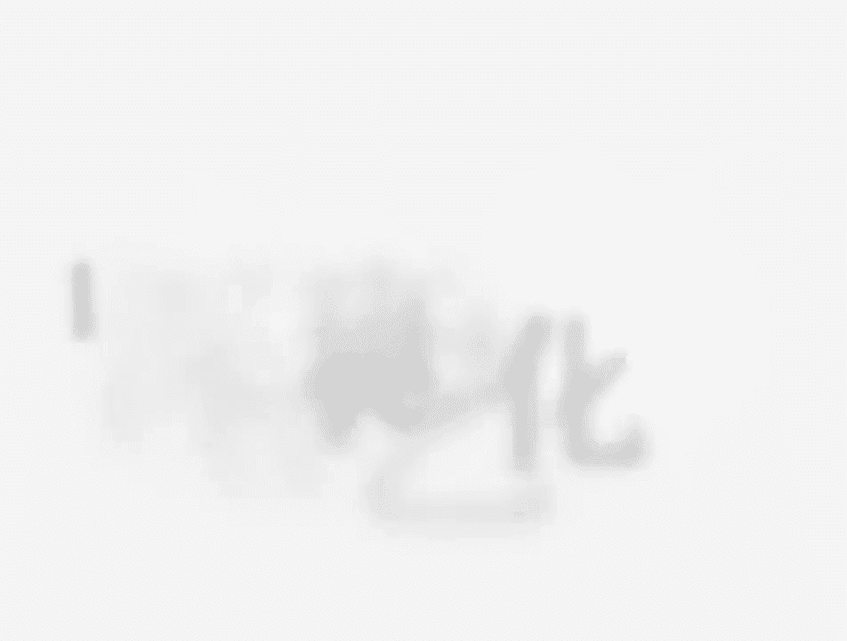
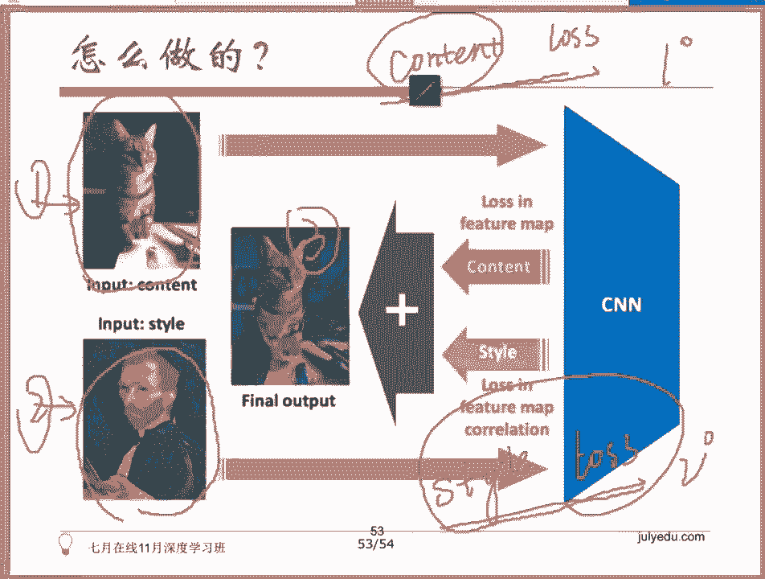
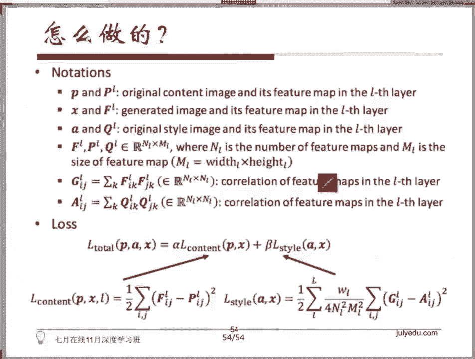
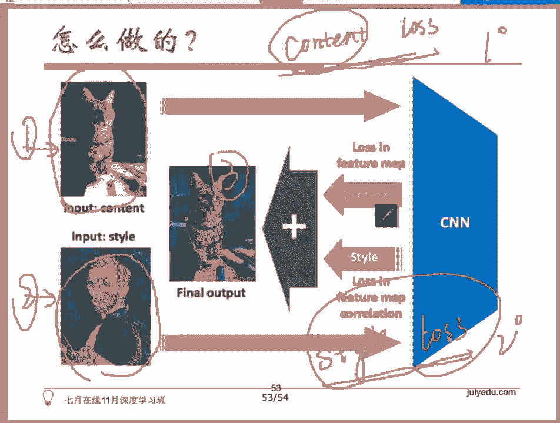
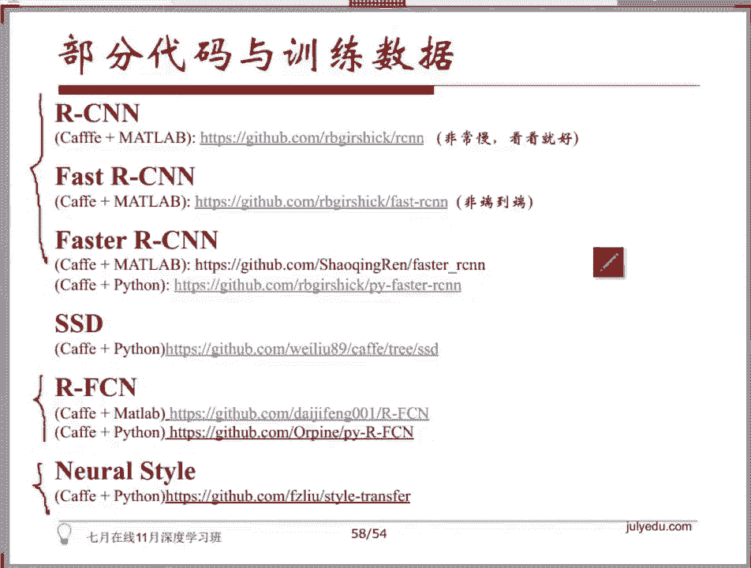

# 人工智能—深度学习公开课（七月在线出品） - P3：NeuralStyle艺术化图片（学梵高作画背后的原理） 🎨



在本节课中，我们将要学习Neural Style Transfer（神经风格迁移）的原理。这是一种能够将著名画作（如梵高、毕加索的作品）的艺术风格，迁移到普通照片上的技术。我们将深入探讨其背后的核心概念、损失函数的构成以及训练过程。

## 概述

Neural Style Transfer技术源于2015年的一篇论文。它的目标非常明确：输入一张原始照片和一张艺术风格图像（如大师的画作），生成一张既保留原始照片内容，又具有艺术风格的新图像。

## 核心原理：两种损失函数

上一节我们介绍了Neural Style Transfer的目标，本节中我们来看看它是如何通过数学方法实现这一目标的。整个过程的核心在于定义并优化两个关键的损失函数。

所有机器学习问题，尤其是有监督学习，通常都需要定义一个损失函数（Loss Function）或代价函数（Cost Function），并通过不断最小化这个函数来优化模型。Neural Style Transfer也不例外，但它同时优化两个相互“竞争”的损失。



以下是构成总损失函数的两个核心部分：

1.  **内容损失**
    *   **目标**：衡量生成图像与原始**内容图像**在视觉内容上的差异度。
    *   **作用**：确保生成图不会偏离原始照片的主体内容。





2.  **风格损失**
    *   **目标**：衡量生成图像与**风格图像**在艺术风格上的差异度。
    *   **作用**：促使生成图学习并模仿艺术画作的笔触、色彩搭配等风格特征。

在训练过程中，这两个损失函数会不断“打架”。当生成图在内容上非常接近原图时，往往难以学到抽象的艺术风格；反之，当风格模仿得很像时，内容的可理解性又会下降。因此，我们需要一个总损失函数来平衡这两者。

总损失函数的公式可以表示为：
`总损失 = α * 内容损失 + β * 风格损失`
其中，**α** 和 **β** 是两个超参数，分别控制内容保真度和风格迁移强度的权重。

## 损失函数的计算细节

理解了总体的损失框架后，我们来看看这两个损失具体是如何计算的。这需要借助一个预训练好的卷积神经网络（如VGG）来提取图像特征。

### 内容损失的计算

内容损失的计算相对直观。它的核心思想是：比较两幅图像在神经网络同一中间层输出的特征图（Feature Map）的差异。

假设我们使用VGG网络的第5个卷积层。对于一幅输入图像，该层会输出一个维度为 `C x H x W` 的特征张量，其中：
*   **C** 代表通道数（即特征图数量，例如512）。
*   **H** 和 **W** 代表特征图的高度和宽度（例如64x64）。

计算步骤如下：
1.  将**原始内容图像**输入网络，提取第L层的特征图，记为 `F^L`。
2.  将**当前生成的图像**输入同一网络，提取第L层的特征图，记为 `P^L`。
3.  计算这两个特征图之间每个位置（像素点）的差值，并求其平方和。

内容损失的公式为：
`L_content = 1/2 * Σ (F^L - P^L)^2`
这个公式本质上是一种L2损失，它迫使生成图像的特征图在数值上接近内容图像的特征图。

### 风格损失的计算

风格损失的计算是Neural Style Transfer算法的创新之处。它使用**Gram矩阵**来捕捉图像的风格信息。

Gram矩阵的计算方法如下：
1.  对于同一幅图像在某一层（如第L层）的特征图（维度 `C x H x W`），我们将其视为 `C` 个大小为 `H x W` 的矩阵。
2.  计算这 `C` 个特征图中，**每两个特征图之间的相关性**。具体做法是：将两个特征图（例如第i个和第j个）展平为向量，并计算它们的点积（内积）。
3.  对所有 `C x C` 个组合进行上述计算，得到一个 `C x C` 的矩阵，这就是Gram矩阵 `G^L`。

**Gram矩阵的物理意义**：特征图中的每个通道可以理解为捕捉了图像的某种纹理或模式。Gram矩阵中元素 `G_{ij}` 的值，反映了第 `i` 种纹理模式与第 `j` 种纹理模式在整幅图像中同时出现的程度。这种不同特征之间的相关性，被证明能有效表达图像的风格。

计算步骤如下：
1.  计算**风格图像**在第L层的Gram矩阵，记为 `A^L`。
2.  计算**生成图像**在第L层的Gram矩阵，记为 `G^L`。
3.  计算这两个Gram矩阵之间的L2损失（类似于内容损失的计算）。

风格损失的公式为：
`L_style = Σ (w_l * ||A^L - G^L||^2)`
其中，`w_l` 是不同层损失的权重，通常可以对多层（如VGG的多个卷积层）的损失进行加权求和，以捕捉不同尺度的风格特征。

## 模型的训练过程

明确了损失函数如何计算后，本节我们来看看Neural Style Transfer独特的训练过程。它与常规的神经网络训练有显著不同。

在传统的图像分类任务中，我们**固定输入图像**，通过反向传播来**调整网络的权重（W和B）**，使网络输出更接近标签。

而Neural Style Transfer的训练过程则相反：
1.  **固定网络权重**：我们使用一个预训练好的VGG网络（如VGG19），并**冻结其所有权重**。这个网络在此任务中仅用作一个强大的“特征提取器”。
2.  **优化输入图像**：我们将**待生成的图像**本身作为可优化的变量（通常初始化为白噪声或内容图像的副本）。
3.  **前向传播与损失计算**：在每次迭代中，将内容图像、风格图像和当前生成图像分别输入固定的VGG网络，根据前面介绍的方法计算内容损失和风格损失，并得到总损失。
4.  **反向传播与更新**：关键的一步来了。我们计算总损失**关于生成图像像素值（X）的梯度**，而不是关于网络权重的梯度。然后使用梯度下降法（如Adam优化器）直接**更新生成图像的像素值**。

这个过程可以概括为：**我们不是在训练一个网络，而是在“训练”或“优化”一张图片**，使其在VGG特征空间中，同时接近内容图像的内容和风格图像的风格。

## 代码实现一览

为了帮助大家理解，我们可以简要看一下TensorFlow版本的代码核心逻辑。以下是关键步骤的示意：

```python
# 1. 加载预训练的VGG模型，并冻结权重
vgg = tf.keras.applications.VGG19(include_top=False, weights='imagenet')
vgg.trainable = False

# 2. 定义内容损失函数
def content_loss(base_content, target):
    return tf.reduce_mean(tf.square(base_content - target))

# 3. 定义Gram矩阵计算和风格损失函数
def gram_matrix(input_tensor):
    result = tf.linalg.einsum('bijc,bijd->bcd', input_tensor, input_tensor)
    input_shape = tf.shape(input_tensor)
    num_locations = tf.cast(input_shape[1]*input_shape[2], tf.float32)
    return result / num_locations

def style_loss(base_style, gram_target):
    gram_style = gram_matrix(base_style)
    return tf.reduce_mean(tf.square(gram_style - gram_target))

# 4. 提取特征并计算总损失
# 获取VGG特定层的输出作为特征
content_features = vgg(content_image)['block5_conv2']
style_features = vgg(style_image)['block1_conv1', 'block2_conv1', ...] # 通常取多层
generated_features = vgg(generated_image)

# 计算损失
c_loss = content_loss(content_features, generated_features['block5_conv2'])
s_loss = 0
for layer_name in style_layers:
    s_loss += style_loss(generated_features[layer_name], style_features[layer_name])

total_loss = alpha * c_loss + beta * s_loss

# 5. 优化生成图像
optimizer = tf.optimizers.Adam(learning_rate=0.02)
gradients = tape.gradient(total_loss, generated_image)
optimizer.apply_gradients([(gradients, generated_image)])
```

## 效果与参数调整

通过调整总损失函数中的超参数 **α** 和 **β**，我们可以控制生成图像的倾向：
*   **α 值相对较大（β较小）**：生成图像更注重保留原始照片的内容，风格化效果较弱。
*   **β 值相对较大（α较小）**：生成图像更注重模仿艺术风格，内容可能变得抽象甚至难以辨认。
*   **α 与 β 平衡**：在内容和风格之间取得一个较好的折中，这是最常见的使用方式。

## 总结




本节课中我们一起学习了Neural Style Transfer（神经风格迁移）的原理。我们从其目标出发，深入探讨了内容损失和风格损失这两个核心概念及其计算方法，特别是通过Gram矩阵来量化图像风格的创新思想。我们还了解了其独特的训练过程——固定预训练网络权重，转而优化生成图像本身的像素值。最后，通过代码概览和参数调整分析，我们掌握了如何在实际中运用这一技术。希望本教程能帮助你理解这项有趣且强大的图像生成技术背后的奥秘。