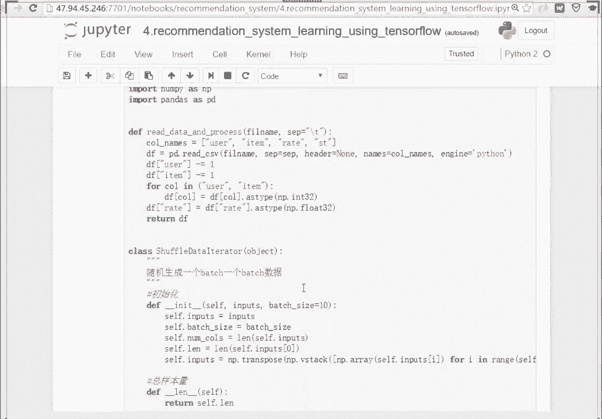

# 人工智能—深度学习公开课（七月在线出品） - P4：TensorFlow推荐系统 🎬

## 概述

在本节课中，我们将学习如何使用TensorFlow构建一个基于矩阵分解的推荐系统。我们将从数据处理开始，逐步搭建模型，并进行训练和评估。整个过程将使用MovieLens数据集作为示例，但您可以将此模板应用于其他格式相似的数据。

## 数据处理 📊

上一节我们介绍了课程目标，本节中我们来看看如何准备数据。推荐系统的数据通常包含用户、物品和评分信息。我们的目标是将其处理成适合神经网络训练的格式。

首先，我们需要读取并处理数据。数据格式通常包括用户ID、物品ID、评分和时间戳。

以下是数据读取与处理函数的核心步骤：

```python
def read_data_and_process(filname):
    # 指定列名
    col_names = ["user", "item", "rate", "st"]
    # 使用pandas读取CSV文件，以制表符分隔，无表头
    df = pd.read_csv(filname, sep="\t", header=None, names=col_names, engine='python')
    # 将用户ID和物品ID转换为从0开始的索引
    df["user"] -= 1
    df["item"] -= 1
    # 转换数据类型
    df["user"] = df["user"].astype(np.int32)
    df["item"] = df["item"].astype(np.int32)
    df["rate"] = df["rate"].astype(np.float32)
    return df
```

接下来，我们需要为模型训练生成批次数据。神经网络通常以批次为单位进行训练，这有助于提高训练效率和模型泛化能力。

以下是用于随机产出训练批次的迭代器类：

```python
class ShuffleDataIterator:
    def __init__(self, inputs, batch_size=10):
        self.inputs = inputs
        self.batch_size = batch_size
        self.num_cols = len(self.inputs)
        self.len = len(self.inputs[0])
        self.inputs = np.transpose(np.vstack([np.array(self.inputs[i]) for i in range(self.num_cols)]))

    def __next__(self):
        # 从所有样本中随机抽取一个批次的下标
        indices = np.random.randint(self.len, size=self.batch_size)
        # 根据下标抽取对应的样本数据
        batch = self.inputs[indices, :]
        return np.hsplit(batch, self.num_cols)
```

对于模型评估，我们需要顺序产出数据，以确保测试集中的每个样本都被评估到。

以下是用于顺序产出评估批次的迭代器类：

```python
class OneEpochDataIterator(ShuffleDataIterator):
    def __init__(self, inputs, batch_size=10):
        super(OneEpochDataIterator, self).__init__(inputs, batch_size=batch_size)
        self.num_batches = self.len // self.batch_size
        if self.len % self.batch_size != 0:
            self.num_batches += 1
        self.batch_idx = 0

    def __next__(self):
        start = self.batch_idx * self.batch_size
        end = min(start + self.batch_size, self.len)
        self.batch_idx += 1
        if self.batch_idx == self.num_batches:
            self.batch_idx = 0
        batch = self.inputs[start:end, :]
        return np.hsplit(batch, self.num_cols)
```

## 模型搭建 🧱

上一节我们处理好了数据，本节中我们来看看如何搭建推荐模型。我们将使用矩阵分解方法，其核心思想是将用户和物品映射到低维向量空间，并通过向量内积来预测评分。

预测评分的公式如下：

**预测评分 = 全局偏置 + 用户偏置 + 物品偏置 + (用户向量 · 物品向量)**

以下是使用TensorFlow搭建该模型的函数：

```python
def inference_svd(user_batch, item_batch, user_num, item_num, dim=5, device="/cpu:0"):
    with tf.device(device):
        # 初始化偏置项
        global_bias = tf.get_variable("global_bias", shape=[])
        w_bias_user = tf.get_variable("embd_bias_user", shape=[user_num])
        w_bias_item = tf.get_variable("embd_bias_item", shape=[item_num])
        # 查找用户和物品的偏置向量
        bias_user = tf.nn.embedding_lookup(w_bias_user, user_batch, name="bias_user")
        bias_item = tf.nn.embedding_lookup(w_bias_item, item_batch, name="bias_item")
        # 初始化用户和物品的嵌入向量
        w_user = tf.get_variable("embd_user", shape=[user_num, dim])
        w_item = tf.get_variable("embd_item", shape=[item_num, dim])
        # 查找用户和物品的嵌入向量
        embd_user = tf.nn.embedding_lookup(w_user, user_batch, name="embedding_user")
        embd_item = tf.nn.embedding_lookup(w_item, item_batch, name="embedding_item")
        # 计算预测评分
        infer = tf.reduce_sum(tf.multiply(embd_user, embd_item), 1)
        infer = tf.add(infer, global_bias)
        infer = tf.add(infer, bias_user)
        infer = tf.add(infer, bias_item, name="svd_inference")
        # 添加L2正则化项
        regularizer = tf.add(tf.nn.l2_loss(embd_user), tf.nn.l2_loss(embd_item), name="svd_regularizer")
    return infer, regularizer
```

模型搭建完成后，我们需要定义损失函数和优化器来训练模型。

以下是定义损失函数和优化器的步骤：

```python
def optimization(infer, regularizer, rate_batch, learning_rate=0.001, reg=0.1, device="/cpu:0"):
    with tf.device(device):
        # 计算L2损失
        cost_l2 = tf.nn.l2_loss(tf.subtract(infer, rate_batch))
        # 总损失 = L2损失 + 正则化项
        penalty = tf.constant(reg, dtype=tf.float32, shape=[], name="l2")
        cost = tf.add(cost_l2, tf.multiply(regularizer, penalty))
        # 使用Adam优化器最小化损失
        train_op = tf.train.AdamOptimizer(learning_rate).minimize(cost)
    return cost, train_op
```

## 模型训练与评估 🚀

上一节我们搭建好了模型，本节中我们来看看如何在实际数据上进行训练和评估。我们将设置训练参数，读取数据，并启动训练循环。

以下是训练过程的核心步骤：

1.  设置超参数，如批次大小、向量维度、迭代轮数等。
2.  读取训练集和测试集数据。
3.  使用之前定义的迭代器产出批次数据。
4.  在TensorFlow会话中运行训练循环，更新模型参数。
5.  定期在测试集上评估模型性能。

训练过程中，我们会监控训练损失和验证损失的变化，以判断模型是否收敛。

## 总结

本节课中我们一起学习了如何使用TensorFlow构建一个简单的推荐系统。我们从数据处理开始，学会了如何读取和批次化数据。然后，我们基于矩阵分解公式搭建了神经网络模型，并定义了损失函数和优化器。最后，我们在实际数据集上完成了模型的训练与评估。




这个模板的核心在于将用户和物品表示为低维向量，并通过向量运算预测评分。您可以将此框架应用于其他具有类似格式的数据集，只需调整数据读取部分即可。通过本课的学习，您应该对使用深度学习框架构建推荐系统有了初步的实践认识。