# 人工智能—深度学习公开课（七月在线出品） - P5：基于序列到序列的深度学习机器翻译系统 🧠➡️🗣️


在本节课中，我们将要学习如何构建一个基于序列到序列（Seq2Seq）架构的深度学习机器翻译系统。我们将从数据处理开始，一步步搭建模型，并完成训练和评估的整个流程。

## 概述 📋

机器翻译是自然语言处理中的核心任务之一。本节课将指导你实现一个基础的神经机器翻译模型。我们将遵循一个清晰的工程流程：首先进行数据预处理，然后构建编码器-解码器模型，接着训练模型，最后评估其翻译效果。

## 第一步：数据预处理与读取 📥

上一节我们介绍了课程目标，本节中我们来看看如何准备数据。数据处理的第一步是将原始文本数据读入程序并进行初步清洗。

我们首先需要从文件中读取中英文句子对。数据文件的格式是每行包含一句英文和一句中文，中间用制表符（`\t`）分隔。

以下是读取数据的步骤：

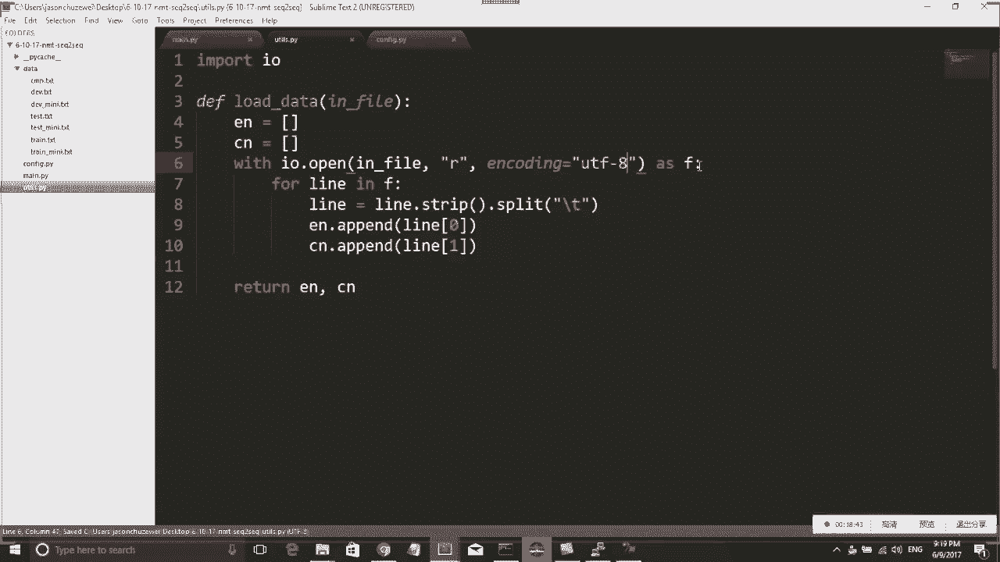

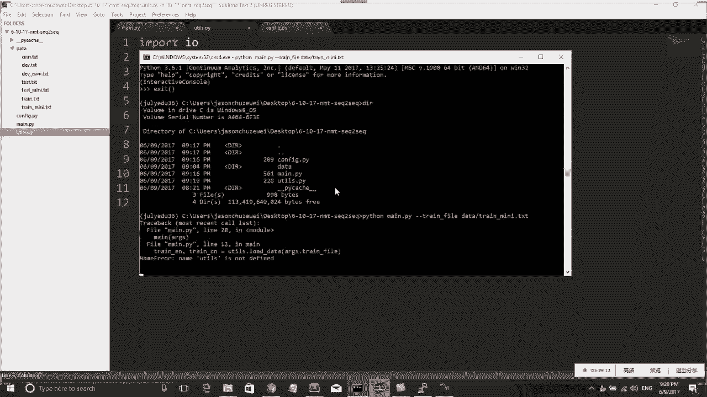

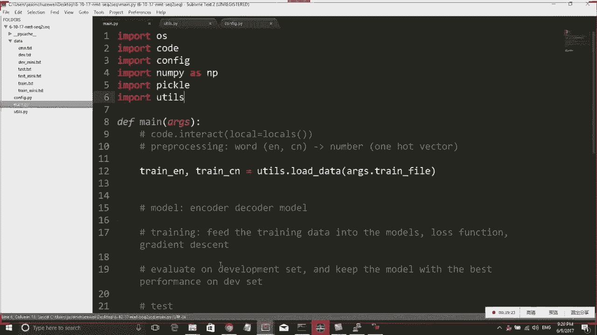

1.  打开数据文件。
2.  逐行读取，并使用制表符分割每一行，得到英文和中文句子。
3.  将句子分别存入英文列表和中文列表。

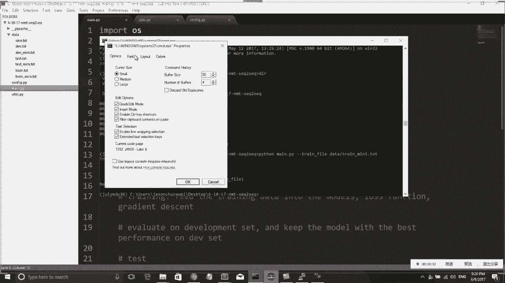

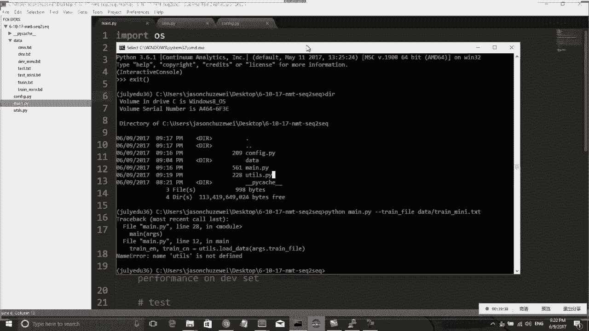

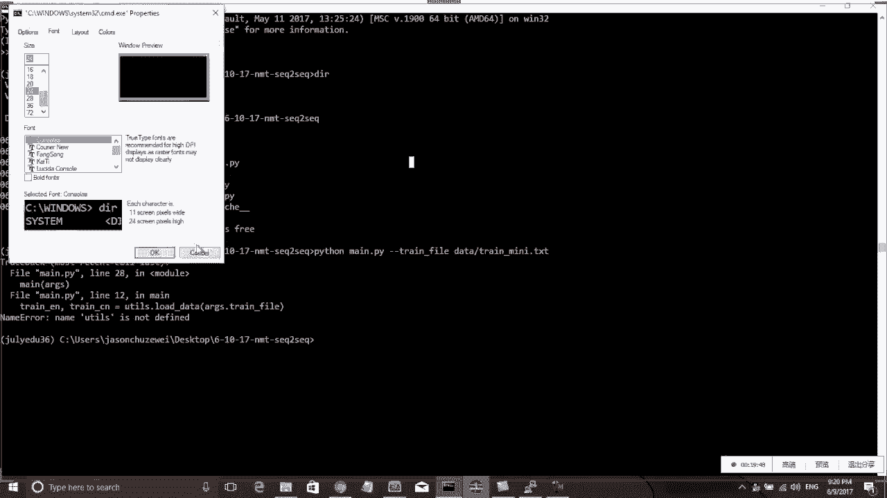

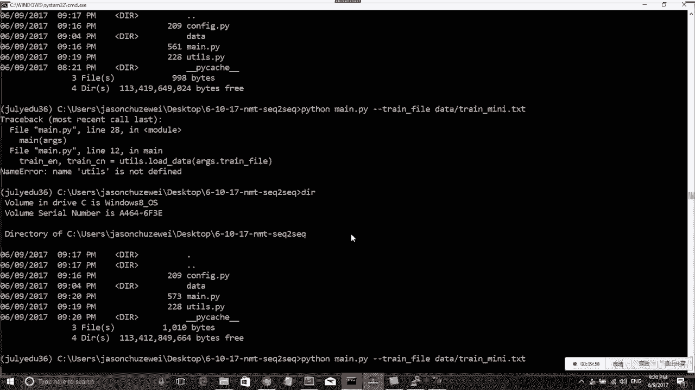

```python
def load_data(in_file):
    english = []
    chinese = []
    with open(in_file, 'r', encoding='utf-8') as f:
        for line in f:
            line = line.strip()
            parts = line.split('\t')
            if len(parts) == 2:
                english.append(parts[0])
                chinese.append(parts[1])
    return english, chinese
```

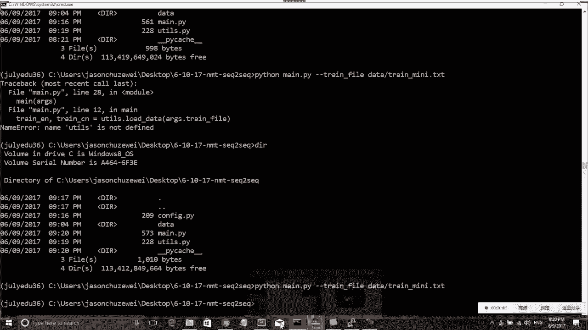

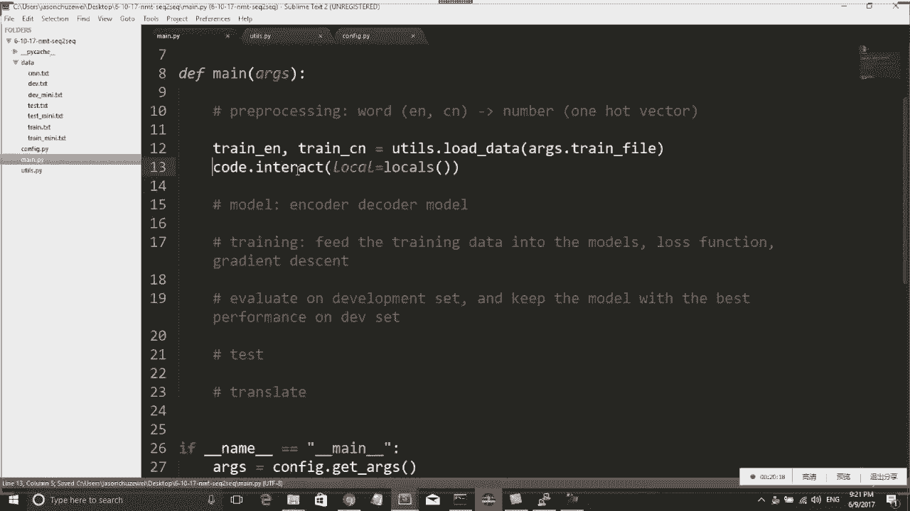

## 第二步：文本分词与特殊标记 ✂️

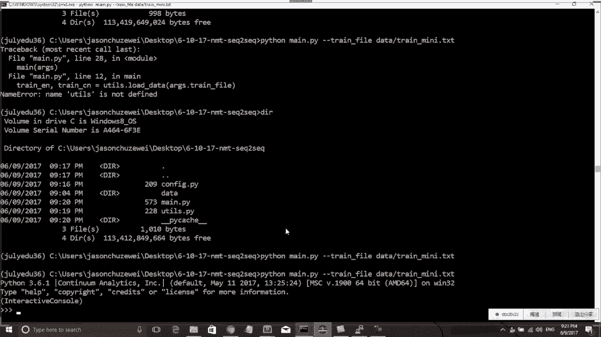

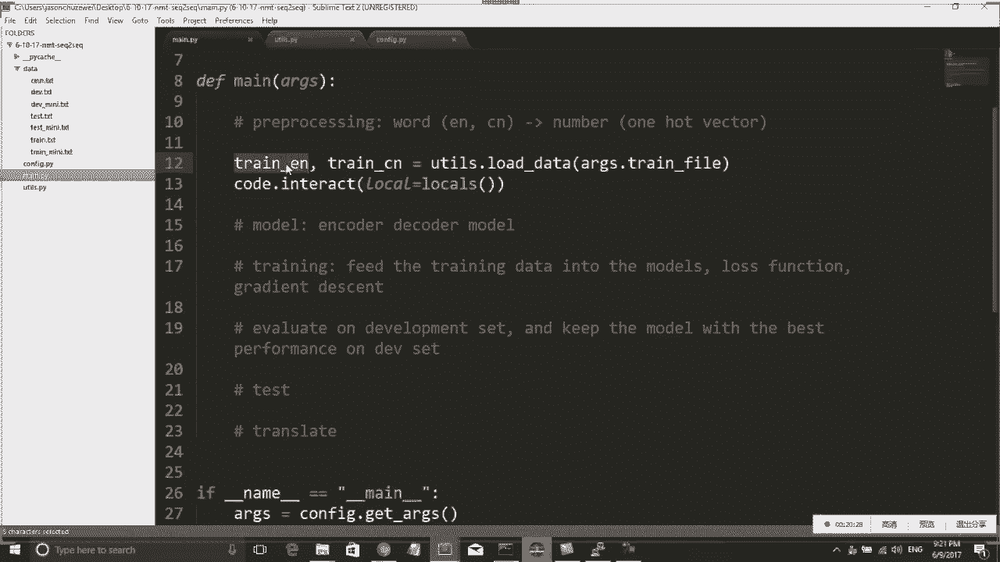

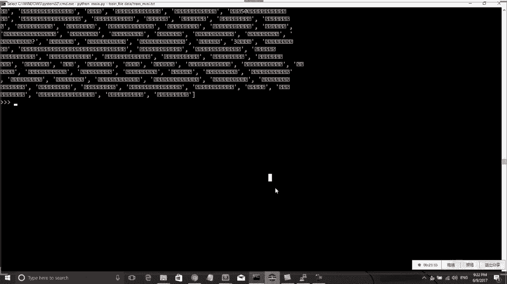

读取原始字符串后，我们需要将句子分解成单词或字符的序列。对于英文，我们使用NLTK库进行分词；对于中文，我们采用按字符分割的简单方式。此外，为了告知模型句子的开始和结束，我们需要在每个序列的开头和结尾添加特殊标记：`BOS`（Begin Of Sentence）和`EOS`（End Of Sentence）。

以下是分词和添加标记的步骤：

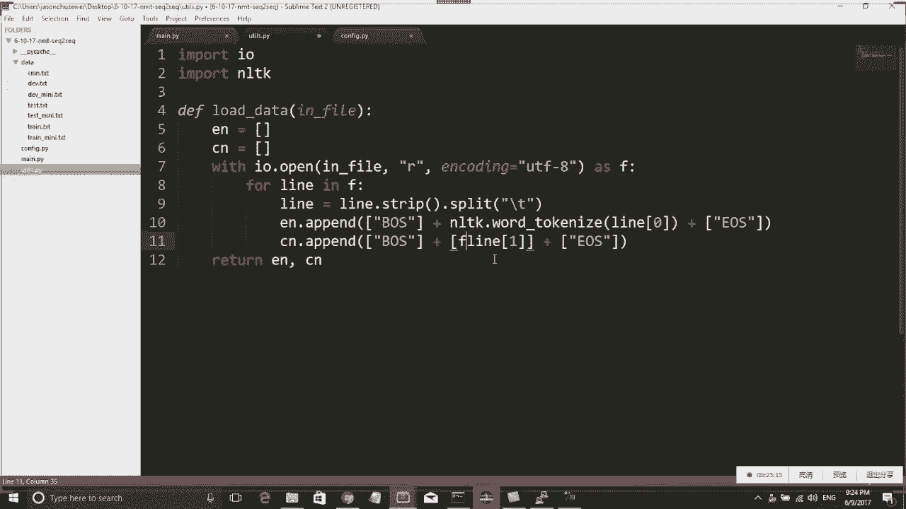

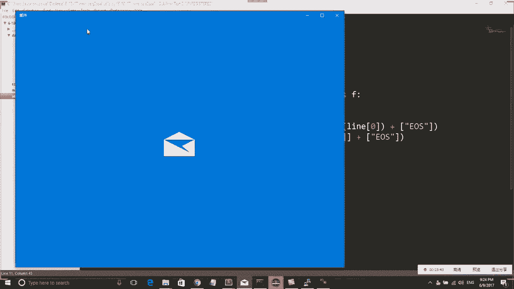

1.  对英文句子使用`word_tokenize`进行分词。
2.  对中文句子按字符进行分割。
3.  在每个序列的开头添加`BOS`标记，结尾添加`EOS`标记。

```python
from nltk.tokenize import word_tokenize

def tokenize_and_tag(english_sentences, chinese_sentences):
    tokenized_en = []
    tokenized_cn = []
    for en_sent, cn_sent in zip(english_sentences, chinese_sentences):
        # 英文分词
        en_words = ['BOS'] + word_tokenize(en_sent.lower()) + ['EOS']
        tokenized_en.append(en_words)
        # 中文按字符分割
        cn_chars = ['BOS'] + list(cn_sent) + ['EOS']
        tokenized_cn.append(cn_chars)
    return tokenized_en, tokenized_cn
```

## 第三步：构建词汇表与数字编码 🔢

模型无法直接处理单词，因此我们需要将单词映射为数字。这需要为英文和中文分别构建一个词汇表（字典）。词汇表记录了每个单词对应的唯一ID。对于训练集中未出现过的单词，我们使用一个特殊的`UNK`（Unknown）标记来表示。

以下是构建词汇表和编码的步骤：

1.  统计所有训练数据中单词的出现频率。
2.  选择出现频率最高的前N个单词构成词汇表，并为每个单词分配一个ID（从1开始）。
3.  将`UNK`标记的ID设为0。
4.  使用构建好的词汇表，将分词后的句子序列转换为对应的数字ID序列。

```python
from collections import Counter

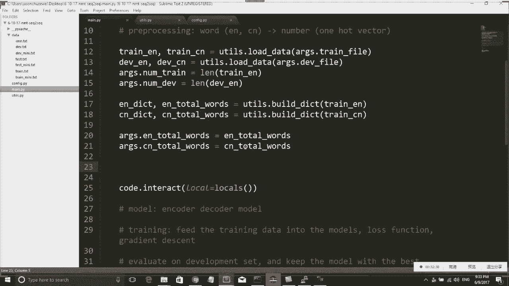

def build_dictionary(tokenized_sentences, max_words=50000):
    word_counts = Counter()
    for sentence in tokenized_sentences:
        for word in sentence:
            word_counts[word] += 1
    # 选择最常见的单词
    most_common_words = word_counts.most_common(max_words)
    # 构建单词到ID的映射
    word_to_id = {'UNK': 0}
    for idx, (word, _) in enumerate(most_common_words):
        word_to_id[word] = idx + 1  # ID从1开始
    return word_to_id, len(most_common_words)

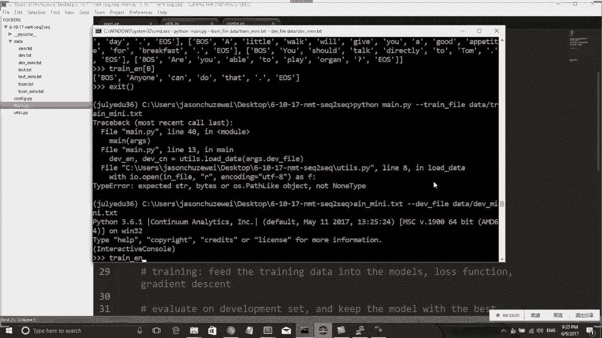

def encode_sentences(tokenized_sentences, word_to_id):
    encoded = []
    for sentence in tokenized_sentences:
        encoded_sent = [word_to_id.get(word, 0) for word in sentence]  # 未知词映射到0
        encoded.append(encoded_sent)
    return encoded
```

## 第四步：数据排序与批处理准备 ⚙️

为了提升训练效率，我们通常将数据按序列长度进行排序。这样，在组成批次（Batch）进行训练时，同一个批次内的句子长度相近，可以减少因填充（Padding）带来的计算浪费。

我们只需根据英文句子的长度（或中文句子长度）对所有句子对进行排序即可。

```python
def sort_data_by_length(encoded_en, encoded_cn):
    # 根据英文句子长度创建索引
    paired_data = list(zip(encoded_en, encoded_cn))
    paired_data.sort(key=lambda x: len(x[0]))
    sorted_en, sorted_cn = zip(*paired_data)
    return list(sorted_en), list(sorted_cn)
```

## 总结 🎯

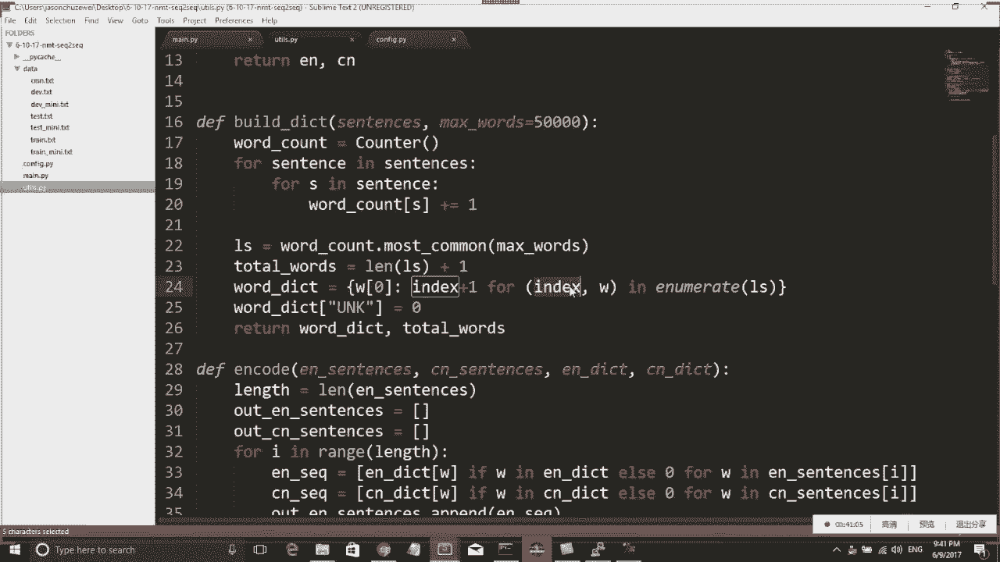


本节课中我们一起学习了构建神经机器翻译系统的数据预处理全流程。我们完成了从读取原始文本、分词、添加特殊标记，到构建词汇表、将文本转换为数字ID，以及为高效训练进行数据排序的关键步骤。这些步骤是为后续模型搭建和训练奠定坚实的数据基础。下一节，我们将利用处理好的数据，开始构建编码器-解码器模型结构。