# 人工智能—计算广告公开课（七月在线出品） - P1：CTR预估技术的演变 🎯


## 概述

在本节课中，我们将学习点击率预估技术的演变历史。我们将从最基础的逻辑回归模型开始，逐步深入到深度学习模型，并探讨在线学习、强化学习等前沿技术。课程将穿插讲解机器学习相关技巧与实践经验，旨在帮助初学者理解CTR预估的核心概念与技术脉络。

---

## 第一章：逻辑回归 📈

上一节我们概述了课程内容，本节中我们来看看CTR预估技术中最基础且经典的模型——逻辑回归。

### 什么是CTR预估？

CTR预估的核心任务是通过用户、物品和上下文信息来预测用户点击某个物品的概率。其数学表示如下：

**公式**：`Y = f(U, I, C)`
其中，`U` 代表用户，`I` 代表物品，`C` 代表上下文。模型的目标是利用这组三元组特征来预估最终的点击结果 `Y`。

### 逻辑回归模型的三要素

学习一个模型，我们需要从三个方面入手：模型本身、损失函数和优化算法。这不仅适用于逻辑回归，也适用于其他机器学习模型。

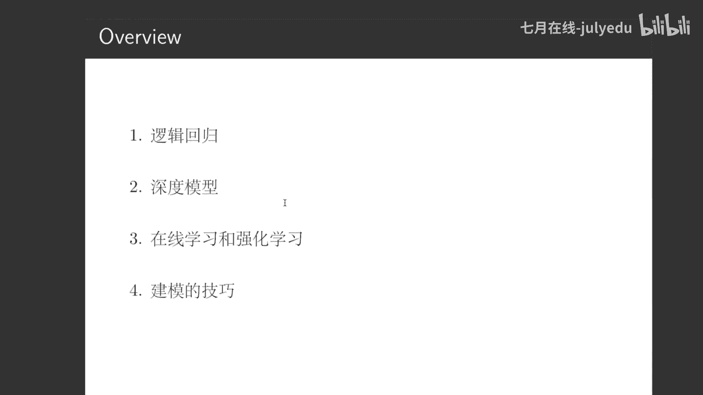

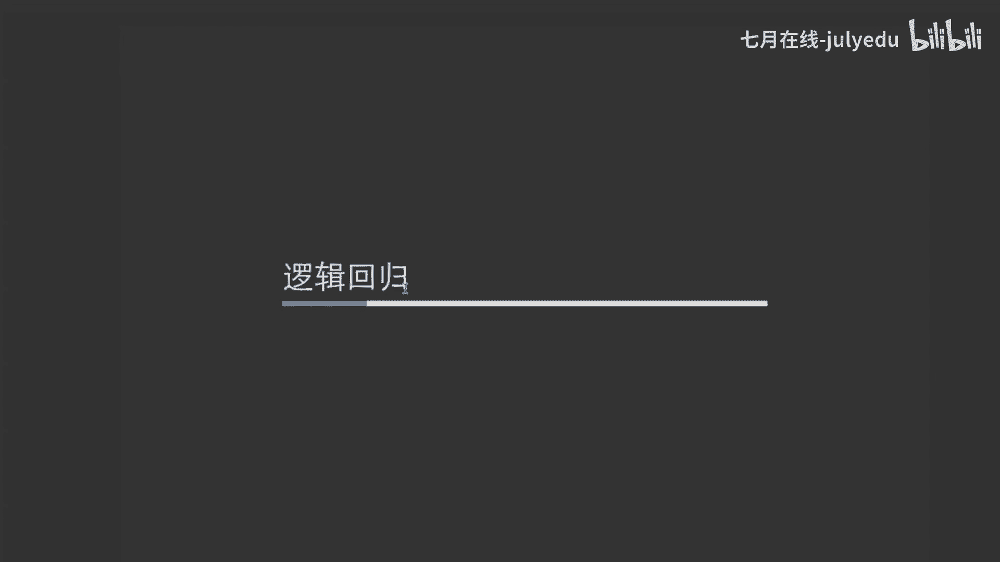

#### 1. 模型

逻辑回归模型的基本形式是一个线性函数外加一个Sigmoid变换，将输出映射到0到1之间，代表点击概率。

**公式**：`f(x) = σ(β^T x)`
其中，`σ` 是Sigmoid函数，`β` 是模型参数，`x` 是特征向量。

#### 2. 损失函数

损失函数定义了模型“好坏”的标准。逻辑回归通常使用交叉熵作为损失函数。

**公式**：`L = -[y log(ŷ) + (1-y) log(1-ŷ)]`
其中，`y` 是真实标签，`ŷ` 是模型预测值。

#### 3. 优化算法

优化算法决定了如何更新模型参数以使损失函数最小化。常见算法包括随机梯度下降和FTRL。

**代码示例（SGD核心思想）**：
```python
# 伪代码
for epoch in range(num_epochs):
    for x, y in dataset:
        gradient = compute_gradient(loss_function, x, y, params)
        params = params - learning_rate * gradient
```

### 逻辑回归的特性与特征工程

逻辑回归属于广义线性模型家族。这类模型对连续特征和特征量纲不一致问题比较敏感。因此，特征工程至关重要，主要包括以下两点：

以下是特征工程的两个核心方向：

1.  **特征离散化**：将连续特征分桶，可以解决特征敏感性、量纲不一致问题，并能实现风险均摊，降低异常值的影响。
2.  **特征组合**：将原始的一阶特征进行组合，生成二阶、三阶等高阶交叉特征，能显著提升模型表达能力。

传统的特征工程依赖人工经验，但存在上限。因此，自动特征组合技术应运而生。

### GBDT + LR：自动特征工程的典范

GBDT+LR模型巧妙地结合了树模型和线性模型，实现了自动特征离散化与组合。

**流程简述**：
1.  首先，用GBDT模型在训练集上训练多棵决策树。
2.  然后将每个样本输入到训练好的GBDT中，样本会落入每棵树的某个叶子节点。
3.  接着，将样本在所有树上的叶子节点位置进行One-Hot编码，生成一个高维稀疏的离散特征向量。
4.  最后，将这个稀疏特征向量作为逻辑回归模型的输入进行训练。

**为什么有效？**
*   **对GBDT**：它擅长处理连续特征，通过树的分裂过程自动进行了特征组合与离散化。
*   **对LR**：LR模型擅长处理GBDT输出的离散化特征。两者结合，GBDT充当了强大的特征转换器，LR则负责最终的精准预测。

---

## 第二章：深度模型 🧠

上一节我们介绍了基于特征工程的经典逻辑回归模型，本节中我们来看看如何利用深度学习模型来进一步提升CTR预估的性能。

### 深度学习为何有效？

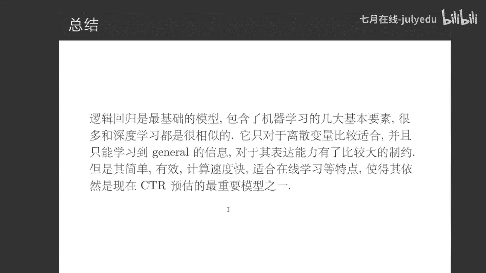

深度学习近几年在CTR预估中广泛应用，主要得益于两点：
1.  **数据量的爆发**：深度学习模型参数多、VC维高，需要海量数据才能充分训练，避免欠拟合。
2.  **算力的提升**：GPU、TPU等专用硬件的发展，使得训练复杂的深度神经网络成为可能。

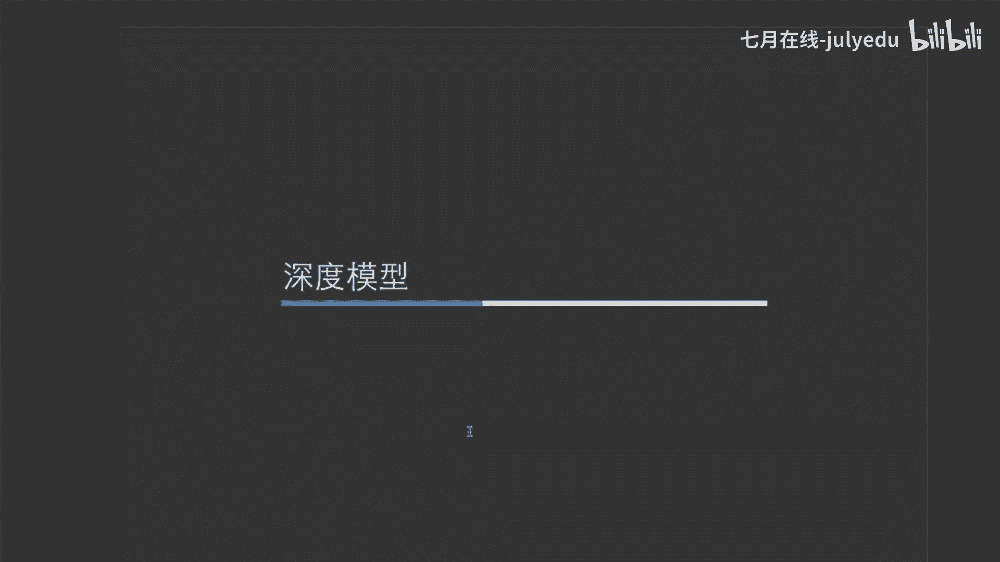

### 深度CTR模型的两条演进路线

深度CTR模型的发展主要沿两条主线展开：
1.  **模型复杂化路线**：从FM模型出发，不断引入更复杂的网络结构。
2.  **业务场景化路线**：从Embedding+MLP基础架构出发，结合具体业务场景进行优化。

#### 起点一：因子分解机

FM模型通过矩阵分解技术，解决了特征稀疏场景下的二阶特征组合问题。

**公式**：`ŷ = w₀ + Σ w_i x_i + Σ Σ <v_i, v_j> x_i x_j`
其中，`<v_i, v_j>` 代表特征向量的内积，通过低维稠密向量 `v` 的学习来刻画特征间交互。

从神经网络视角看，FM可以理解为对离散特征进行**嵌入**，然后对嵌入向量进行内积交互。

#### 核心概念：Embedding

Embedding的本质是一种映射，将高维稀疏的离散特征向量，转换为低维稠密的连续特征向量。
*   **数学上**：是从一个向量空间到另一个向量空间的映射。
*   **神经网络上**：对应网络中的一层权重矩阵。
*   **特征工程上**：是特征的一种新的、更高效的表示方式。

#### 起点二：Embedding + MLP

这是深度CTR模型最基础的架构。先将所有特征通过Embedding层映射为稠密向量，然后拼接起来，输入到多层感知机中进行深层特征交互与预测。

#### 里程碑：Wide & Deep 模型

Google提出的Wide & Deep模型是CTR预估领域的里程碑。它并行了两个部分：
*   **Wide部分**：简单的线性模型，处理稀疏特征，擅长记忆。
*   **Deep部分**：深度神经网络，处理稠密特征，擅长泛化。

两部分联合训练，兼具记忆与泛化能力。该框架简单有效，易于扩展，后续很多模型都是在其基础上的变体。

#### 前沿模型探索

近年来，业界提出了许多针对特定业务场景的深度模型：
*   **DIN**：引入注意力机制，用于处理用户历史行为序列，更好地捕捉与当前候选商品相关的行为。
*   **ESMM**：通过多任务学习，联合训练CTR和CVR任务，解决了CVR任务样本稀疏的难题。

---

## 第三章：在线学习与强化学习 ⚡

上一节我们探讨了复杂的深度模型，本节中我们来看看如何让模型“动起来”，实现实时更新与智能决策。

### 模型提升的关键

在实践中，提升模型效果主要依赖三个方面：
1.  **业务理解**：准确地将业务问题抽象为数学模型。
2.  **特征工程**：挖掘更精准的特征，包括实时特征。
3.  **特征与模型实时化**：即在线学习与强化学习。

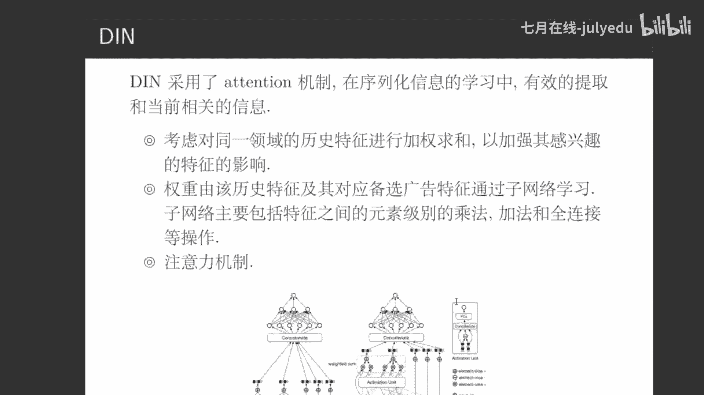

### 在线学习

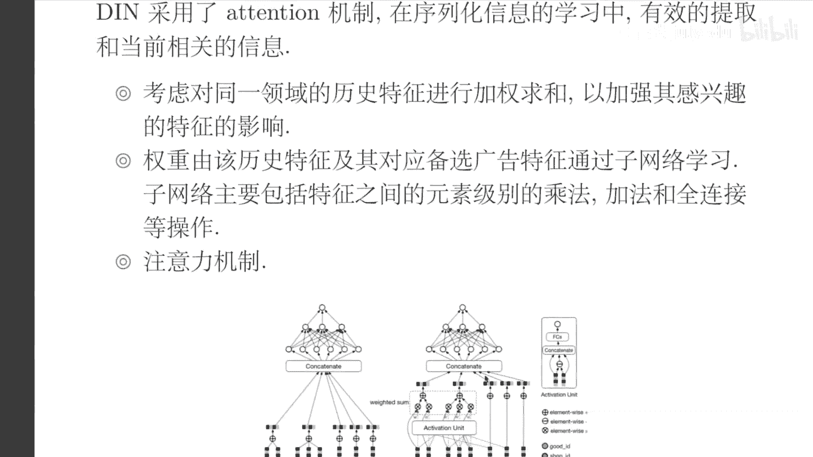

在线学习意味着模型能够实时地利用新产生的数据更新自身。

**在线学习的价值**：
*   **引入实时信息**：如当前时间、用户实时行为。
*   **快速学习新特征**：新广告上线后能快速积累有效特征。
*   **更新统计信息**：使上下文统计特征更准确。

**在线学习的挑战**：
1.  **流式计算引擎**：需要高性能、高可用的实时数据处理平台。
2.  **样本处理**：涉及时间窗口、样本拼接、过滤与采样等。
3.  **更新与评估逻辑**：模型如何在线更新，以及如何在线评估效果。
4.  **优化算法**：需采用适合在线场景的算法，如FTRL。

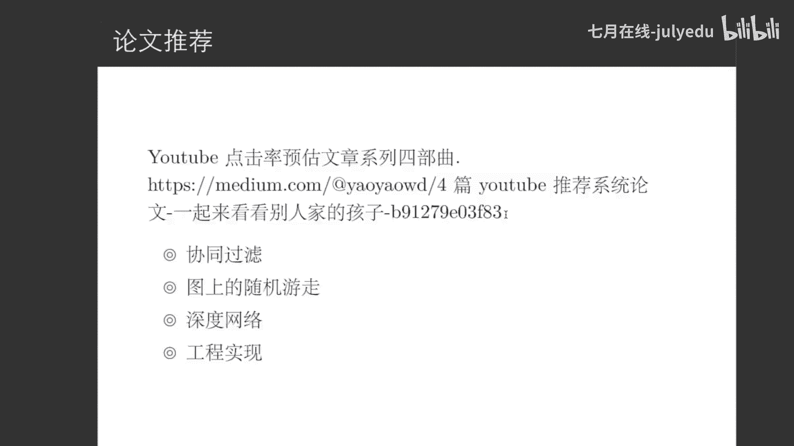

### 强化学习

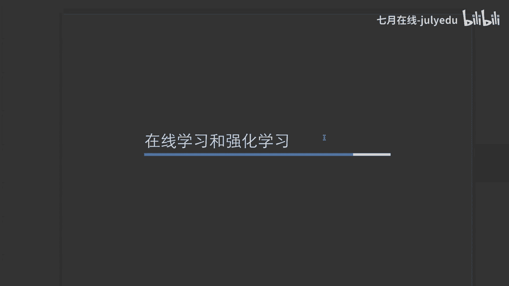

强化学习让智能体通过与环境的动态交互来学习最优策略，更贴近人类学习方式。

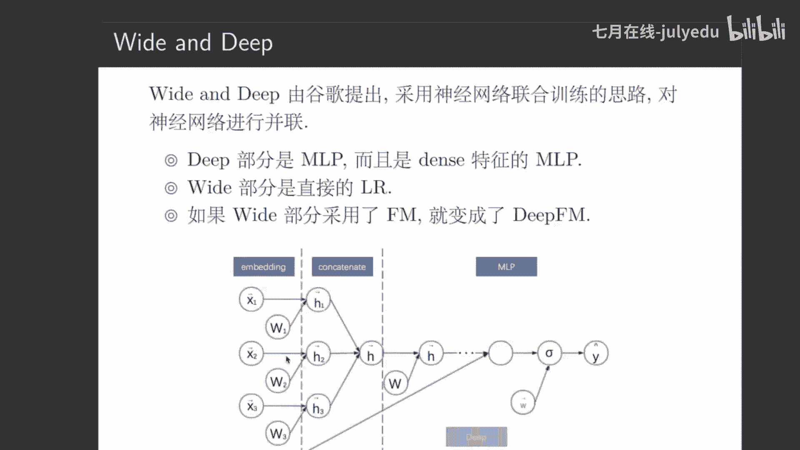

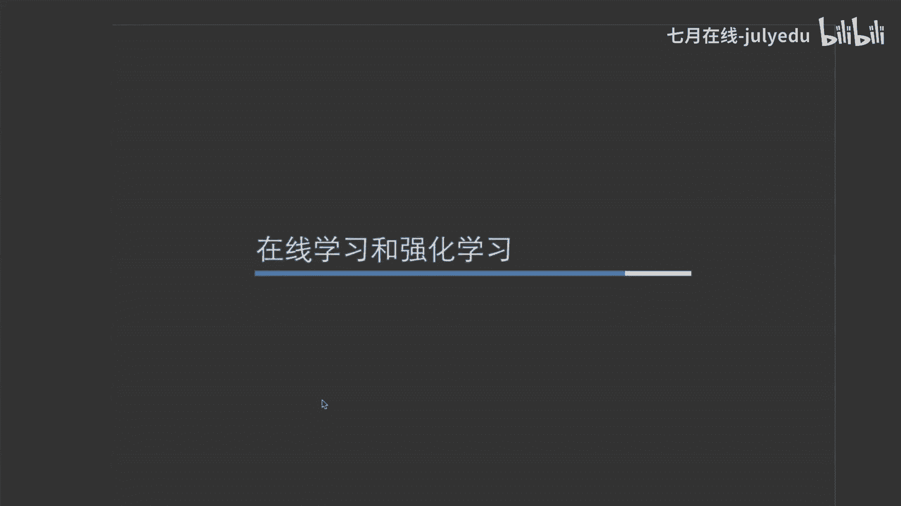

**在广告中的应用**：
1.  **多臂老虎机**：解决探索与利用的平衡，适用于简单选择场景。
2.  **上下文老虎机**：在考虑用户上下文信息的情况下进行决策。
3.  **深度强化学习**：结合深度学习的强大感知能力，处理更复杂的状态和动作空间，是未来的重要方向。

---

## 第四章：建模技巧与总结 🛠️

在本节课的最后，我们简要探讨一些CTR预估中的实用建模技巧，并对全课内容进行总结。

### 常见问题与技巧

在CTR预估的实践中，会遇到许多具体问题：

以下是几个典型的建模挑战：

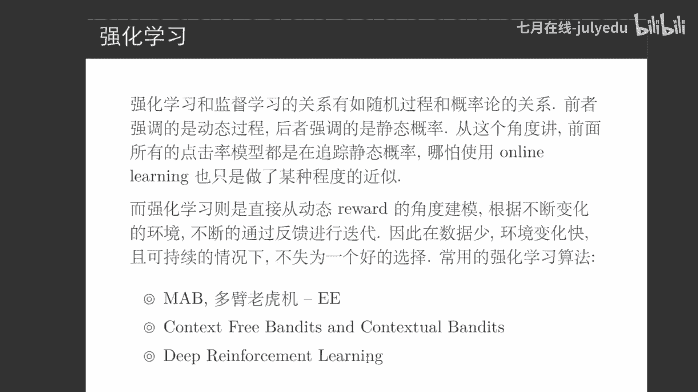

1.  **冷启动问题**：新广告或新用户缺乏历史数据。在线学习可以部分缓解，但非万能。
2.  **召回与精排的平衡**：召回阶段追求性能与覆盖率，精排阶段追求精准度，需要权衡。
3.  **评估指标**：AUC并非永远是最佳指标。在关注精确率或召回率的场景下，需选择更合适的评估体系。
4.  **平滑技术**：对于数据稀疏的样本（如新广告），其统计指标（如点击率）不可靠，需要进行平滑处理。
5.  **平台利益平衡**：在计算广告体系中，需要设计机制平衡用户体验、广告主利益和平台收益。

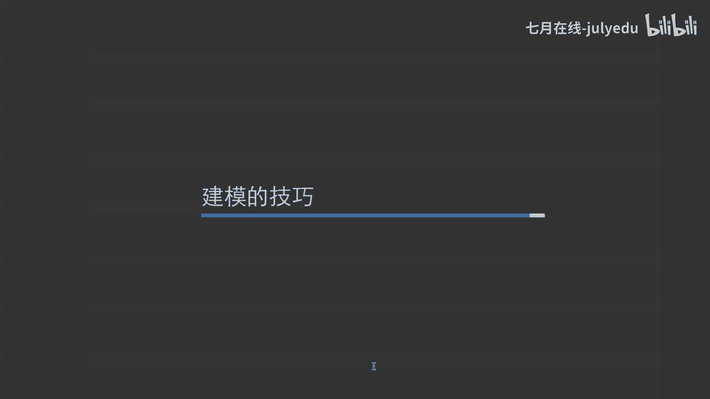

### 总结

本节课我们一起学习了CTR预估技术的完整演变历程：

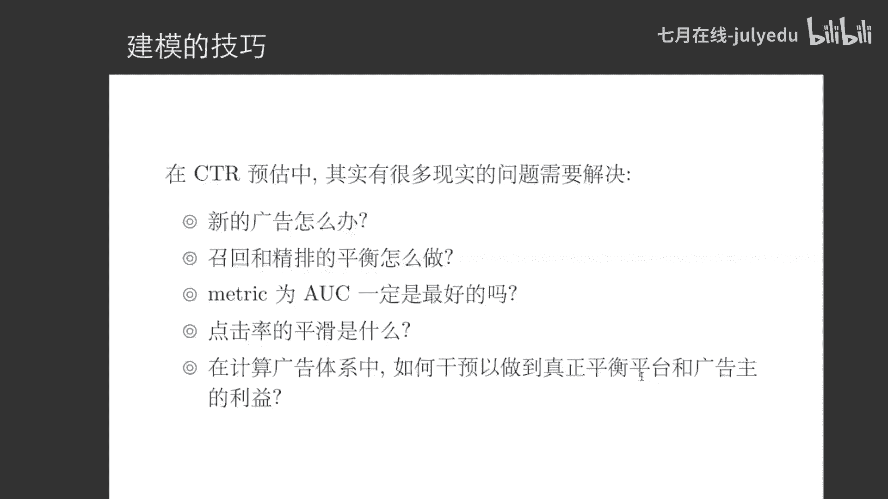

1.  **逻辑回归**：作为基石，我们理解了模型、损失函数、优化算法三位一体的建模方法论，以及特征工程（离散化、组合）的核心重要性。
2.  **深度模型**：我们从FM和Embedding+MLP出发，看到了模型如何通过复杂化和业务场景化两条路径演进，最终形成了如Wide & Deep这样兼具记忆与泛化能力的强大架构。
3.  **在线学习与强化学习**：我们探讨了让模型实时进化以及与环境智能交互的前沿技术，这是提升模型效果和适应性的关键。
4.  **建模技巧**：我们认识到，除了模型本身，对业务的理解、对数据的处理以及对系统各方面的权衡，同样是成功构建CTR预估系统的关键。


CTR预估技术仍在快速发展，希望本课程能为你打开这扇大门，助你在计算广告与推荐系统的领域继续深入探索。