# 🧠 人工智能—计算广告公开课（七月在线出品） - P2：计算广告的市场与技术

## 📖 课程概述

在本节课中，我们将要学习计算广告的核心概念、市场背景与技术体系。我们将从在线广告的基本定义出发，逐步深入探讨计算广告的三种主要产品形态（合约广告、竞价广告、程序化交易广告），并了解其背后的技术架构、核心算法（如点击率预估）以及在线分配等关键问题。

---

## 🏛️ 第一部分：计算广告的产品与发展简史

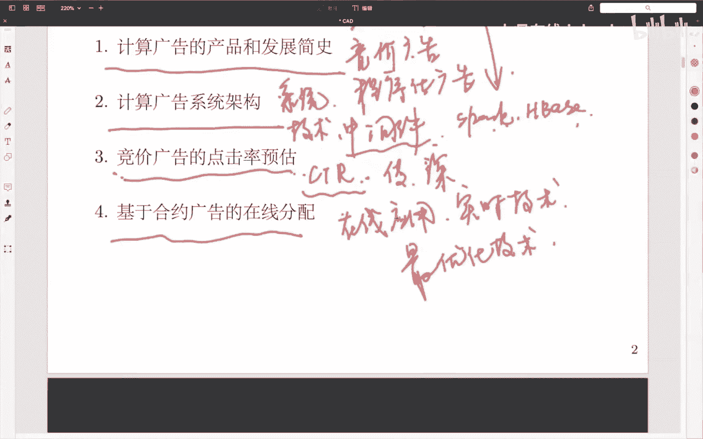

计算广告是一种在线广告形式。首先需要了解什么是在线广告。在线广告，顾名思义，就是网络广告或互联网广告，直接在媒体上投放广告。

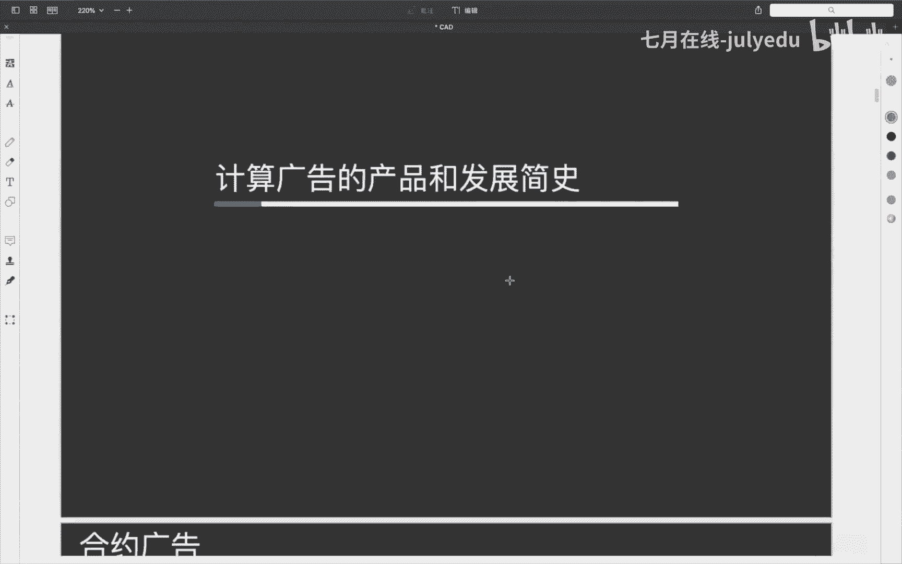

虽然“在线广告”这个名字可能有些陌生，但它的表现形式大家应该很熟悉。例如，在浏览网站时，底部出现的淘宝推广链接；或者在淘宝、京东购物时，看到的站内推荐链接。这些广告都是计算广告，也就是在线广告。再比如，使用百度或谷歌搜索引擎时，搜索结果最上方经常出现的广告。这些都属于互联网广告。

接下来，我们讨论在线广告与传统广告的不同。传统广告类似于街上发传单或在电视上播放的广告，我们称之为传统广告。在线广告则基于互联网技术，在过去一二十年里逐渐衍生和发展出一套新体系。计算广告是在线广告基础上的进一步发展，通过将机器学习、计算等技术应用到广告领域，为平台方和广告主带来更多收益。

这里提到了两个关键名词：**平台方**和**广告主**。广告主是投放广告的人，平台方是提供广告投放渠道的地方。例如，百度上展示了一家医院的广告，那么这家医院就是广告主，百度就是平台方。平台方有时也称为**媒体**。此外，还有**用户**，即看广告的人。我们自己就是用户。这样就形成了计算广告的三方体系：平台方、广告主和用户。本课程将主要在平台方和广告主之间展开讨论。

本公开课主要从四个方面分享计算广告的技术：
1.  **计算广告的产品和发展简史**：讲解合约广告、竞价广告和程序化交易广告的特点、涉及的技术以及发展历程。
2.  **计算广告的系统架构**：讨论计算广告的整体系统架构（系统架构大图）以及涉及的具体技术和中间件。
3.  **计算广告的点击率预估**：讨论CTR预估的基本技术，从传统机器学习算法和深度学习算法中各挑例子进行讲解。CTR预估是目前竞价广告和程序化广告中最重要的技术，也是机器学习发挥作用最大的地方。
4.  **基于合约广告的在线分配**：讲解在线应用、实时技术以及最优化技术。

---

### 📜 合约广告

首先介绍的是合约广告。顾名思义，合约广告是广告主与平台签订合约。合约内容一般是：广告主在平台的特定位置展示其广告创意。典型的例子是视频广告，例如优酷在百度上投放推广视频。通常，合约会以展示次数作为最终计费条件。

广告可以分为三个阶段：**曝光**、**点击**和**转化**。
*   **曝光**：广告投放在平台上，被展示出来，就是一次曝光。
*   **点击**：用户对广告感兴趣并点击进去。
*   **转化**：用户点击后，在广告主网站发生购买或其他行为，成为网站用户。

合约广告一般是针对**曝光**进行计费的，即只要展示了广告就计费。这种付费方式称为**CPM**。CPM的意义在于关注长期价值和流量价值。例如，优酷在百度投广告，更看重的是通过百度吸引更多用户进入优酷网站浏览，产生流量效应，而不是用户具体看了什么内容。因此，当点击收益不大，而更考虑长期价值和流量价值时，通常会使用合约广告。

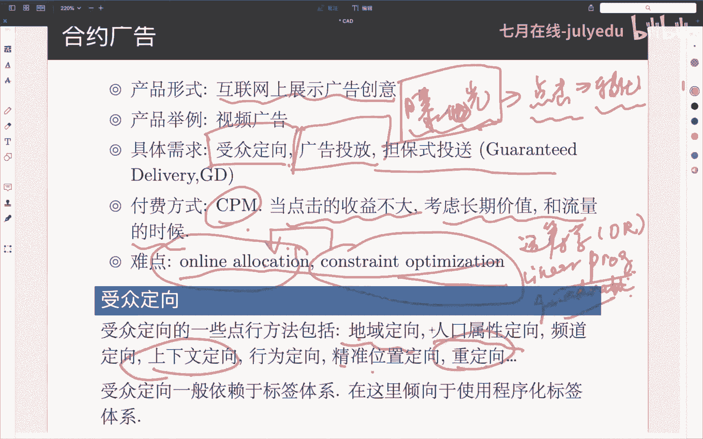

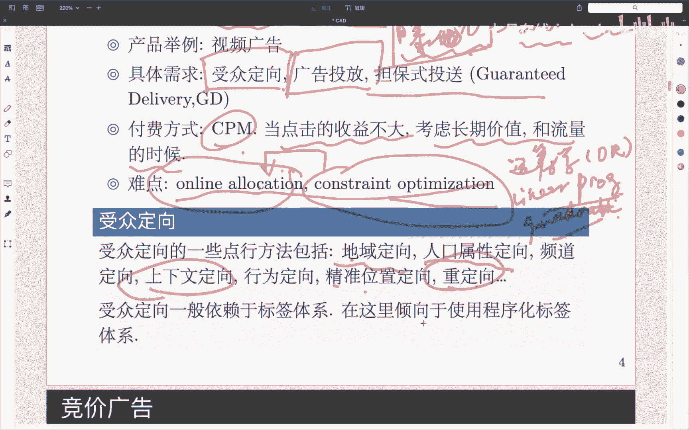

合约广告的投放方式通常涉及以下需求：
1.  **受众定向**：广告主会圈定一部分目标人群进行投放，这部分技术称为受众定向。广告主会告诉平台他们想圈定哪类人群。
2.  **投放**：将广告投放到具体每个人的视角上，确保有人能看到。
3.  **担保式投送**：广告主可能对广告投放的数量或其他指标有要求，例如保证至少达到1000万次的投放量。这引出了合约广告的技术难点。

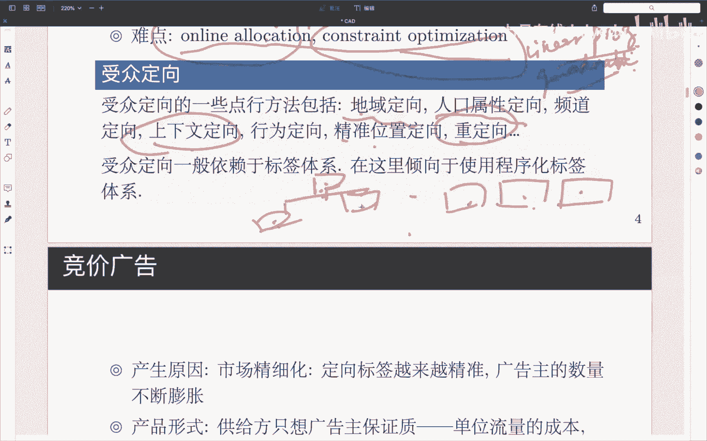

合约广告的技术难点在于：
1.  **在线分配**：平台流量很难精确预估。平台需要实时、动态地分配流量给不同的广告主，以满足他们的担保要求，同时保持整体均衡。例如，前一个小时投放过多，下一个小时就需要减少投放。
2.  **受限最优化**：当多个广告主竞争同一人群的流量时，如何保证每个广告主都能达到满足的量级，并使整体效果最优？这是一个受限最优化问题，通常与在线分配结合解决。业界常用运筹学、线性规划、二次优化等技术进行计算。

---

#### 🎯 受众定向小知识

广告主如何进行受众定向？广告主通常拥有用户信息，这些信息可能是自己总结的，也可能是平台方提供的（在合约广告中通常是平台方提供）。典型的受众定向方法包括：
*   地域定向（如只投给北京市的人）
*   人群属性定向（如只投给青年人）
*   频道定向
*   上下文定向
*   行为定向
*   精准位置定向
*   重定向

这里重点解释两个概念：
*   **上下文定向**：根据当前系统请求的状态来决定广告投放给谁的过滤条件。这是一个动态标签，例如根据用户实时的地理位置信息决策。
*   **重定向**：广告主对曾经在其平台有过行为（如购买）的用户进行重点投放，希望他们再次光顾。

受众定向依赖于标签体系。在合约广告中，通常由广告主维护。标签体系一般有两种：
1.  **结构化标签**：具有上下级从属关系的标签。
2.  **平行化标签**：各个标签之间没有严格的从属或互斥关系。

合约广告更倾向于使用具有上下级关系的结构化标签。

**总结**：合约广告的核心是按曝光计费，原因在于考虑长期和流量价值。其难点在于在线分配和受限最优化问题。

---

### ⚖️ 竞价广告

随着市场精细化程度提高、需要更精准的定向标签、以及广告主数量不断膨胀，广告技术从合约广告进化到了**竞价广告**。与合约广告最大的区别在于，竞价广告不再保证流量，而是保护单位流量的成本，更关注引流效果。此时，计费方式从按曝光计费转变为按**点击**计费，即**CPC**。

典型的例子是**搜索广告**，例如百度搜索结果上方的广告。搜索广告是竞价广告的典型代表，因为用户搜索时目的性强，平台能结合用户信息和广告主标签进行更精准的投放。

竞价广告的具体需求包括：
1.  **精准人群定向**：通过用户信息、上下文特征、广告主沉淀的用户画像等进行精准投放。
2.  **竞价机制**：由于广告主数量多且不保量，平台需要决定广告的排序。常用的排序公式是 **ECPM = CTR × Bid**。
    *   **CTR** 是点击率，由平台方预估。
    *   **Bid** 是广告主愿意出的价格，由广告主设定。
    平台的目标是最大化ECPM。广告主之间因此存在竞价。目前应用最广的竞价机制是**广义第二高价**。例如，两个广告主竞价，一个出价100元，一个出价200元。出价200元的广告主获胜，但他实际支付的价格是第二高的出价（即100元）加上一个很小的单位（如0.01元）。

竞价广告的难点在于平台方的**CTR预估**。CTR预估的准确性直接关系到平台的收益（ECPM），因此是机器学习应用最广泛的领域之一。

---

### 🔄 程序化交易广告（实时竞价）

从竞价广告中又发现了新的问题：出价逻辑过于封闭，无法实时调整，也无法自主选择流量。例如，广告主可能发现给北京人投100元不合适，希望根据不同人的情况动态调整出价。这就产生了**实时竞价**。

实时竞价的产品形式是：每次广告展示时都实时出价。与传统竞价广告不同，在实时竞价中，平台方（SSP）会将竞价请求发送给广告交易平台（ADX），ADX再向各个需求方平台（DSP，即广告主端）发起实时竞价。每个DSP根据当前广告位信息，实时决定是否出价以及出价多少，然后返回给ADX和SSP，最终由平台方决定展示哪个广告。

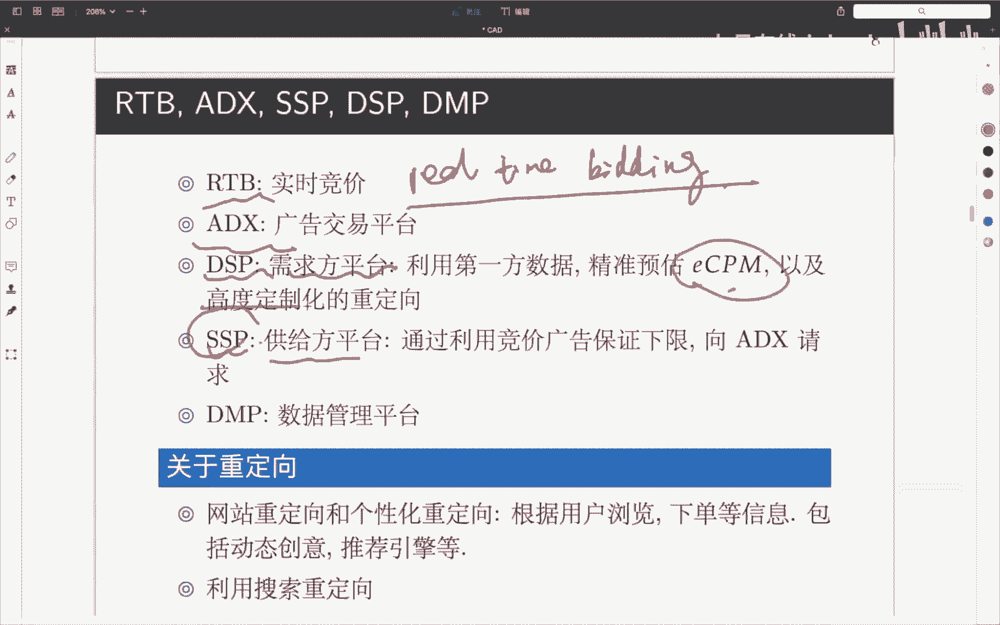

实时竞价的需求同样是精准人群定向，但竞价机制变成了实时竞价。计费方式也是CPC。其难点在于**需求方的精准定价**，即广告主（DSP）需要更精准地预估自己的转化率和出价。

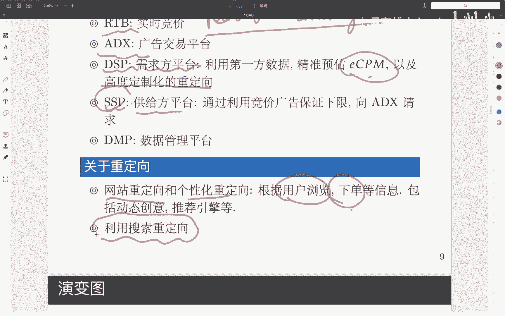

---

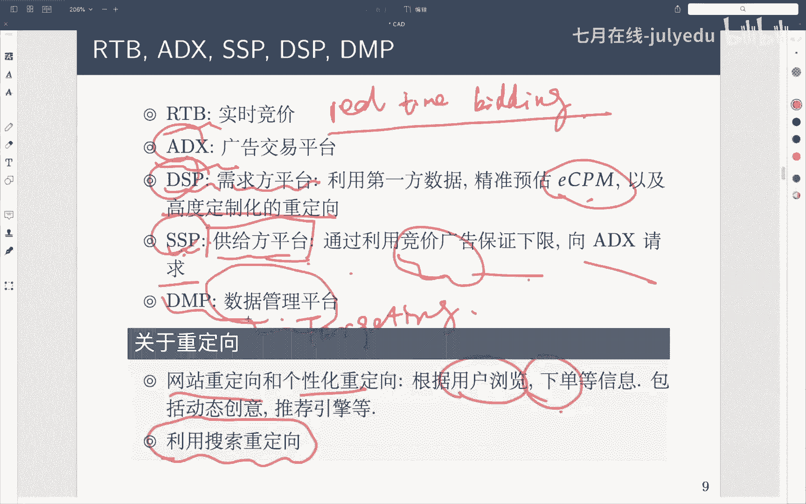

#### 🏢 需求方层级组织

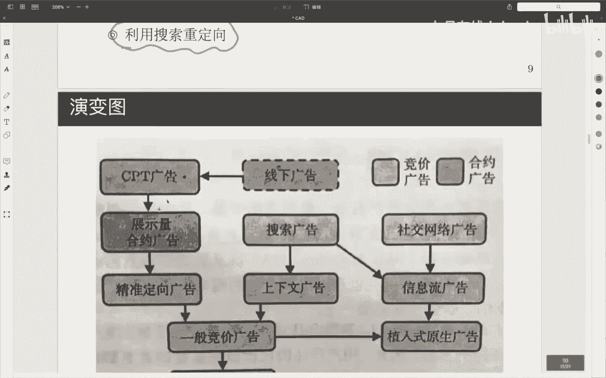

需求方的广告组织一般分为三个层级：
1.  **广告计划**：一次广告的合同，例如推广“步步高手机”这个产品。
2.  **广告组**：具体的投放策略，例如针对年轻人或在百度平台投放。
3.  **广告创意**：具体的广告内容，如针对男性和女性设计的不同图片、标题、文案等。

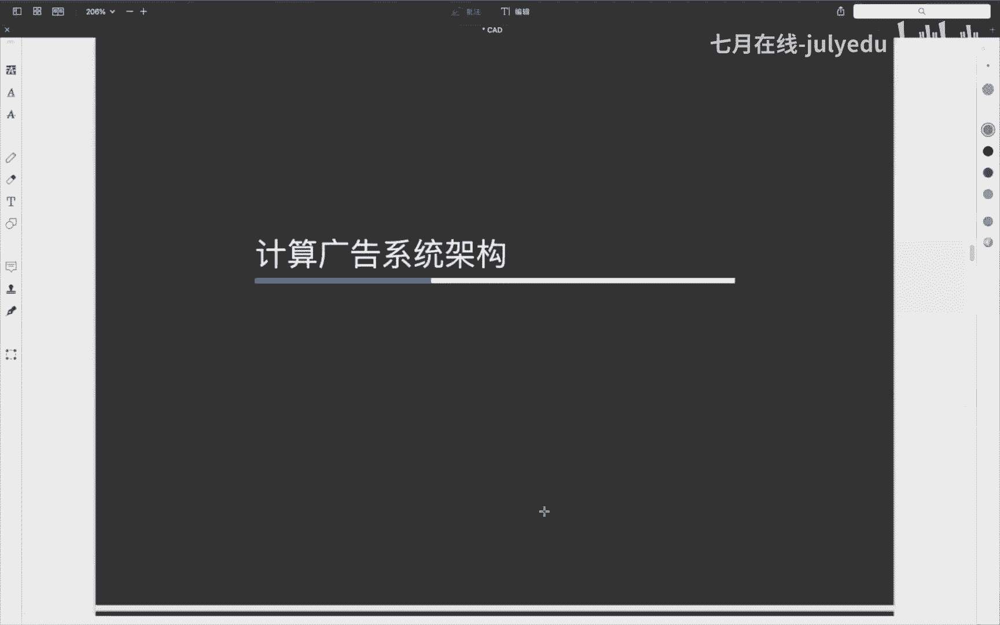

---

#### 🔍 再谈搜索广告

搜索广告是最常见的竞价广告形式。
*   **查询扩展**：平台会根据搜索关键词进行扩展匹配，如精准匹配、短语匹配、模糊匹配、否定匹配等。
*   **广告位**：一般分为北区（搜索结果上方）、南区（搜索结果下方）和东区（搜索结果右侧）。北区价格通常最高。
*   **ECPM计算**：依然是 **CTR × Bid**。

---

#### 📊 竞价广告 vs. 合约广告

1.  **更精细的人群定向**：竞价广告可以利用平台方更精细的用户数据（如兴趣标签），而不仅是广告主提供的粗略标签。
2.  **中小广告主成为主流**：竞价广告降低了投放门槛。
3.  **数据为核心的产品体系**：CTR预估完全由平台方通过数据分析、模型优化来主导。

---

#### 📚 相关术语详解

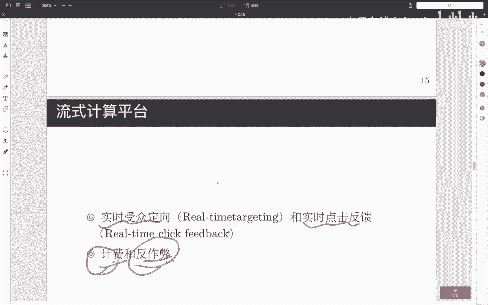

*   **RTB**：实时竞价。
*   **ADX**：广告交易平台，连接SSP和多个DSP。
*   **DSP**：需求方平台，代表广告主利益，进行精准出价。
*   **SSP**：供给方平台，代表媒体（平台方）利益，管理广告位。
*   **重定向技术**：根据用户在网站的行为（浏览、下单）进行定向投放，是计算广告中的重要技术。
*   **DMP**：数据管理平台，管理人群标签等数据。

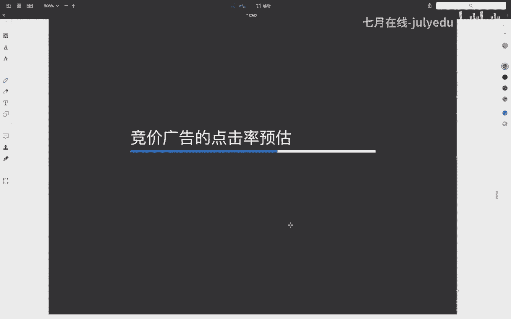

---

#### 🗺️ 广告演变图总结

广告发展脉络可概括为：线下广告 → 合约广告（展示量担保）→ 精准定向广告 → 竞价广告。同时，搜索广告的蓬勃发展也推动了上下文广告的发展，最终汇入一般竞价广告，并进一步实时化，发展为程序化交易广告（实时竞价广告）。

---

## 🏗️ 第二部分：计算广告的系统架构

计算广告的系统架构通常包含以下几个核心部分：

1.  **分布式计算平台**：负责核心计算任务，如点击率建模、在线流量分配等。
2.  **广告投放机**：线上服务系统，处理广告请求，负责广告的召回、排序、ECPM计算和收益管理。
    *   **召回**：从海量广告中快速筛选出少量候选广告。分为业务召回（根据规则过滤）和算法召回（如向量召回）。
    *   **排序**：对召回结果进行精细排序，常用深度学习模型。之后可能还有基于收益管理和在线分配的重排序环节。
3.  **数据高速公路**：负责实时将日志数据推送到流计算平台，并打通离线和在线数据，提供一致的开发体系。
4.  **流式计算平台**：处理实时数据，包括实时受众定向、实时点击反馈、构造实时特征，以及计费、反作弊等业务逻辑。

相关软件与中间件包括：Hadoop（大数据存储计算）、Kafka（日志消息队列）、Spark（分布式计算引擎）、Storm/Flink（流计算引擎）、Redis（缓存）、Elasticsearch（搜索）等。

---

## 📈 第三部分：计算广告的点击率预估

CTR预估是互联网公司进行流量分配的核心依据，对于平台、用户和广告主三方都至关重要。它直接关系到平台的收入，因此是机器学习最重要的应用领域之一。

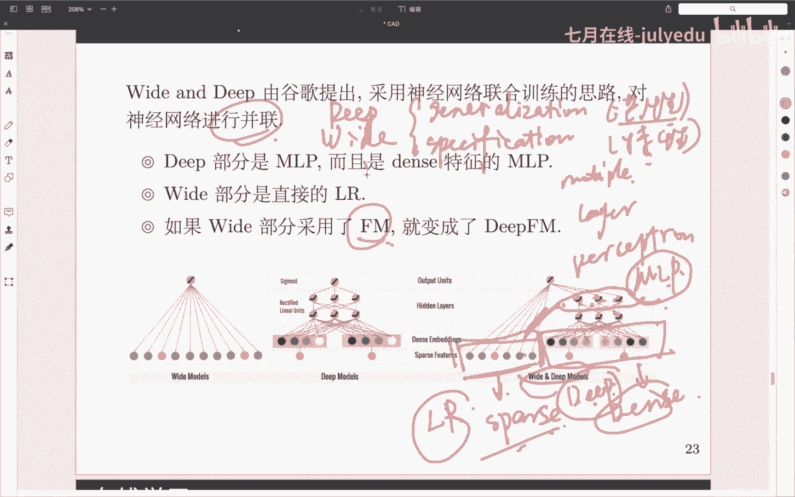

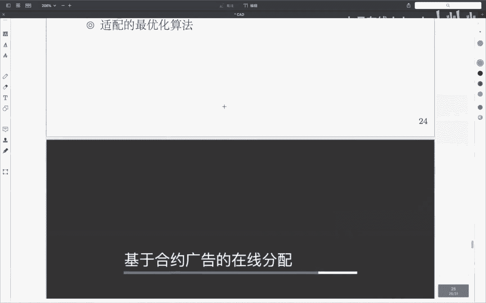

CTR预估问题可以形式化为：给定用户`U`、物品（广告）`I`、上下文`C`，预测点击结果`Y`（0或1）。特征来自离线特征（用户画像）和实时特征（如近期点击率），标签来自系统日志。

---

### 🤖 传统机器学习算法：逻辑回归

逻辑回归是广义线性模型，适用于离散特征。其模型公式为：
`P(Y=1) = σ(β^T X)`
其中`σ`是Sigmoid函数，将线性结果映射到(0,1)区间。

逻辑回归模型简单，但需要复杂的特征工程，如特征离散化、二阶特征组合等。也有自动特征组合方法，如GBDT+LR。逻辑回归是计算广告领域最基础且重要的模型之一。

---

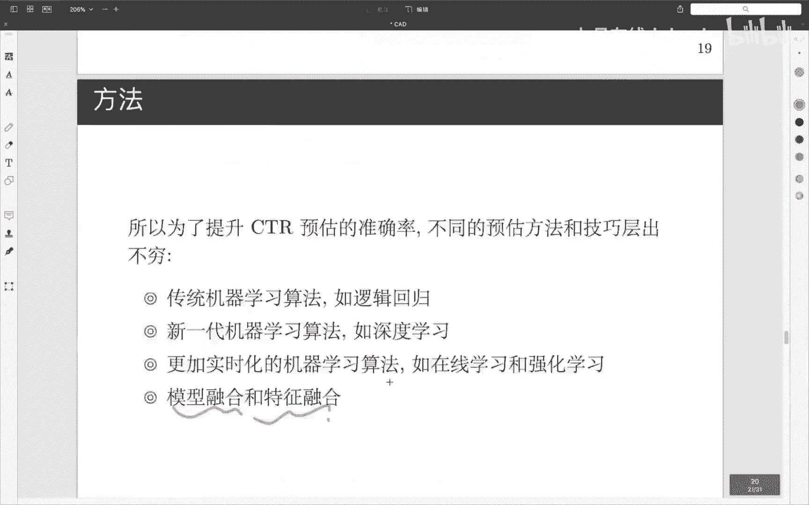

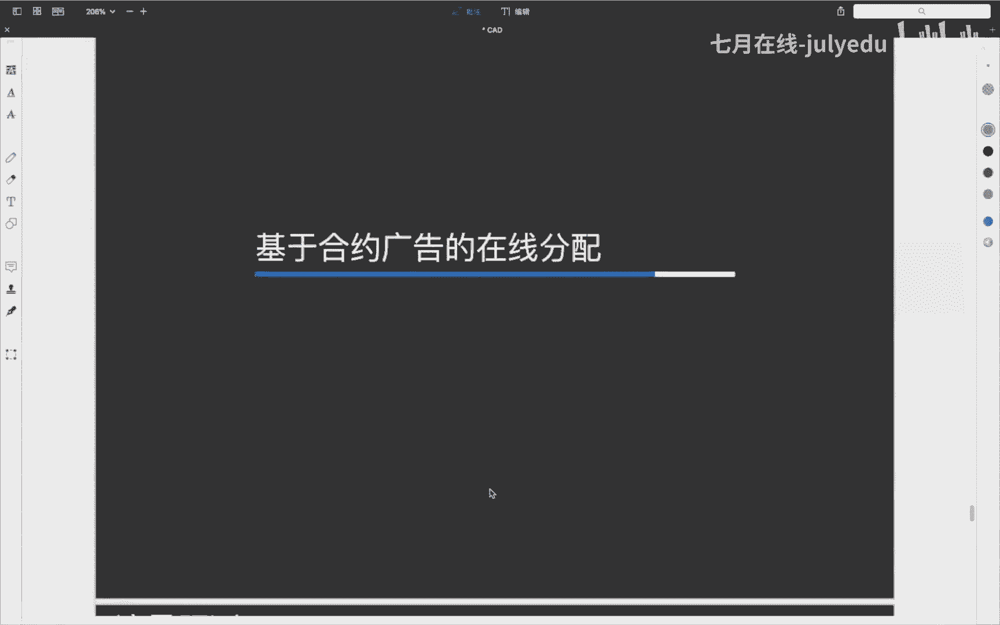

### 🧠 新一代算法：深度学习（以Wide & Deep为例）

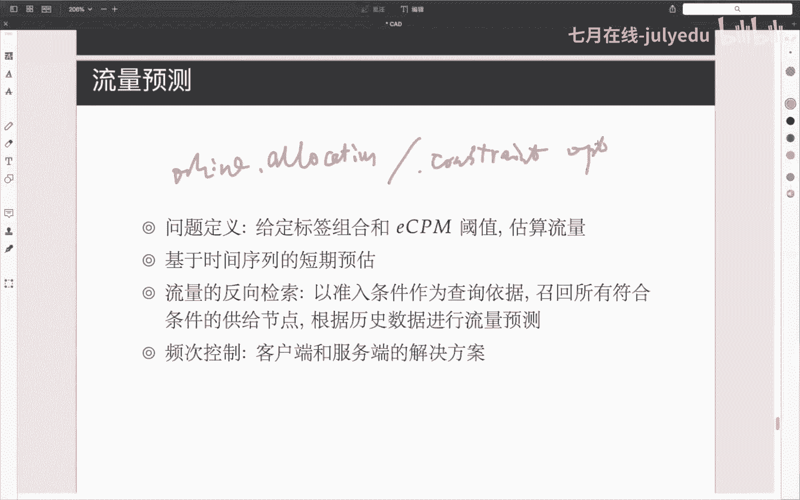

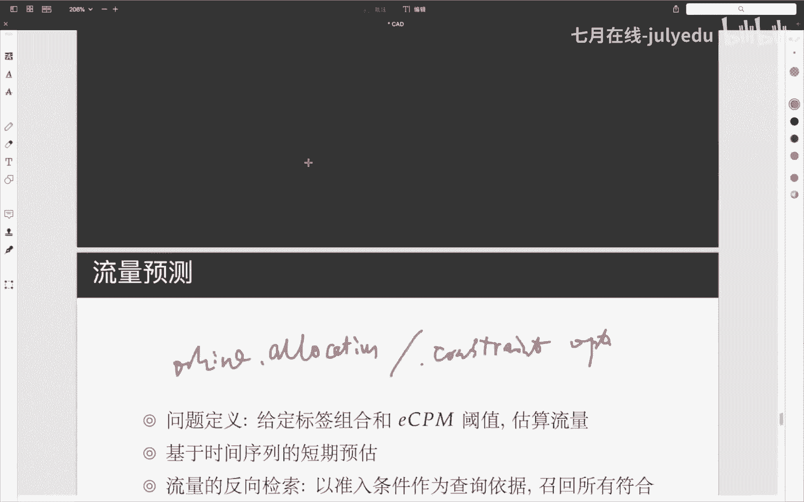

Wide & Deep模型由谷歌提出，采用神经网络并联联合训练的思路。
*   **Wide部分**：类似逻辑回归，处理稀疏的离散特征，擅长记忆（捕捉特性）。
*   **Deep部分**：使用深度神经网络（MLP），处理稠密特征，擅长泛化（捕捉共性）。

该模型能同时捕捉共性和特性，结构上是Deep部分多层堆叠后，与Wide部分并联输出。

---

### ⚡ 在线学习

在线学习旨在实现模型和特征的实时更新。
*   **模型实时化**：在线系统可以实时用新数据更新模型，而非天/周级别的离线更新。
*   **特征实时化**：例如，统计广告最近1小时、3小时等的点击量（滑窗统计）。如何精准、高效地计算这些实时特征是一个重要课题。

在线学习涉及的技术包括：
*   流计算引擎（Spark Streaming, Storm, Flink）。
*   合理的样本拼接与时间窗口设定。
*   在线样本的过滤与采样。
*   适配的优化算法（如Google的FTRL），注重稀疏性，防止模型膨胀和过拟合。

---

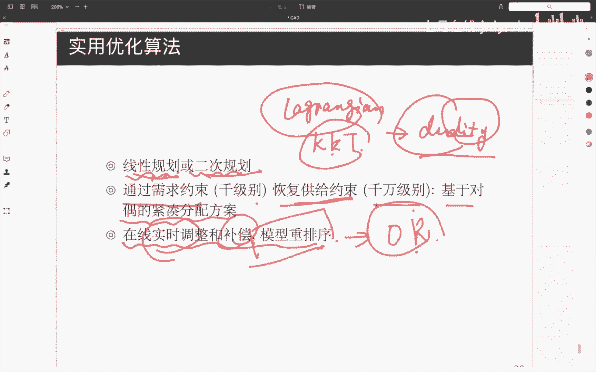

## 🧮 第四部分：基于合约广告的在线分配

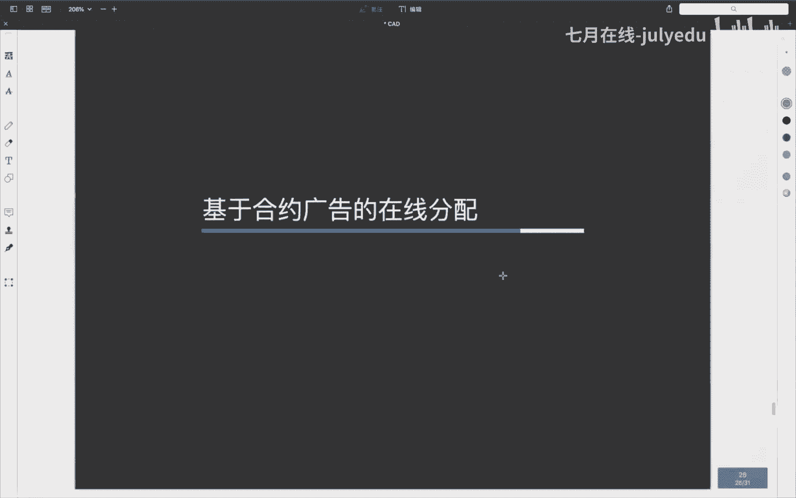

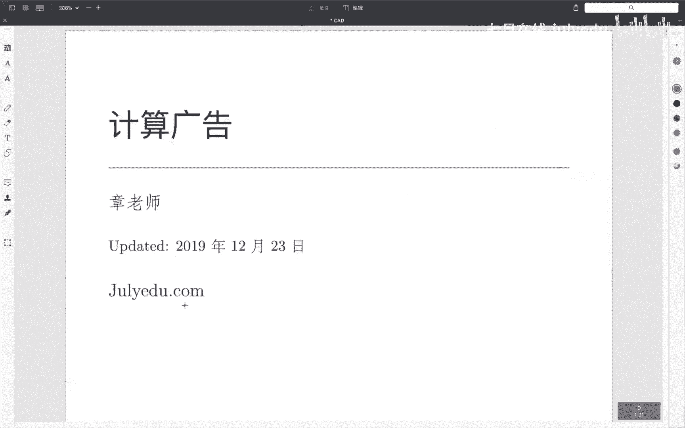

回顾合约广告，其核心问题是在线分配和受限最优化。

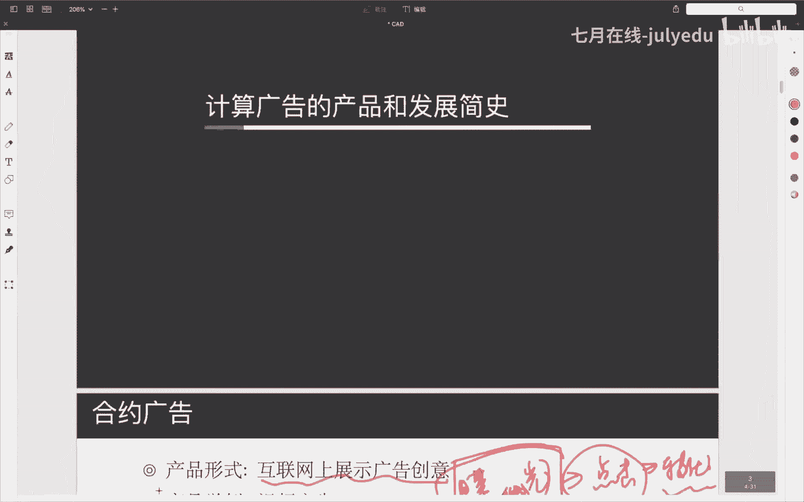

**流量预测**是在线分配的基础。问题定义是：给定标签组合和ECPM阈值，估算流量。实践中常用基于时间序列的短期预估（如根据过去15分钟预测未来15分钟），以指导下一个时间段的流量分配。这涉及**流量反向检索**（根据用户标签查找可投广告）和**频次控制**（通过服务端或客户端统计控制广告展示频率）。

**在线分配问题的数学定义**是优化一个目标函数（如总收益），并满足一系列约束条件。主要分为两类：
1.  **担保问题**：保证广告主的流量不低于承诺值 `D_a`。
2.  **有预算的出价问题**：广告主的消耗不超过其总预算 `B_a`。

**实用优化算法**包括线性规划、二次规划等。通过拉格朗日乘子法和KKT条件可以求解其对偶问题，有时对偶问题更易求解。此外，还有基于对偶的紧凑分配方案，以及通过重排序技术进行实时调整和补偿。

---

## 🎯 课程总结

本节课我们一起学习了计算广告的市场与技术全景。
*   我们首先了解了在线广告与计算广告的基本概念，以及平台方、广告主、用户三方体系。
*   接着，我们深入探讨了计算广告的三种主要产品形态：**合约广告**（按曝光计费，重在担保和长期价值）、**竞价广告**（按点击计费，核心是CTR预估和竞价机制）和**程序化交易广告/实时竞价**（实时出价，难点在需求方精准定价）。
*   然后，我们剖析了计算广告的**系统架构**，包括分布式计算、广告投放机、数据流水线和流式计算平台。
*   之后，我们重点讲解了**点击率预估**这一核心技术，从传统的逻辑回归到深度学习的Wide & Deep模型，并介绍了**在线学习**的概念与技术。
*   最后，我们回归到合约广告的**在线分配**问题，探讨了其数学定义和实用的优化算法。

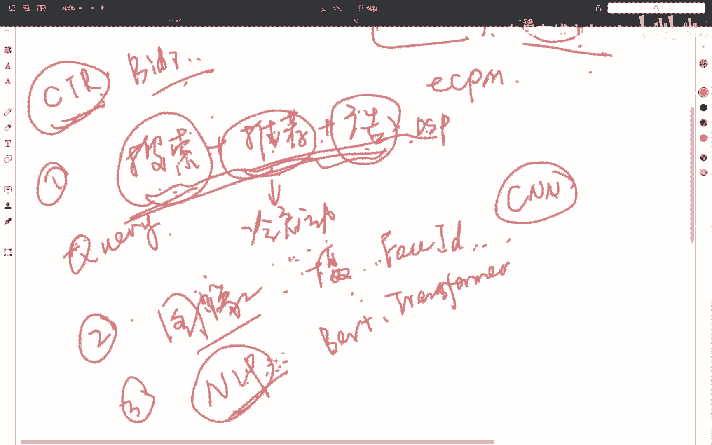

希望本课程能帮助你建立起对计算广告领域的基本认知框架。