# 人工智能—计算广告公开课（七月在线出品） - P4：Lookalike相似人群拓展项目实战 🎯


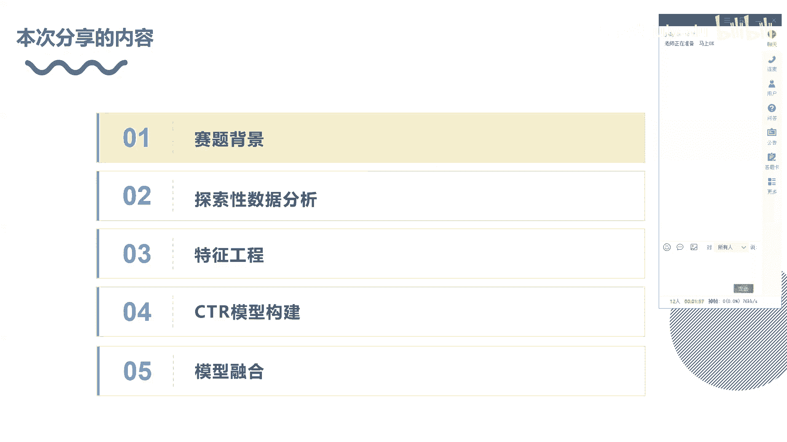

在本节课中，我们将学习Lookalike相似人群拓展项目。这是一个在推荐和广告领域非常经典的业务场景，源于2018年的腾讯广告算法大赛。从2017年到2020年，腾讯大赛的赛题都非常贴合真实业务，极具学习和研究价值。通过对赛题的复盘和拆解，我们可以深入理解解决方案的思路，学习如何进行特征工程、挖掘强信息，以及应用哪些模型来解决真实场景下的问题。

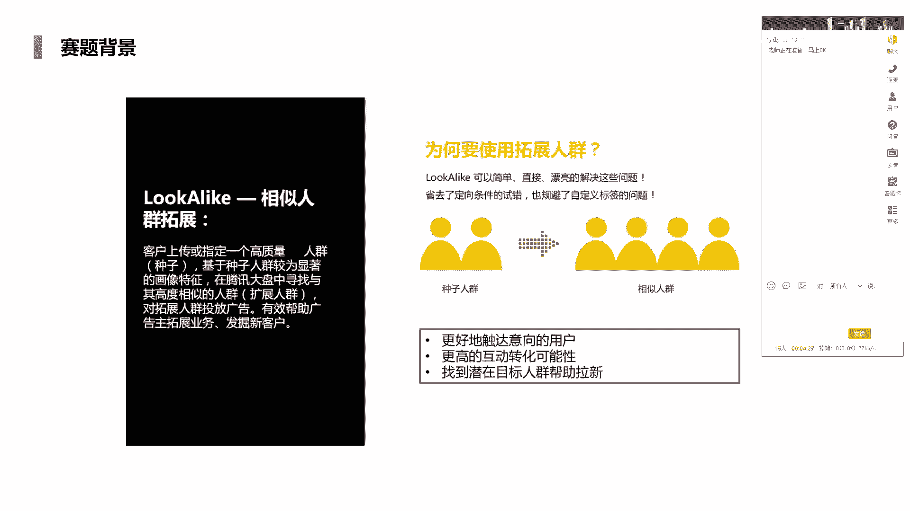

本节课将从五个部分展开分享：赛题背景、探索性数据分析、特征工程、CTR模型建模以及最后的模型融合。

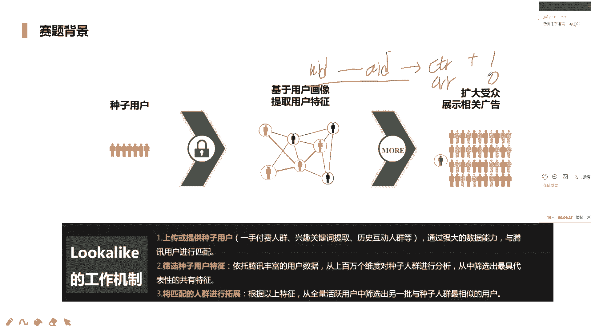

## 1. 赛题背景 📋

首先，我们来了解Lookalike的具体业务场景。Lookalike即相似人群扩展。客户会上传一部分指定的高质量人群，这部分人群被称为“种子人群”。业务的目标是依托于种子人群，从中找到一些显著的画像特征，然后在大盘活跃用户中寻找与种子人群高度相似的“扩展人群”。这个过程需要依靠建模，而非人工判断。

具体流程是：我们拥有种子人群以及向他们投放的广告。根据种子人群对广告的点击（正向样本）与不点击（负向样本）行为进行建模，从而提取出这群人的共同偏好和兴趣。然后，我们从人群库中向其他用户推送同类广告，观察他们是否发生点击或转化。如果发生，则认为这些用户与种子人群具有相似的兴趣，可以归为扩展的相似人群。

Lookalike主要有三个业务作用：
1.  **更好触达意向用户**：扩展原有人群，覆盖更多具有相同意向的用户。
2.  **更高的互动转化可能性**：相似人群更有可能对广告产生互动和转化。
3.  **找到潜在目标人群帮助拉新**：这是用户增长策略中的重要环节，可以帮助唤醒成熟用户或吸引新用户。

整个业务流程分为三步：
1.  上传种子用户。
2.  基于用户画像提取用户特征。
3.  扩大受众，展示相关广告。

本赛题对此流程进行了简化。我们不需要从全量用户中寻找，数据已经提供了候选用户（UID）和对应的广告（AID）。我们的任务是预测给定的“用户-广告”对是否会发生转化（如点击），这本质上可以转化为一个点击率（CTR）预测问题。

## 2. 赛题任务与数据 🗂️

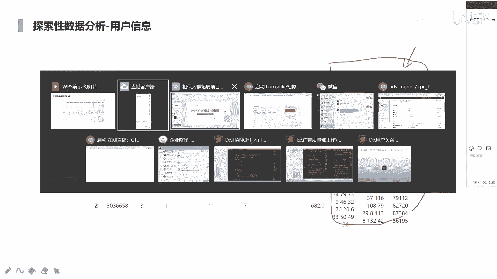

上一节我们介绍了业务背景，本节中我们来看看具体的赛题任务和数据构成。

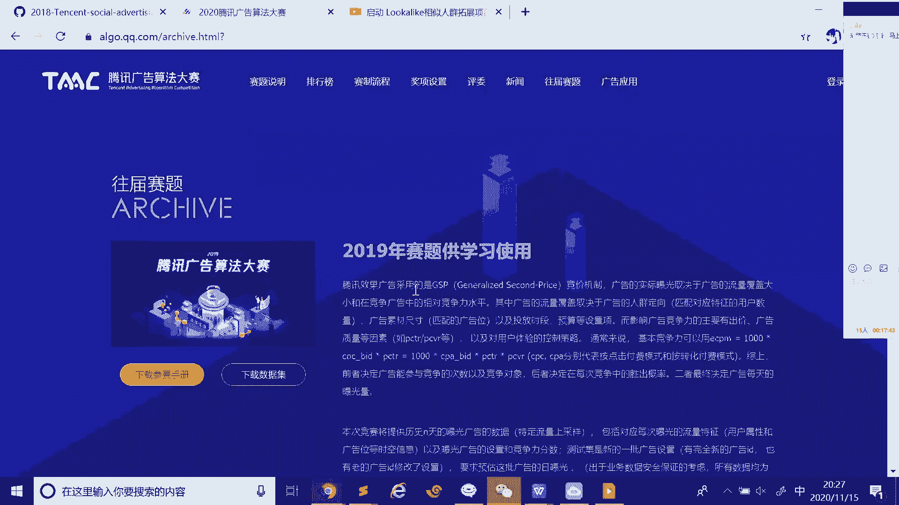

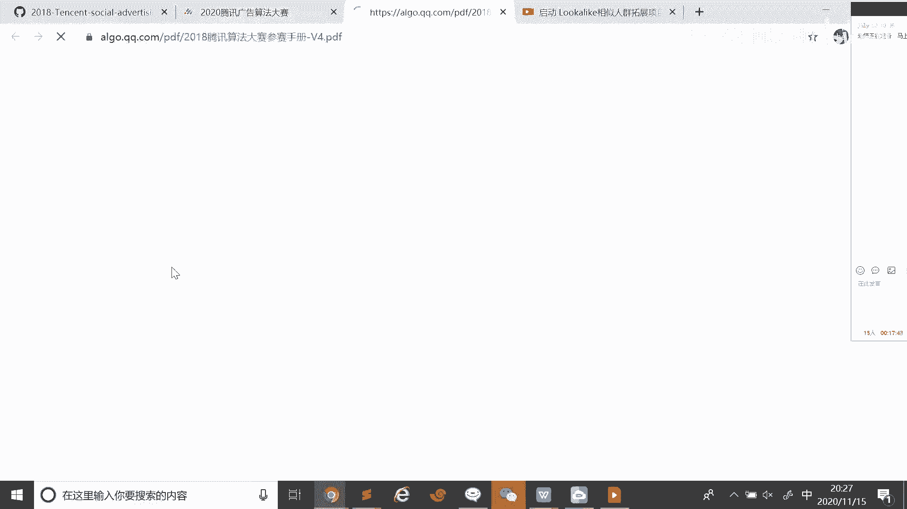

**赛题任务**：本赛题提供了几百个种子人群（即种子包），每个种子人群对应一类广告（AID）。选手需要根据提供的训练数据，预测测试集中给定的“用户-广告”对是否属于该种子包（即用户是否会点击该广告）。预测结果需要以概率形式（如0.76）提交。

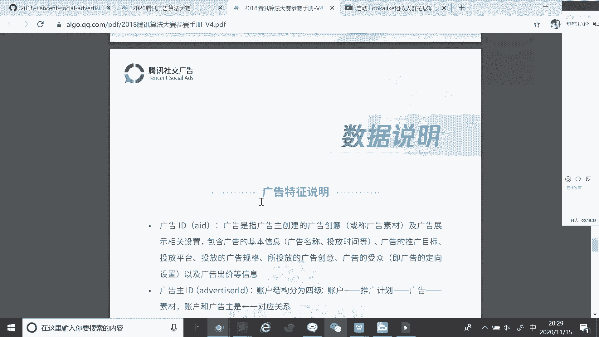

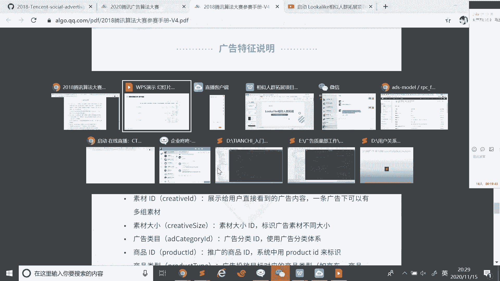

**评价指标**：采用按种子包加权的AUC（Area Under Curve）进行评估。这是因为每个种子包对应的广告特性不同，用户行为分布也不同。为每个种子包单独计算AUC后再进行加权平均（类似GAUC的思想），能更公平、准确地评估模型针对不同广告的排序能力。

**数据构成**：数据已做脱敏处理，时间范围为30天（但未提供具体时间戳）。数据分为四个部分：
1.  **训练集**：包含`AID`（广告ID）、`UID`（用户ID）和`label`（是否点击/转化）。
2.  **测试集**：包含`AID`和`UID`，需要预测`label`的概率。
3.  **用户特征**：每个用户ID对应一系列特征，包括年龄、性别等单值特征，以及兴趣、关键词等**多值特征**（特征值以逗号分隔，如“125,8”）。
4.  **广告特征**：每个广告ID对应的特征，如广告主ID、素材ID、广告类别等。

我们的特征工程将主要围绕`AID`和`UID`展开。

## 3. 探索性数据分析 🔍

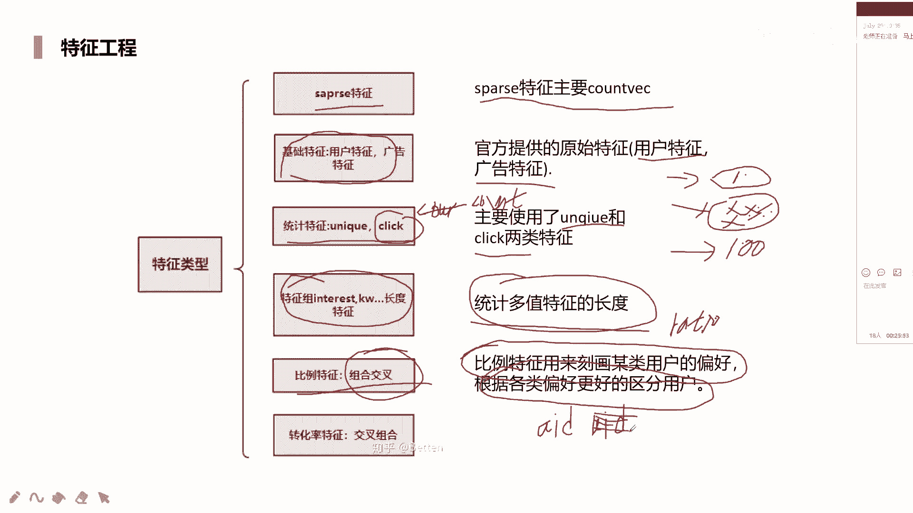

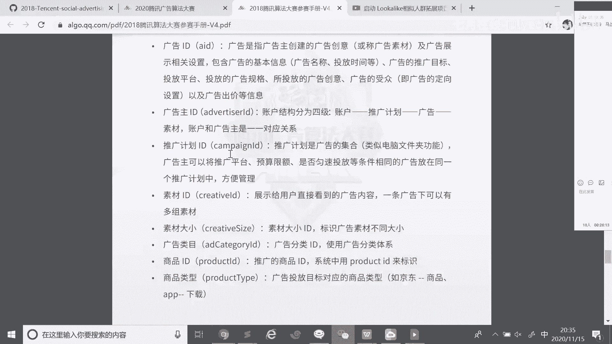

在开始构建模型之前，我们必须先理解数据。探索性数据分析（EDA）是至关重要的第一步，它能帮助我们了解数据规模、类型、分布及潜在问题。

我们对数据进行了基本统计：
*   **训练集**：用户ID（UID）的唯一值约有780多万个，广告ID（AID）有173个。UID的重复率很低。
*   **测试集**：用户ID的唯一值约有200多万个，与训练集的用户重合度很低。广告ID同样为173个，与训练集完全一致。

**关键发现**：
*   由于用户ID在训练集和测试集之间重复很少，且新用户ID会不断出现，因此**不能直接将UID作为模型特征**，否则会导致严重的冷启动问题，模型无法泛化。但可以围绕UID构造统计特征。
*   广告ID（AID）在训练和测试中完全一致，可以直接使用或基于其构造特征。

通过EDA，我们对数据有了初步认识，接下来就可以着手进行特征工程了。

## 4. 特征工程 ⚙️

特征工程是模型效果的关键。本节我们将介绍针对本赛题的各种特征构造方法。

以下是构造特征的主要思路：

**1. 多值特征处理**
用户特征中的兴趣、关键词等是多值特征。处理方法包括：
*   **展开为稀疏向量**：使用 `CountVectorizer` 或 `TfidfVectorizer`。例如，对于兴趣“125,8”，可以将其视为文本，转换为词频或TF-IDF向量。
    ```python
    # 示例：使用 CountVectorizer
    from sklearn.feature_extraction.text import CountVectorizer
    vectorizer = CountVectorizer(tokenizer=lambda x: x.split(','))
    X = vectorizer.fit_transform(user_interests)
    ```
*   **降维**：展开后维度可能极高，可以使用 `PCA`、`NMF` 或 `SVD` 进行降维，得到稠密、低维的特征表示。

**2. 基础特征**
直接使用原始的单值特征，如年龄、性别、广告尺寸等，作为类别特征或数值特征。

**3. 统计特征**
*   **计数（Count）**：例如，用户历史点击广告的总次数、广告被点击的总次数。
*   **唯一值计数（Unique Count）**：例如，用户兴趣列表中不同兴趣的个数，反映兴趣广度。
*   **点击统计**：用户或广告的点击次数，反映活跃度。
*   **长度特征**：多值特征列表的长度。

**4. 比例特征**
也称为目标编码（Target Encoding），能刻画用户对特定属性的偏好强度。
*   **公式**：`Retail(UID, AID) = 用户UID点击广告AID的次数 / 用户UID的总点击次数`
*   **注意**：为防止数据泄露，需使用交叉验证的方式计算；对于稀疏行为，需加入贝叶斯平滑。

**5. 交叉组合特征**
将不同特征组合，得到更细粒度的信息。
*   **示例**：将“性别”和“年龄段”组合成新特征“性别_年龄段”，能更精细地刻画用户群体。

## 5. CTR模型建模 🤖

特征准备就绪后，我们进入模型构建阶段。本赛题可用的模型非常多样。

**1. 树模型（LightGBM / XGBoost）**
这类模型是处理结构化数据的利器，稳定且强大。
*   **LightGBM**：采用叶子节点（leaf-wise）分裂和直方图算法，训练效率高，能避免过拟合。
*   **XGBoost**：采用层级（level-wise）分裂和预排序算法，精度高但效率相对较低。

**2. 因子分解机及其变种**
*   **FM（Factorization Machines）**：擅长捕捉二阶特征交叉。其核心公式为：
    `ŷ = w0 + Σwi*xi + ΣΣ<vi, vj>*xi*xj`
    其中，`<vi, vj>`是特征i和j的隐向量内积。
*   **FFM（Field-aware FM）**：在FM基础上引入“域”的概念。同一个特征在与不同域的特征交叉时，使用不同的隐向量，更贴合实际（例如，“男性”与“篮球”交叉和与“化妆品”交叉的重要性不同）。
*   **NFFM/DeepFM**：将FM与深度神经网络结合，FM部分负责显式低阶特征交叉，DNN部分负责隐式高阶特征交叉，建模能力更强。

**3. 验证策略**
为保证线上线下一致性，我们采用了特殊的验证方式：
1.  首先，按广告ID（AID）将训练集切分出20%作为**离线验证集**，其构成方式与测试集一致。
2.  然后，在剩余的80%数据上，再进行5折交叉验证来训练模型和调参。
这种方式虽然损失了部分训练数据，但能最大程度模拟测试集环境，确保模型稳定性。

## 6. 模型融合 🧩

当单一模型达到瓶颈时，模型融合是提升效果的最终手段。融合的核心在于利用模型的差异性。

**融合的理论基础**：
*   **特征差异**：使用不同的特征子集训练模型。
*   **样本差异**：通过采样（Bagging）使模型看到不同的数据。
*   **模型差异**：使用不同类型的模型（如树模型、FFM、DNN）。

**常用融合方法**：
1.  **加权平均/投票**：对多个模型的预测结果进行加权平均或投票。
2.  **Stacking**：
    *   第一层：用多个基模型（如LGB, XGB, FFM）对训练集进行K折交叉验证预测，得到一组新的特征（即每个样本的K个预测值）。
    *   第二层：将这些新特征与原始特征拼接，训练一个元模型（如线性回归、浅层树模型）进行最终预测。
    *   这种方法能有效融合不同模型的“知识”。

**高级技巧**：
*   可以构建多层级、多链路的复杂Stacking结构。
*   对于类别特征，在输入树模型前可进行计数编码、目标编码等；在输入神经网络前则通过嵌入层（Embedding）转化为稠密向量。

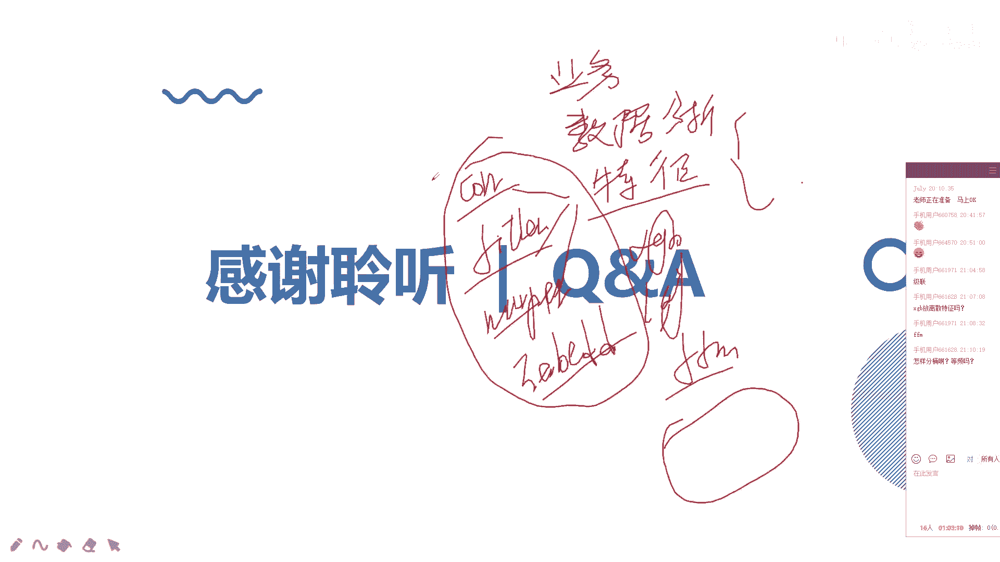

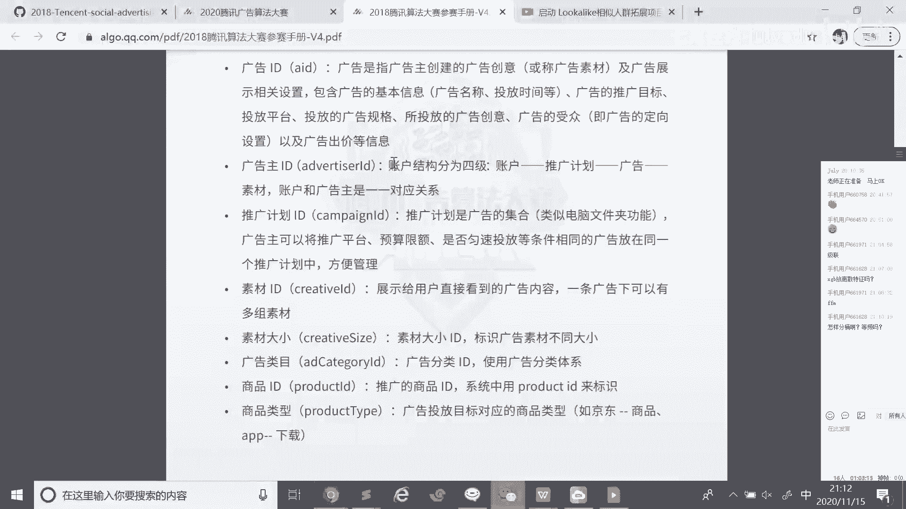

## 总结 📝

本节课我们一起学习了Lookalike相似人群拓展项目的完整实战流程。

我们从**理解业务背景**出发，明确了将业务问题转化为CTR预测问题的思路。接着，通过**探索性数据分析**深入了解了数据构成和关键点。然后，我们重点讲解了**特征工程**，包括多值特征处理、统计特征、比例特征和交叉特征的构造方法。在**模型建模**部分，我们介绍了适用于本场景的树模型、因子分解机及其变种模型。最后，我们探讨了通过**模型融合**来进一步提升效果的策略与技巧。

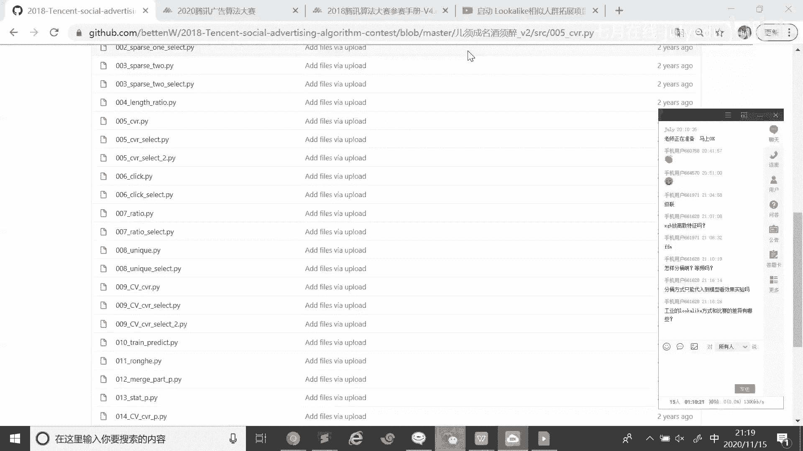


这个赛题是计算广告领域的经典案例，其中涉及的特征处理、模型选择和融合思路，对于从事推荐、广告、用户增长等相关工作的同学具有很高的参考价值。建议课后复现相关代码，并研究其他优秀选手的开源方案，以加深理解。