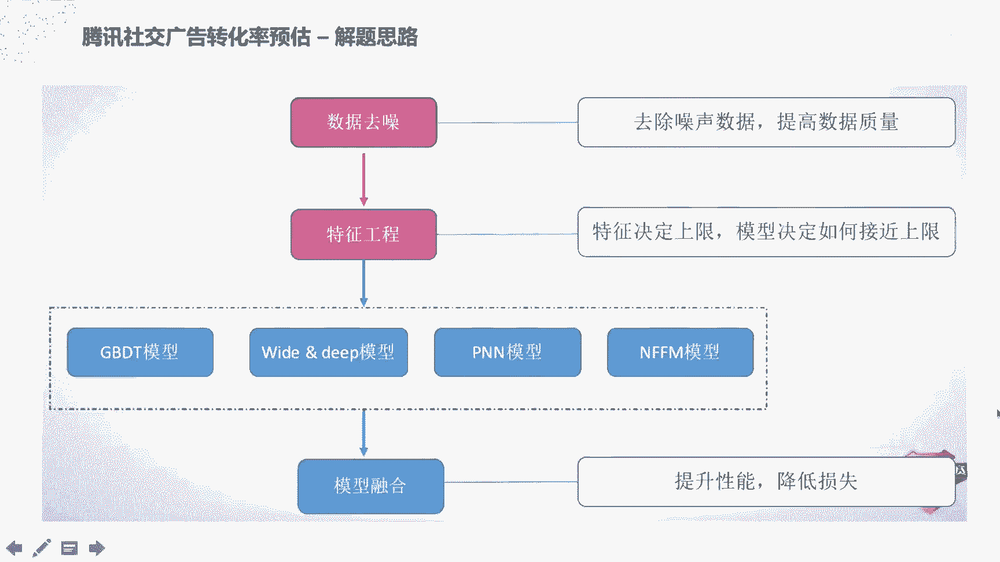
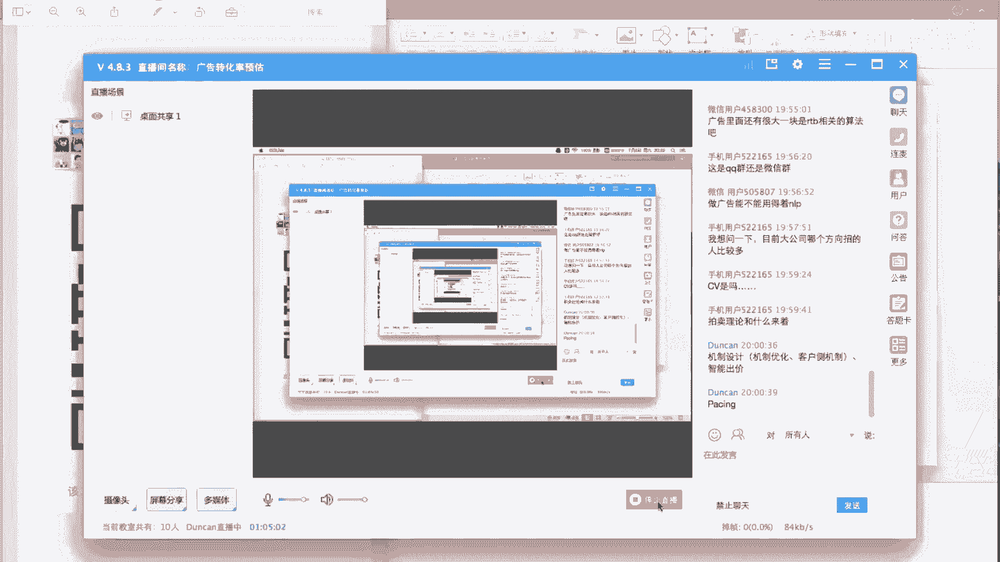

# 人工智能—计算广告公开课（七月在线出品） - P5：带你从头到尾实战广告转化率预估 🎯

在本节课中，我们将学习广告转化率预估的核心概念、技术流程，并以2017年腾讯社交广告大赛为例，深入解析从数据处理、特征工程到模型构建与融合的完整实战方案。课程最后，我们还将拓展介绍多目标学习在解决转化率预估难题上的应用。

## 第一部分：转化率预估背景知识

互联网广告的商业模式主要基于几种出价和计费方式。

*   **CPM**：按千次展现扣费。
*   **CPC**：按点击扣费。
*   **CPA**：按转化行为（如下载、购买）扣费。
*   **OCPC**：基于预估转化率进行智能出价，按CPC扣费。

典型的互联网广告转化漏斗是：曝光 -> 点击 -> 转化（如访问、咨询、下载、购买）。CPC优化点击层，而OCPC和CPA则需要参考下层的转化效果。

因此，转化率预估是CPA和OCPC等模式的关键技术。其核心是给定一个广告展示对象，通过统计或建模方法预估其转化概率。

以下是几个核心指标的定义：

*   **点击率**：`CTR = 点击次数 / 展现次数`
*   **转化率**：`CVR = 转化次数 / 点击次数`
*   **点击转化率**：`CTCVR = 转化次数 / 展现次数 = CTR * CVR`

本次课程聚焦于**CVR预估**，即预测用户点击广告后发生转化行为（如APP安装、商品购买）的概率。

该任务的特点在于数据海量，且转化行为数据相对于点击数据更为稀疏。如何在海量数据中设计有效特征并解决数据稀疏性问题，是本次介绍的重点。

## 第二部分：腾讯社交广告转化率预估赛题解析

上一节我们介绍了转化率预估的基本概念，本节中我们来看看一个具体的实战案例：2017年腾讯社交广告转化率预估大赛。

该赛题使用了腾讯社交平台（如朋友圈、QQ空间）的真实广告日志数据。提供了30天的APP安装流水，以及第17至30天共14天的广告点击日志作为训练集。目标是利用这些数据，预测第31天广告被点击后发生APP激活（即转化）的概率。

评估指标为二分类任务常用的对数损失函数 **Log Loss**。

数据包含以下信息：
*   **用户信息**：用户ID、年龄、性别、教育程度等。
*   **广告信息**：APP ID、广告主ID、广告素材ID、推广计划ID、APP类别等。
*   **上下文信息**：广告位位置、网络类型、点击时间等。

解题的一般思路流程为：数据分析 -> 数据去噪 -> 特征工程 -> 模型构建与融合。

### 数据去噪

由于转化行为链路较长，数据可能存在回流延迟。针对此问题的去噪方法包括：
1.  删除每个APP在最后一次转化发生之后的所有点击日志数据。
2.  对于发生重大更新的APP，若其前后转化率差异巨大，则删除更新前的历史数据。

### 特征工程

特征工程是机器学习任务的上限。对于本赛题，特征主要包括以下几类：

以下是转化率相关特征，旨在从不同维度挖掘历史转化信息：
*   APP历史转化率
*   广告位历史转化率
*   用户历史转化率
*   用户-APP类别组合转化率

以下是点击相关特征，通过统计分析发现点击模式与转化率存在关联：
*   用户/APP/广告位在不同时间窗口（如分钟、小时、天）内的点击次数统计
*   用户对特定APP的点击次数
*   **注意**：构造特征时需严防数据泄露，只能使用当前样本时间点之前的历史数据。

以下是安装行为相关特征：
*   用户上次安装APP的时间
*   点击与上次安装的时间差
*   用户近期安装APP的数量
*   用户连续安装的APP ID组合

以下是时间相关特征：
*   将一天24小时划分为48个半小时时段，作为类别特征。

## 第三部分：模型构建与融合

在完成了数据清洗和特征构造之后，本节我们来看看如何利用模型进行学习和预测。

常用的模型包括传统的梯度提升决策树 **GBDT**，以及深度学习模型如 **Wide & Deep**、**PNN** 和 **NFM** 等。本次冠军方案的一个创新点是使用了 **NFFM** 模型。

**NFFM** 模型结构解析：
1.  输入特征首先进行 **One-Hot 编码**，得到高维稀疏特征向量。
2.  通过一个 **Embedding 层**（可视为一个查找表 `lookup table`）将每个稀疏特征映射为低维稠密向量。假设有 `N` 个特征，每个特征映射为 `K` 维向量，则得到 `N * K` 的稠密矩阵。
3.  模型左半部分是一个简单的线性模型（如逻辑回归），直接对原始稀疏特征进行加权求和。
4.  模型右半部分是核心创新：对 `Embedding` 得到的稠密向量进行两两特征间的 **逐元素乘积** 操作，得到特征交叉信息。这与 **FM** 模型思想一致，但 NFFM 进一步将交叉后的结果输入到一个多层全连接神经网络中进行高阶特征组合。
5.  最终，将线性部分的输出和神经网络部分的输出合并，通过 **Sigmoid** 函数输出最终的转化概率。

单模型 NFFM 即可达到线上第三名的成绩。

### 模型融合

为了进一步提升效果，可以采用模型融合策略。冠军方案融合了8个模型：
*   特征：39个简单特征 + 49个复杂特征。
*   模型：1个 GBDT，1个 WDL，2个 PNN，4个 NFFM。
*   方法：对8个模型的预测结果进行 **加权平均**。
模型融合相比单模型带来了约1%的性能提升。

## 第四部分：拓展：多目标学习与ESMM模型

前面介绍的方案是在点击样本空间内预估CVR。然而，工业界实践中有两个固有难题：样本选择偏差和数据稀疏性。

**样本选择偏差**：训练时我们使用点击日志（点击后的样本），但线上预估时需要对所有曝光样本进行推断。这两个样本空间存在差异。
**数据稀疏性**：转化样本数量远少于点击样本，导致模型训练不充分。

为了解决这些问题，阿里提出了 **ESMM** 模型，它利用多任务学习在整个曝光样本空间进行建模。

用户行为遵循序列决策模式：曝光 -> 点击 -> 转化。根据概率公式，有：
`P(转化|曝光) = P(点击|曝光) * P(转化|点击)`
即 `CTCVR = CTR * CVR`

ESMM模型结构包含两个主要任务：
1.  **主任务**：预估 `P(转化|点击)`，即 **CVR**。
2.  **辅助任务**：预估 `P(点击|曝光)`，即 **CTR**。

模型通过将 `CTR` 和 `CVR` 的预估结果相乘，得到 `CTCVR` 的预估值，并利用 `CTCVR` 和 `CTR` 的观测数据（来自全量曝光样本）来联合训练网络。

ESMM模型的两个关键设计：
*   **共享Embedding层**：CVR网络和CTR网络共享底层的特征Embedding参数。这大大减少了参数量，并使得CVR任务能够利用CTR任务从海量曝光数据中学到的特征表示，缓解数据稀疏问题。
*   **全样本空间训练**：通过引入CTR作为辅助任务，模型能够利用全量曝光数据进行训练，使训练空间和线上推断空间保持一致，解决了样本选择偏差问题。

实验表明，ESMM模型在CVR预估任务上优于传统方法。

## 总结与课程回顾

本节课中我们一起学习了广告转化率预估的完整流程。

我们从基础概念出发，了解了CTR、CVR、CTCVR等核心指标以及转化率预估的商业应用场景。接着，我们深入分析了2017年腾讯社交广告大赛的实战案例，涵盖了从**数据去噪**、**特征工程**（包括转化率、点击、安装、时间等特征），到复杂模型**NFFM**的构建原理，以及通过**模型融合**提升效果的策略。

最后，我们探讨了传统CVR预估的局限性，并介绍了利用**多任务学习**的**ESMM**模型如何通过共享参数和全空间训练，有效解决样本选择偏差和数据稀疏性两大挑战。

希望本课程能帮助你建立起对广告转化率预估系统性、实战性的理解。