# 🧠 人工智能—计算广告公开课（七月在线出品） - P7：计算广告的发展和相关技术

在本节课中，我们将要学习计算广告的核心知识。课程将从四个方面展开：计算广告的产品发展简史、系统架构、竞价广告点击率预估以及基于合约广告的在线分配。我们将深入浅出地探讨这些主题，帮助初学者理解计算广告领域的核心概念和技术。

---

## 📜 第一部分：计算广告的产品发展简史

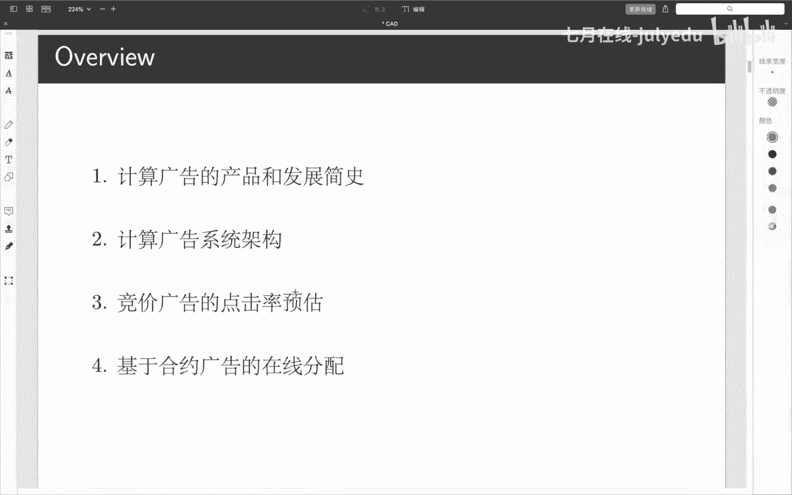

上一节我们介绍了课程的整体框架，本节中我们来看看计算广告是如何一步步发展演变的。

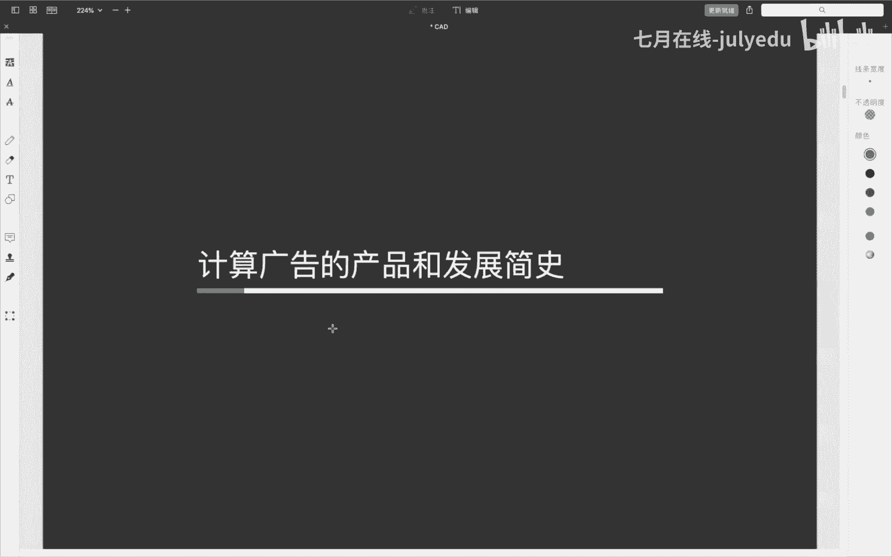

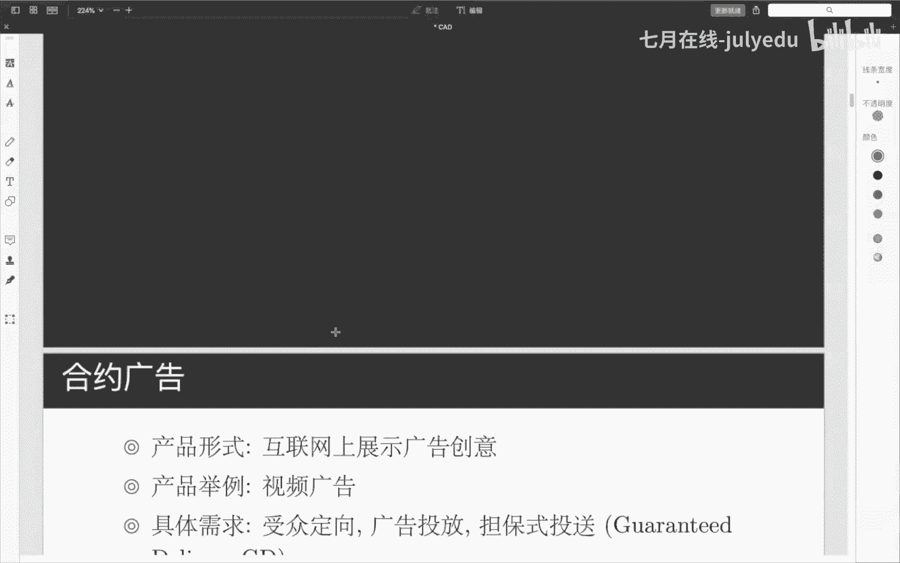

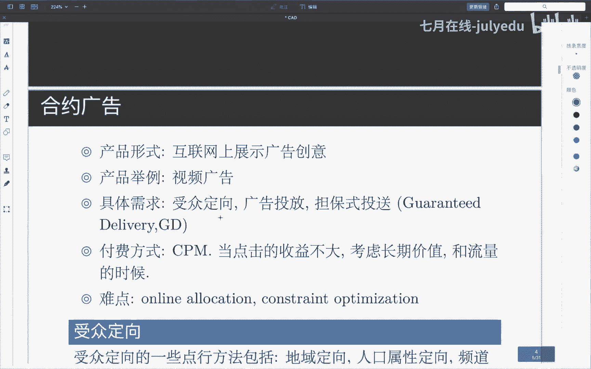

计算广告由“计算”和“广告”两部分组成。“广告”的含义众所周知，而“计算”则指利用数学和数据技术，实现广告的精准投放，从而获得比传统广告更大的收益。

在线广告是指在网络和互联网流媒体上投放的广告，例如百度、知乎等网站上的广告。与传统广告不同，在线广告在发展中形成了特定模式，其特点是以人群为投放目标，以产品为技术导向。

广告的本质是实现商业信息的传播。

---

### 合约广告

合约广告是最容易理解的形式。其产品形式是在互联网上展示广告创意，例如视频广告。

以下是合约广告的具体需求：

*   **受众定向**：根据用户属性（如性别、地域）进行广告推送。
*   **广告投放**：系统根据受众标签进行广告替换和展示。
*   **担保式投送**：媒体向广告主保证一定的广告曝光量。

合约广告的付费方式是 **CPM**，即按千次展示付费。其难点在于，当多个广告主对不同标签组合的人群有保量需求时，如何进行复杂的在线分配和约束优化。

---

### 竞价广告

竞价广告比合约广告更加精细化。其发展源于市场精细化、定向标签更精准以及广告主数量膨胀。

竞价广告的产品形式是供给方不再保证曝光量，而是保证单位流量的成本，即按点击付费。搜索广告是典型例子。

以下是竞价广告的具体需求：

*   **精准人群定向**：使用更精细、静态的用户特征进行刻画。
*   **竞价机制**：通过预估点击率和出价计算期望收益，以最大化收益为目标。

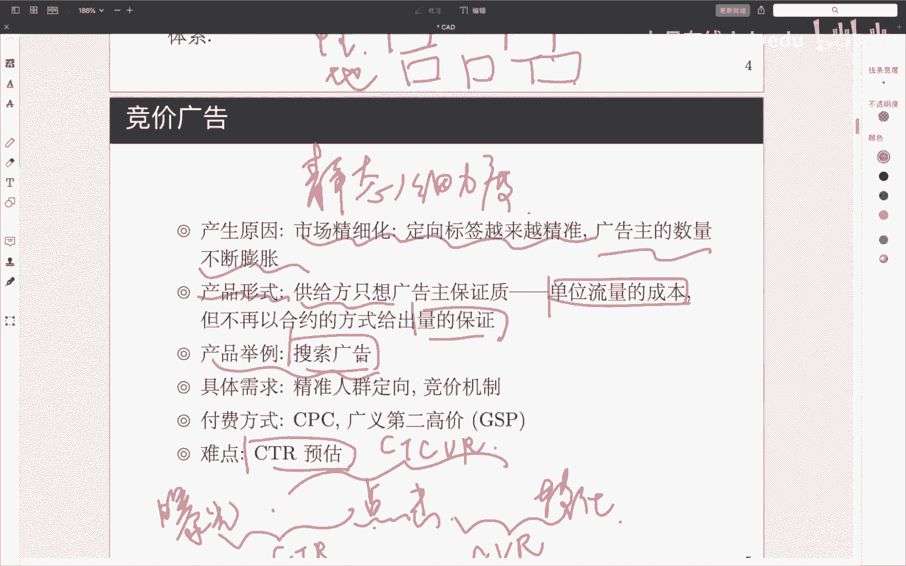

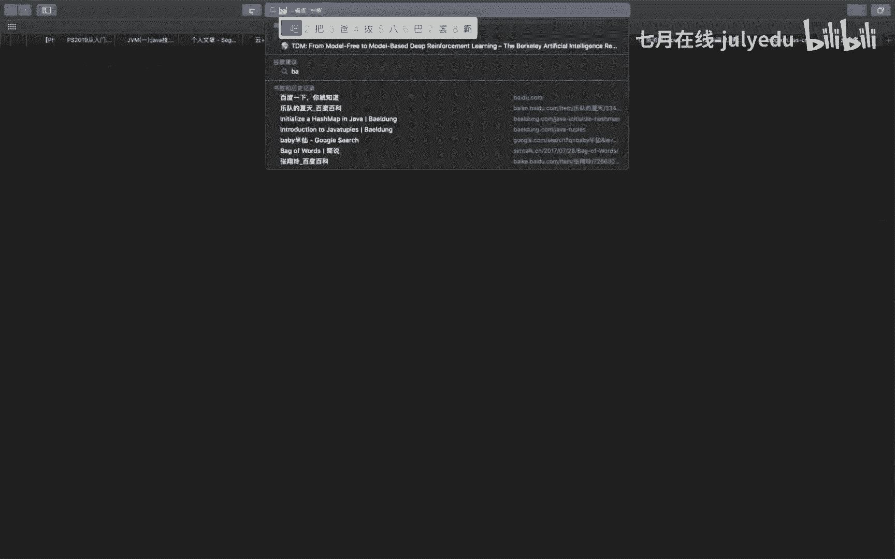

竞价广告的付费方式是 **CPC**，即按点击付费，通常采用广义第二高价机制。其核心难点在于 **CTR预估** 的准确性。

---

### 程序化交易广告（实时竞价）

程序化交易广告的核心是实时竞价机制。它解决了广告主希望根据实时数据（如用户转化价值）动态调整出价和选择流量的需求。

其产品形式是每次广告展示都进行实时出价。流程通常为用户访问媒体，媒体通过广告交易平台向多个需求方平台询价，各平台根据自身数据实时出价，价高者获得展示机会。

程序化交易广告的付费方式回归到 **CPM**。其难点在于需求方需要进行精准的实时定价。

---

### 广告层级组织与相关概念

一个广告活动通常包含以下层级组织：广告计划、广告组和广告创意。

此外，还需要了解一些核心概念：

*   **ADX**：广告交易平台，类似二级市场。
*   **DSP**：需求方平台，代表广告主利益。
*   **SSP**：供给方平台，代表媒体利益。
*   **DMP**：数据管理平台，负责标签生产与管理。
*   **RTB**：实时竞价。
*   **重定向**：根据用户历史行为进行再次定向投放。

---

## 🏗️ 第二部分：计算广告的系统架构

上一节我们回顾了计算广告的产品演进，本节中我们来看看支撑这些产品的技术系统架构。

计算广告的系统架构通常分为四个部分：在线服务、数据高速公路、分布式计算和流式计算。

---

### 在线服务

在线服务是响应用户请求的核心。其主要功能包括：

*   生成会话日志。
*   进行受众定向和行为打标。
*   调用CTR预估模型进行打分。
*   集成商业智能模块。

在线服务负责串联整个线上系统，处理高并发请求，并完成广告的召回、排序和重排序。

---

### 数据高速公路

数据高速公路负责日志的收集、管理和分发。其主要功能包括：

*   准实时地将日志推送到其他平台。
*   连接在线和离线系统，供批处理和流处理消费。

常用的相关技术包括 Kafka 和 Flume。

---

### 流式计算平台

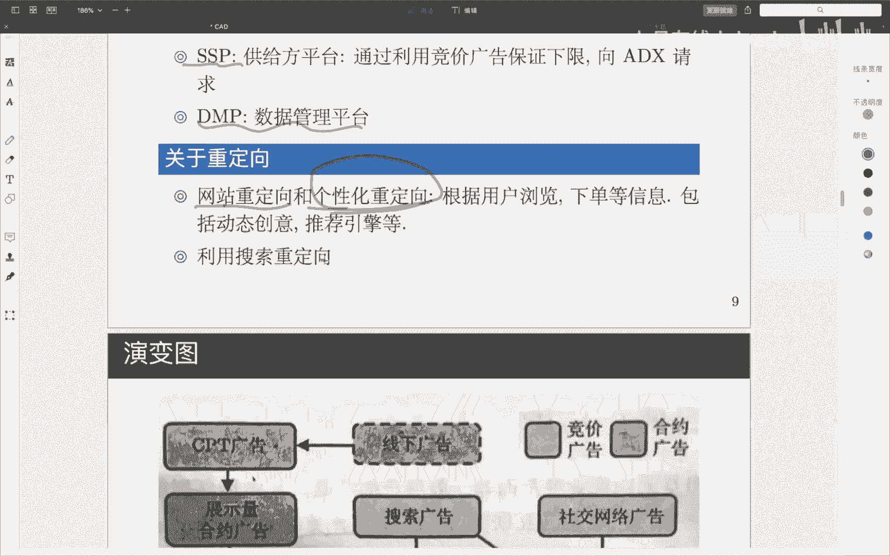

流式计算平台用于处理实时任务。其主要应用包括：

*   实时受众定向。
*   实时点击反馈统计。
*   计费和反作弊。

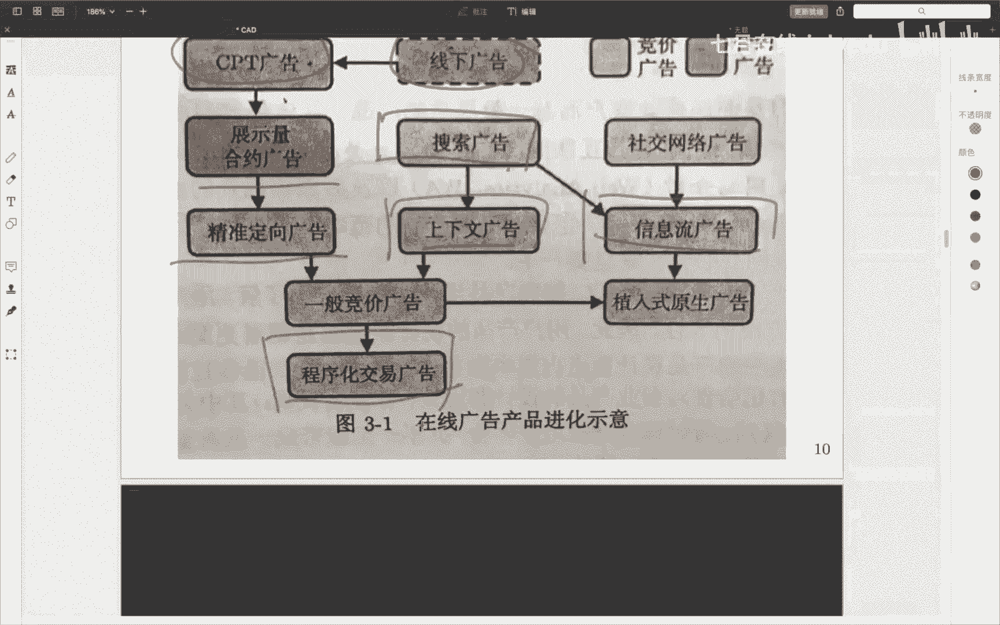

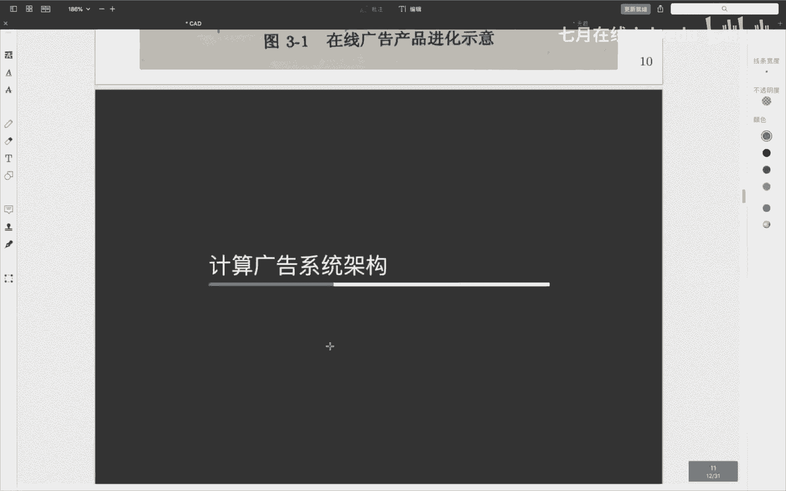

常用的流式计算引擎有 Storm、Spark Streaming 和 Flink。

---

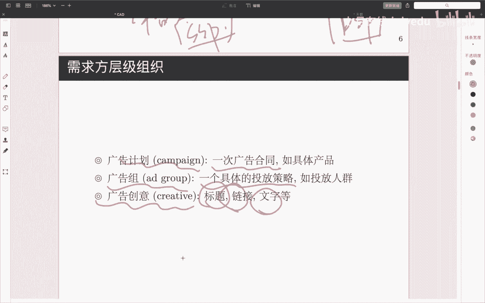

### 批处理计算平台

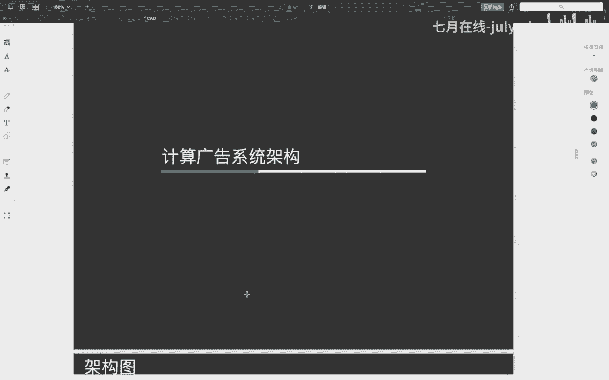

批处理计算平台用于离线分析。其主要任务包括：

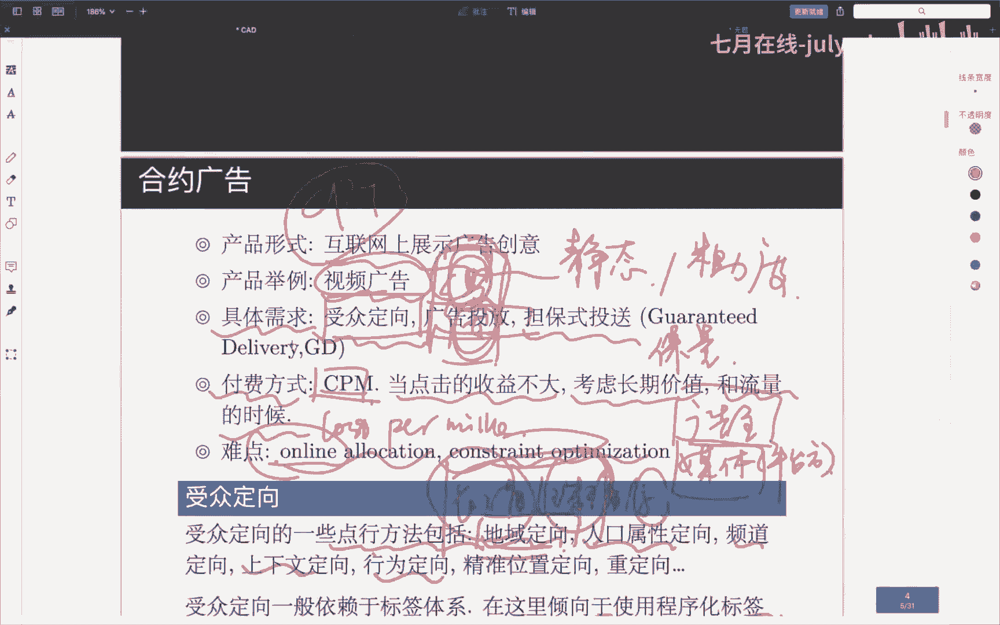

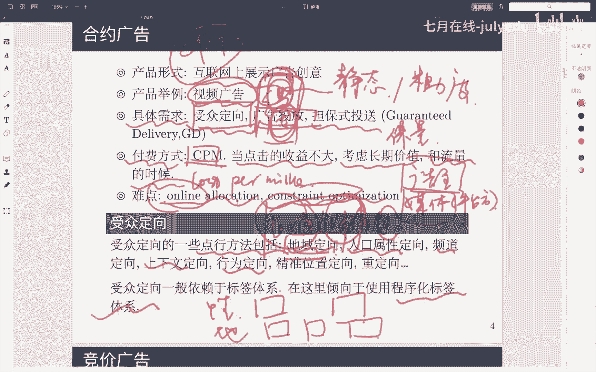

*   数据分析与BI报表。
*   特征工程与模型训练。

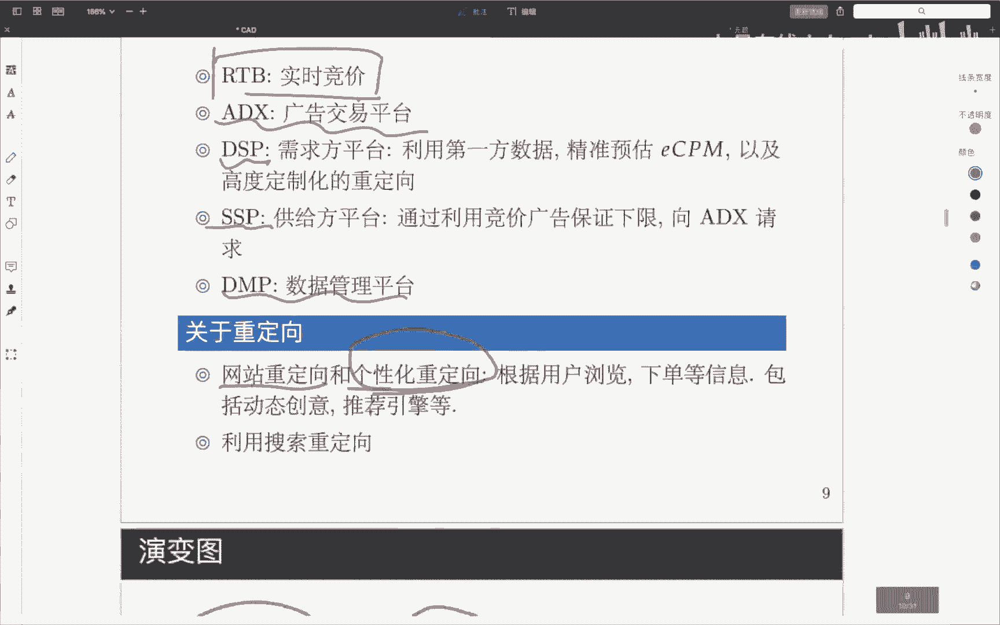

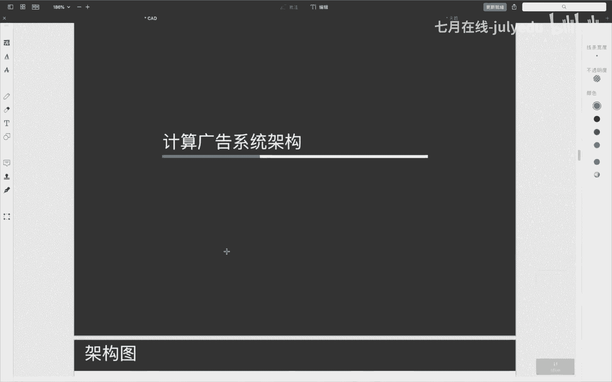

常用的技术包括 Hadoop、HDFS 和 Hive。此外，Redis、Lucene 和 Elasticsearch 也常用于缓存和索引。

---

## 🔮 第三部分：竞价广告点击率预估

上一节我们介绍了计算广告的系统骨架，本节中我们深入其中最核心的算法部分——点击率预估。

CTR预估对于提升广告收益至关重要。为了提升预估准确率，业界不断涌现新的方法。

---

### 预估方法与技术

CTR预估的技术演进主要分为几个方向：

*   **传统机器学习算法**：如逻辑回归。
*   **新一代机器学习算法**：如基于深度学习的DNN、Wide & Deep等模型。
*   **更前沿的算法**：如在线学习和强化学习。
*   **模型与特征融合**。
*   **优化算法**：如SGD、Adam、FTRL等。

CTR预估的数学表示是通过用户、广告和上下文特征来预测点击概率 `y = f(user, item, context)`。

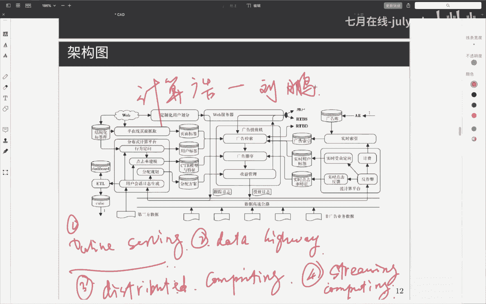

---

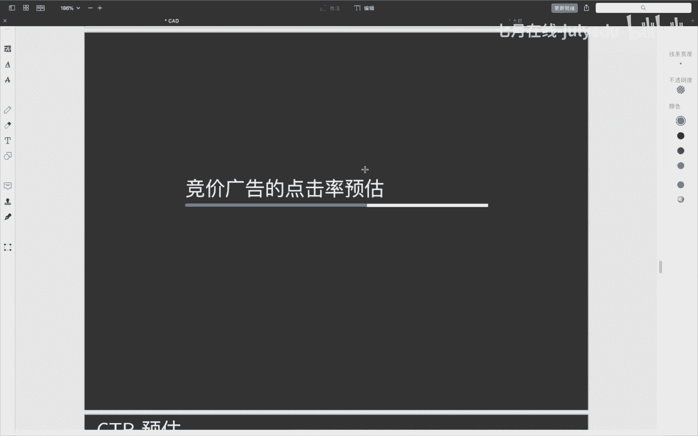

### 逻辑回归与特征工程

逻辑回归是CTR预估的基础模型。使用时常需要注意：

*   特征离散化有助于风险均摊和模型鲁棒性。
*   特征组合包括人工组合和自动组合（如使用GBDT+LR）。

---

### Wide & Deep 模型

Wide & Deep 模型综合了记忆和泛化的优势：

*   **Wide部分**：擅长记忆特定、稀疏的特征组合。
*   **Deep部分**：擅长泛化，学习深层特征表示。

模型输入可以是稀疏特征或稠密特征，但需要进行适当处理以适应两部分。

---

### 在线学习

在线学习使模型能实时更新，适应数据分布的变化。其实现依赖于：

*   实时计算引擎提供实时特征和数据。
*   时间窗口、样本过滤与拼接等技术。
*   适配的优化算法，如专为稀疏性设计的FTRL。

---

## ⚖️ 第四部分：基于合约广告的在线分配

在本课程的最后一部分，我们将探讨合约广告中的一个经典问题——在线分配。

合约广告需要满足广告主的保量需求，同时最大化平台收益，这引出了一个约束优化问题。

---

### 流量预测与频次控制

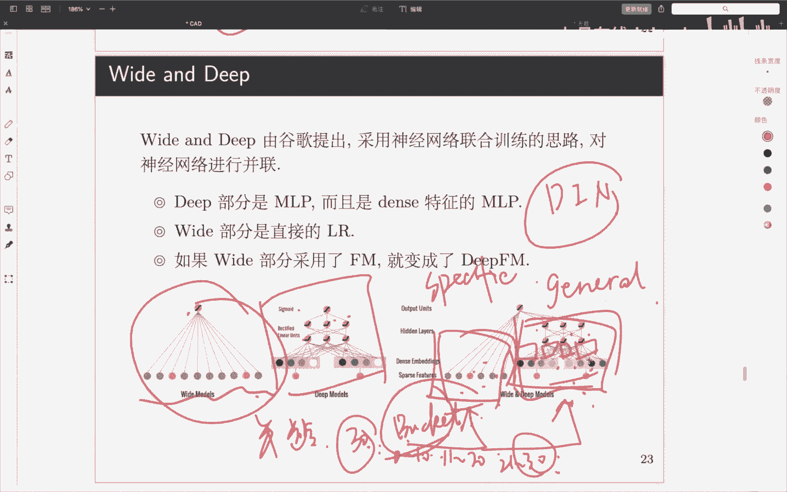

在线分配的基础是流量预测，即预估不同标签组合下的流量供给。常用方法是基于时间序列的短期预估。

频次控制是为了避免用户对同一广告感到疲劳，可通过客户端或服务端策略实现。

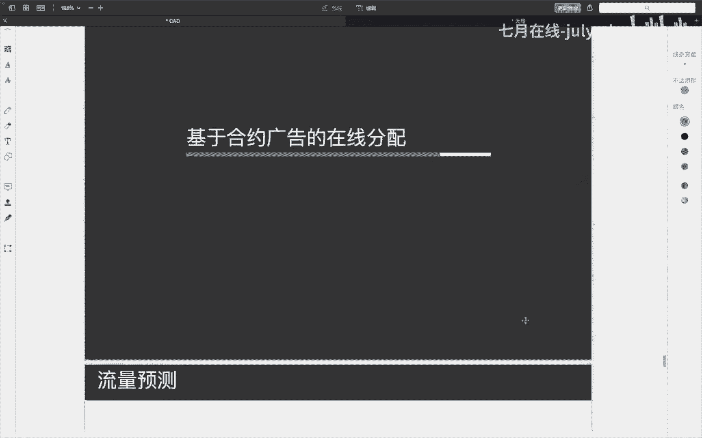

---

### 在线分配问题建模

在线分配问题可以形式化为一个约束优化问题。其核心约束包括：

1.  **供给方约束**：每个展示机会分配给各广告主的比例之和不超过1。
2.  **需求方约束**：
    *   **担保问题**：保证每个广告主获得约定的最低流量。
    *   **预算问题**：每个广告主的消耗不超过其预算。

---

### 解决方案

解决上述优化问题的方法包括：

*   **线性规划与二次规划**。
*   **对偶问题求解**：利用拉格朗日乘子法将原问题转化为对偶问题求解，并设计紧凑的分配方案。
*   **在线实时调整与补偿**：根据全天流量完成情况，动态调整后续时间段的分配策略。

---

## 📝 总结

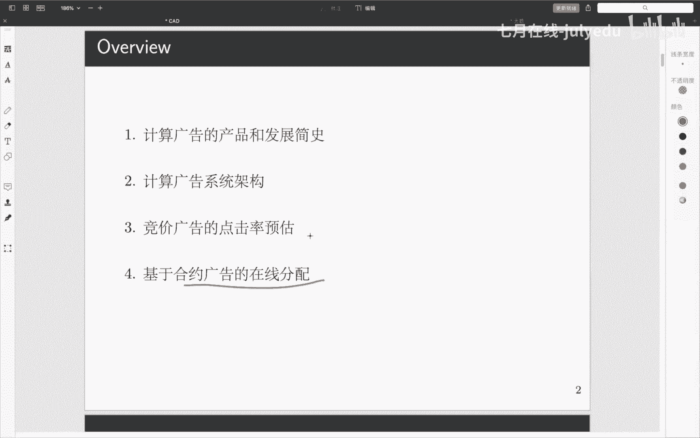

本节课我们一起学习了计算广告的核心知识。我们从计算广告的产品发展简史开始，了解了从合约广告、竞价广告到程序化交易广告的演进过程及其核心概念。接着，我们探讨了支撑这些广告产品的复杂系统架构。然后，我们深入研究了竞价广告的核心——点击率预估的各种模型与技术。最后，我们分析了合约广告中的在线分配问题及其解决方案。希望本课程能帮助你建立起对计算广告领域的整体认知。