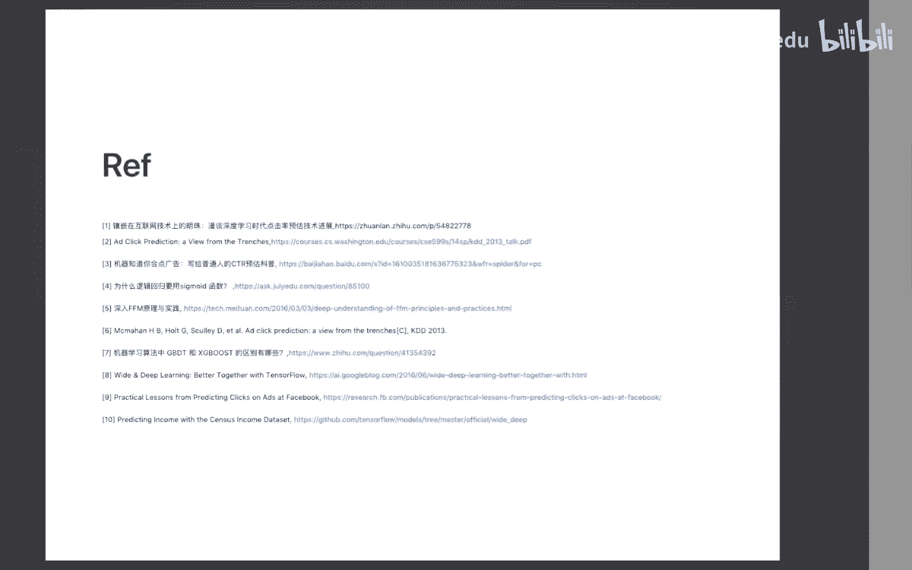

# 人工智能—计算广告公开课（七月在线出品） - P8：计算广告的核心：CTR预估 📈

在本节课中，我们将要学习计算广告领域的核心技术之一：点击率预估。我们将从问题背景出发，了解其重要性，并梳理其核心算法的发展脉络，最后通过一个经典比赛案例来巩固所学知识。

## 什么是CTR预估？🎯

CTR的全称是Click Through Rate，中文称为点击率。这个问题最初来源于互联网广告，具体来说是搜索引擎中的搜索广告。当用户在搜索引擎中输入关键词时，系统会展示广告。CTR预估就是预测用户点击某个广告的概率。

CTR预估技术之所以重要，被称为“镶嵌在互联网技术上的明珠”，是因为它与搜索引擎公司的核心商业模式和商业收入强相关。这项技术的发展历史几乎伴随着整个互联网技术的发展。

## CTR预估的应用场景 📱

CTR预估技术有两大经典应用场景：广告和推荐。

以下是几个典型的产品案例：
*   **搜索引擎广告**：例如百度和Google的搜索广告，这是其最核心的商业模式。
*   **电商广告**：例如阿里巴巴的广告系统，在淘宝搜索结果中融入广告商品。
*   **信息流推荐**：例如今日头条，其信息流内容推荐的核心技术之一就是CTR预估。

此外，任何标签为“是”或“否”（即0或1）的二分类问题，例如广告转化率预估、信用卡欺诈交易识别等，都可以借鉴CTR预估的思路来解决。

## 机器学习问题建模 🧠

上一节我们了解了CTR预估的应用场景，本节中我们来看看如何将“用户是否会点击广告”这个商业问题，形式化为一个标准的机器学习问题。

这个过程遵循经典的机器学习建模流程：
1.  **问题定义**：预估广告是否被点击是一个二分类问题。标签Y为0（未点击）或1（点击）。
2.  **特征提取**：从数据中抽取特征，表示为X。
3.  **模型假设**：假设标签Y和特征X之间存在一个函数关系H（即我们的算法模型）。模型H带有参数θ。
4.  **损失函数**：训练时需要最小化的目标，对于二分类问题，通常使用交叉熵损失函数。
5.  **模型训练**：通过优化算法（如梯度下降）寻找最优参数θ，使损失函数最小。
6.  **离线评估**：在测试集上评估模型性能，常用指标包括AUC（衡量排序能力）和LogLoss（衡量预估误差）。
7.  **线上验证**：将模型部署到线上进行A/B测试，观察业务指标（如线上CTR）是否提升。

不同的CTR预估算法，本质上对应着不同的模型假设H。

## 核心算法发展历程 🚀

在明确了问题建模方式后，我们来详细看看CTR预估领域常用的核心算法及其发展过程。这些算法在工业界被广泛使用。

以下是算法演进的主要阶段：

### 1. 逻辑回归
逻辑回归是CTR预估最经典、应用历史最长的算法之一。其模型假设H是特征X的线性加权和，再经过Sigmoid函数变换，得到点击概率。
**公式**：`P(Y=1|X) = sigmoid(W^T * X)`
它的优点是模型简单、可解释性强、易于大规模分布式实现，并支持在线学习。缺点是模型表达能力有限。

### 2. 因子分解机
为了提升模型表达能力，因子分解机系列算法被提出。它们的核心思想是引入特征之间的交互组合。
*   **FM**：在逻辑回归的基础上，增加了特征两两组合的隐向量内积项，以建模特征间的交互关系。
*   **FFM**：在FM的基础上引入了“域”的概念，同一个特征对于不同域的特征交互使用不同的隐向量，使得特征组合更加精细。

### 3. 在线学习与FTRL
之前的算法多属于批量学习，即每次训练需要使用全部历史数据，计算开销大。在线学习则支持用最新数据增量更新模型，学习更快，能及时适应数据变化。
FTRL是一种优秀的在线学习优化算法，它通过理论上的Regret分析，保证了在线学习的效果能够逼近批量学习的最优解。FTRL可用于优化逻辑回归、FM等模型。

### 4. 树模型与集成学习
以GBDT为代表的树模型是另一条技术路线。它通过集成多棵决策树来构建强大的预测模型。
**代表工具**：XGBoost, LightGBM。
其优点是对连续值特征处理友好、模型鲁棒性强、在小数据量上效果往往优于线性模型。缺点是大规模分布式实现相对复杂，模型结构更新较慢。

### 5. 深度模型与混合模型
随着深度学习兴起，CTR预估进入了深度模型时代。最具代表性的是Google提出的Wide & Deep模型。
*   **Wide部分**：线性模型（如逻辑回归），负责“记忆”，擅长处理大量稀疏的ID类特征，学习历史数据中频繁出现的模式。
*   **Deep部分**：深度神经网络，负责“泛化”，通过 embedding 和深层网络，学习特征之间的深层、非线性关系，能更好地处理未见过的特征组合。
这种混合架构巧妙地平衡了模型的记忆能力和泛化能力。

### 6. 特征工程自动化
Facebook提出的GBDT+LR模型，旨在用模型自动完成特征工程。其思路是先用GBDT模型对原始特征进行转换，将每棵树的叶子节点编号作为新的离散特征，再输入给LR模型。这相当于利用树模型自动进行了特征离散化、组合与筛选。

## 常用工具与资源 🛠️

了解算法后，我们需要掌握实现它们的工具。以下是一些常用工具：

**线性模型/FM模型**：
*   LibLinear / Scikit-learn：单机实现。
*   Spark MLlib：分布式实现。
*   LibFM / xLearn：专门针对FM/FFM的高效实现。

**树模型**：
*   XGBoost
*   LightGBM

**深度模型**：
*   TensorFlow：提供了Wide & Deep的官方教程。
*   DeepCTR：一个集成了众多深度CTR模型（如DeepFM, xDeepFM等）的开源项目，方便研究和实验。

## 实战练习：经典CTR预估比赛 🏆

理论需要结合实践。本节我们将通过一个经典的CTR预估比赛——Criteo Display Advertising Challenge，来巩固所学知识。

这是一个非常贴近真实广告业务场景的比赛，数据质量高，特征具有代表性。冠军解决方案中包含了大量特征工程的技巧和模型融合的智慧。

**学习建议**：
1.  **复现冠军方案**：仔细研究冠军分享的技术报告和代码，尝试使用LibFM等工具复现其核心特征工程和模型，理解每一步的动机。
2.  **尝试新算法**：用课程中学到的GBDT、Wide & Deep等新模型在该数据集上重新实验，看看能否超越几年前的冠军成绩。
3.  **深入思考**：在实践过程中，思考特征构建、模型选择背后的原因，这是提升机器学习实战能力的关键。

通过这个完整的练习，你将深刻理解CTR预估问题的核心挑战和解决方案。

## 总结 📝

本节课我们一起学习了计算广告的核心——CTR预估技术。我们从其商业背景和重要性讲起，了解了如何将点击率预测问题建模为机器学习中的二分类问题。随后，我们系统梳理了从经典的逻辑回归、因子分解机，到在线学习FTRL，再到树模型GBDT，以及当前主流的深度混合模型（如Wide & Deep）的算法发展历程。最后，我们介绍了相关的实用工具，并通过一个经典比赛案例指出了将理论付诸实践的最佳路径。掌握CTR预估，不仅是进入计算广告领域的钥匙，也是理解大规模机器学习应用的一个绝佳范例。