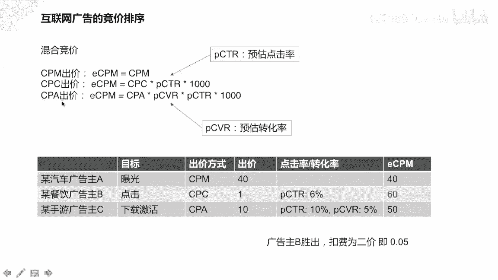
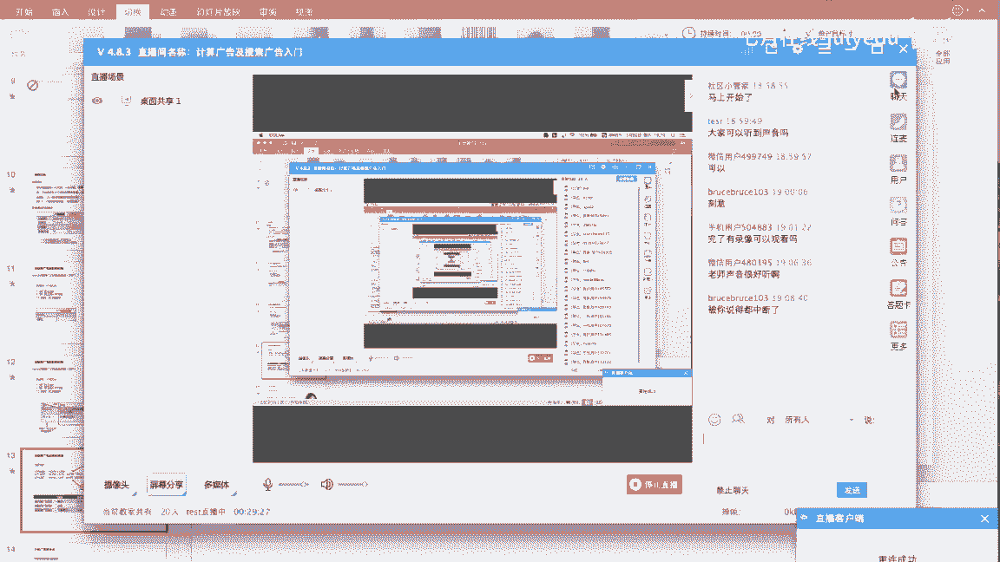
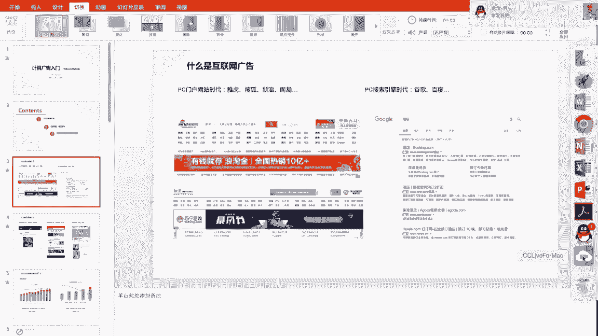
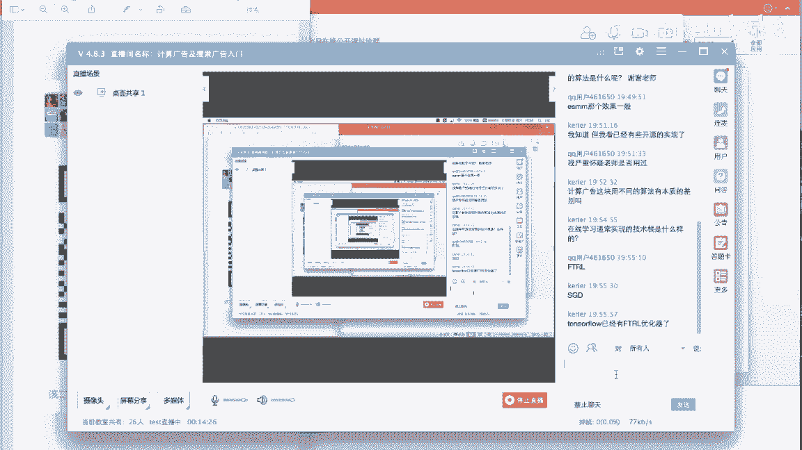
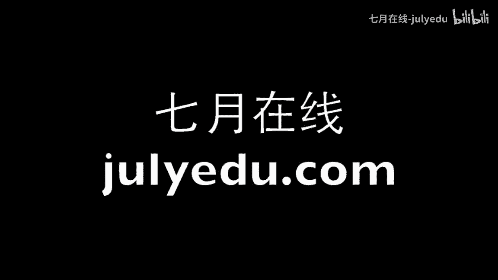

# 人工智能—计算广告公开课（七月在线出品） - P9：计算广告及搜索广告入门 🎯

在本节课中，我们将要学习计算广告的基础知识，包括互联网广告的商业模式、核心的拍卖与竞价排序机制，以及成为一名广告算法工程师所需的关键技能。

## 什么是互联网广告？💻

上一节我们介绍了课程概述，本节中我们来看看什么是互联网广告。互联网广告随着技术发展，其形态也在不断演变。

在PC门户网站时代，如雅虎、搜狐、新浪、网易等网站，广告主要以大型横幅广告（Banner）的形式出现。这种广告售卖媒体资源的方式，与传统的电视广告和报纸广告较为相似。

随后进入PC搜索引擎时代，以谷歌、百度为代表，广告主通过购买关键词进行广告投放。当用户搜索特定关键词时，相关广告会通过竞价排名机制获得展现机会。

在移动互联网时代，广告形式变得更加多样化。以下是几种主要类型：

*   **移动社交广告**：出现在微信朋友圈、QQ空间等社交平台。
*   **移动媒体广告**：出现在今日头条、抖音等信息流和短视频平台。
*   **电商推广广告**：出现在淘宝、京东等电商平台，用于推广商品。

## 为什么互联网公司热衷广告？💰

互联网公司热衷于广告业务的原因非常简单：广告是其主要收入来源。例如，谷歌母公司Alphabet约84%的营收来自广告，百度约82%的营收来自广告。这也解释了为何广告算法工程师的薪酬颇具竞争力。

## 互联网广告的商业模式 🏷️

互联网广告主要有三种出价与计费模式：

*   **CPM**：按千次展现收费。广告每展示一千次，广告主即支付一次费用。
*   **CPC**：按点击收费。这是目前流行的一种方式，只有当用户点击了广告链接后，广告主才会被扣费。
*   **CPA**：按行动成本收费。这是一种按广告投放实际效果计费的方式，例如按照有效的用户注册或激活行为进行计费，而不限制广告的投放量。

## 广告拍卖机制 ⚖️

上一节我们了解了广告的商业模式，本节中我们来看看广告资源是如何通过拍卖机制售卖的。

常见的拍卖方式有多种。例如，公开增价拍卖是电视上常见的形式，参与者依次加价，直到无人再加价时成交。而荷兰式拍卖则是公开减价拍卖，拍卖师从一个高价开始逐步降价，直到有参与者接受当前价格。

在互联网广告中，普遍采用的是**第二价格密封拍卖**。要理解它，首先需要了解密封拍卖，即每个参与者不知道其他人的出价，例如招投标。在第一价格密封拍卖中，出价最高者获胜，并按自己的出价结算。而在第二价格密封拍卖中，出价最高者同样获胜，但结算时按出价第二高的价格支付。

为什么互联网广告选择第二价格密封拍卖呢？我们可以通过一个简单的博弈模型来分析。在第一价格拍卖中，广告主的收益是其对广告的认可价值减去自己的出价。这会导致广告主有不断试探性降低出价的动力，使得整个竞价系统不稳定。而在第二价格拍卖中，无论广告主如何调整出价，其最优策略始终是“诚实出价”，即出价等于自己对广告的认可价值。这使得竞价系统更加稳定，广告主无需过度关注他人的出价策略。

## 广告竞价排序机制 📊

在实际场景中，通常有多个广告主竞争同一个广告展示位。这时，系统需要通过竞价排序机制来决定展示哪个广告。

由于广告主可能采用不同的出价模式，系统需要将它们统一到同一个维度进行比较，这个维度就是**eCPM**。eCPM代表预估的千次展现收益。

以下是不同出价模式折算为eCPM的公式：

*   **CPM出价**：`eCPM = CPM`
*   **CPC出价**：`eCPM = CPC * pCTR * 1000`
*   **CPA出价**：`eCPM = CPA * pCTR * pCVR * 1000`

其中，`pCTR`是预估点击率，`pCVR`是预估转化率。

假设有三个广告主竞争同一个广告位：
*   广告主A（汽车品牌）采用CPM出价40元。
*   广告主B（餐饮优惠券）采用CPC出价1元，其广告的`pCTR`为6%。
*   广告主C（手游下载）采用CPA出价10元，其广告的`pCTR`为10%，`pCVR`为5%。

计算他们的eCPM：
*   A: 40元
*   B: `1 * 0.06 * 1000 = 60`元
*   C: `10 * 0.10 * 0.05 * 1000 = 50`元

因此，广告主B胜出。但根据第二价格拍卖规则，B的实际扣费会按照第二高的eCPM，即广告主C的50元进行结算。

从这个过程可以看出，**预估点击率**和**预估转化率**是广告排序算法中的核心环节。

## 广告算法工程师的核心技能 🛠️

上一节我们介绍了竞价排序机制，本节中我们来看看支撑这套系统运转的算法工程师需要哪些技能。

广告界有一个著名的“哥德巴赫猜想”：广告主有一半的广告费被浪费了，但不知道是哪一半。广告算法工程师的核心任务之一就是通过技术手段减少这种浪费。

一个典型的广告投放流程涉及用户画像、广告召回、竞价排序、展现与转化跟踪等环节。这其中的技术挑战包括复杂的定向规则、海量的用户与广告数据、高并发的实时请求以及极低的延迟要求。

广告算法涉及的技术点非常广泛，主要包括以下几类：

**1. 点击率/转化率预估**
这是一个经典的机器学习二分类问题。系统需要预测在特定场景下，某条广告被用户点击或发生转化的概率。使用的特征包括场景特征、广告特征、媒体特征和用户特征。模型从传统的逻辑回归、GBDT，到复杂的深度模型如Wide & Deep、DIN、DIEN等都有应用。提升预估准确性哪怕一个百分点，都可能为大型平台带来每日数百万的收入增长。

**2. 自然语言处理技术**
在搜索广告等领域应用广泛。主要包括：
*   **查询改写**：将用户搜索词映射到更规范或更易召回广告的形式。
*   **查询分析与召回**：理解查询意图并召回相关广告。
*   **语义相关性**：计算查询与广告之间的语义匹配度。
*   **创意生成**：自动生成广告标题或文本摘要。

**3. 计算机视觉技术**
主要用于广告创意环节。例如：
*   **图像分类与质量评估**：判断图片是否吸引点击且符合法规。
*   **智能创意**：自动从网页中抓取并组合图文生成广告。
*   **图像特征提取**：将图像转化为特征向量，作为CTR预估模型的一维特征，常用ResNet、VGG等模型。

**4. 机制设计与博弈论**
这是计算广告区别于一般机器学习任务的独特领域。例如：
*   **智能调价**：如何根据广告主的目标自动优化其出价。
*   **流量分配**：在合约广告中，如何在不同时间段合理分配广告库存。
*   **强化学习应用**：模拟广告主的出价行为，优化整体拍卖效果。

**5. 人群定向与扩展**
精准找到目标用户是广告效果的关键。除了基础属性定向，还包括：
*   **兴趣定向**：根据用户历史行为挖掘其商业兴趣。
*   **消费能力定向**。
*   **相似人群扩展**：基于社交网络等图数据，找到与种子用户相似的人群，常用Graph Embedding技术。

对于广告算法工程师而言，需要了解的技术面较广，但通常只需在某一两个领域有深入专长即可，例如精通CTR预估、NLP或机制设计中的任一方向。

## 总结 📝

本节课中我们一起学习了计算广告的基础入门知识。我们首先认识了互联网广告的形态与商业模式，理解了CPM、CPC、CPA等核心概念。接着，我们深入探讨了支撑互联网广告运行的**第二价格密封拍卖**机制及其稳定性原理，并学习了如何通过**eCPM**将不同出价模式的广告放在同一维度进行**竞价排序**。最后，我们概述了成为一名广告算法工程师可能涉及的五大类核心技术：**点击率预估**、**自然语言处理**、**计算机视觉**、**机制设计**以及**人群定向**。这些技术共同构成了现代计算广告系统的基石。