# 🎓 人工智能—计算机视觉CV公开课（七月在线出品） - P1：2小时杀入视觉赛题前10%

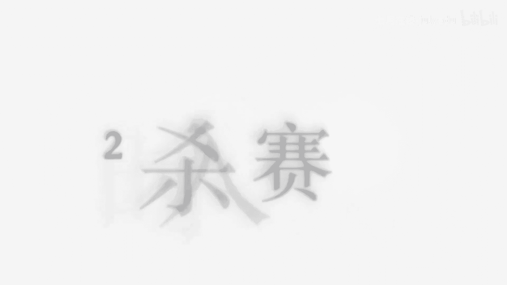

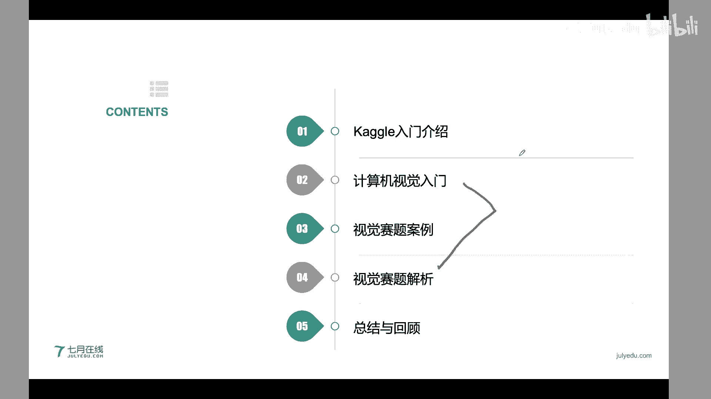

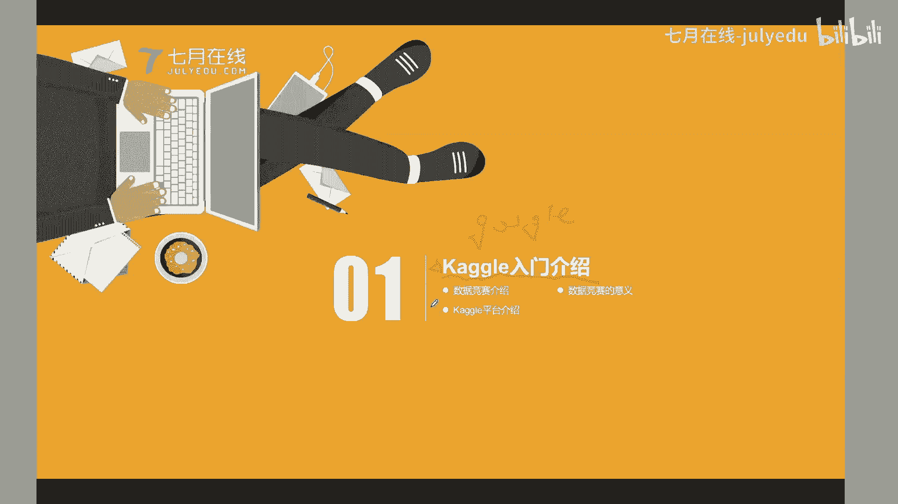

在本节公开课中，我们将学习如何快速入门计算机视觉竞赛，掌握核心解题思路，并了解如何通过系统学习提升在Kaggle等平台上的竞赛成绩。课程内容轻松易懂，旨在帮助初学者在两小时内掌握关键知识点。

## 📊 第一部分：Kaggle竞赛简介

Kaggle是一个被谷歌收购的全球性数据科学竞赛平台。它以具体问题为导向，聚合跨学科人才，利用数据研发算法模型，探索解决方案。

数据竞赛是一种众包模式。参赛者在规定时间内提交算法模型，平台通过定量和交互式的评分机制进行排名。这种竞赛通常面向公众开放，具有明确的业务背景，旨在解决工业或学术界的实际问题。

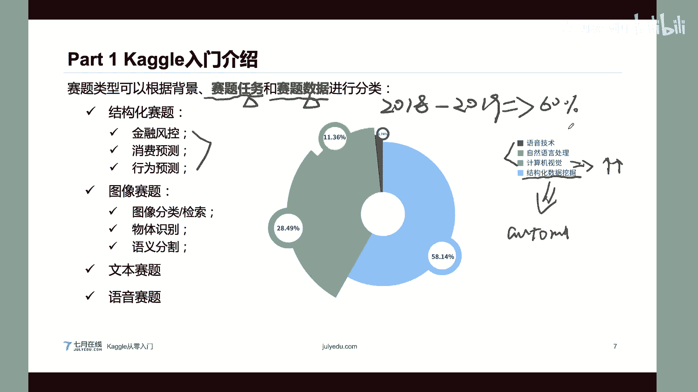

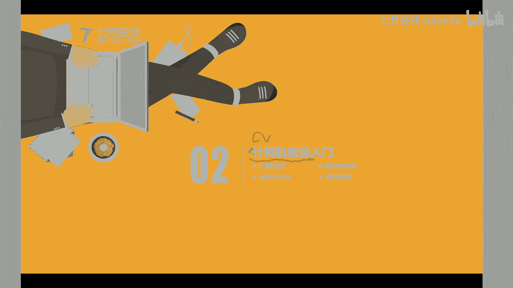

与传统的学科竞赛相比，数据竞赛具有以下特点：
*   **内容不同**：关注数据挖掘、机器学习算法及相关业务，而非特定学科知识点。
*   **反馈机制**：支持每日多次提交并即时获得评分反馈，而非“一锤定音”。
*   **评分方式**：采用精确的定量打分（如准确率到小数点后多位）。
*   **交互性**：提交代码或模型后，系统自动评估并反馈结果，更符合数据挖掘的实际流程。

Kaggle平台为每个比赛提供了完整的页面，包含赛题介绍、数据集、Notebook（在线编程环境）、讨论区和排行榜，是目前最成熟、含金量最高的竞赛平台之一。

竞赛可以根据任务或数据类型进行划分：
*   **按任务**：可分为结构化数据（如金融风控）、计算机视觉（如图像分类）、自然语言处理（如文本分类）、语音处理等。
*   **按数据**：可分为结构化数据（表格数据）和非结构化数据（图像、文本、语音）。近年来，非结构化数据相关的竞赛比例显著上升。

本节课我们将聚焦于**计算机视觉（CV）** 领域的赛题。

## 👁️ 第二部分：计算机视觉入门指南

计算机视觉是让机器获得“看”和理解能力的一门科学。对于计算机而言，一张图像本质是一个三维张量（矩阵），例如 `H x W x C`（高度 x 宽度 x 通道数）。然而，人眼并非逐像素理解，而是感知语义信息，这之间存在“语义鸿沟”。

目前的技术尚无法让机器像人一样通用地理解图像。现有的计算机视觉算法多是针对特定任务（如人脸识别、车牌识别）分别建模，属于“狭义人工智能”。

计算机视觉应用广泛，如安防、智慧城市、自动驾驶等。但现有算法在复杂场景（如小目标、遮挡、环境干扰）下仍难以达到100%的精度，存在提升空间。

### 计算机视觉学习路线建议

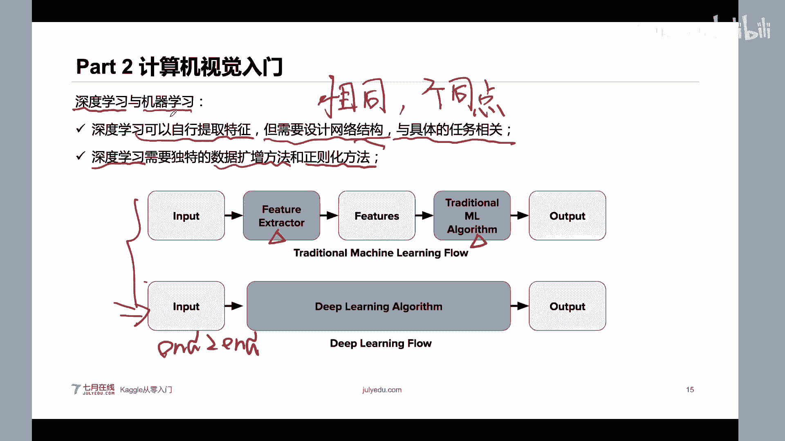

以下是系统学习计算机视觉的五阶段路线：
1.  **计算机视觉基础**：学习数字图像处理、颜色空间、特征提取（如边缘、角点）等。
2.  **机器学习与深度学习基础**：掌握机器学习原理、神经网络，特别是卷积神经网络（CNN）的原理与实战。
3.  **深度学习进阶**：了解CNN模型发展脉络（如AlexNet, VGG, ResNet），学习大规模图像检索、行人重识别、目标检测基础等。
4.  **目标跟踪与语义分割**：掌握相关算法与应用。
5.  **视觉项目实战**：进行实际项目演练，可能涉及强化学习、模型部署等。

### 计算机视觉的核心任务

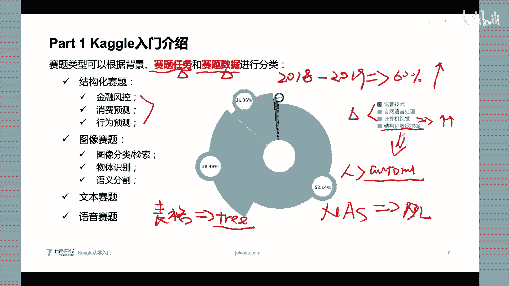

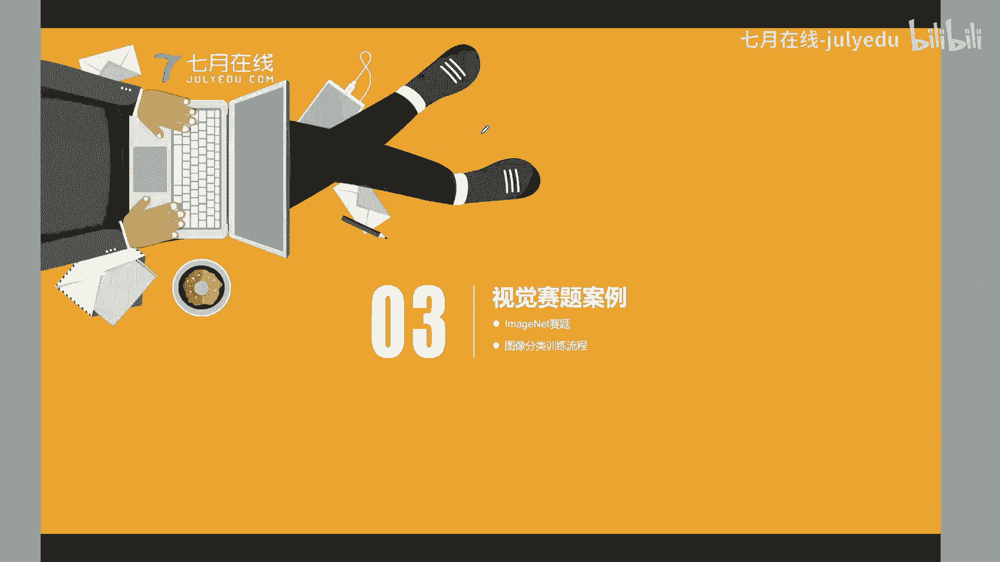

常见的计算机视觉任务包括：
*   **图像分类**：识别图像主体类别（如动物分类）。
*   **物体检测**：定位并识别图像中的单个或多个物体（如行人检测、车牌识别）。
*   **实例分割**：在物体检测基础上，精确分割出每个物体的像素轮廓。

这些任务是许多高级应用（如自动驾驶中的交通标志识别、安防中的人脸检测）的基础。

### 深度学习与卷积神经网络

深度学习是机器学习的一个分支，在计算机视觉中占据主导地位，主要因为：
*   **精度更高**：在多数任务上超越传统机器学习方法。
*   **适用性广**：特别擅长处理图像、语音等非结构化数据。
*   **可迁移性强**：在一个数据集上预训练的模型，可以较容易地迁移到新任务上。

深度学习是一种“表征学习”，通过多层网络自动学习数据的层次化特征。CNN因其能有效提取图像的局部特征（如边缘、纹理），成为计算机视觉的首选网络结构。

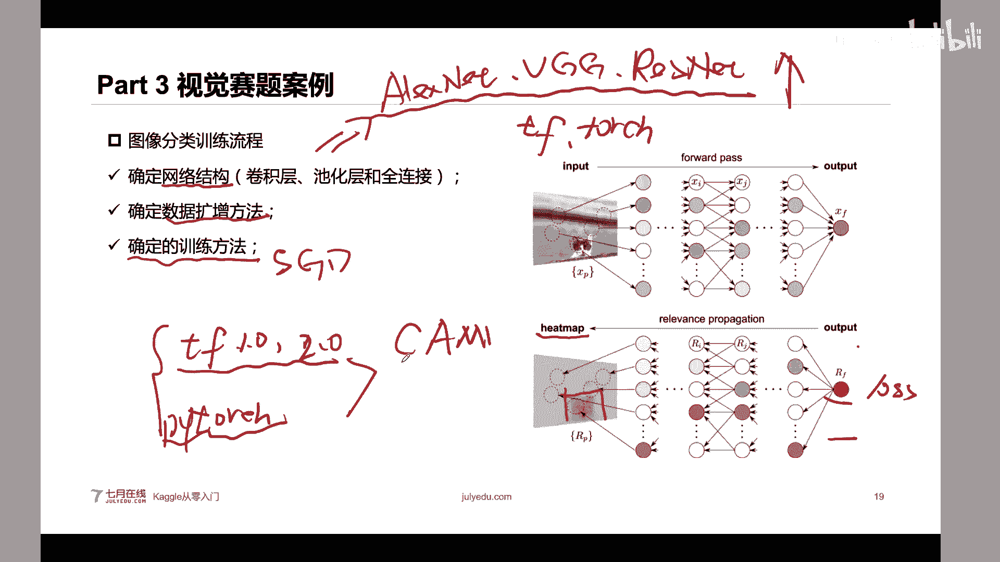

**深度学习 vs. 传统机器学习流程对比**：
*   **传统机器学习**：`输入 -> (人工)特征提取 -> 模型 -> 输出`
*   **深度学习**：`输入 -> 端到端网络（自动特征提取+模型） -> 输出`

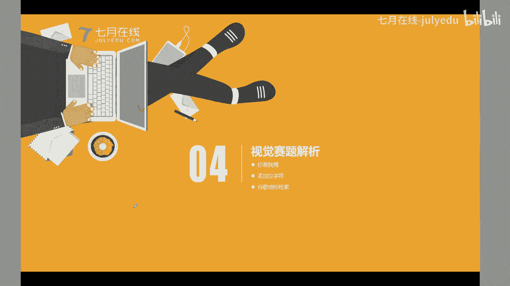

深度学习能自动提取特征，但需要精心设计网络结构，并常需配合数据增强和正则化方法来防止过拟合。

## 🧩 第三部分：视觉赛题案例解析 - ImageNet图像分类

ImageNet是一个包含千万级图像、1000个类别的经典数据集，极大推动了深度学习在CV领域的发展。在ImageNet上预训练的模型，其学到的特征（如浅层网络的边缘、纹理信息）具有通用性。

### 迁移学习的价值

我们可以利用在ImageNet上预训练的模型，通过**迁移学习**快速适应新任务：
1.  **复用参数**：将预训练模型的参数作为新任务模型的初始化。
2.  **微调**：使用新任务的数据对模型参数进行微调。

迁移学习能显著减少新任务所需的数据量、缩短训练时间、并提供更好的参数起点，从而提高模型精度。

### 构建图像分类模型的流程

1.  **确定网络结构**：选择或设计CNN网络，如ResNet, EfficientNet等。
2.  **确定数据增强方法**：对训练图像进行变换（如翻转、旋转、裁剪、加噪），以增加数据多样性并防止过拟合。需注意，增强方法需符合任务逻辑（如手写数字可水平翻转，但交通标志可能不行）。
3.  **确定训练方法**：使用随机梯度下降等优化算法，结合反向传播进行训练。现代框架（如TensorFlow, PyTorch）已封装了大部分计算细节。

## 🏆 第四部分：Kaggle视觉竞赛实战案例

### 案例一：谷歌涂鸦识别挑战

**赛题**：对全球用户手绘的涂鸦（共5000万张，340类）进行分类。
**难点**：数据量巨大（远超ImageNet），图像尺寸大（512x512），训练周期长。
**解题核心思路**：
1.  **数据转换**：将存储鼠标轨迹的JSON数据绘制成图像。为适配三通道预训练模型，可在不同通道绘制不同粗细的笔画，以编码更多信息。
2.  **模型选择**：在模型复杂度（精度）与训练时间之间权衡，可选择MobileNet等轻量模型起步。
3.  **渐进式训练**：由于直接训练大尺寸图像困难，采用 **“逐步放大”策略**：
    *   先在缩小的图像（如64x64）上训练模型至收敛。
    *   然后将图像尺寸放大一倍（如128x128），加载上一步训练好的权重进行微调。
    *   重复此过程，直至达到原始尺寸（512x512）。这比直接训练大尺寸图像更高效且精度更高。
4.  **高级技巧**：使用MixUp、CutOut等数据增强方法；利用测试集类别分布均匀的特点进行后处理（如类别平均）。

### 案例二：孟加拉语手写字符识别

**赛题**：识别孟加拉语手写字符，每个字符有三个独立标签：字根(G, 168类)、元音(V, 11类)、辅音(C, 7类)。这是一个多标签分类问题。
**难点**：测试集中出现了训练集未出现过的G-V-C组合（约200种），即出现了“新字符”，容易导致模型在B榜（私有榜）上表现不佳。
**解题核心思路**：
*   **思路一：未知样本检测与分治**
    1.  使用ArcFace等损失函数训练一个模型，使同类特征紧凑、异类特征分离。
    2.  计算训练集中所有已知字符的特征中心。
    3.  对测试样本，计算其与所有已知特征中心的距离。若距离过远，则判定为“未知字符”。
    4.  对“已知字符”和“未知字符”分别用不同策略的模型进行预测（如欠拟合模型独立预测G/V/C，过拟合模型学习组合关系）。
*   **思路二：合成未知样本**
    1.  利用孟加拉语的字体文件（TTF/TTC），生成训练集中缺失的G-V-C组合字符图像。
    2.  使用风格迁移模型，将这些印刷体字符转换为手写风格。
    3.  将合成数据加入训练集，让模型直接学习所有可能的字符。

### 案例三：谷歌地标图像检索

**赛题**：构建地标检索系统，即“以图搜图”，找出包含相同地标的图片。
**核心概念**：图像检索的本质是**特征提取与相似度匹配**。
**基本流程**：
1.  **特征提取**：使用CNN模型（如ResNet）提取图像的特征向量（Feature Map）。
2.  **特征池化**：使用池化层（如GeM, Generalized Mean Pooling）将特征图聚合为一个固定长度的特征向量。池化方式对检索性能影响很大（Max Pooling利于保留关键点）。
3.  **检索**：计算查询图像的特征向量与图像库中所有特征向量的相似度（如余弦相似度），返回最相似的图像。
**提分技巧**：
*   **测试时数据增强**：对查询图像进行多次裁剪，分别检索后融合结果。
*   **查询扩展**：将初次检索到的Top-K结果的特征进行平均，用这个平均特征再次检索，以提升召回率。
*   **索引加速**：对于大规模图像库，需使用PCA降维、聚类索引等方法加速检索过程。

## 📝 第五部分：总结与展望

### 本节课程总结

1.  **深度学习是基础**：掌握深度学习，特别是CNN的原理与技巧，是解决视觉赛题的必要条件。
2.  **具体问题具体分析**：不同赛题的数据增强方法、训练策略可能截然不同，需灵活应对。
3.  **模型诊断指南**：遵循一个系统化的模型诊断流程（如下图），能高效定位问题并找到改进方向。
    *   训练集误差大 -> 使用更强大的模型。
    *   验证集误差大（训练集误差小）-> 增加正则化（数据增强、Dropout等）。
    *   公开榜（A榜）误差大 -> 检查训练集与测试集分布是否一致，尝试数据合成或领域适应。
    *   私有榜（B榜）误差大（A榜误差小）-> 可能过拟合了A榜，需减少针对A榜的调参，增强模型泛化能力。

### 未来展望

1.  **竞赛趋势**：视觉竞赛将越来越多，且难度和业务贴近度会不断提升。
2.  **赛题类型**：单纯的图像分类赛题将减少，物体检测、语义分割、多模态（图像+文本）等更复杂的赛题将成为主流。

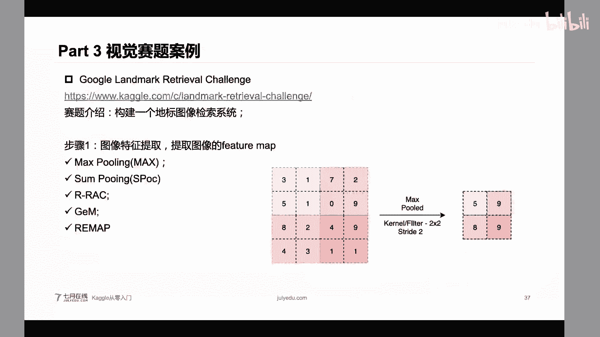

通过系统学习（如参加专业的CV就业班）和竞赛实战，可以快速提升在计算机视觉领域的技术实力和竞赛水平。希望本课程能为大家的CV学习之路提供一个清晰的起点。

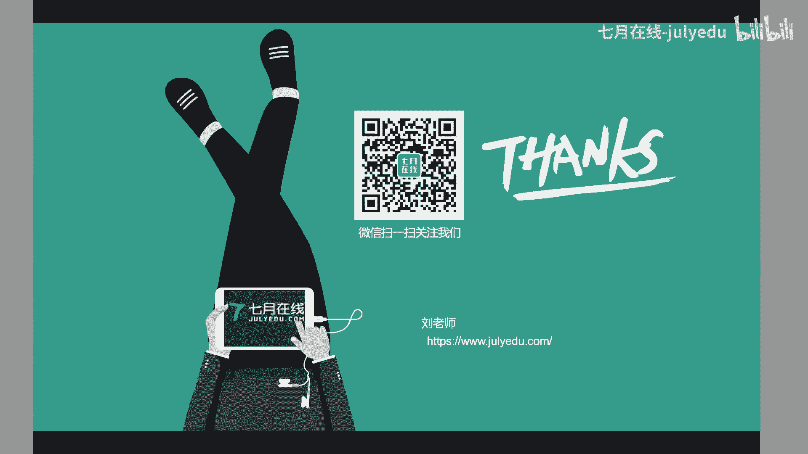

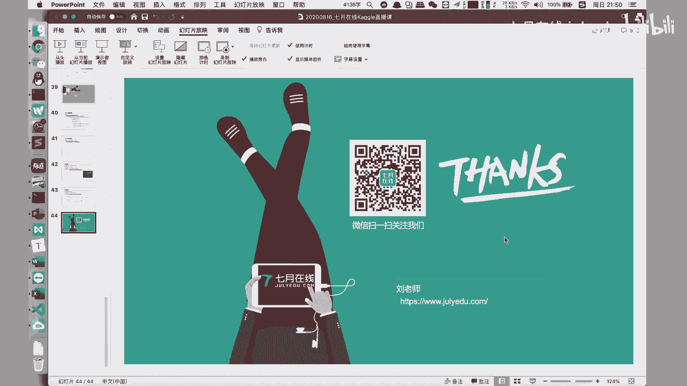

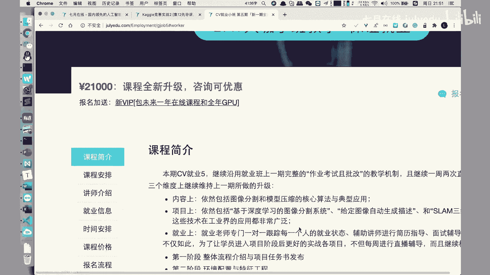

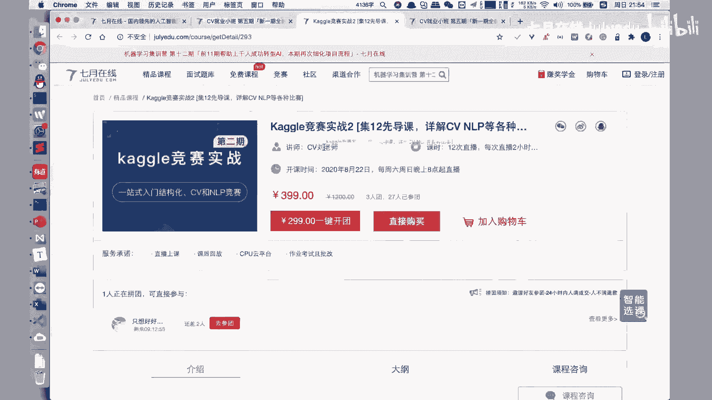

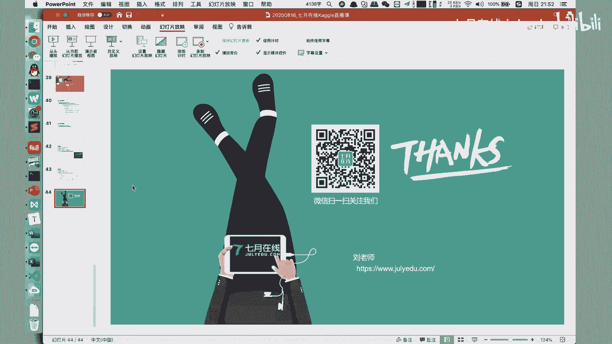

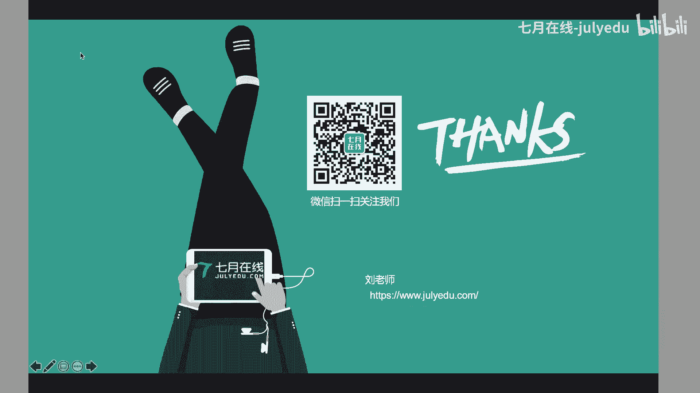

