# 🎯 人工智能—计算机视觉CV公开课 P10：物体分割Mask RCNN理论与实战

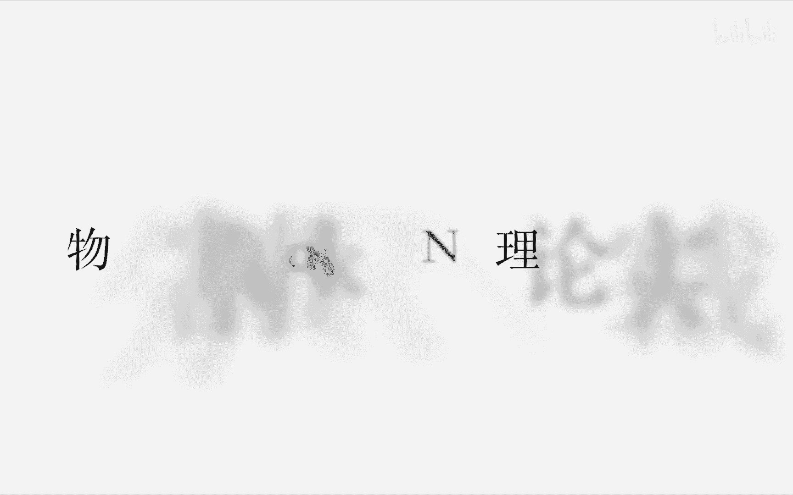

在本节课中，我们将要学习物体分割（Instance Segmentation）的核心概念，特别是基于Mask RCNN的方法。我们将从卷积神经网络（CNN）的基础理论回顾开始，逐步深入到目标检测（RCNN系列）的演进，最终详细讲解Mask RCNN的原理、改进点及其实际应用。课程内容力求简单直白，让初学者能够理解。

## 📚 概述：视觉感知的基本问题

视觉感知主要解决四个基本问题：
1.  **分类**：识别图像中的内容是什么。
2.  **检测**：确定目标物体的位置（边界框）并识别其类别。
3.  **语义分割**：对图像中的每个像素进行分类，但不区分同一类别的不同个体（例如，将所有人分割为“人”这个类别）。
4.  **实例分割/物体分割**：在检测的基础上，精确分割出每个物体的轮廓，并能区分同一种类的不同个体（例如，区分图像中的每一个人）。

本节课的重点是**实例分割**，我们将以Mask RCNN作为核心模型进行讲解。

## 🧠 第一部分：卷积神经网络（CNN）理论回顾

上一节我们概述了视觉任务，本节中我们来看看实现这些任务的基础技术——卷积神经网络。理解CNN是理解后续所有高级模型的关键。

CNN并非全新理论，其概念早在1998年的LeNet-5中就已提出。如今的流行得益于数据量的积累和算力的提升，使其在视觉任务中大放异彩。

一个典型的CNN结构包含以下层：
*   **卷积层**：使用卷积核在图像上滑动，进行特征提取。
*   **下采样层（池化层）**：降低特征图尺寸，增强特征不变性。
*   **全连接层**：将提取的特征用于最终分类或回归。

### 核心操作与数学表达

以下是CNN中的核心概念：

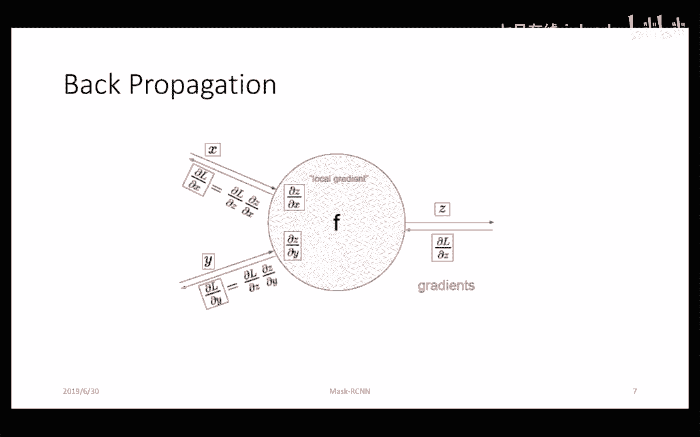

*   **卷积操作**：本质上是矩阵运算，其数学表达为加权求和。
    **公式**：`输出 = Σ (输入特征 Xi * 卷积核权重 Wi) + 偏置 b`
*   **激活函数**：在卷积后引入非线性变换，如ReLU、Sigmoid。
*   **损失函数**：衡量模型预测与真实标签的差距。对于回归问题，常用均方误差（MSE）。
    **公式**：`L = 1/N * Σ (预测值 - 真实值)^2`
*   **反向传播（BP）与梯度下降**：通过链式法则计算损失函数对网络权重的梯度，并利用梯度下降法更新权重，使损失最小化。这是训练神经网络的核心算法。

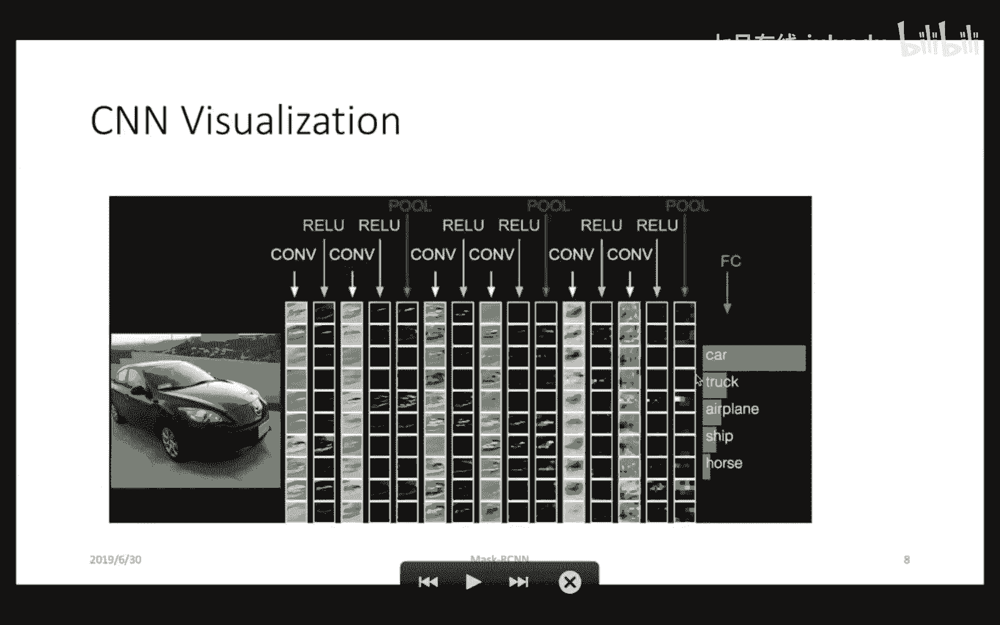

简单来说，CNN通过多层卷积和非线性变换，从图像中提取出高层语义特征，最终通过这些特征完成分类等任务。

## 🔍 第二部分：目标检测（Object Detection）演进之路

在回顾了CNN的基础后，我们进入目标检测领域。本节我们将看到检测模型如何从RCNN一步步演进到更高效的Faster RCNN。

### RCNN：区域提议与卷积特征提取

RCNN的思路直观但效率较低：
1.  **生成候选区域**：使用传统方法（如Selective Search）在图像中生成约2000个可能包含物体的区域（Region of Interest， ROI）。
2.  **特征提取**：将每个ROI区域缩放（Warp）到统一尺寸，分别输入CNN提取特征。
3.  **分类与回归**：对提取的特征，使用支持向量机（SVM）进行分类，并使用边界框回归（Bounding Box Regression）精修位置。

**RCNN的主要问题**：对大量重叠的ROI进行独立的CNN前向传播，计算冗余严重；区域提议阶段耗时。

### Fast RCNN：共享卷积计算

Fast RCNN针对RCNN的计算冗余进行了关键改进：
1.  **整体特征提取**：先对整个输入图像进行一次CNN前向传播，得到整张图的特征图（Feature Map）。
2.  **区域映射**：将Selective Search生成的ROI映射到特征图上对应的区域。
3.  **ROI池化**：通过ROI池化层，将不同尺寸的ROI特征转换为固定尺寸的特征。
4.  **分类与回归**：将固定尺寸的特征送入全连接层，同时完成分类和边界框回归。

**改进效果**：大幅减少了卷积计算量，提升了效率。但区域提议仍依赖传统方法。

### Faster RCNN：端到端的区域提议

Faster RCNN的核心创新是将区域提议也集成到神经网络中，实现端到端训练。
1.  **区域提议网络（RPN）**：在主干网络提取的特征图上，使用一组预先定义好的、不同尺寸和长宽比的“锚框”（Anchor）进行滑动。RPN网络判断每个锚框内是否包含物体（二分类），并初步调整锚框位置。
2.  **特征共享**：RPN和后续的检测头（Fast RCNN部分）共享同一个特征图。
3.  **两阶段训练**：通常先训练RPN生成提议区域，再固定RPN训练检测头。也可进行交替训练。

**核心优势**：区域提议过程也由可学习的神经网络完成，速度更快，且提议质量更高。

## 🎭 第三部分：实例分割与Mask RCNN详解

理解了目标检测的框架后，我们终于可以进入本节课的核心——实例分割模型Mask RCNN。它是在Faster RCNN框架上的自然延伸。

### Mask RCNN：Faster RCNN + FCN

用一句话概括：**Mask RCNN = Faster RCNN + 全卷积网络（FCN）**。

它在Faster RCNN的两个输出分支（分类分支、边界框回归分支）基础上，增加了第三个分支：**Mask预测分支**。
*   该分支是一个小型FCN，对每个ROI区域进行像素级的二分类（判断每个像素是否属于该ROI所检测到的物体类别）。
*   它利用分类分支提供的类别信息，只为对应的类别生成掩码（Mask），最终输出一个二值掩码图。

### 关键技术：特征金字塔网络（FPN）

物体尺度变化是视觉任务的一大挑战。CNN深层特征语义信息强但分辨率低，对小物体不敏感；浅层特征分辨率高但语义信息弱。

FPN通过**自顶向下路径**和**横向连接**，将深层的强语义特征与浅层的高分辨率特征融合，构建了具有丰富多尺度信息的特征金字塔。Mask RCNN常采用FPN作为主干网络，显著提升了对不同尺度物体的检测与分割精度。

### 关键技术：ROIAlign

在Faster RCNN的ROI池化中，存在两次量化取整操作（将ROI坐标映射到特征图，再将特征图网格划分），这会导致像素级任务（如分割）出现偏差。

**ROIAlign** 取消了量化操作，使用**双线性插值**方法，精确计算每个池化采样点的特征值。这避免了量化误差，使特征图与原始图像像素对齐更精确，对分割任务至关重要。

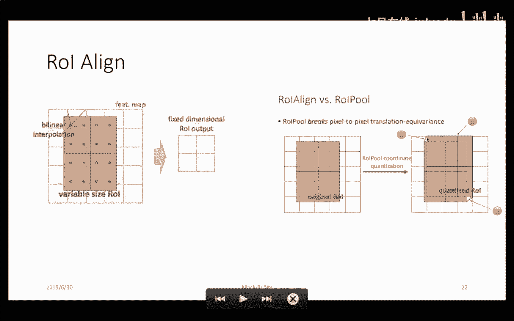

### 损失函数

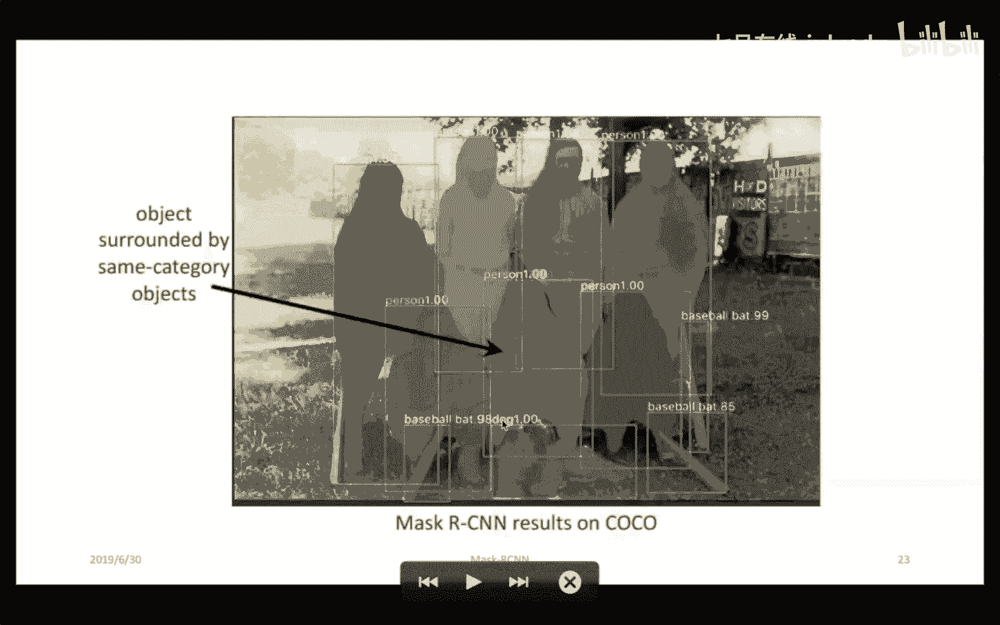

Mask RCNN的损失函数由三部分组成：
**公式**：`L = L_class + L_box + L_mask`
*   `L_class`：分类损失。
*   `L_box`：边界框回归损失。
*   `L_mask`：掩码预测损失（对每个ROI，在特定类别上计算平均二值交叉熵损失）。

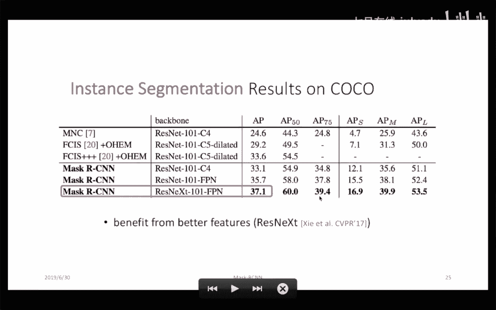

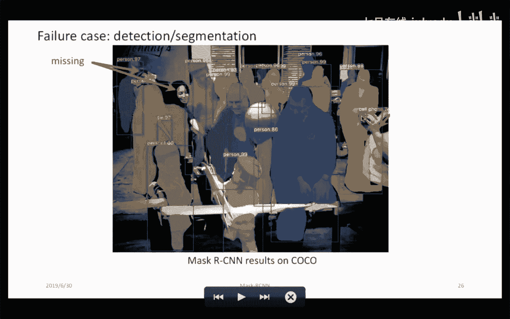

## 💻 第四部分：Mask RCNN实战指南

理论最终需要付诸实践。本节将简要介绍如何运行和训练一个Mask RCNN模型。

目前有多种框架实现了Mask RCNN，其中Facebook开源的**PyTorch版本**较为流行且易于使用。

### 环境安装与Demo运行

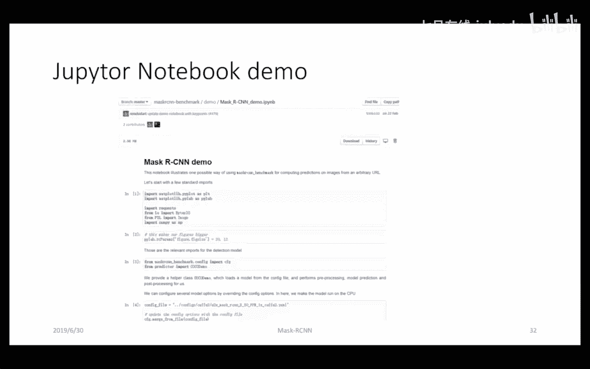

以下是关键的实践步骤：

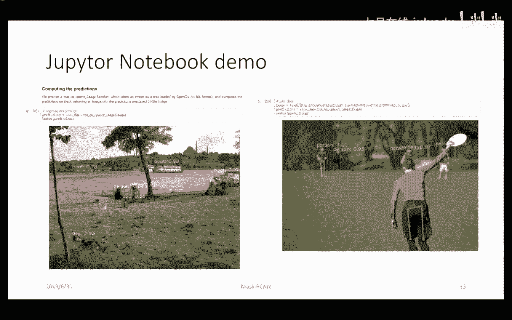

1.  **安装**：按照官方README安装依赖。注意PyTorch和Torchvision的版本需与CUDA版本匹配。
2.  **运行Demo**：项目提供了Webcam实时演示和Jupyter Notebook示例。若无摄像头，可修改代码读取静态图片进行推理。
3.  **查看结果**：Demo会展示实例分割（以及可选的人体关键点检测）的可视化效果。

### 训练自定义数据集

若要训练自己的数据，需进行以下配置：

1.  **数据准备**：使用标注工具（如LabelMe）标注图像，生成包含多边形轮廓的JSON文件。需将数据转换为模型要求的格式（如COCO格式）。
2.  **修改配置**：
    *   在配置文件中指定自定义数据集的路径和类别数。
    *   修改模型配置（如`configs/`下的yaml文件），指定主干网络、是否从预训练模型微调等。
    *   调整超参数（如学习率）。
3.  **开始训练**：执行训练脚本，指定配置文件路径。

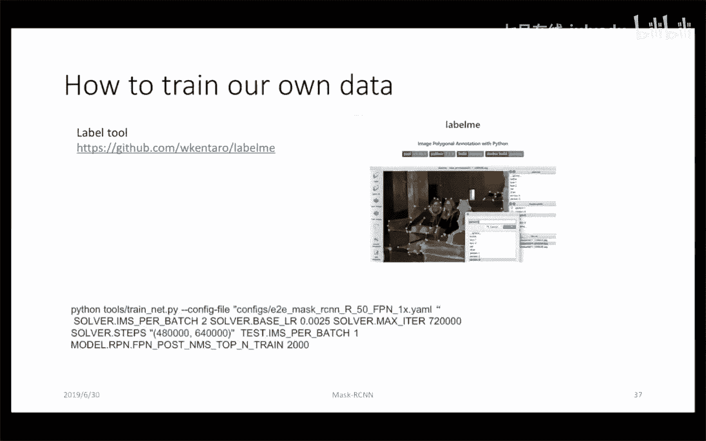

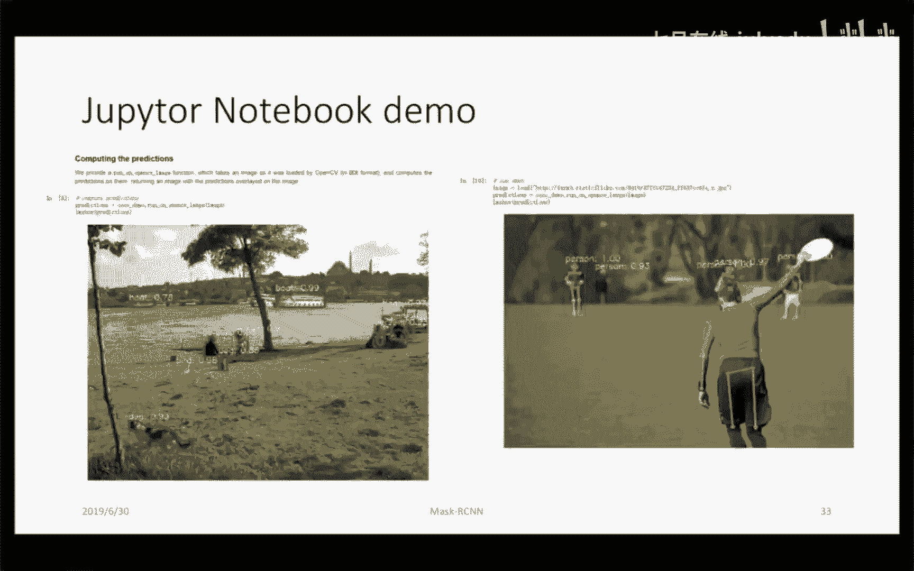

通过以上步骤，即可在自定义数据集上训练Mask RCNN模型。

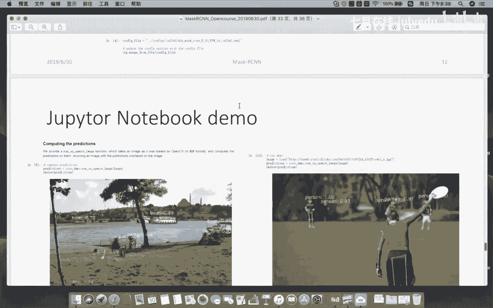

## 📝 总结

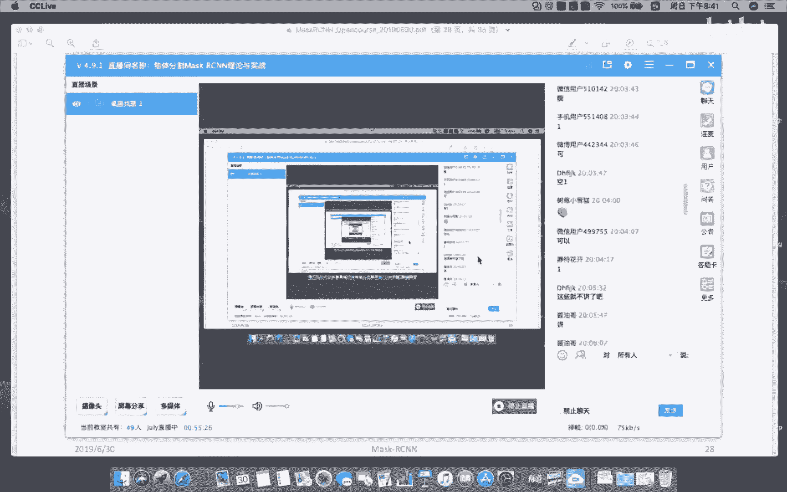

本节课中我们一起学习了实例分割的核心模型Mask RCNN。我们从CNN的基础理论出发，回顾了目标检测从RCNN、Fast RCNN到Faster RCNN的演进过程，理解了多任务学习、特征共享、锚框机制等核心思想。在此基础上，我们深入剖析了Mask RCNN如何通过增加掩码分支、引入FPN和ROIAlign等关键技术，在Faster RCNN的框架上实现了精准的像素级实例分割。最后，我们简要了解了其开源实现的用法。希望本课程能帮助你建立起对Mask RCNN从理论到实践的完整认知。