# 🎓 人工智能—计算机视觉CV公开课（P11）：计算机视觉面试求职经验分享

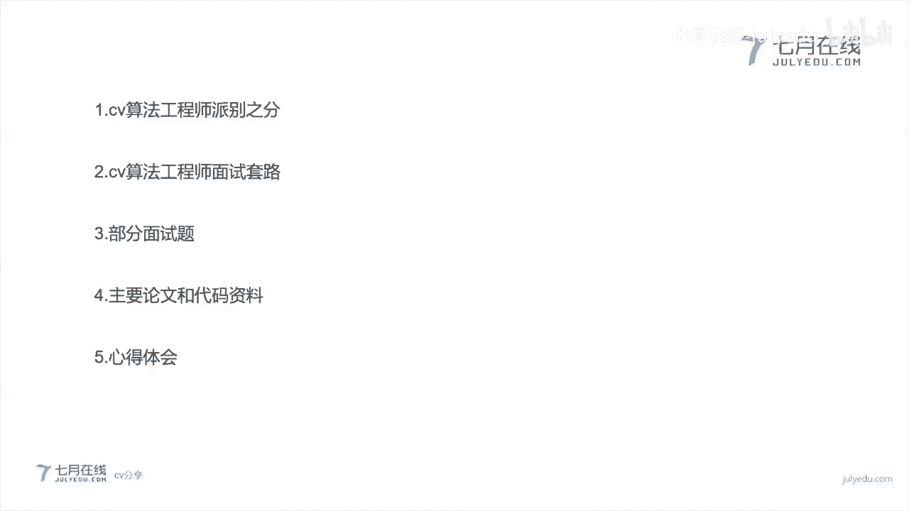

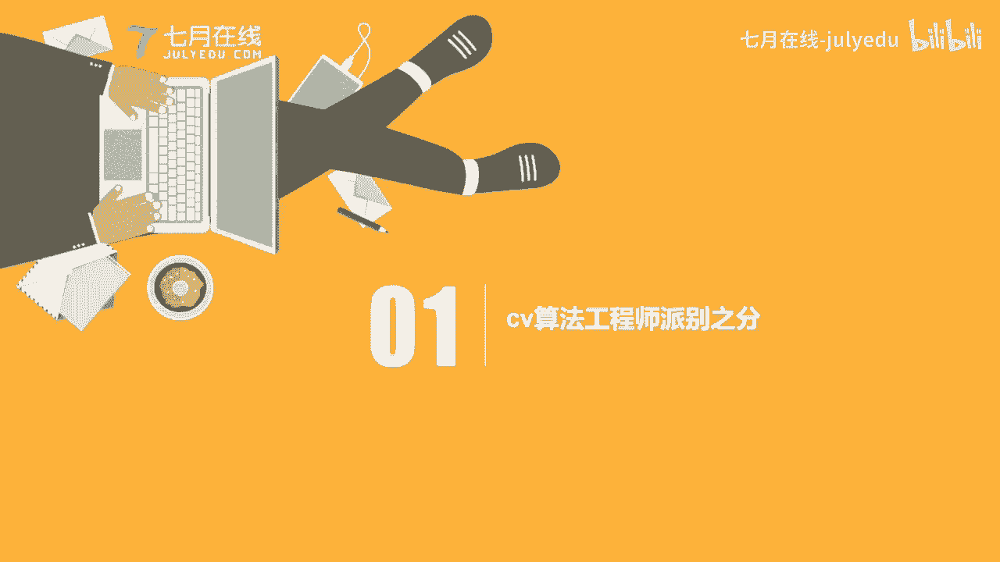

在本节课中，我们将跟随一位优秀学员的分享，系统性地了解计算机视觉算法工程师的求职面试经验。课程将涵盖岗位派别区分、面试核心套路、常见面试题解析、必备学习资料以及个人心得体会，旨在帮助初学者建立清晰的求职认知和学习路径。

---

## 🧩 第一部分：CV算法工程师的派别之分

在计算机视觉领域，算法工程师的岗位通常可以分为两大派别：**算法派**和**工程派**。理解这两者的区别，对于规划职业路径和准备面试至关重要。

上一节我们介绍了课程概述，本节中我们来看看算法工程师的具体分类。

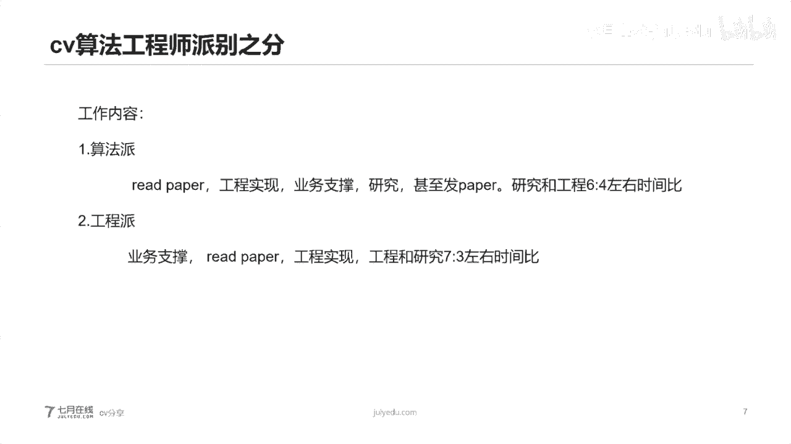

**算法派**工程师更侧重于模型结构的研究、算法的优化与迭代。他们需要深厚的理论基础和数学功底，日常工作包括研读论文、复现代码，并对业务场景的数据分布进行深刻理解。

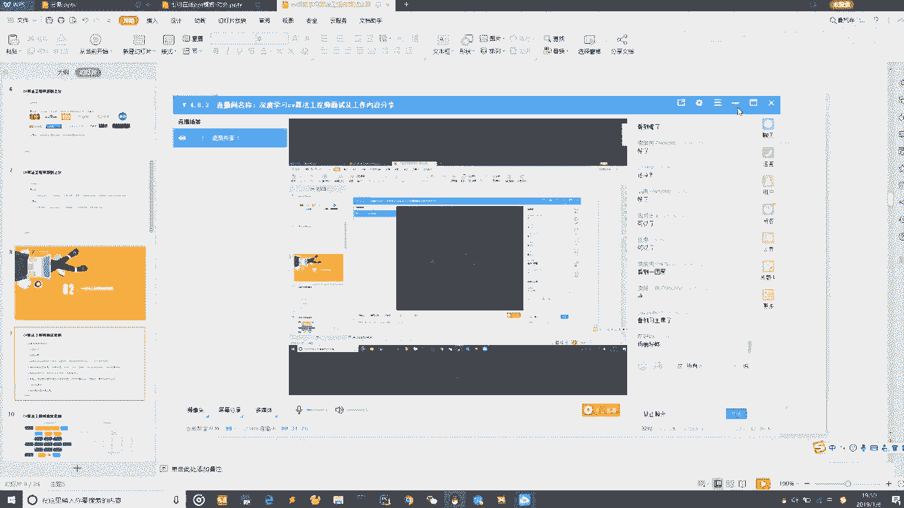

**工程派**工程师则更偏向于业务实现和工程落地。他们的核心要求是能够高效地编写代码、训练模型和调整参数，以支撑具体的产品需求。

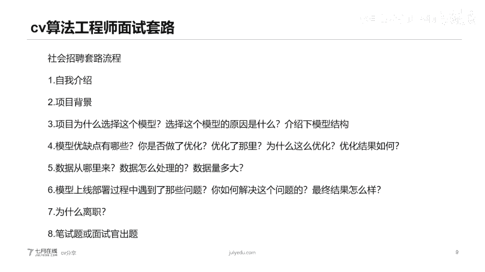

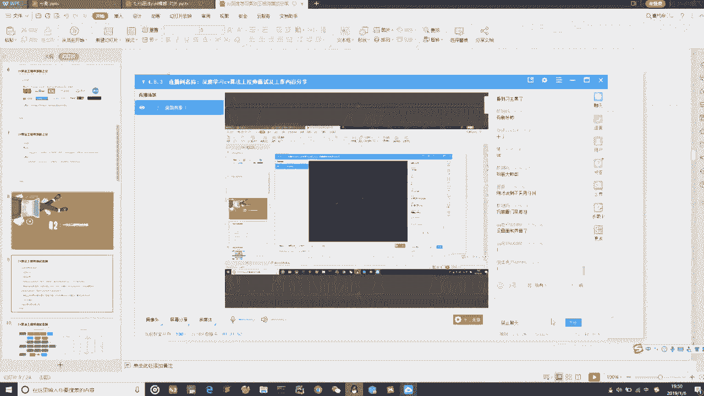

以下是两种派别的核心对比：

*   **算法派**：
    *   **工作重心**：模型结构研究、算法优化。
    *   **能力要求**：深厚的理论基础、数学功底、论文阅读与复现能力。
    *   **面试考察**：80% 为基础理论、项目经历、模型设计；20% 为代码能力。
    *   **典型公司**：大型互联网公司（如BAT）、资金充裕的独角兽公司。

*   **工程派**：
    *   **工作重心**：业务支撑、工程实现。
    *   **能力要求**：强大的编码能力、项目实现经验。
    *   **面试考察**：80% 为实现方案、项目细节、代码编写；20% 为基础理论。
    *   **典型公司**：初创公司、刚转型的中小型公司。

选择哪条路径，取决于你的兴趣和技能倾向。如果你热爱钻研模型原理，算法派是更好的选择；如果你更享受用代码解决实际问题，工程派可能更适合你。

---

## 🎯 第二部分：CV算法工程师的面试套路

了解了岗位分类后，我们来看看面试中常见的流程和问题。社招面试通常遵循一套相对固定的“套路”，掌握这些可以帮助你更好地准备。

以下是面试中常见的几大环节：

1.  **自我介绍**：简洁明了，突出与岗位相关的项目经验，避免提及无关信息（如非相关专业背景）。
2.  **项目背景**：阐述为什么在该项目中选择使用深度学习，重点说明数据量级（建议不低于20万）和数据分布。
3.  **模型选择**：解释为什么选择某个特定模型（如 Inception V3, ResNet），需要结合准确率、运算速度、稳定性以及行业标杆（如谷歌的模型）来回答。
4.  **模型结构**：深入阐述核心模型结构（如 Inception Module, 残差块），最好能动手画出来。这是考察理论基础的重点。
5.  **优化与思考**：面试官会考察你是否对模型有过深度思考和优化尝试。这反映了你的研究潜力和对问题的理解深度。
6.  **数据与实现**：说明数据来源、处理方式以及数据量。可以将数据处理等非核心工作“甩锅”给其他团队，聚焦于算法设计本身。
7.  **部署与问题**：描述模型上线过程中遇到的问题（如小目标检测不准）及解决方案（如数据重新标注、数据扩增）。要承认问题的存在，并体现代码能力。
8.  **离职原因**：从行业、企业、个人发展三个维度立体地回答，展现你的宏观思考能力，避免单纯抱怨“钱少”或“干得不爽”。
9.  **笔试与代码**：可能会考察手写分类模型（如MNIST）、排序查找算法等。核心数据结构是重点。

在回答问题时，要主动引导面试官，展现你对问题的深度思考，而不仅仅是机械地回答。

---

## ❓ 第三部分：常见的CV面试题解析

面试中会遇到各种技术问题，以下是一些高频考点，掌握它们能让你在面试中更加从容。

上一节我们梳理了面试流程，本节中我们聚焦于具体的技术问题。

以下是部分核心面试题及准备要点：

*   **模型原理题**：
    *   **题目**：介绍 Inception V3 和 ResNet 的核心结构。
    *   **准备**：必须能默写画出 Inception Module 和残差连接结构，并理解其设计初衷（解决梯度消失、提升特征提取能力等）。
*   **基础概念题**：
    *   **题目**：什么是BN层（Batch Normalization）？它有什么作用？
    *   **准备**：理解其公式 `BN(x) = γ * (x - μ) / √(σ² + ε) + β`，以及它能加速训练、缓解梯度消失/爆炸的作用。
*   **经典模型题**：
    *   **题目**：简述Faster R-CNN的原理。
    *   **准备**：掌握R-CNN系列（R-CNN, Fast R-CNN, Faster R-CNN）的演进过程，核心是理解RPN（Region Proposal Network）和端到端训练。
*   **数学推导题**：
    *   **题目**：手推反向传播（Backpropagation）公式。
    *   **准备**：这是考察数学功底的必考题。需要熟练掌握链式法则，并能推导具体网络层中权重（W）和偏置（b）的梯度更新公式。
*   **代码实践题**：
    *   **题目**：手写一个简单的图像分类模型（如用PyTorch实现LeNet对MNIST分类）。
    *   **准备**：熟悉深度学习框架（PyTorch/TensorFlow）的基本API，能够不依赖参考独立完成数据加载、模型定义、训练循环等代码。

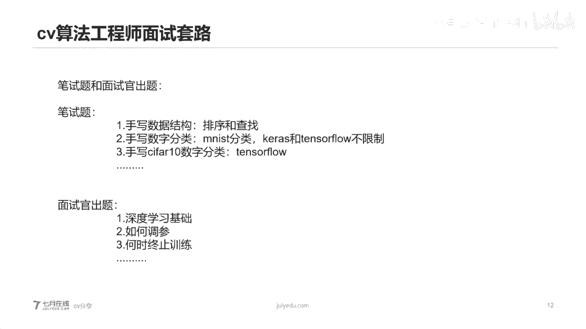

对于目标检测模型（如YOLO系列），要能说清各版本的改进点。对于优化器，要理解SGD（随机梯度下降）的核心价值——它将复杂的图像问题转化为可优化的数学问题，是深度学习发展的基石。

---

## 📚 第四部分：核心论文与学习资料

要成为一名合格的CV算法工程师，持续学习论文和积累代码实践是必不可少的。以下是一些推荐的学习资料。

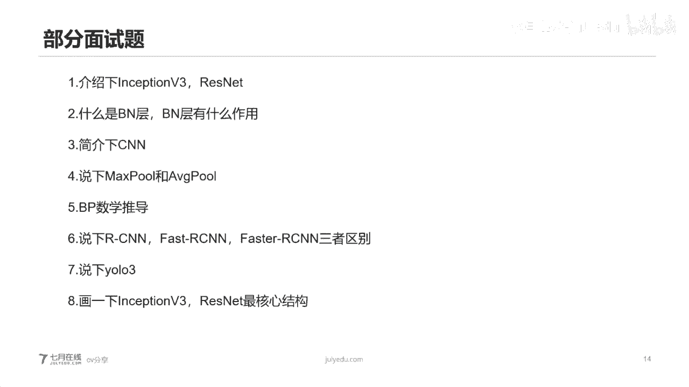

以下是提升理论和技术水平的关键资源：

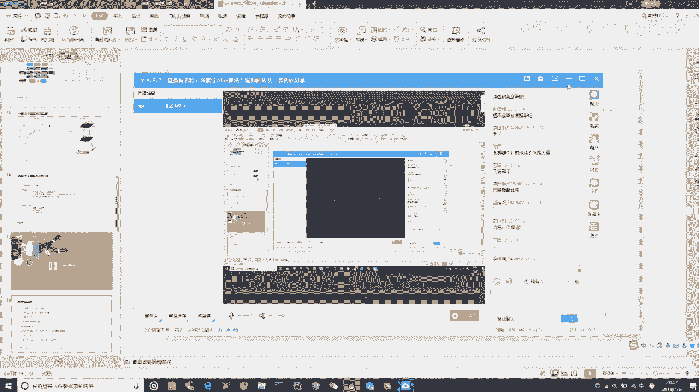

*   **必读论文与资料**：
    *   **基础论文**：ResNet, Inception系列，Faster R-CNN，YOLO系列，Transformer in CV（如ViT）。
    *   **中文解读**：寻找优秀的中英文对照论文解读博客或专栏，帮助降低阅读门槛。
    *   **“花书”**：《深度学习》（Deep Learning） by Ian Goodfellow。建议通读以建立宏观知识体系。
*   **代码与框架**：
    *   **框架教程**：PyTorch官方教程、TensorFlow指南。
    *   **实战代码**：GitHub上的热门项目复现（如mmdetection, detectron2）。
    *   **模型转换**：了解ONNX等工具，实现不同框架间模型的转换与部署。
*   **数学基础**：
    *   **核心科目**：线性代数、概率论与数理统计、微积分。
    *   **学习建议**：如果感到吃力，可以观看考研数学课程或专业培训机构的数学课，目标是能看懂论文中的数学符号和推导逻辑。
*   **面试准备**：
    *   **算法题**：在LeetCode上练习基本的排序、查找、动态规划问题。
    *   **项目复盘**：深入思考自己做过的项目，从模型选择到问题解决的每一个环节，准备好“为什么”。

记住，学习是一个量变到质变的过程。初期看不懂论文很正常，坚持阅读和思考，积累到一定阶段自然会豁然开朗。

---

## 💡 第五部分：心得体会与未来展望

最后，分享一些关于学习心态、职业发展和行业前景的个人思考。

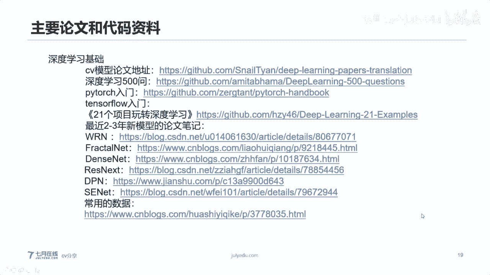

本节课我们一起学习了面试的方方面面，最后我们来谈谈一些更深层次的体会。

*   **学习心态：直面“绝望之谷”**
    在学习过程中，几乎每个人都会经历“邓宁-克鲁格效应”中的“绝望之谷”——发现自己什么都不懂。**这恰恰是你真正入门和开始深入思考的标志，千万不要在此刻放弃。** 坚持过去，就会进入开悟爬升期。
*   **核心竞争力：算法 > 工程**
    算法工程师的核心价值在于**算法设计能力**和**模型迭代优化能力**，而非单纯的代码量。要花70%的精力钻研理论、论文和数学基础，用30%的精力提升代码实践。深入理解“为什么模型要这样设计”比“如何调包跑通模型”更重要。
*   **未来方向**
    *   **深度强化学习**：让机器自动设计网络结构可能是未来的重要方向。
    *   **GAN的应用**：在图像生成、数据增强等领域有广阔前景。
    *   **模型结构探索**：在深度探索趋于饱和后，模型宽度（Width）的研究值得关注。
*   **业务与数据思维**
    技术最终服务于业务场景。要对业务有深刻理解，并对数据分布保持敏感。**未来，将是数据科学家和算法工程师驱动产品迭代的时代。**
*   **求职建议**
    *   **尽早行动**：不要等“完全准备好”再去面试，通过面试查漏补缺是高效的学习方式。
    *   **针对性准备**：根据目标公司的派别（算法/工程）调整简历和面试策略。
    *   **保持良好心态**：求职有运气成分，一次失败不代表能力不行。保持清淡饮食，规律作息，以积极状态应对。

---

## 📝 总结

在本节课中，我们一起学习了计算机视觉算法工程师求职的完整攻略：

1.  **明确派别**：区分了**算法派**（重研究）和**工程派**（重实现），帮助你定位发展方向。
2.  **掌握套路**：梳理了社招面试的九大常见环节，让你对面试过程心中有数。
3.  **攻克试题**：解析了模型原理、数学推导、代码实践等高频面试题。
4.  **积累资料**：推荐了论文、代码、数学等核心学习资源，提供了学习路径。
5.  **调整心态**：分享了面对学习困难、构建核心竞争力以及规划职业未来的心得体会。

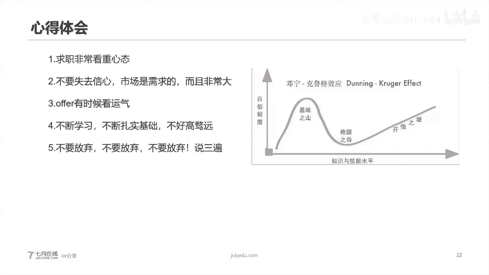

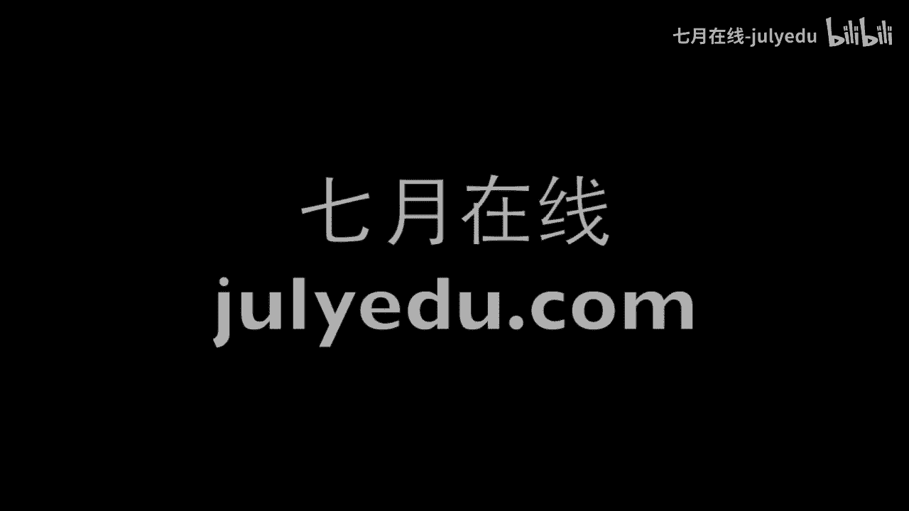

记住，成为一名优秀的CV算法工程师是一场马拉松。它需要你扎实数学基础，保持英语阅读能力，深入理解模型本质，并始终对业务和数据保持好奇。这条路虽然漫长，但前景光明。祝大家都能在CV领域找到自己心仪的工作，实现个人价值！