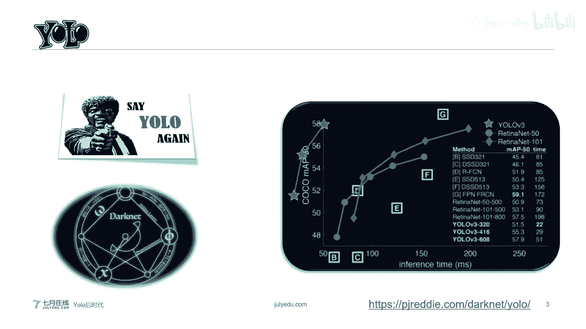
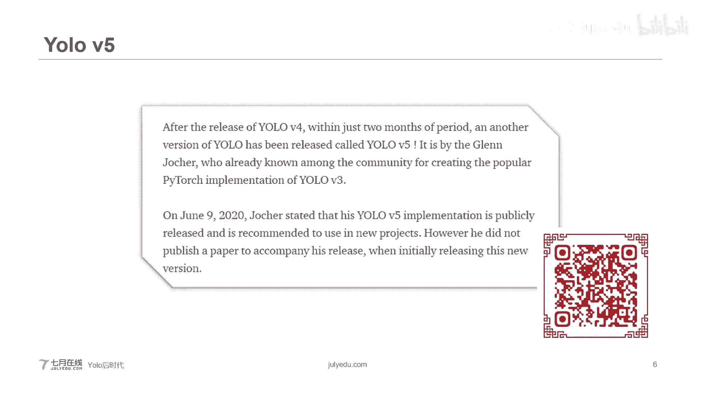
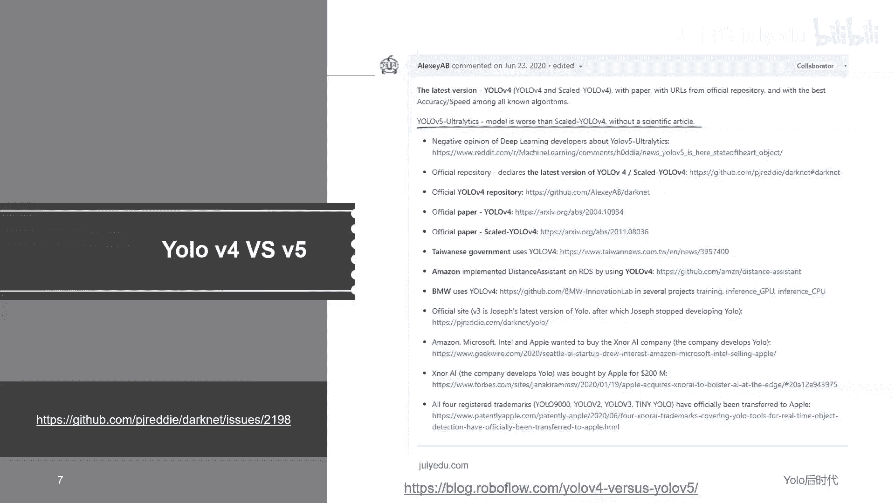
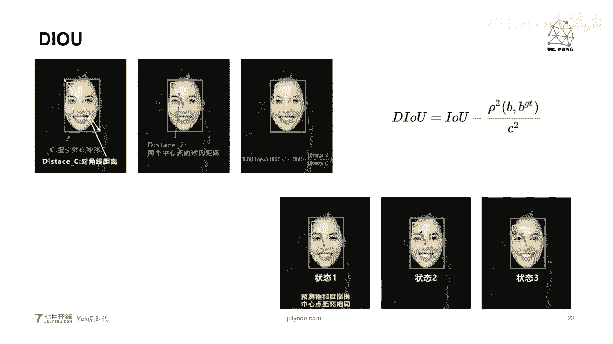
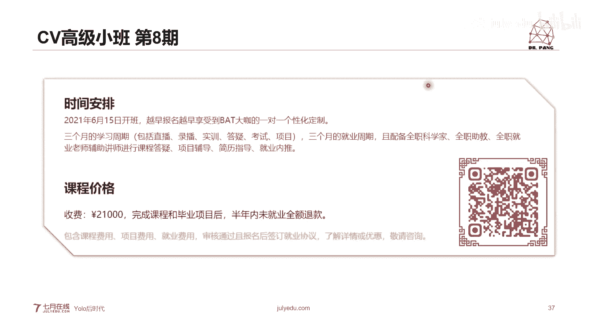

# 人工智能—计算机视觉CV公开课（七月在线出品） - P13：Yolo后时代之目标检测的发展方向 🎯

在本节课中，我们将要学习目标检测领域在YOLO之父“退役”后的发展动态。我们将以YOLOv4和YOLOv5的出现为引，探讨目标检测算法的核心改进，并展望该领域未来的两个重要发展方向。

## YOLO的传承与演变 🏔️

上一节我们介绍了目标检测的基本概念，本节中我们来看看YOLO系列的发展历程。YOLO（You Only Look Once）是目标检测领域一座无法绕过的高山。在YOLO出现之前，目标检测主要以R-CNN家族为代表的两阶段方法为主。YOLO的出现标志着一阶段实时目标检测的真正开端。

2020年2月，YOLO之父宣布因伦理原因退出计算机视觉研究领域。此后不久，由俄罗斯学者和中国台湾学者联合推出了YOLOv4。约两个月后，另一位长期维护YOLO社区的大神推出了基于PyTorch的YOLOv5。YOLOv5在工业界表现优异，但未发表正式论文。因此，本节课我们将主要围绕有详细论文支撑的YOLOv4展开，其论文也被称为“目标检测调参手册”。

## 目标检测器的通用框架 🏗️

无论是单阶段还是两阶段检测器，只要是基于锚框（Anchor）的方法，都遵循一个通用框架。该框架主要包含四个部分。

以下是目标检测器的主要组成部分：
1.  **输入（Input）**：模型的输入，通常是图像或视频帧。
2.  **骨干网络（Backbone）**：用于提取图像特征的卷积神经网络（CNN），如VGG、ResNet、Darknet53等。
3.  **颈部（Neck）**：连接骨干网络和预测头的部分，用于融合和增强特征，例如FPN、PAN结构。
4.  **预测头（Head）**：负责进行最终的分类和边界框回归预测。

YOLOv4的整体结构也严格遵循了这个框架，并在每个部分都进行了创新性的改进。

## YOLOv4 核心技术解析 ⚙️

接下来，我们将逐一解析YOLOv4在框架各个部分所采用的核心技术。

### 1. 输入端改进：马赛克数据增强

在训练阶段，YOLOv4对输入端进行了重要改进，主要采用了**马赛克（Mosaic）数据增强**技术。该技术借鉴了2019年的CutMix，但将拼接的图片数量从2张增加到了4张。

以下是马赛克数据增强的步骤：
1.  随机缩放4张原始图片。
2.  随机裁剪这4张图片。
3.  将这4张处理后的图片随机排布拼接成一张新的训练图片。

使用马赛克数据增强主要有两个优点：
*   **丰富数据集**：特别是增加了大量小目标样本，提升了模型对小目标的检测能力。
*   **优化GPU使用**：一次性计算4张图片的数据，可以在较小的批量（Batch Size）下高效利用GPU。

这里引出了如何定义目标大小的问题。在COCO数据集中，通常这样划分：
*   **小目标**：边界框面积 < \(32 \times 32\) 像素
*   **中目标**：\(32 \times 32\) ≤ 边界框面积 < \(96 \times 96\) 像素
*   **大目标**：边界框面积 ≥ \(96 \times 96\) 像素

### 2. 骨干网络改进：CSPDarknet53

YOLOv4的骨干网络采用了**CSPDarknet53**。它是在YOLOv3的Darknet53基础上，引入了**CSPNet（Cross Stage Partial Network，跨阶段局部网络）** 的设计思想。

CSPNet的主要思想是将特征图在通道维度上分成两部分，一部分进行复杂的卷积变换，另一部分直接保留（捷径连接），最后再将两部分合并。这种方法能有效缓解梯度信息重复的问题。

以下是CSPNet的三个优点：
1.  增强了CNN的学习能力，同时在轻量化时保持准确性。
2.  降低了计算瓶颈。
3.  降低了内存成本。

此外，YOLOv4在骨干网络中还用**DropBlock** 替代了传统的**Dropout**。Dropout随机丢弃单个神经元，而在卷积层中，由于池化层的存在，这种随机丢弃可能效果不佳。DropBlock改为丢弃整个局部区域块，能更有效地防止卷积网络过拟合。

### 3. 颈部改进：SPP与PAN

在颈部，YOLOv4集成了**SPP（Spatial Pyramid Pooling，空间金字塔池化）** 模块和**PAN（Path Aggregation Network，路径聚合网络）** 结构。

*   **SPP模块**：解决了输入图像必须缩放到统一尺寸的问题。它通过不同尺度的池化层（如`4x4`, `2x2`, `1x1`），将任意大小的特征图转换为固定长度的特征向量（例如`16+4+1=21`维）。这使得网络可以接受任意尺寸的输入。
*   **PAN结构**：在FPN（特征金字塔网络）自顶向下传达强语义特征的基础上，增加了一个自底向上的路径，用于传达强定位特征。YOLOv4中的PAN将特征融合方式从相加（Addition）改为拼接（Concatenation），保留了更多的特征信息。

### 4. 预测头与损失函数改进：CIoU Loss

预测头部分，YOLOv4沿用了YOLOv3的设计，但改进了边界框回归的损失函数。目标检测的核心是优化边界框的预测，其关键在于损失函数，而损失函数的基础是IoU（交并比）。

原始IoU Loss存在两个问题：1）当预测框与真实框不相交时，IoU为0，无法优化；2）当相交情况不同但IoU相同时，无法区分哪种情况更好。

为了解决这些问题，研究者们提出了一系列改进：
*   **GIoU Loss**：在IoU基础上，考虑最小外接矩形，缓解了不相交时的优化问题。
*   **DIoU Loss**：在IoU基础上，同时考虑重叠面积和两个框中心点的距离。
*   **CIoU Loss**：YOLOv4采用的损失函数。它在DIoU的基础上，额外考虑了边界框的**长宽比**一致性。

CIoU Loss的公式如下：
\[
\mathcal{L}_{CIoU} = 1 - IoU + \frac{\rho^2(b, b^{gt})}{c^2} + \alpha v
\]
其中，\(v\) 衡量长宽比的相似性，\(\alpha\) 是权重系数。CIoU能更全面地引导边界框回归。

此外，YOLOv4在预测后处理中，将传统的NMS（非极大值抑制）替换为**DIoU-NMS**。传统NMS仅根据分类分数抑制重叠框，当两个目标靠得很近时，容易错误地抑制其中一个。DIoU-NMS在考虑分数的同时，也考虑框之间的中心点距离，能更好地区分相邻目标。

## 目标检测的未来方向 🚀

在YOLO系列性能不断提升之后，目标检测领域未来将向何处发展？我们认为有两个重要方向值得关注。

### 方向一：无锚框（Anchor-Free）目标检测

基于锚框的方法需要预设大量锚框，其中包含大量负样本（不包含目标的框），计算效率有提升空间。无锚框方法摒弃了锚框，转而预测目标的关键点。

以下是两种经典的无锚框方法：
1.  **CornerNet**：通过检测目标框的**左上角**和**右下角**两个关键点来确定边界框。它使用嵌入向量（Embedding）来匹配属于同一物体的角点对。
2.  **CenterNet**：在CornerNet的基础上，额外预测目标的**中心点**。通过判断中心点是否落在预测框的中心区域内，来辅助匹配和过滤误检，提高了精度。

### 方向二：模型压缩与轻量化

将大型、高精度的模型（如YOLOv5）部署到算力有限的移动端或嵌入式设备（如手机、无人机）时，需要进行模型压缩，在精度和效率之间取得平衡。

以下是几种常见的模型压缩技术：
*   **网络剪枝**：识别并移除网络中冗余的神经元或连接（“南郭先生”）。例如，MobileNet系列网络通过深度可分离卷积等设计，大幅减少了参数量和计算量。
*   **知识蒸馏**：用一个大型“教师网络”指导一个小型“学生网络”进行训练，让学生网络模仿教师网络的行为。
*   **参数量化**：将模型参数从高精度浮点数（如32位）转换为低精度数据（如8位整数），减少存储和计算开销。
*   **动态计算**：让模型根据当前设备资源（如电量）动态调整计算复杂度，在资源紧张时以较低精度运行。

## 总结 📝

本节课中我们一起学习了YOLO后时代目标检测的发展。我们从YOLOv4的论文入手，详细分析了它在输入端（马赛克数据增强）、骨干网络（CSPDarknet53、DropBlock）、颈部（SPP、PAN）以及预测头（CIoU Loss， DIoU-NMS）等方面的创新。这些改进共同推动了目标检测性能的边界。

最后，我们展望了目标检测未来的两个重要趋势：**无锚框（Anchor-Free）方法**和**模型轻量化压缩技术**。前者试图从根本上改变检测范式，后者则致力于让先进的检测算法能落地于实际应用场景。希望本课程能帮助你更好地理解目标检测领域的现状与未来。