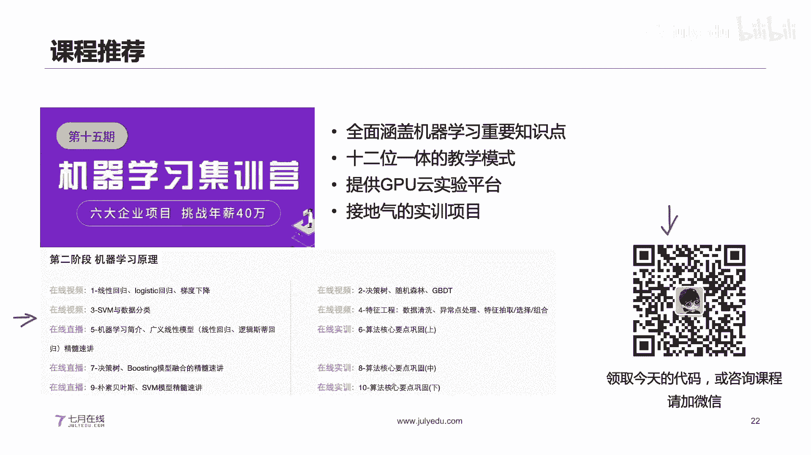

# 人工智能—计算机视觉CV公开课（P14）：电商图像检索原理与实践 🖼️🔍


在本节课中，我们将要学习电商领域下图像检索的核心原理与实践过程。我们将从图像特征提取的基础知识开始，逐步深入到具体的检索流程、先进的深度学习方法以及检索加速技术。

## 第一部分：图像特征提取

图像是一种非结构化的数据，其尺寸和内容多变。为了进行有效的图像检索，我们需要找到一种方法来描述图像，并将其编码成固定维度的特征向量，以便后续计算相似度。

图像特征主要分为两类：全局特征和局部特征。

### 全局特征与局部特征

*   **全局特征**：关注图像的整体信息，通常将整张图像编码成一个固定长度的向量（例如，512维）。这使得相似度计算非常直接。
*   **局部特征**：关注图像的细节信息，通常提取图像中的多个关键点（Key Points），每个关键点用一个向量（例如，128维）描述。因此，一张图像的特征可能是一个 `N x 128` 的矩阵，其中 `N`（关键点数量）是不固定的。

上一节我们介绍了特征的基本分类，本节中我们来看看图像检索任务的具体类型，以及如何选择特征。

### 图像检索任务类型与特征选择

图像检索任务可分为：
*   **相似图像检索**：找到与查询图像内容类似（如同类商品）的图像。
*   **相同图像检索**：找到与查询图像完全一致或几乎一致的图像（如版权检索）。

以下是特征选择的一般建议：
*   **全局特征（如CNN特征）** 更适合**相似图像检索**和分类相关任务（如图像分类、语义分割）。
*   **局部特征（如SIFT关键点）** 更适合**相同图像检索**，因为它能精确匹配图像的局部细节，对形变、旋转有较好的鲁棒性。

对于初学者，学习图像检索可以遵循以下路径：
1.  学习各类图像特征（哈希、直方图、关键点、CNN）的原理与优缺点。
2.  理解图像检索与图像分类任务的区别与联系。
3.  掌握如何将不定长的局部特征编码为定长的全局特征。
4.  了解如何用CNN网络提取局部特征的前沿工作。

接下来，我们将详细介绍几种常见的特征提取方法。

### 传统特征提取方法

以下是几种经典的特征提取方法：

**1. 图像哈希值**
图像哈希（如aHash, pHash, dHash）通过缩放图像、灰度化、计算像素差异等步骤，生成一个固定长度（如64位）的字符串或二进制序列来表示图像。
*   **优点**：计算快，存储方便，可用于快速去重。
*   **缺点**：对图像内容变化（如颜色、旋转）敏感，且存在不同图像哈希值相同的碰撞可能。

**2. 颜色直方图**
颜色直方图统计图像中不同颜色值的像素分布情况。
*   **优点**：对图像的旋转、平移变化不敏感。
*   **缺点**：对颜色变化非常敏感，且丢失了颜色的空间分布信息。

**3. 关键点特征（如SIFT, ORB）**
提取图像中的角点、边缘等显著位置作为关键点，并为每个关键点计算一个描述子向量。
*   **优点**：对旋转、缩放、亮度变化具有很好的鲁棒性，适合精确匹配。
*   **缺点**：计算速度相对较慢；容易受到图像中文字等强边缘信息的干扰。

### 从局部特征到全局特征：词袋模型

由于局部特征（`N x 128` 矩阵）的长度 `N` 不固定，我们需要将其编码为固定维度的全局特征。常用方法是**词袋模型**。

步骤如下：
1.  **提取特征**：从所有训练图片中提取局部特征，得到一个大的特征池（例如，`M x 128` 矩阵）。
2.  **生成视觉词典**：对特征池进行聚类（如K-Means），聚类中心称为“视觉单词”。假设我们设定聚类数为 `K`，则得到 `K x 128` 的视觉词典。
3.  **图片编码**：对于一张新图片，提取其局部特征（`N x 128`）。对于每个局部特征，在视觉词典中找到最近的视觉单词。最终，图片被表示为一个 `K` 维的直方图向量，每个维度值是该视觉单词出现的频率。

公式化表示：一张图片 `I` 的词袋向量 `V` 可以通过以下方式计算：
`V_i = count( nearest_visual_word(feature_j) == i )`， 其中 `i` 从 `1` 到 `K`，`feature_j` 是图片的局部特征。

## 第二部分：图像检索流程

基于内容的图像检索通用流程如下：
1.  **特征提取**：对图像库中的所有图像提取特征（全局特征或编码后的局部特征），并存储到特征数据库中。
2.  **查询处理**：对用户输入的查询图像，提取相同的特征。
3.  **相似度计算**：计算查询图像的特征与特征库中所有特征之间的相似度（如余弦相似度、欧氏距离）。
4.  **结果排序与返回**：根据相似度对库中图像进行排序，返回最相似的若干张图像。

在深度学习中，我们通常使用卷积神经网络来提取强大的全局特征。

### 基于CNN的特征提取

一个典型的图像分类CNN网络结构为：`卷积层 -> 池化层 -> 全连接层 -> Softmax`。
*   **卷积层**：提取图像的局部特征。
*   **池化层**：对特征进行降维，并一定程度上消除特征的位置信息，增强模型的平移不变性。常见的池化方法有：
    *   **最大池化（Max Pooling）**：保留最显著的特征。
    *   **平均池化（Average Pooling）**：保留平均特征。
    *   **广义均值池化（GeM Pooling）**、**注意力池化（如R-MAC）** 等更高级的方法。

对于图像检索，我们通常去掉最后的全连接层和Softmax，直接使用卷积层和池化层输出的特征作为图像的全局描述子。

## 第三部分：ArcFace原理与实践 👤➡️📏

在开集检索场景（测试集类别可能不在训练集中出现）下，传统的Softmax分类损失并不直接优化特征之间的可分性。ArcFace是一种先进的损失函数，它直接在角度空间最大化类间间隔，从而学习到更具判别力的特征。

### ArcFace原理

ArcFace对Softmax损失进行了改进：
1.  对权重和特征向量进行L2归一化，使预测仅依赖于特征与权重之间的角度 `θ`。
2.  在目标类别的角度 `θ` 上增加一个附加角度间隔 `m`，使得同类特征更加紧凑，不同类特征更加分离。

其损失函数核心公式可以简化为：
`L = -log( e^(s·cos(θ_yi + m)) / (e^(s·cos(θ_yi + m)) + Σ e^(s·cos(θ_j)) ) )`
其中，`s` 是缩放因子，`θ_yi` 是特征与它真实类别权重向量的角度，`m` 是附加的角度间隔。

### ArcFace实践：电商图像聚类比赛

我们以一个电商图像聚类比赛为例进行实践。任务是将测试集的图像聚类到训练集已有的类别中，这是一个典型的开集检索问题。

**代码流程概述：**
1.  **数据准备**：划分训练集和验证集，确保类别不交叉。
2.  **模型定义**：使用预训练的CNN（如EfficientNet）作为特征提取器，移除其分类头，接上ArcFace层。
3.  **训练**：使用ArcFace损失函数和交叉熵损失进行训练。
4.  **特征提取与聚类**：
    *   对测试集图像提取特征。
    *   计算特征间的余弦相似度矩阵。
    *   设定一个动态阈值，将相似度高于该阈值的图像对归为同一类，完成聚类。

```python
# 伪代码示例：计算相似度并聚类
features = model.extract_features(test_images) # 形状: [N, D]
similarity_matrix = cosine_similarity(features, features) # 形状: [N, N]
# 使用阈值进行聚类...
```

## 第四部分：图像检索加速方法 ⚡

当图像库规模巨大（如百万、千万级）时，直接计算查询特征与所有库特征的相似度（暴力搜索）效率极低。以下是几种加速方法：

1.  **聚类索引**：
    *   先对特征库中的所有特征进行粗聚类（如分成1000类）。
    *   检索时，先确定查询特征所属的粗类别，然后仅在该类别内进行精细搜索。这大大缩小了搜索范围。

2.  **乘积量化**：
    *   将高维特征向量切分成多个子向量。
    *   对每个子向量空间独立进行聚类，生成子码本。
    *   图像特征用其各子向量对应的聚类中心ID（码字）串联起来表示，这相当于一个压缩的编码。
    *   检索时，通过计算查询编码与库中编码的近似距离来加速。这种方法在压缩率和检索精度间取得了很好的平衡。

3.  **近似最近邻搜索**：
    *   使用诸如 **HNSW** 的图索引方法。
    *   预先构建一个特征相似图，图中相近的节点代表特征相似。
    *   检索时，从图中的一个点出发，沿着边快速导航到最近邻区域，避免了全局比较。

## 总结

本节课中我们一起学习了电商图像检索的核心知识。我们从**图像特征提取**的基础开始，区分了全局特征与局部特征及其适用场景。接着，我们梳理了标准的**图像检索流程**，并介绍了如何利用CNN提取深度特征。然后，我们深入探讨了针对开集检索的**ArcFace损失函数**的原理，并通过一个实践案例展示了其应用。最后，我们介绍了面对海量数据时的**图像检索加速方法**，如聚类索引、乘积量化和HNSW。




通过本课程，你应该对构建一个基本的图像检索系统有了清晰的认识，并了解了如何利用先进技术提升检索效果与效率。