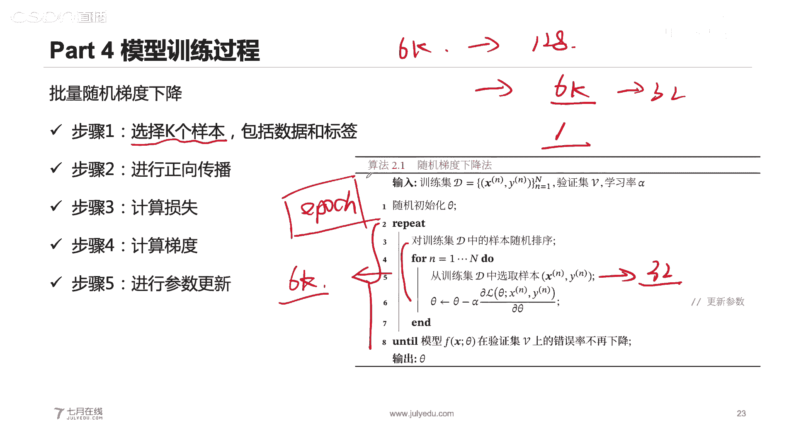
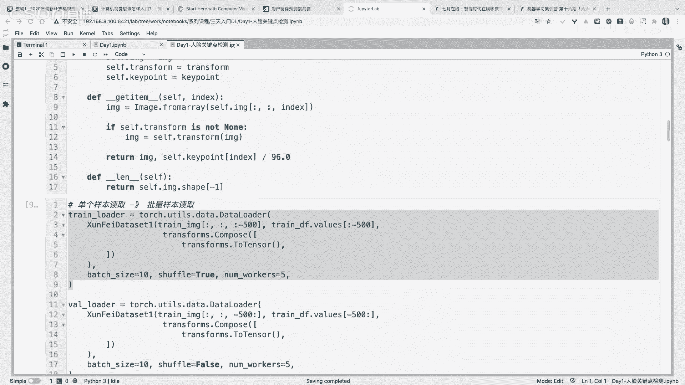
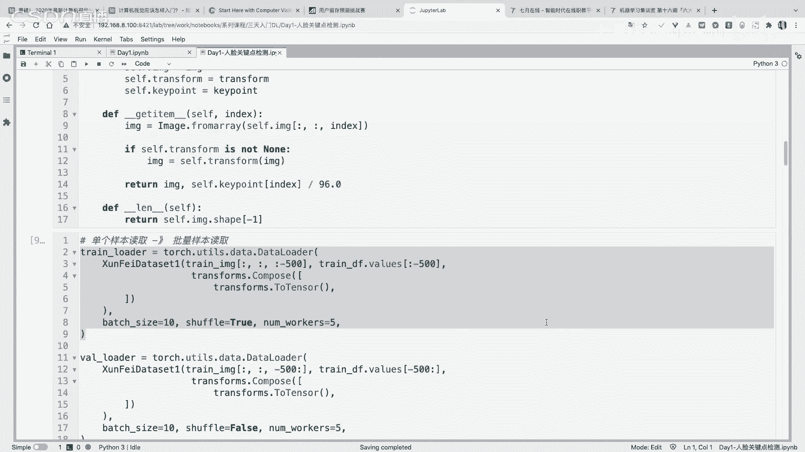
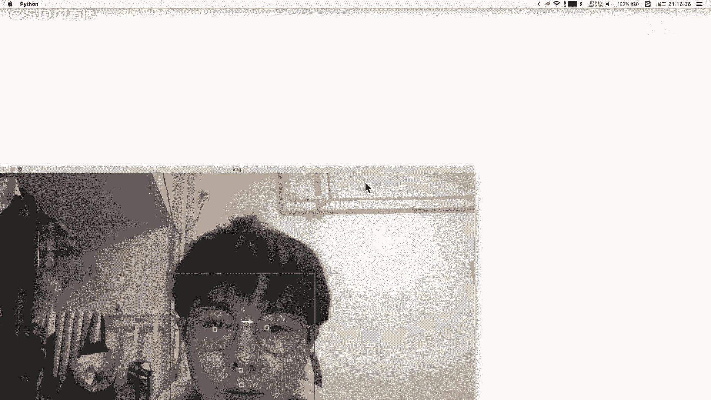
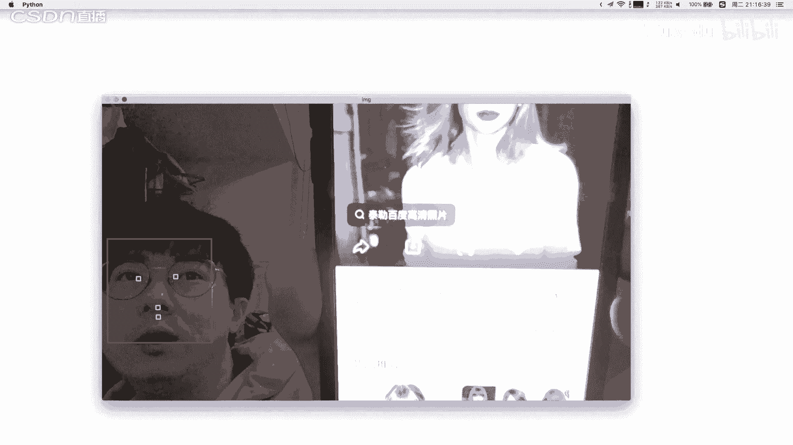
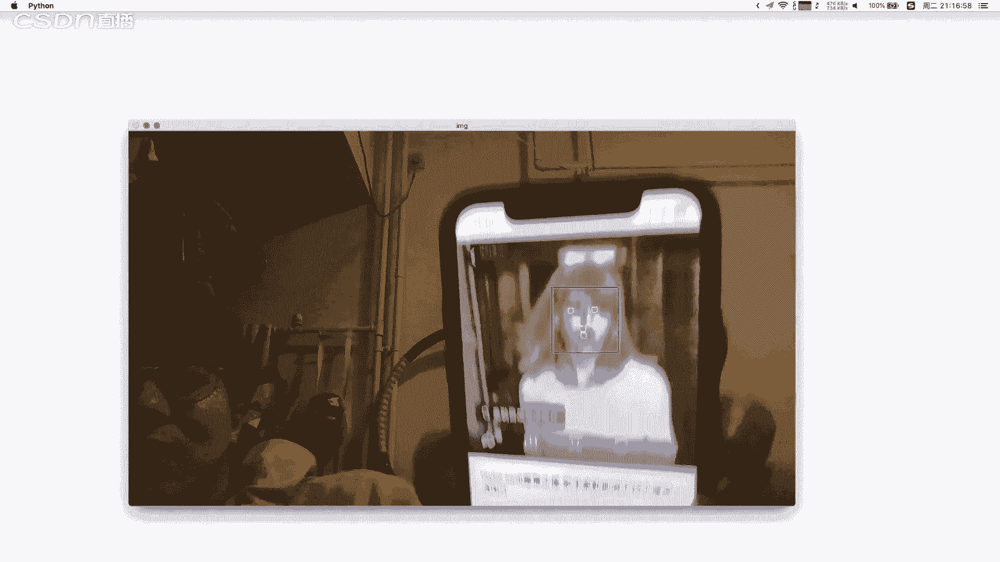
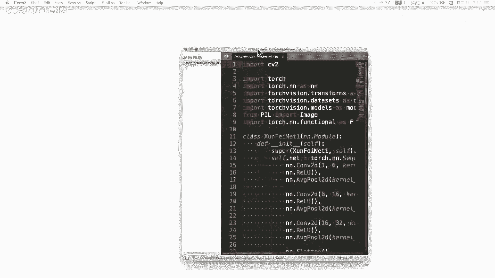
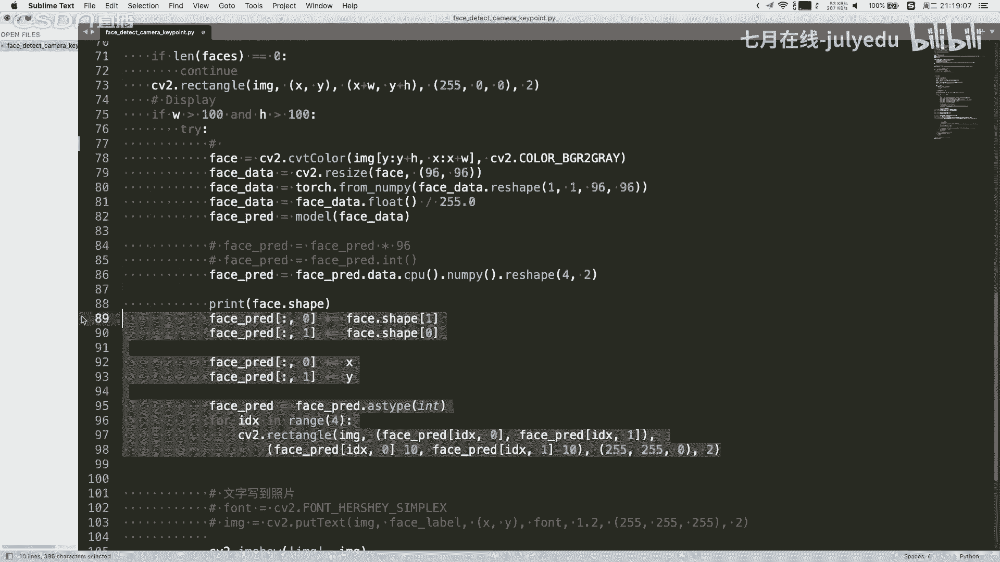
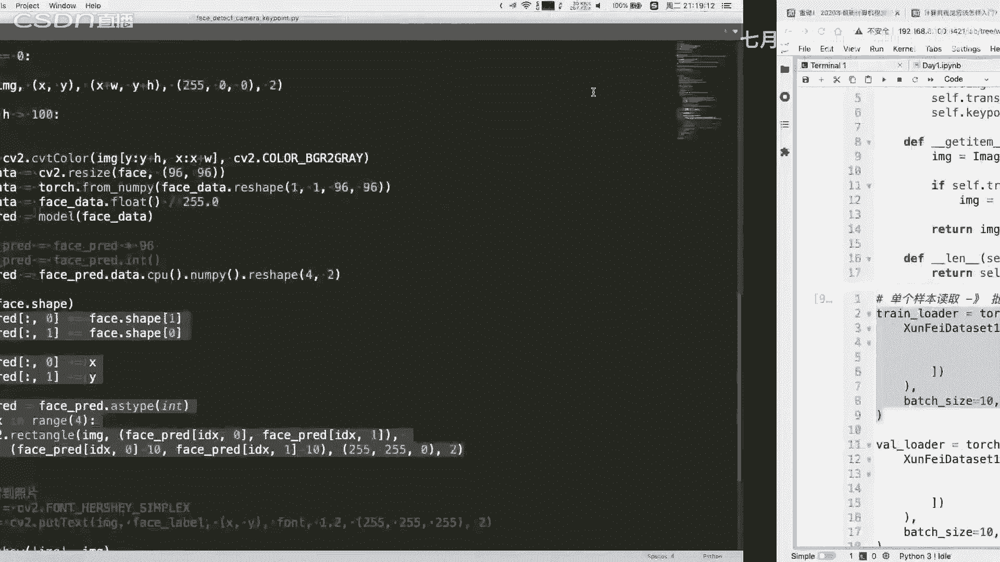
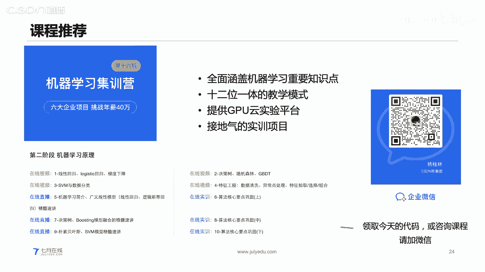

# 人工智能—计算机视觉CV公开课（七月在线出品） - P15：从零实现人脸关键点模型的训练和部署 🎯


## 概述
在本节课中，我们将学习如何从零开始构建、训练并部署一个用于人脸关键点检测的深度学习模型。我们将从深度学习的基础概念讲起，逐步深入到模型搭建、训练流程，最后完成一个可以实时运行的人脸关键点检测应用。


---

## 第一部分：深度学习介绍 🤖

深度学习是包含多层神经元结构的一种机器学习模型，其整体结构与人脑神经元的结构有相似之处。深度学习是机器学习的一个分支，属于人工智能领域的一部分。

上一节我们介绍了课程的整体安排，本节中我们来看看深度学习的核心定义。

### 人工智能、机器学习与深度学习的关系
最外层是人工智能，里面是机器学习，再里面是深度学习。深度学习是机器学习的一种算法或一个分支。机器学习领域还包括其他模型，如树模型、线性模型（逻辑回归、SVM）、无监督模型（KNN）等。

### 深度学习的特点
深度学习的特点是端到端的。端到端指的是从输入到输出的过程，即 `inputs -> model -> outputs`，中间直接通过模型完成一次性计算。深度学习是一个有效的计算图，每个节点代表一个具体的计算过程，节点之间具有有向的数据流向。

深度学习模型通常包含输入层、隐含层和输出层。输入层将原始数据输入到节点，隐含层是中间层，输出层得到最终的输出结果，可以是类别的概率值或回归的数值结果。

下图展示了一个典型的全连接网络。什么是全连接网络呢？假如这是第一层、第二层、第三层，层与层之间具有有向的数据流向。第二层节点的输出作为第三层节点的整体输入，本质上是一种映射关系。

**全连接层的计算**可以用矩阵乘法方便地表示。例如，单个神经元的计算为：
`z = x1*w1 + x2*w2 + x3*w3 + b`
`output = activation_function(z)`
其中，`activation_function` 可以是 `sigmoid` 等函数。

### 深度学习的应用场景
深度学习非常适合处理那些“对人很简单，但对机器很难”的任务，即人类能直观完成但难以用传统方法提取特征的任务。例如：
*   **CV方向**：人脸识别、车辆检测、动物识别、红绿灯检测。
*   **NLP方向**：文本翻译、客服对话机器人。

这些任务通常是有监督场景，且很难进行人工特征工程。

---

## 第二部分：模型搭建基础 🧱

上一节我们介绍了深度学习是什么，本节中我们来看看如何搭建一个深度学习模型。

在搭建一个网络模型时，本质是由输入层、隐含层和输出层这三类层组成。如果搭建的是卷积神经网络，通常遵循以下步骤：
1.  确定输入和输出，即确定网络模型的输入维度和输出维度。
2.  确定隐含层。例如使用卷积层时，需要确定通道数量、卷积核大小、步长和填充等参数。
3.  确定全连接层的维度等。

### 理解“层”的概念
学习深度学习框架，本质是学习各种“层”的使用。常见的层包括：
*   **激活函数层**：如 `sigmoid`, `ReLU`。
*   **损失函数层**：如 `BCE` (二分类交叉熵), `CE` (多分类交叉熵), `MSE` (均方误差), `MAE` (平均绝对误差)。
*   **卷积层**：如 1D、2D、3D卷积，转置卷积。
*   **全连接层**
*   **规范化层**

### 卷积层详解
卷积层的作用类似于数字图像处理中的滤波器。它通过一个滤波器（卷积核）对输入的二维数据进行滤波，得到输出结果。

以下是卷积操作的核心参数：
*   **卷积核大小**：滤波器的尺寸。
*   **步长**：每次滑动时移动的像素个数。
*   **填充**：在输入数据四周填充常数（通常为0）。

**输出维度计算公式**：
`output_size = (N + 2P - F) / S + 1`
其中：
*   `N`：输入尺寸
*   `P`：填充尺寸
*   `F`：卷积核大小
*   `S`：步长

**示例**：输入维度为 `7x7`，卷积核 `3x3`，填充为1，步长为1。
`output_size = (7 + 2*1 - 3) / 1 + 1 = 7`

对于多通道输入（如RGB彩色图片为3通道），卷积核也需要具有相应的通道数。计算时，每个输入通道与卷积核的对应通道进行计算，所有结果求和再加上偏置，得到一个输出值。多个卷积核会产生多通道输出。

### 卷积神经网络
卷积神经网络由卷积层、激活函数、池化层和全连接层有效组合而成。其结构类似于人的视网膜，逐步提取特征并汇聚信息。

典型的卷积神经网络流程是：输入数据 -> 卷积层（特征提取）-> 池化层（降维）-> 展平为向量 -> 全连接层 -> 输出。

---

## 第三部分：模型训练与超参数 ⚙️

上一节我们介绍了如何搭建模型，本节中我们来看看如何训练模型以及其中的关键概念。

### 参数与超参数
*   **参数**：模型能够从训练数据集中学习并调整的数值，例如权重 `W`。
*   **超参数**：不能从数据中学习，需要人工设置的数值，例如网络结构本身、学习率等。

模型由 **数据** 和 **超参数** 共同决定。

以下是深度学习中常见的超参数：
*   学习率
*   损失函数的超参数
*   批次大小
*   Dropout 比率
*   模型深度
*   卷积核尺寸

选择超参数时，可以关注哪些能提高模型的建模能力，哪些能缓解过拟合。

### 学习率的作用
学习率决定了每次参数更新的步长。
*   **学习率过小**：更新幅度太小，需要很多步才能收敛，训练缓慢。
*   **学习率过大**：更新幅度太大，可能越过最优点，导致损失函数震荡，无法收敛。

### 模型的训练过程
模型训练是一个迭代过程，核心步骤包括正向传播、损失计算、反向传播和参数更新。

**训练流程伪代码**：
```
for epoch in range(num_epochs):          # 遍历整个数据集多次
    for batch in data_loader:           # 遍历批次数据
        # 1. 正向传播
        predictions = model(batch.data)
        # 2. 计算损失
        loss = loss_function(predictions, batch.labels)
        # 3. 反向传播 (计算梯度)
        loss.backward()
        # 4. 参数更新 (使用优化器，如SGD)
        optimizer.step()
        optimizer.zero_grad()           # 清零梯度，为下一批次准备
```




**为什么要使用批次？**
使用所有样本（批量梯度下降）计算准确但耗时，且缺乏随机性。使用单个样本（随机梯度下降）梯度噪声大，不稳定。使用小批次是折衷方案，既能保证一定的计算效率，又能引入有益的随机性，有助于模型泛化。

**梯度下降** 通过计算损失函数对参数的偏导，沿着使损失降低最快的方向更新参数。公式为：
`参数 = 参数 - 学习率 * 梯度`

---

## 第四部分：代码实践 💻

上一节我们介绍了模型的训练理论，本节中我们通过代码进行实践。我们推荐使用 PyTorch 框架。

### PyTorch 基础
PyTorch 的张量（Tensor）是多维矩阵，可以从 Python 列表或 NumPy 数组创建。它支持 GPU 加速，能高效处理线性代数运算。

**自动求导**是 PyTorch 的核心特性之一，可以自动计算梯度。

### 案例1：线性回归拟合
我们创建一个带噪声的线性数据 `y = -3x + 4 + noise`，然后用一个线性模型 `y_pred = w*x + b` 去拟合。

以下是核心训练循环：
```python
# 初始化参数
w = torch.tensor([1.0], requires_grad=True)
b = torch.tensor([1.0], requires_grad=True)
# 定义优化器
optimizer = torch.optim.SGD([w, b], lr=learning_rate)

for epoch in range(num_epochs):
    # 正向传播
    y_pred = w * x_data + b
    # 计算损失
    loss = F.mse_loss(y_pred, y_data)
    # 反向传播
    loss.backward()
    # 参数更新
    optimizer.step()
    optimizer.zero_grad()
```
通过调整学习率，可以观察损失收敛情况。

### 案例2：实现全连接层
全连接层本质是矩阵乘法 `output = input @ W + b`。可以手动实现，也可以直接使用 `torch.nn.Linear`。

### 案例3：实现卷积层与卷积神经网络
卷积操作本质是滑动窗口的乘加运算。可以手动实现，也可以使用 `torch.nn.Conv2d`。

一个简单的卷积神经网络定义如下：
```python
class SimpleCNN(nn.Module):
    def __init__(self):
        super().__init__()
        self.conv1 = nn.Conv2d(1, 6, 5)   # 输入通道1，输出通道6，卷积核5x5
        self.pool = nn.MaxPool2d(2, 2)
        self.conv2 = nn.Conv2d(6, 16, 5)  # 输入通道6，输出通道16，卷积核5x5
        self.fc1 = nn.Linear(16 * 5 * 5, 120) # 展平后输入全连接层
        self.fc2 = nn.Linear(120, 84)
        self.fc3 = nn.Linear(84, 10)

    def forward(self, x):
        x = self.pool(F.relu(self.conv1(x)))
        x = self.pool(F.relu(self.conv2(x)))
        x = torch.flatten(x, 1) # 展平
        x = F.relu(self.fc1(x))
        x = F.relu(self.fc2(x))
        x = self.fc3(x)
        return x
```

### 核心案例：人脸关键点检测 👁️👃👄
**任务**：输入一张人脸图片，输出左眼、右眼、鼻子、嘴巴四个关键点的坐标（共8个值）。




**模型构建**：使用一个简单的卷积神经网络，最后通过全连接层输出8个坐标值。需要对坐标标签进行归一化（缩放到0-1之间）。











**训练流程**：
1.  加载数据，创建 `DataLoader`。
2.  定义模型、损失函数（如 `MSELoss`）和优化器。
3.  运行训练循环（正向传播、计算损失、反向传播、参数更新）。

**部署与推理**：
1.  训练完成后保存模型权重。
2.  在部署时，加载模型权重。
3.  使用 OpenCV 捕获摄像头视频流，对每一帧进行人脸检测。
4.  对检测到的人脸区域，预处理后输入模型进行正向传播（推理），得到关键点坐标。
5.  将关键点绘制在原始图像上并显示。





一个简单的推理代码片段：
```python
# 加载模型
model = FaceKeypointModel()
model.load_state_dict(torch.load('model_weights.pth'))
model.eval()

# 处理单张人脸图像
with torch.no_grad():
    predictions = model(processed_face_tensor)
    keypoints = predictions.numpy().reshape(-1, 2) # 转换为坐标点
    # 将归一化的坐标映射回原图尺寸并绘制
```

---




## 总结 🎓
本节课我们一起学习了深度学习的核心概念、模型搭建基础、训练流程与超参数调整，并通过 PyTorch 代码实践了线性回归、全连接网络、卷积网络，最终完成了一个从零开始训练并部署的人脸关键点检测项目。深度学习的学习需要理论与实践相结合，建议在理解原理的基础上，多动手编写和运行代码。