# 人工智能—计算机视觉CV公开课（七月在线出品） - P18：基于Pytorch实战：手部姿势识别 🖐️


在本节课中，我们将要学习如何利用深度学习模型进行手部姿势识别。课程将首先介绍一个高效的网络结构——EfficientNet，并探讨其背后的AutoML（自动机器学习）思想。随后，我们将通过一个实际的手势分类案例，演示如何使用PyTorch框架和EfficientNet模型来构建和训练一个手部姿态识别系统。

## 概述：EfficientNet与AutoML 🤖

上一节我们介绍了课程主题，本节中我们来看看EfficientNet网络及其背后的AutoML理念。EfficientNet是继ResNet之后，在深度学习中又一个非常重要的网络结构。它在模型参数量和运行速度方面都远超之前的网络。

EfficientNet在设计网络结构时，引入了AutoML的搜索过程。这意味着网络结构的设计并非完全依赖人工，而是通过算法自动搜索得到更优的配置。

那么，什么是AutoML呢？在具体的建模过程中，我们通常需要进行模型调参和优化等步骤。然而，这些步骤并非全部需要算法工程师手动参与。AutoML的目标是让机器自动完成部分或全部流程。

一个完整的数据挖掘或建模工作通常包含以下步骤：
1.  数据预处理
2.  特征提取
3.  模型训练
4.  模型选择
5.  模型预测

在上述流程中，Machine Learning Framework（机器学习框架）部分的工作，很大程度上可以由机器自动完成。

## AutoML能做什么？🔧

AutoML能够完成的任务范围很广，主要包括：
*   自动数据分析
*   自动特征工程
*   自动特征缩放
*   自动正则化
*   自动特征选择
*   自动模型选择
*   自动超参数优化

其中，最核心的方向有三个：
1.  **自动特征产生/构造**
2.  **网络结构搜索（NAS）**
3.  **模型超参数调优**

### 自动特征产生

在特征工程中，自动特征挖掘是指从已有数据集中自动发现并构造新特征。

以下是两类主要方法：

**1. 基于神经网络的方法**
此方法构建一个神经网络，让网络自动完成特征提取和特征交叉。例如，在网络中加入嵌入层（Embedding Layer）对输入特征进行编码，然后让特征在模型内部自动进行高阶组合。

**2. 基于搜索的方法**
此方法将特征组合视为一个搜索问题。假设原始有A、B、C、D四个特征，目标是找到能带来最大精度收益的特征组合（如A+B，或A+B+D等）。这个过程需要对特征空间进行搜索和评估，以确定最有效的特征子集。

### 网络结构搜索（NAS）

网络结构搜索是AutoML中目前落地较多的方向。传统神经网络结构需要人工设计，过程繁琐且依赖专家知识。NAS的目标是通过算法自动搜索出最优的网络结构。

NAS的核心包含三个部分：
1.  **搜索空间**：定义网络结构的基本组成元素（如卷积核大小、池化方式、连接方式等）。
2.  **搜索策略**：采用何种算法在搜索空间中寻找最优结构，例如基于强化学习或基于梯度的方法。
3.  **性能评估**：如何快速、准确地评估搜索到的网络结构的性能。

由于网络结构的组合可能性极多，NAS通常需要巨大的计算量。

一种常见的可微分搜索方法是**DARTS**。它将网络结构表示为一个有向无环图，图中节点代表特征，边代表可能的操作（如卷积、池化）。DARTS为每条边赋予一个可训练的权重参数，通过梯度下降来优化这些权重，最终“软化”地选择出最优的网络连接和操作。其优化目标可表示为以下公式：

`min_α L_val(ω*(α), α)`
`s.t. ω*(α) = argmin_ω L_train(ω, α)`

其中，`α`代表网络结构参数，`ω`代表网络权重参数。目标是在验证集上取得最小损失，同时网络权重需要在训练集上最优。

对于想实践AutoML的开发者，可以使用一些开源库，例如基于TensorFlow的`AutoKeras`。它可以用非常简洁的代码自动搜索适合特定数据集（如图像分类、文本情感分析）的网络结构。

## EfficientNet：复合缩放策略 📈

上一节我们了解了AutoML和NAS，本节中我们来看看EfficientNet如何运用这些思想。EfficientNet的网络设计内在包含了AutoML的思路。

在图像分类领域，ImageNet是常用的评估数据集。评价一个模型的好坏，通常从**准确率**、**参数量**和**计算量**三个维度考量。理想模型是参数量少、计算量低，同时准确率高。

研究发现，提升模型精度主要可以通过三种方式：
1.  增加网络深度（`depth`）
2.  增加网络宽度（`width`，即通道数）
3.  增加输入图像分辨率（`resolution`）

单独增加任何一项都能提升精度，但也会增加计算量。EfficientNet的洞察在于：**平衡地缩放深度、宽度和分辨率三个维度，可以获得更好的精度-效率权衡**。

因此，EfficientNet将问题形式化为一个约束优化问题：在给定计算资源（FLOPS）预算下，最大化模型精度。它提出了一个**复合缩放**策略，使用一个复合系数`φ`来统一缩放三个维度：

`depth: d = α^φ`
`width: w = β^φ`
`resolution: r = γ^φ`
`s.t. α · β² · γ² ≈ 2`
`α ≥ 1, β ≥ 1, γ ≥ 1`

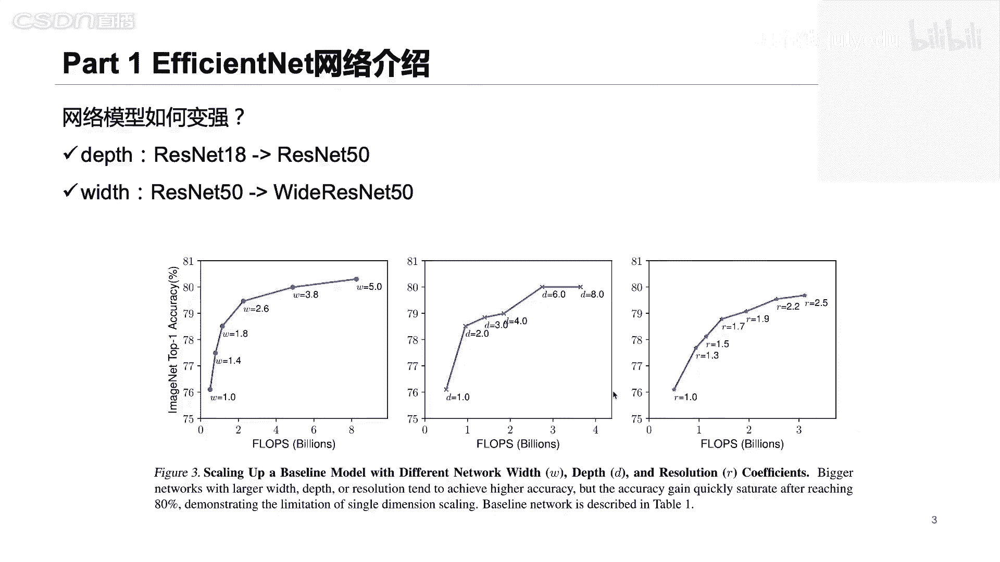


其中，`α, β, γ`是通过网格搜索确定的基础放大系数。约束条件 `α · β² · γ² ≈ 2` 是为了确保FLOPS大约增加 `2^φ` 倍。

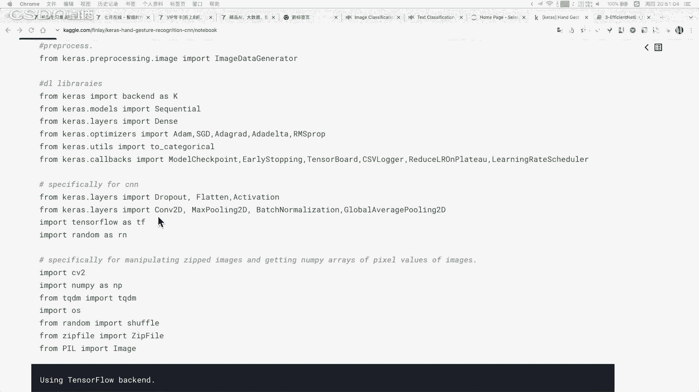

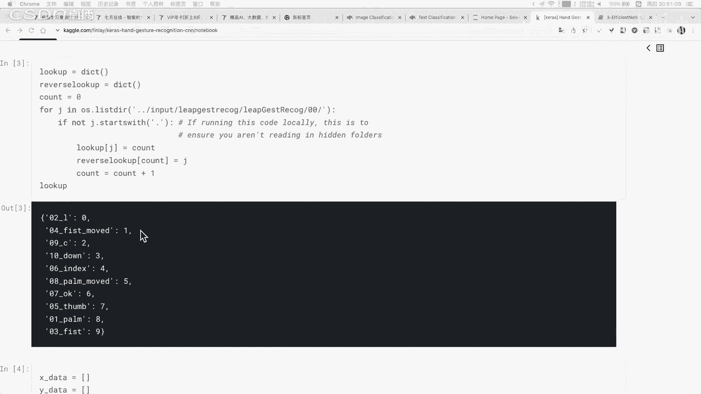

EfficientNet的设计流程分为两步：
1.  **固定`φ=1`**，通过网格搜索确定最优的`α, β, γ`，得到基础网络 **EfficientNet-B0**。
2.  使用不同的`φ`值（如1, 2, 3...），在B0的基础上进行复合缩放，得到 **EfficientNet-B1 到 B7** 等一系列模型。

通过这种系统化的缩放方法，EfficientNet家族模型在准确率和效率上都达到了当时（2019年）的领先水平。

## 实战：基于PyTorch的手势识别 ✋

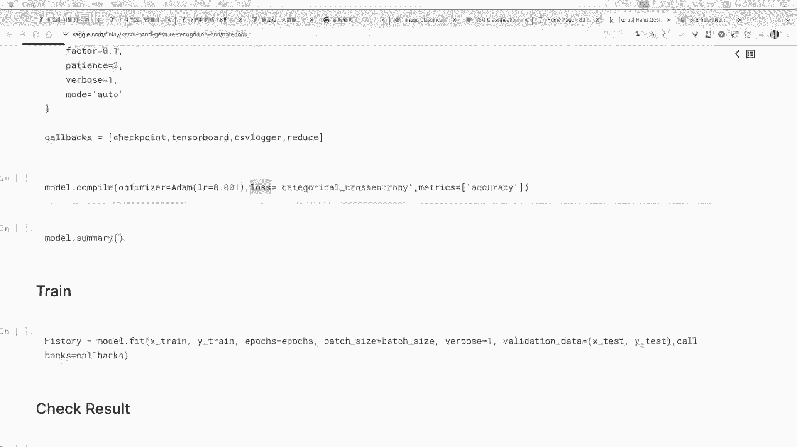

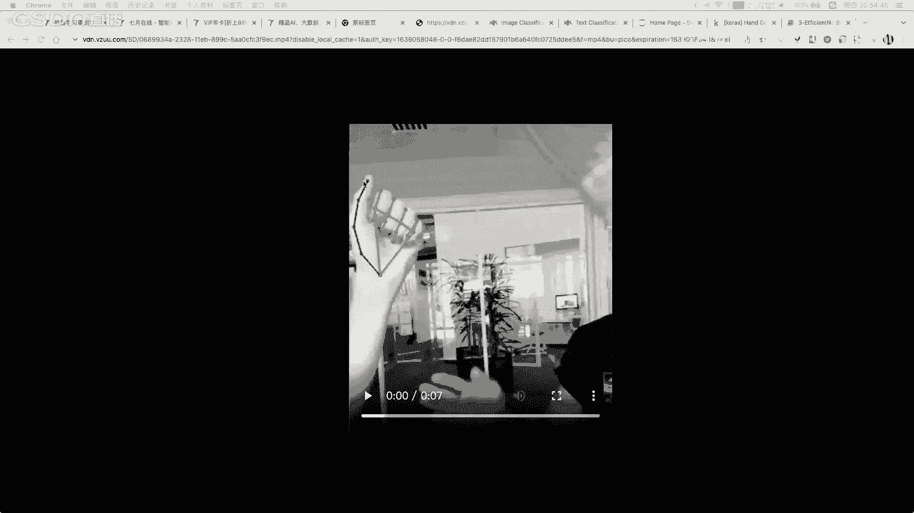

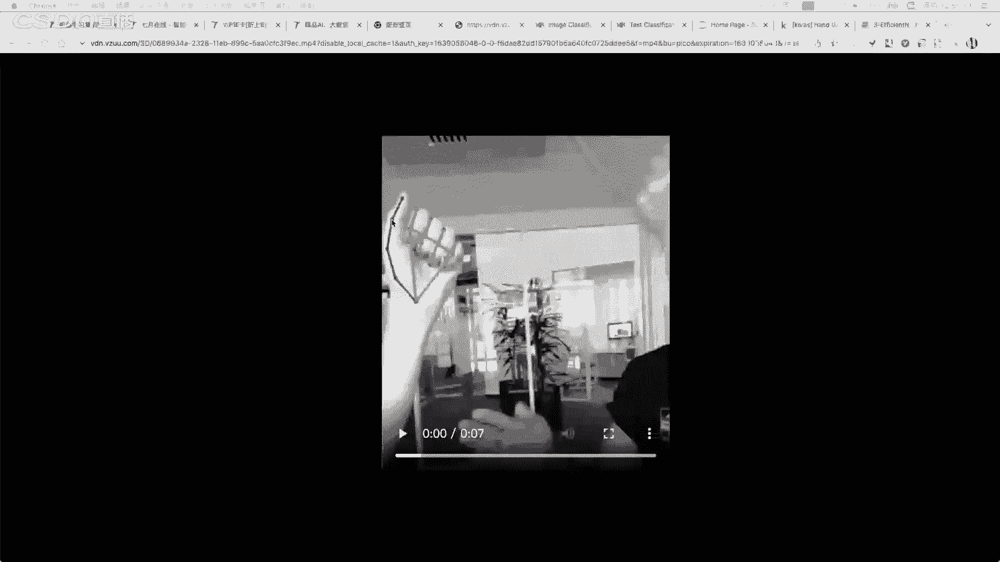

上一节我们学习了EfficientNet的原理，本节中我们来看看如何将其应用于实际任务——手势识别。

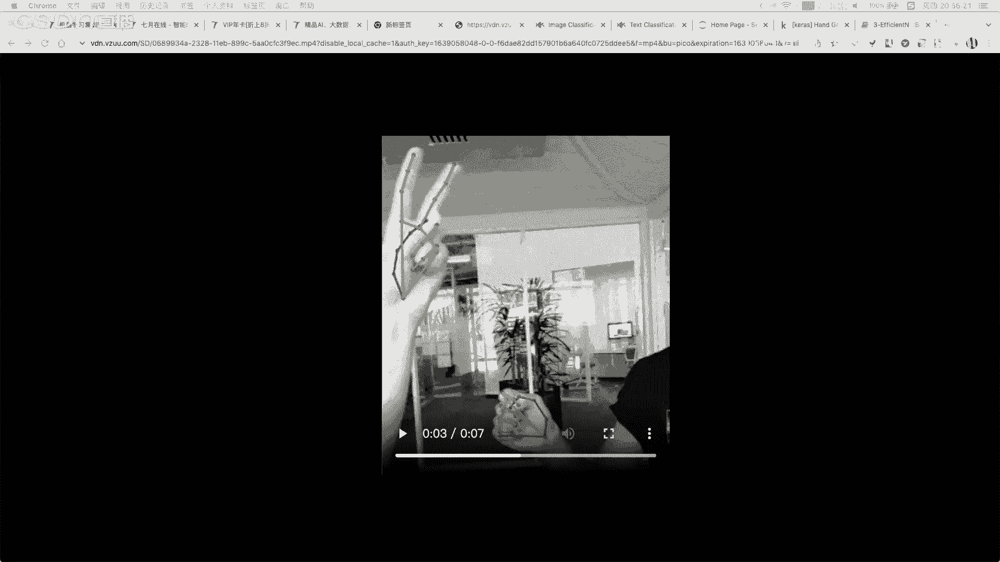

我们将使用一个包含10类手势（如数字1-5、不同拇指朝向等）的数据集。任务目标是对输入的手部图片进行分类。


以下是实现步骤的核心代码概述：

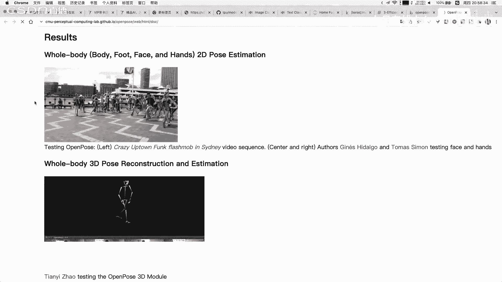


**1. 导入库与定义模型**
```python
import torch
import torchvision.models as models
# 加载预训练的EfficientNet-B0，并修改其分类头以适应我们的10分类任务
model = models.efficientnet_b0(pretrained=True)
model.classifier[1] = torch.nn.Linear(model.classifier[1].in_features, 10) # 10个手势类别
```

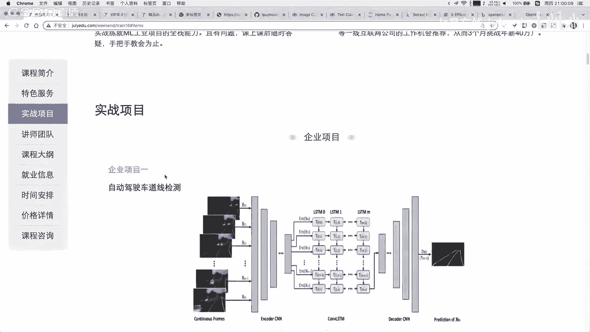

**2. 加载与预处理数据**
```python
from torchvision import transforms, datasets
# 定义数据预处理（调整大小、归一化等）
data_transforms = transforms.Compose([
    transforms.Resize((224, 224)),
    transforms.ToTensor(),
    transforms.Normalize([0.485, 0.456, 0.406], [0.229, 0.224, 0.225])
])
# 加载数据集
train_dataset = datasets.ImageFolder('path/to/train_data', transform=data_transforms)
train_loader = torch.utils.data.DataLoader(train_dataset, batch_size=32, shuffle=True)
```


**3. 定义损失函数与优化器**
```python
criterion = torch.nn.CrossEntropyLoss()
optimizer = torch.optim.Adam(model.parameters(), lr=0.001)
```

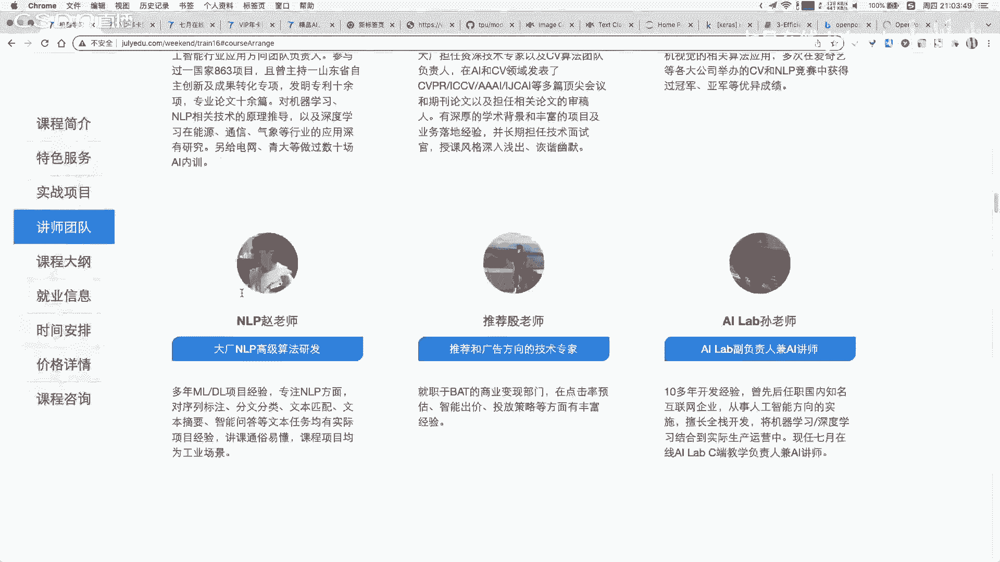


**4. 训练模型**
```python
for epoch in range(num_epochs):
    for images, labels in train_loader:
        outputs = model(images)
        loss = criterion(outputs, labels)
        optimizer.zero_grad()
        loss.backward()
        optimizer.step()
    print(f'Epoch [{epoch+1}/{num_epochs}], Loss: {loss.item():.4f}')
```

**5. 模型评估与预测**
训练完成后，可以在验证集上评估模型精度，并对新图片进行预测。

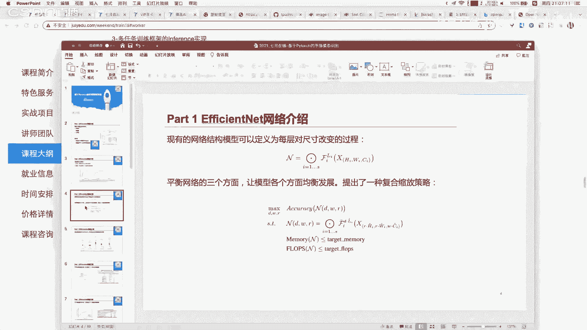

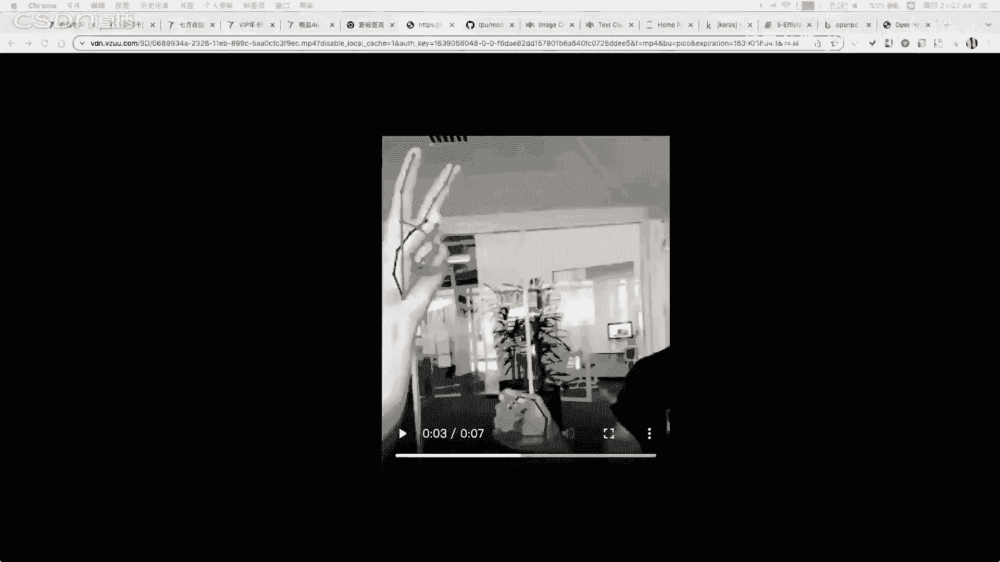

**关于更复杂的手势识别**
需要注意的是，上述案例是简单的**图像分类**。对于需要识别手部**关键点**（如指尖、关节）的更复杂任务（例如手语识别或精细的手势控制），则需要使用**姿态估计**模型。这类模型（如Google的MediaPipe）会输出手部的骨骼关键点坐标，而非简单的类别标签。工业界在部署时，往往会选择更轻量、高效的关键点检测模型。

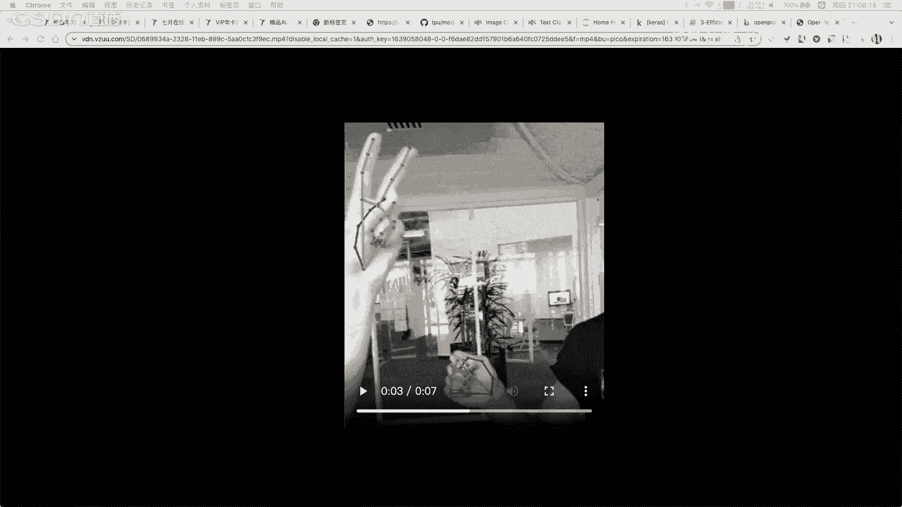

## 总结 🎯

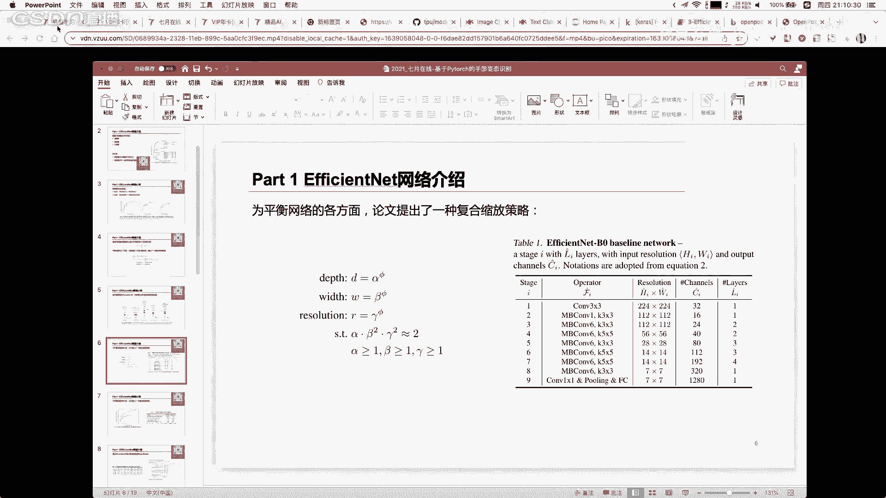


本节课中我们一起学习了以下内容：
1.  **AutoML的核心思想**：让机器自动完成特征工程、模型选择和超参数优化等流程，其中网络结构搜索是一个重要方向。
2.  **EfficientNet的设计精髓**：通过复合缩放策略，平衡地增加网络深度、宽度和输入分辨率，从而在提升精度的同时高效利用计算资源。
3.  **实战手势识别**：我们演示了如何使用PyTorch和预训练的EfficientNet模型，快速构建一个手势图像分类器。对于更复杂的、基于关键点的手势识别任务，则需要采用姿态估计模型。

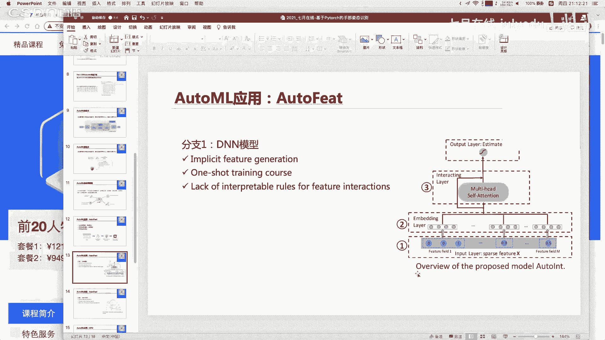


希望本教程能帮助你理解EfficientNet和AutoML的概念，并为你实现自己的计算机视觉项目提供基础。