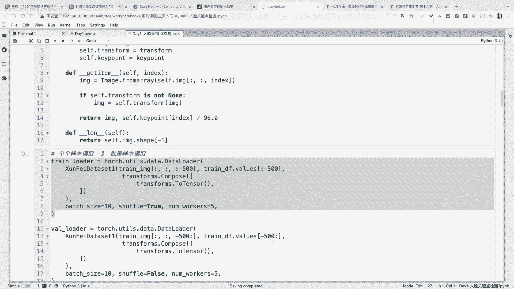
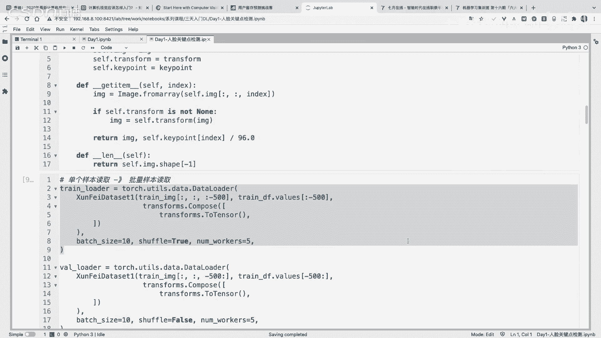
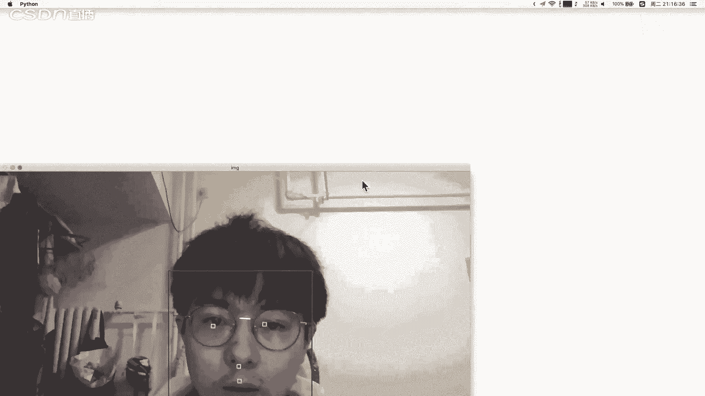
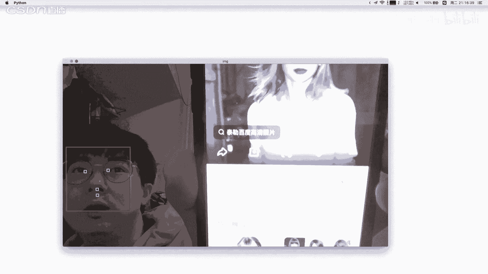
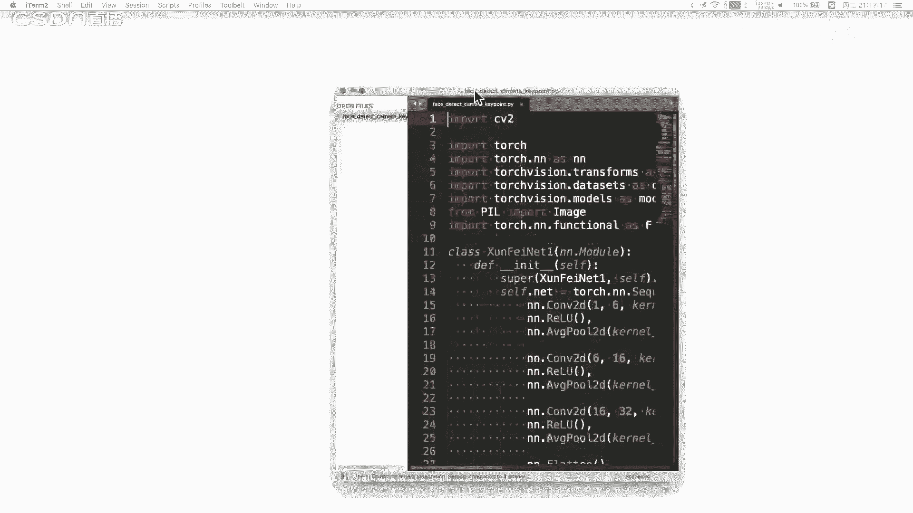
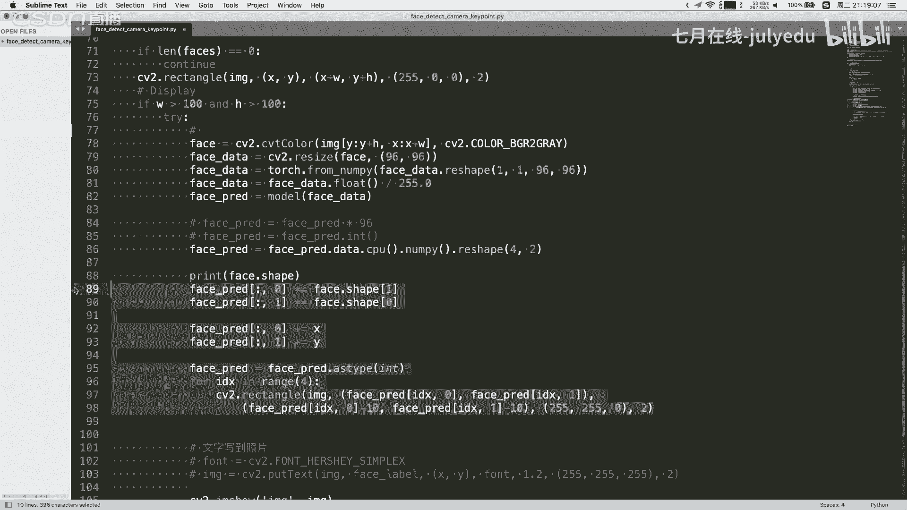
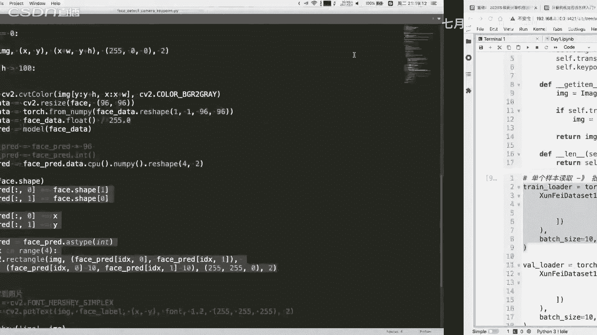
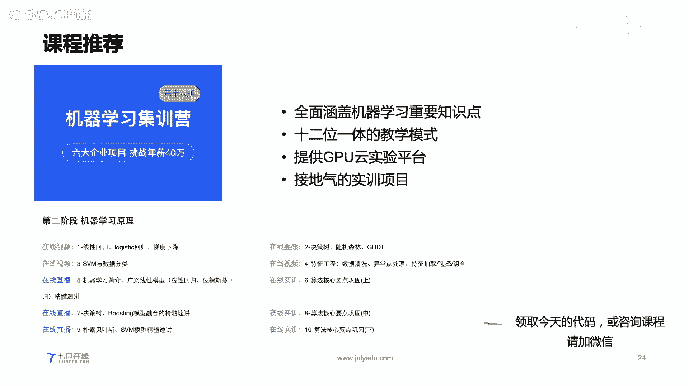

# 人工智能—计算机视觉CV公开课（P19）：从零实现人脸关键点模型的训练和部署 🎯


在本节课中，我们将学习如何从零开始构建、训练并部署一个用于人脸关键点检测的深度学习模型。我们将从深度学习的基础概念讲起，逐步深入到模型搭建、训练流程，并最终完成一个可运行的实时检测应用。


---

## 第一部分：深度学习介绍 🤖

深度学习是包含多层神经元结构的一种机器学习模型，其整体结构与人脑神经元网络有相似之处。深度学习是机器学习的一个分支，属于人工智能领域的一部分。

理解深度学习，需要明确它与机器学习、人工智能的关系。人工智能的范围最广，包含了机器学习。机器学习则包含了深度学习以及其他多种模型（如决策树、支持向量机等）。深度学习是机器学习中一类以神经网络为基础的算法。

深度学习的一个核心特点是“端到端”（End-to-End）学习。这意味着模型直接从原始输入（如图片）学习，并输出最终结果（如分类标签），中间无需复杂的人工特征工程。模型能够自动从数据中学习并提取有用的特征。

深度学习模型可以看作一个有效的计算图。图中的每个节点代表一个计算单元（神经元），节点之间的有向连接代表数据的流动方向。一个典型的全连接网络包含输入层、隐含层和输出层。输入层接收原始数据，隐含层进行特征变换和提取，输出层产生最终预测结果。

---

## 第二部分：模型搭建基础 🧱

上一节我们介绍了深度学习的基本概念，本节中我们来看看如何搭建一个基础的神经网络模型。

在搭建卷积神经网络时，通常遵循以下步骤：
1.  确定模型的输入和输出维度。
2.  设计隐含层结构，例如确定卷积层的通道数、卷积核大小、步长和填充等参数。

深度学习框架（如PyTorch）将各种功能封装为不同的“层”。常见的层类型包括：
*   **全连接层**：进行线性变换。
*   **卷积层**：提取空间特征，是计算机视觉的核心。
*   **激活函数层**：如ReLU、Sigmoid，引入非线性。
*   **池化层**：进行下采样，降低数据维度。
*   **损失函数层**：如交叉熵（Cross-Entropy）、均方误差（MSE），用于衡量预测误差。

### 卷积层详解

卷积层是卷积神经网络的核心。其操作类似于数字图像处理中的滤波器。对于一个二维输入，卷积核在输入数据上滑动，进行局部区域的加权求和计算。

卷积操作涉及几个关键参数：
*   **卷积核大小**：决定感受野的大小。
*   **步长**：卷积核每次滑动的像素数。
*   **填充**：在输入数据边缘添加的像素（常为0），用于控制输出尺寸。

输出特征图尺寸的计算公式为：
`输出尺寸 = (输入尺寸 + 2 * 填充 - 卷积核尺寸) / 步长 + 1`

对于彩色图像等多通道输入，卷积核也需要具备相应的通道数。每个通道分别与输入的对应通道进行卷积，最后将所有通道的结果相加，并加上偏置项，得到一个输出通道的值。使用多个卷积核，即可得到多通道的输出特征图。

一个典型的卷积神经网络由卷积层、激活函数层、池化层和全连接层组合而成。网络前部通过卷积和池化逐步提取和压缩特征，最后通过全连接层将特征映射到最终的输出（如分类结果）。

---

## 第三部分：模型参数与训练过程 🔄

搭建好模型结构后，我们需要通过训练来确定模型内部的参数。首先，要区分**参数**和**超参数**。

**参数**是模型内部可以通过训练数据自动学习和调整的变量，例如神经网络中的权重和偏置。
**超参数**是在训练开始前需要人工设定的变量，它们控制着训练过程本身，例如学习率、批大小、网络层数、卷积核尺寸等。模型的结构本身也是一个超参数。

超参数的选择至关重要。以**学习率**为例：
*   学习率过小，参数更新缓慢，训练效率低下。
*   学习率过大，参数更新步伐太大，可能导致损失函数在最优值附近震荡，无法收敛。

模型的训练是一个迭代优化过程，主要包含两个步骤：**正向传播**和**反向传播**。

1.  **正向传播**：输入数据通过网络层层计算，得到预测输出。
2.  **计算损失**：使用损失函数比较预测输出与真实标签的差异。
3.  **反向传播**：计算损失函数相对于每个模型参数的梯度（偏导数）。这指明了参数调整的方向。
4.  **参数更新**：使用优化算法（如随机梯度下降SGD），沿着梯度反方向更新参数，以减小损失。更新公式为：`新参数 = 旧参数 - 学习率 * 梯度`

训练通常不会使用全部数据一次性更新，而是采用**小批量梯度下降**。将数据集分成多个小批次，每次使用一个批次进行正向和反向传播并更新参数。这样做既提高了计算效率，又因批次的随机性有助于模型跳出局部最优。

完整的训练流程是一个双重循环：
*   外层循环遍历整个数据集多次（每个遍历称为一个“轮次”或Epoch）。
*   内层循环遍历数据集中的所有小批次（Batch）。

---

## 第四部分：代码实践与案例 🖥️

理论需要实践来巩固。我们将使用PyTorch框架进行代码实践。PyTorch的张量（Tensor）与NumPy数组类似，但支持GPU加速和自动求导，非常适合深度学习。

### 1. PyTorch基础与线性回归

首先，我们创建一个简单的线性回归任务来演示训练流程。

```python
import torch
# 1. 准备数据
x = torch.linspace(0, 10, 100).reshape(-1, 1)
y = -3 * x + 4 + torch.randint(-2, 3, (100, 1)).float()
# 2. 初始化参数
w = torch.randn(1, requires_grad=True)
b = torch.randn(1, requires_grad=True)
# 3. 定义损失函数和优化器
criterion = torch.nn.MSELoss()
optimizer = torch.optim.SGD([w, b], lr=0.05)
# 4. 训练循环
for epoch in range(20):
    y_pred = x * w + b          # 正向传播
    loss = criterion(y_pred, y) # 计算损失
    optimizer.zero_grad()       # 梯度清零
    loss.backward()             # 反向传播
    optimizer.step()            # 更新参数
    print(f'Epoch {epoch}, Loss: {loss.item()}')
```

### 2. 构建卷积神经网络进行人脸关键点检测

接下来，我们构建一个CNN模型来检测人脸关键点（如眼睛、鼻子、嘴角的坐标）。

```python
import torch.nn as nn
class FaceKeypointCNN(nn.Module):
    def __init__(self):
        super().__init__()
        self.conv_layers = nn.Sequential(
            nn.Conv2d(1, 6, kernel_size=5),  # 输入1通道，输出6通道
            nn.ReLU(),
            nn.MaxPool2d(2, 2),
            nn.Conv2d(6, 16, kernel_size=5), # 输入6通道，输出16通道
            nn.ReLU(),
            nn.MaxPool2d(2, 2),
            nn.Conv2d(16, 32, kernel_size=3),# 输入16通道，输出32通道
            nn.ReLU(),
            nn.MaxPool2d(2, 2)
        )
        self.fc_layers = nn.Sequential(
            nn.Flatten(),                     # 将特征图展平为向量
            nn.Linear(32 * 5 * 5, 256),       # 全连接层
            nn.ReLU(),
            nn.Linear(256, 8)                 # 输出8个坐标值 (x1,y1,x2,y2,...)
        )
    def forward(self, x):
        x = self.conv_layers(x)
        x = self.fc_layers(x)
        return x
# 实例化模型、定义损失和优化器
model = FaceKeypointCNN()
criterion = nn.MSELoss()
optimizer = torch.optim.Adam(model.parameters())
```

训练过程与线性回归类似，但数据加载更复杂。我们需要使用`DataLoader`来批量加载图像和标签数据，并进行归一化等预处理。

### 3. 模型部署与应用

训练完成后，我们可以保存模型权重，并将其部署到实际应用中。



以下是部署的核心步骤：
1.  **加载模型**：加载训练好的权重文件。
2.  **图像预处理**：对摄像头捕获的每一帧图像，使用OpenCV进行人脸检测和裁剪，然后调整为模型所需的输入尺寸并归一化。
3.  **模型推理**：将处理后的图像输入模型，进行正向传播得到关键点坐标。
4.  **结果可视化**：将预测的关键点绘制回原始图像帧上。











```python
import cv2
# 加载训练好的模型
model.load_state_dict(torch.load('face_keypoint_model.pth'))
model.eval() # 设置为评估模式
# 初始化摄像头
cap = cv2.VideoCapture(0)
face_cascade = cv2.CascadeClassifier(cv2.data.haarcascades + 'haarcascade_frontalface_default.xml')
while True:
    ret, frame = cap.read()
    gray = cv2.cvtColor(frame, cv2.COLOR_BGR2GRAY)
    faces = face_cascade.detectMultiScale(gray, 1.3, 5)
    for (x, y, w, h) in faces:
        # 裁剪人脸区域并预处理
        face_roi = gray[y:y+h, x:x+w]
        face_resized = cv2.resize(face_roi, (96, 96))
        face_tensor = torch.from_numpy(face_resized).float().unsqueeze(0).unsqueeze(0) / 255.0
        # 模型推理
        with torch.no_grad():
            keypoints = model(face_tensor).view(-1, 2).numpy() * 96
        # 将关键点坐标映射回原图
        for kp in keypoints:
            px, py = int(x + kp[0] * w / 96), int(y + kp[1] * h / 96)
            cv2.circle(frame, (px, py), 3, (0, 255, 0), -1)
    cv2.imshow('Face Keypoint Detection', frame)
    if cv2.waitKey(1) & 0xFF == ord('q'):
        break
cap.release()
cv2.destroyAllWindows()
```



---



## 总结 📝

本节课中我们一起学习了深度学习的完整流程：
1.  **理解基础**：明确了深度学习是机器学习的一个分支，其核心是端到端的特征学习和多层神经网络计算。
2.  **搭建模型**：学习了卷积神经网络的结构，包括卷积层、池化层、全连接层的作用和参数计算。
3.  **训练模型**：掌握了模型训练的核心循环：正向传播、计算损失、反向传播和参数更新，并理解了超参数（如学习率）的重要性。
4.  **实践与部署**：使用PyTorch框架实现了从简单的线性回归到复杂的人脸关键点检测CNN模型的代码，并完成了从训练到实时摄像头部署的全过程。




通过这个从理论到实践、从训练到部署的完整案例，希望你对如何构建一个深度学习项目有了清晰的认识。持续学习和动手实践是掌握深度学习的关键。