# 🎬 人工智能—计算机视觉CV公开课（七月在线出品） - P2：工业级的视频版权检测算法

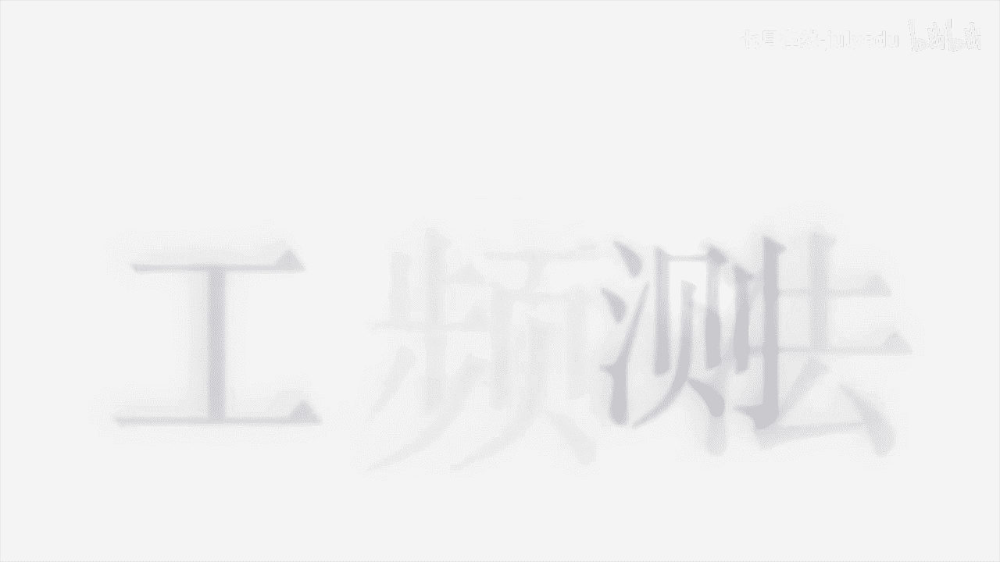

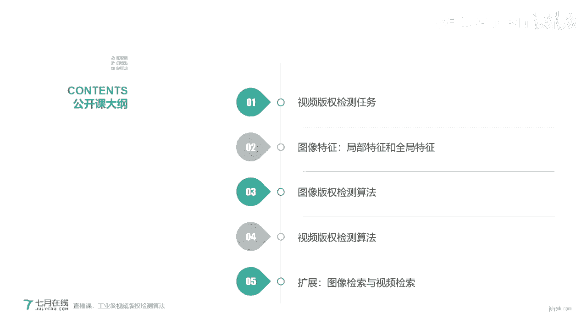

在本节课中，我们将学习工业级的视频版权检测算法。这是一个针对特定场景的完整解决方案，我们将从任务定义、基础知识讲起，逐步深入到图像和视频版权检测的核心算法，并最终了解如何将其应用于实际比赛和工业场景。

## 📋 第一部分：视频版权检测任务定义

上一节我们介绍了课程的整体结构，本节中我们来看看视频版权检测任务的具体定义。

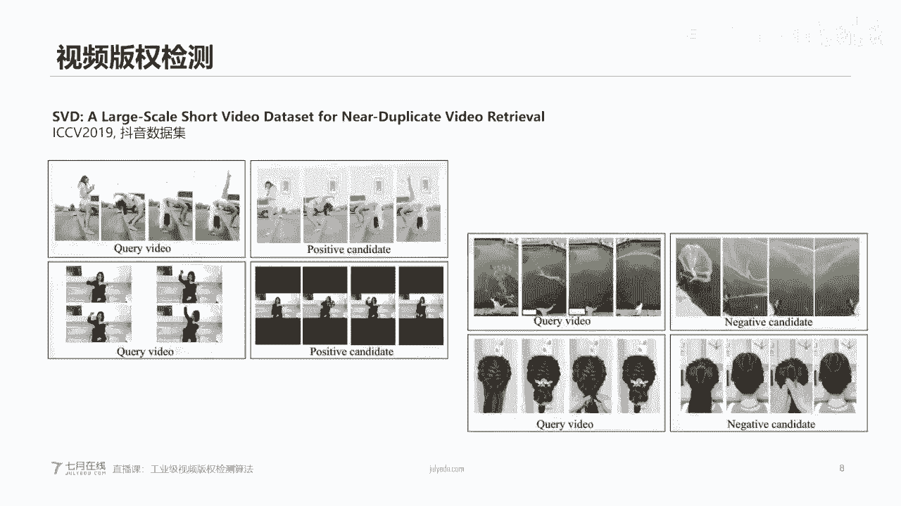

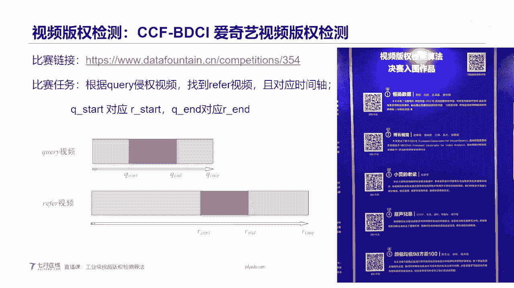

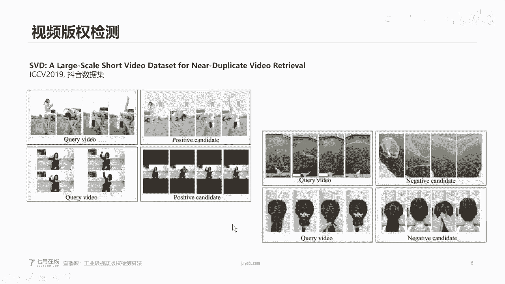

视频版权检测，学术上称为 Video Duplicate Detection。随着移动互联网和智能手机的普及，短视频已成为重要的信息媒介，同时也带来了大量的视频侵权行为。本课程主要从视觉角度解决版权检测问题，不涉及音频部分。

任务可以抽象为：给定一个待检测的短视频（称为 Query），我们需要在一个视频库（包含许多 Refer 视频）中，找到它可能侵权的原始长视频。侵权的视频可能经过多种复杂变换，例如：
*   插入模板、文字、Logo、水印或小动画。
*   进行降质处理，如模糊、丢帧、调整对比度或分辨率。
*   进行裁剪、混剪（视频拼接）、画中画、刚体变换、速度变换等综合操作。

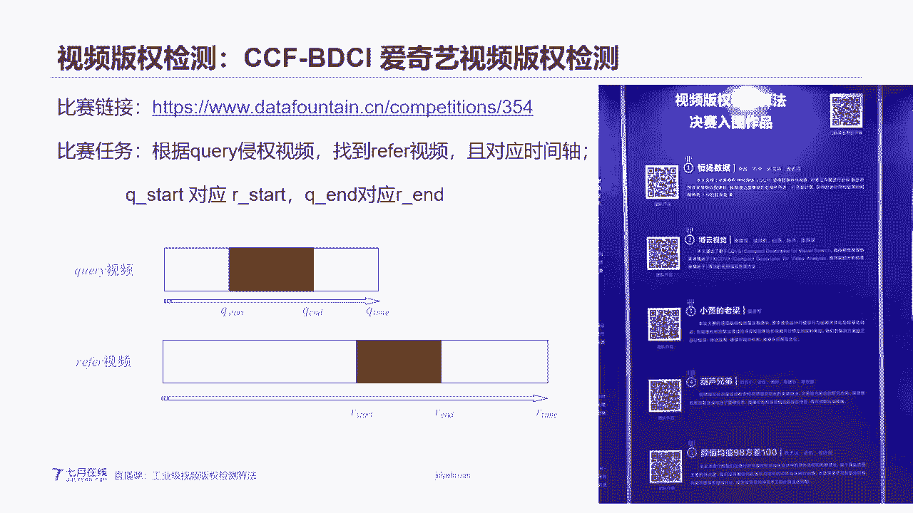

这些变换是视频版权检测的主要难点。目前已有多个学术数据集来研究此问题，例如 CC_WEB_VIDEO, FIVR, VCDB 以及抖音发布的 SVD 数据集。该领域仍是一个活跃的研究方向。

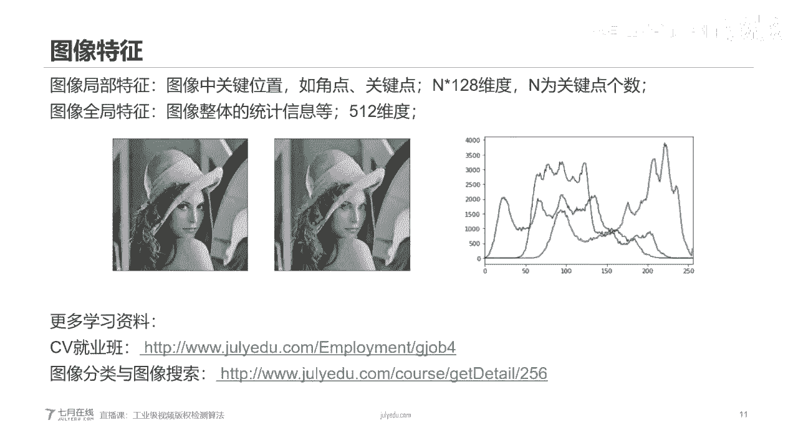

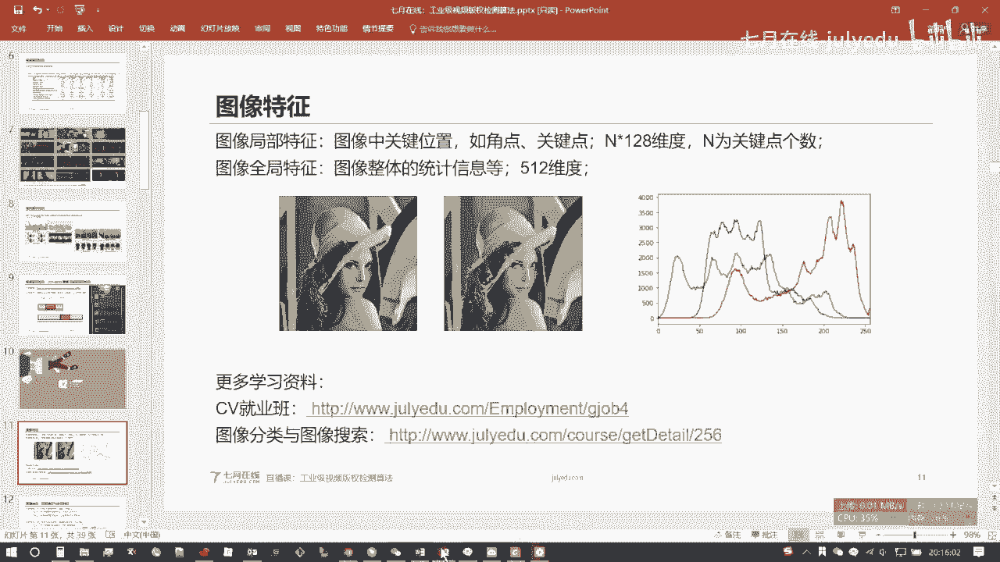

## 🧠 第二部分：图像特征基础知识

理解了任务背景后，我们需要掌握一些基础知识。本节将介绍图像的两类核心特征：局部特征和全局特征。

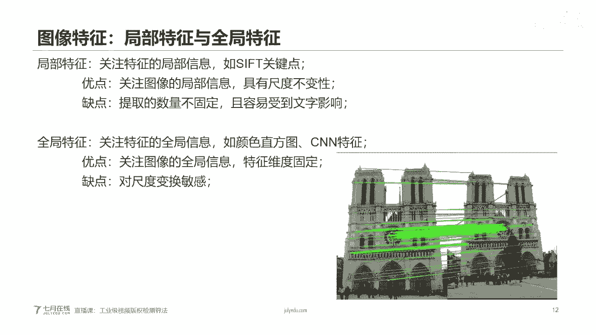

图像特征是我们比较和检索内容的基础。主要分为两类：

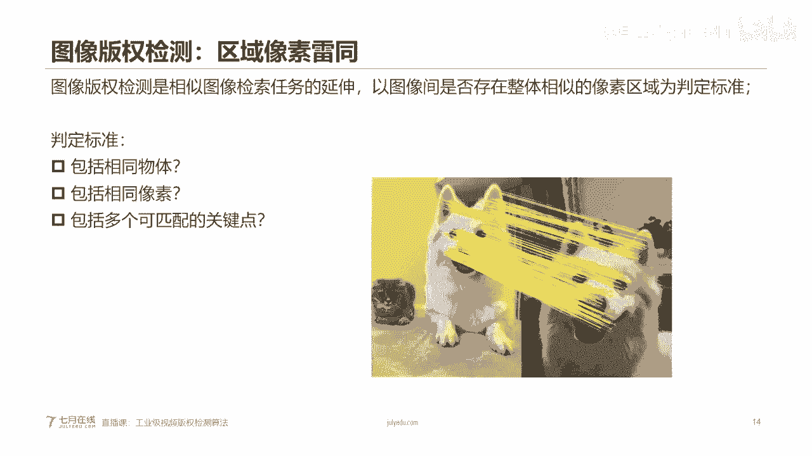

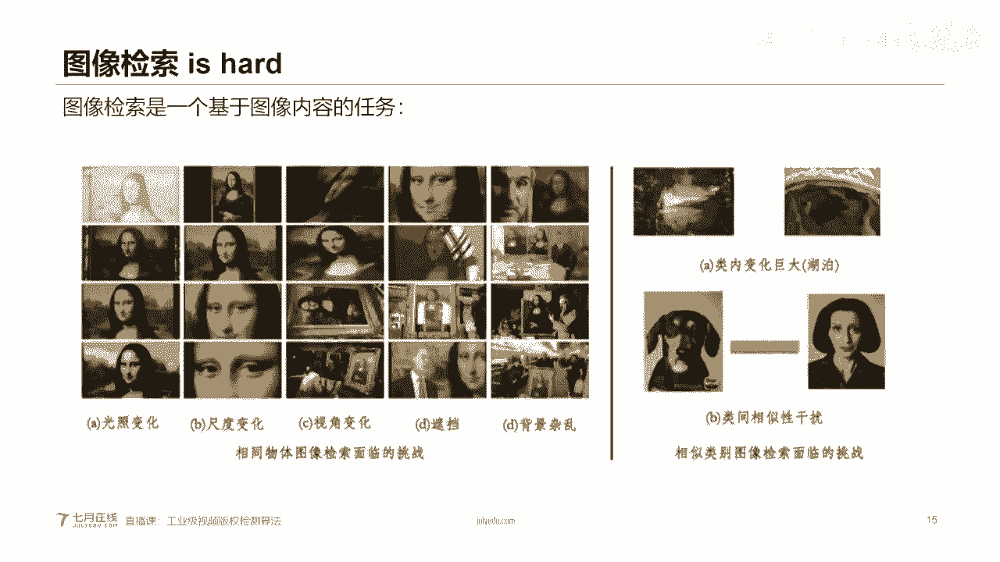

**1. 图像局部特征**
局部特征关注图像内的关键点，如角点或极值点（例如 SIFT、ORB 算法提取的点）。其特点是：
*   特征点数量（N）不固定，随图像内容变化。
*   关注局部信息，具有**尺度不变性**，对旋转、颜色变化相对鲁棒。
*   缺点：易受图像中文字等强边缘信息干扰。

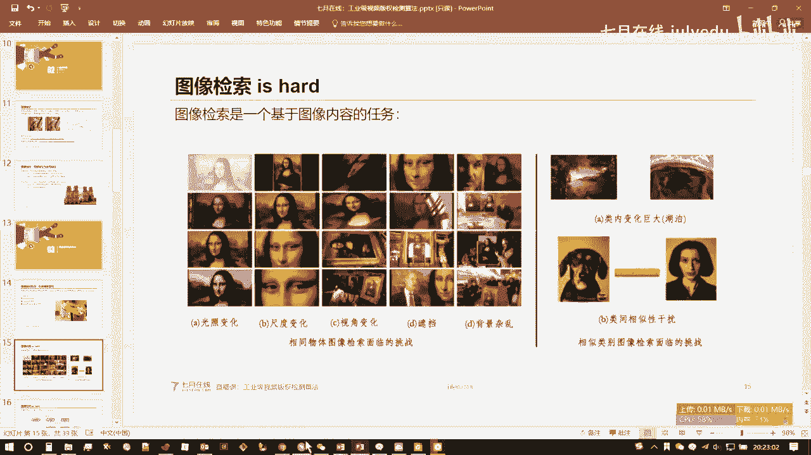

**2. 图像全局特征**
全局特征关注图像的整体统计信息或语义特征（例如颜色直方图或 CNN 提取的特征）。其特点是：
*   特征维度是固定的（例如一个 512 维的向量）。
*   关注全局信息，但通常对图像的尺度变化（如旋转）比较敏感。

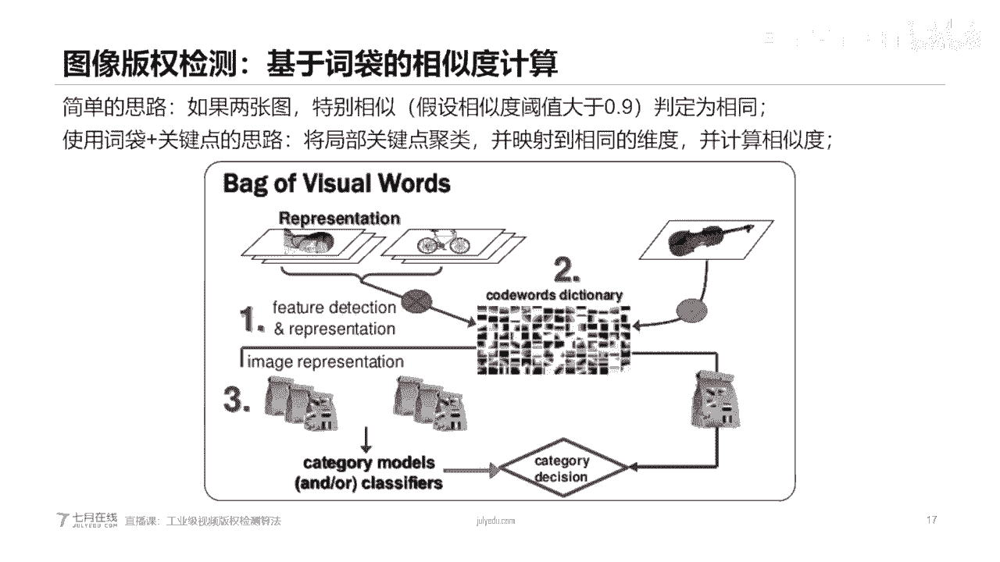

简单对比：局部特征是一个 `N x 128` 的矩阵（N 不固定），而全局特征是一个 `1 x 512` 的向量。

## 🖼️ 第三部分：图像版权检测算法

掌握了图像特征后，我们可以将其应用于具体问题。本节将探讨如何利用这些特征进行图像版权检测。

图像版权检测（Image Copyright Detection）是判断两张图片是否包含相同像素区域的相似图像检索任务。判定标准可以是：是否包含相同物体、像素相似度是否高、或可匹配的关键点是否多。

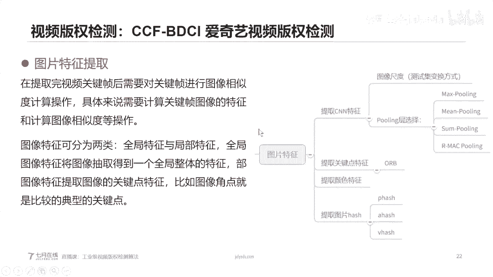

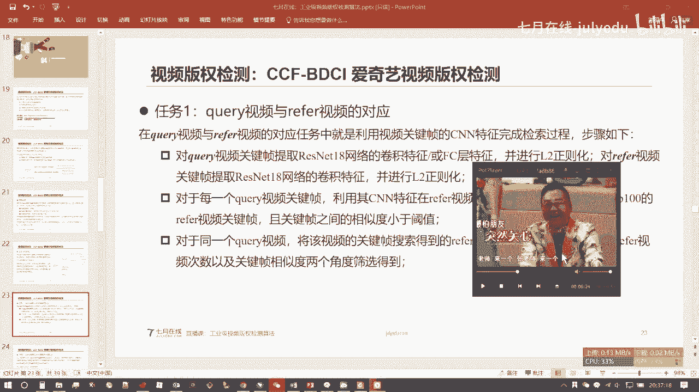

一个基础的解决思路是 **“词袋”模型**。以下是其核心流程：
1.  **提取局部特征**：从所有图片中提取关键点（如 SIFT 特征）。
2.  **特征聚类**：将所有图片的关键点特征进行聚类，形成一部“视觉词典”。
3.  **特征映射**：将每张图片的局部特征映射到这部词典上，统计每个“视觉单词”出现的频率，从而将每张图片表示为一个固定维度的向量（词袋向量）。
4.  **相似度计算**：通过计算两个词袋向量的相似度（如余弦相似度）来判断图像是否相似。若相似度高于阈值（如 0.9），则认为两张图片相同。

**公式**：图像 `I` 的词袋向量表示为：`V_I = [w1, w2, ..., wk]`，其中 `wi` 是第 `i` 个视觉单词在该图像中出现的频率或权重。

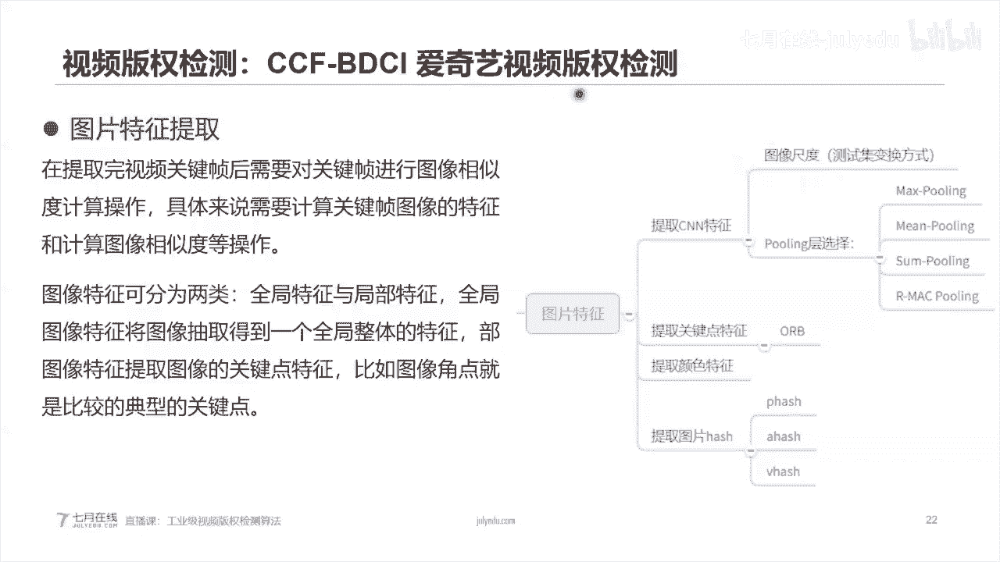

## 🎥 第四部分：视频版权检测算法

将图像检测扩展到视频领域是核心目标。本节我们将学习如何将视频版权检测问题分解并解决。

我们以 CCF BDCI 2019 年的“爱奇艺视频版权检测”比赛为例。任务要求：根据 Query 侵权短视频，找到对应的 Refer 长视频，并精确定位两者在时间轴上的对应片段（即找出 Query 的开始/结束时间 `Qs, Qe` 和 Refer 的开始/结束时间 `Rs, Re`）。

我们可以将此任务分解为两个子任务：
1.  **视频对应关系**：找到 Query 视频对应的 Refer 视频（视频检索任务）。
2.  **时间轴对应关系**：精确定位时间片段。

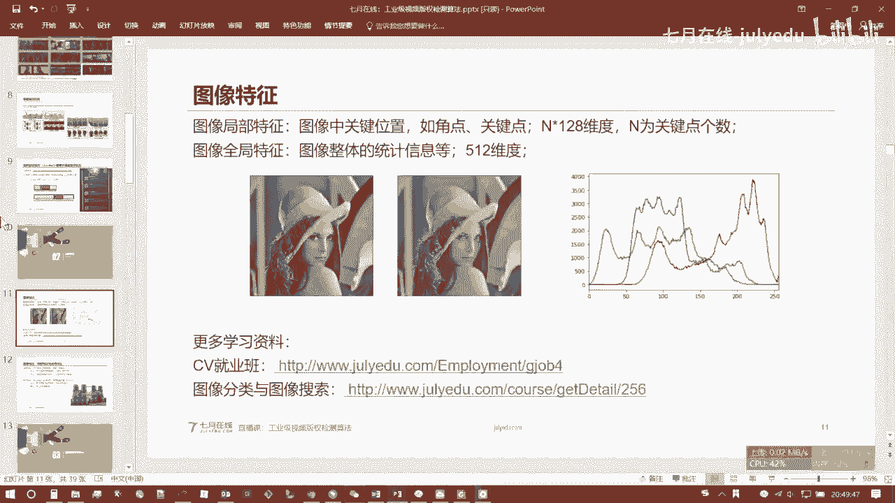

### 步骤一：视频抽帧
首先需要将视频转换为图像序列。常用方法有：
*   **关键帧抽取**：抽取视频压缩中的 I 帧（信息量最大，最清晰）。
*   **场景转换帧抽取**：通过计算帧间差异（如颜色直方图差异）来检测镜头切换点。
*   **均匀抽帧**：按固定时间间隔抽帧。
在版权检测任务中，抽取 **I 帧** 通常最有效，因其数量少、信息密度高。

### 步骤二：图像特征提取
对抽出的关键帧提取特征。可以使用：
*   **全局特征**：如用预训练的 CNN 模型（ResNet, VGG）提取特征。在池化层选择上，**最大池化（Max Pooling）** 通常比平均池化更有效，因其能保留更突出的特征。
*   **局部特征**：如 SIFT 或基于深度学习的局部特征（如 DELF），后者兼具 CNN 的强表征能力和局部特征的尺度不变性。

### 步骤三：解决子任务一（视频检索）
1.  对 Query 和 Refer 视频都抽取关键帧并提取特征（如 ResNet18 的卷积层特征），并进行 L2 归一化。
2.  将 Query 的每一关键帧特征，与 Refer 库中所有关键帧特征进行相似度计算（如余弦相似度），保留相似度最高的 Top-K 个结果。
3.  统计这 Top-K 个结果中，来自同一个 Refer 视频的出现次数。出现次数最多、且平均相似度最高的那个 Refer 视频，即被认为是 Query 对应的视频。

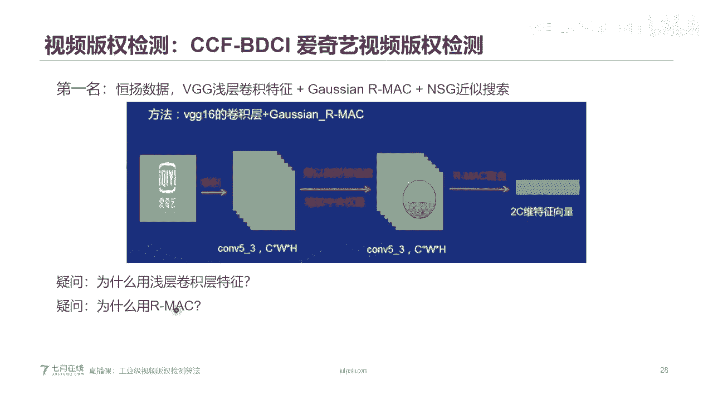

### 步骤四：解决子任务二（时间轴对应）
在找到视频对应关系后，利用已匹配上的关键帧对来推算时间轴。基于一些先验知识（如视频速度比通常为 1:1，裁剪拼接后的起止帧通常是关键帧），可以进行推算：
假设已知 Query 的第 `N-1` 帧匹配 Refer 的第 `M-1` 帧，Query 的第 `N` 帧匹配 Refer 的第 `M` 帧。
若速度比为 1:1，则可以推断 Query 中第 `N-2` 帧在 Refer 中的对应位置约为 `M-1 - (Q[N-1]的时间 - Q[N-2]的时间)`。
通过这种向前/向后推导，并结合多个匹配对进行验证，可以估算出 `Qs, Qe, Rs, Re`。

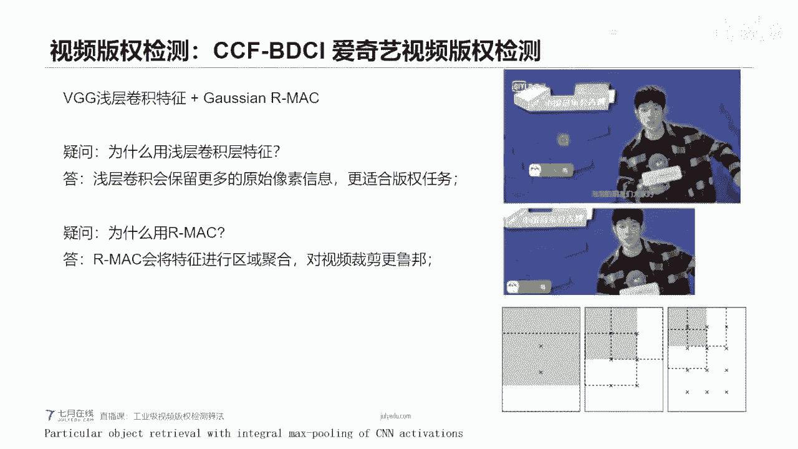

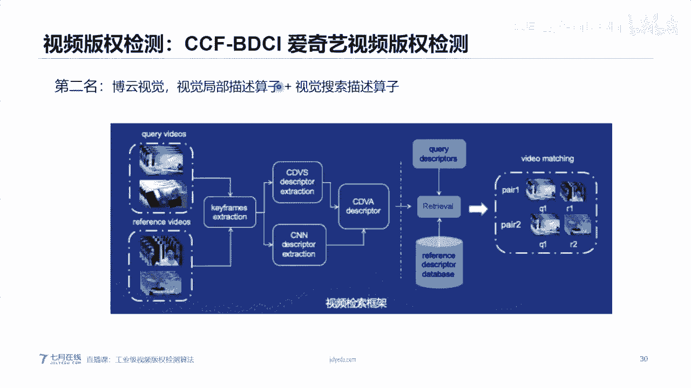

### 其他优秀方案亮点
*   **第一名方案**：使用 VGG **浅层卷积特征**（保留更多像素细节）结合 **R-MAC 池化**（一种区域聚合池化，对裁剪更鲁棒）。
*   **第二名方案**：采用 **深度局部特征**，在 CNN 特征图上提取关键点，兼具高精度和尺度不变性，且计算效率高。

### 工程优化：特征检索与压缩
当视频库很大时，需要对海量帧特征进行快速检索。常用方法有：
*   **暴力检索 (KNN)**：精度高，适合数据量小、要求 100% 召回率的场景。
*   **近似最近邻搜索 (ANN)**：如 HNSW、PQ 量化等方法，牺牲少量精度以换取大幅速度提升，适合千万甚至上亿级别的大规模检索。

## 🔍 第五部分：扩展：图像与视频检索

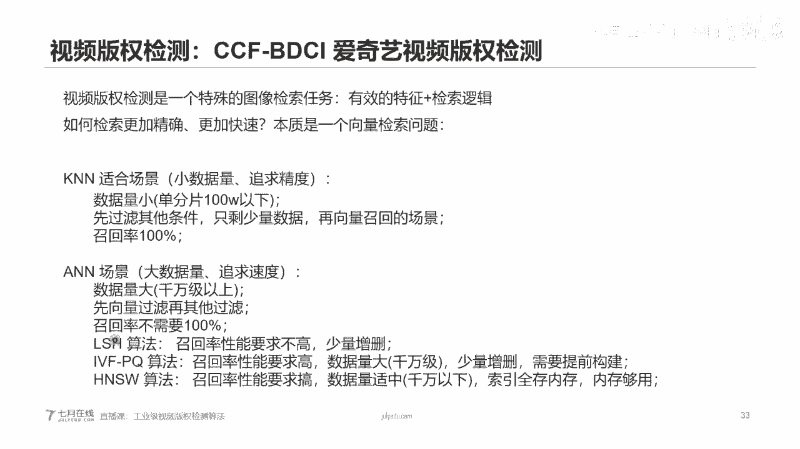

最后，我们简要扩展一下更广义的检索任务。视频版权检测属于“以图搜图”或“以视频搜视频”的范畴。除此之外，还有：
*   **类别检索**：根据视频类别搜索。
*   **文本检索**：根据文本描述搜索视频。这是一个前沿方向，通常通过将文本和图像映射到同一个特征空间（例如使用 Word2Vec 和 CNN），然后在该空间内进行最近邻搜索来实现。

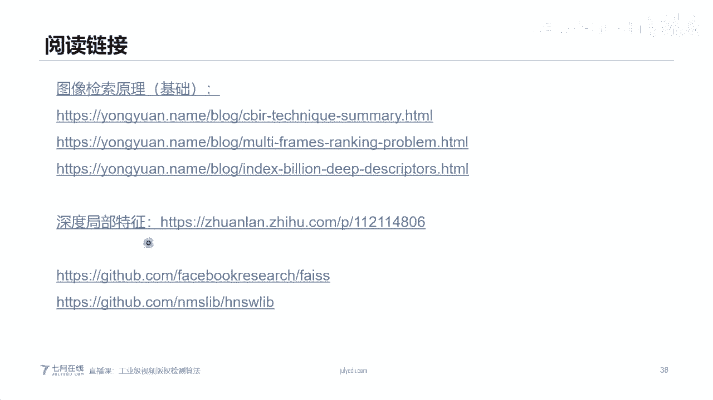

## 📝 总结

本节课中我们一起学习了工业级视频版权检测算法的完整流程。我们从任务定义出发，学习了图像局部与全局特征的基础知识，并了解了如何利用词袋模型进行图像版权检测。接着，我们深入探讨了视频版权检测的核心，将其分解为视频检索和时间轴定位两个子任务，详细讲解了抽帧、特征提取、匹配和推算的具体步骤。最后，我们还了解了特征检索的工程优化方法以及其他图像视频检索的扩展方向。

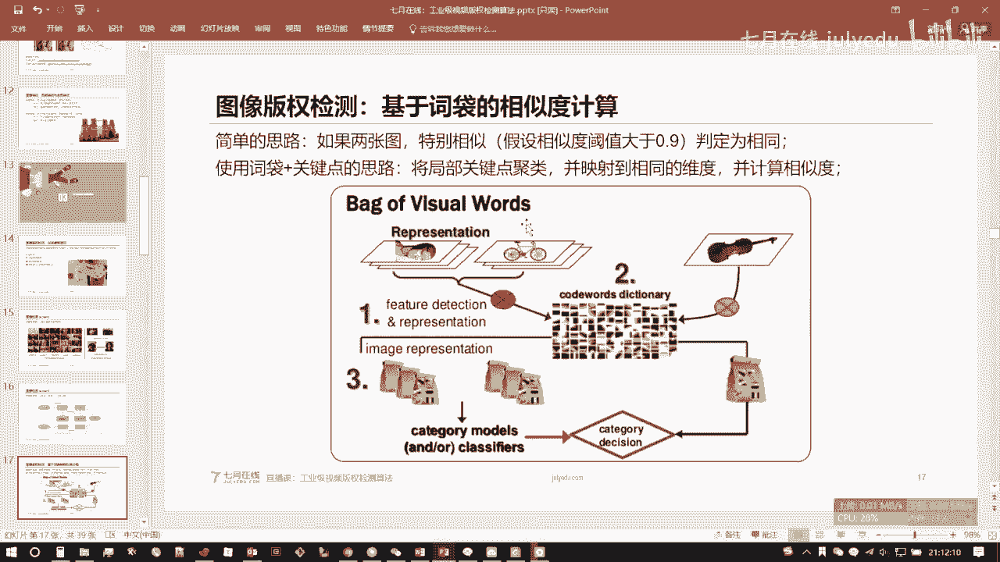

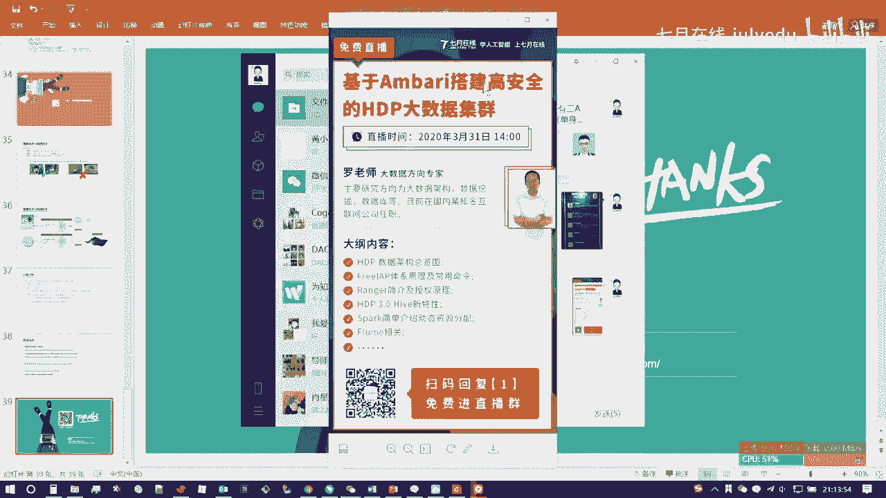

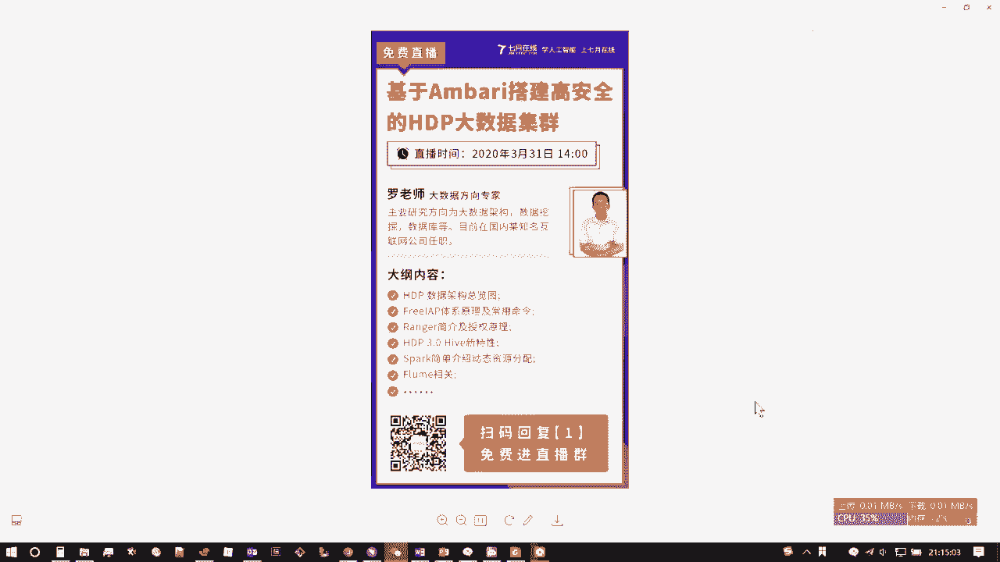

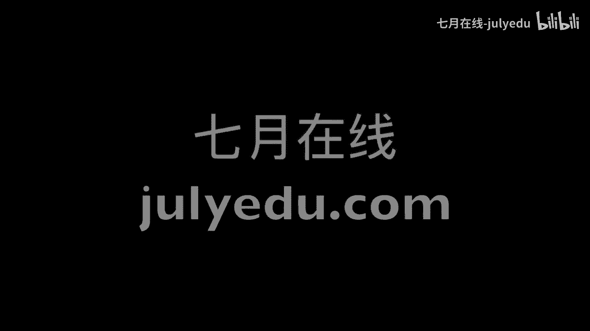

希望本教程能帮助你理解视频版权检测的核心思想与实现路径。