# 人工智能—计算机视觉CV公开课（七月在线出品） - P21：22.3.10 实时情绪识别实战-模型训练与部署

## 概述 📋

在本节课中，我们将学习深度学习的基础概念，并通过一个实时情绪识别的实战项目，了解从模型搭建、训练到部署的完整流程。课程将涵盖深度学习与机器学习的区别、神经网络的基本原理、使用PyTorch框架进行模型训练，以及如何将训练好的模型应用于实际场景。

---

## 第一部分：深度学习介绍 🧠

### 深度学习的定义与范围

深度学习是一种包含多层神经元结构的计算方法，其结构类似于人脑的神经元网络。我们关注的重点是模型从输入到输出的整体网络结构。

在学习深度学习时，不可避免地会接触到机器学习。深度学习是机器学习的一个分支，特别是基于神经元计算的分支。如果将人工智能、机器学习和深度学习的关系用一个维恩图表示，人工智能是最大的范围，机器学习包含在其中，而深度学习则是机器学习的一部分。

对于初学者而言，建议先学习机器学习，再学习深度学习。许多深度学习课程也会先讲解机器学习的基础知识，因此无需担心知识割裂。

### 深度学习与机器学习的区别

机器学习包含许多非深度学习的方法，例如树模型、线性模型（如逻辑回归、LASSO）以及集成学习等。这些方法都是机器学习的重要组成部分。因此，不能将深度学习与机器学习等同或对立起来。

两者的学习方法也有较大不同：
*   **机器学习**：更关注模型原理、模型构造过程以及模型的泛化能力（即精度评价）。
*   **深度学习**：更关注网络结构本身以及网络的优化训练过程。

### 深度学习的特点

1.  **端到端计算**：深度学习可以自动进行特征工程。传统的机器学习流程是：数据 -> 特征工程 -> 模型 -> 预测。而深度学习是端到端的，即：输入 -> 深度学习模型 -> 输出。模型会自动学习所需的特征。
2.  **有向计算图**：深度学习的网络结构可以用有向图表示。节点代表具体的计算过程，边代表数据的流向。

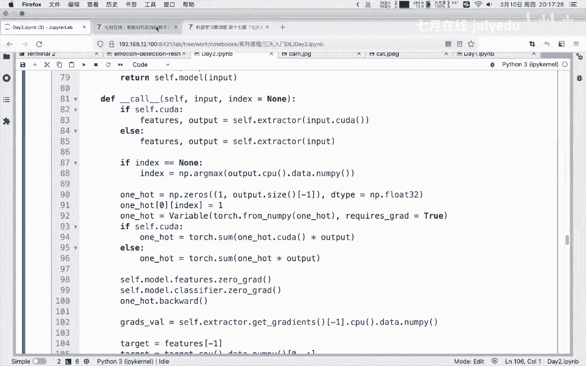


---


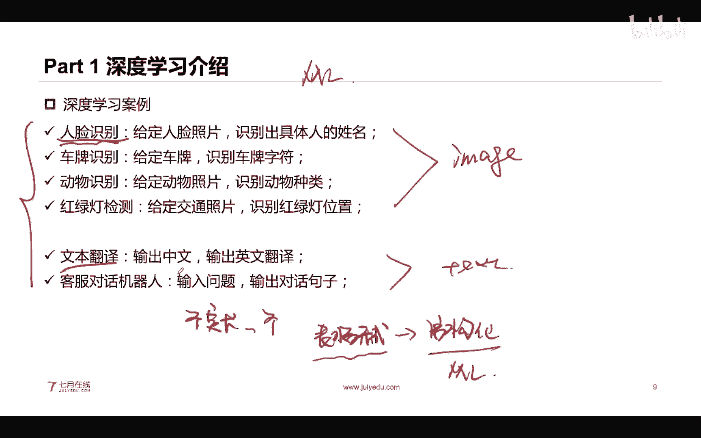


## 第二部分：神经网络基础 ⚙️

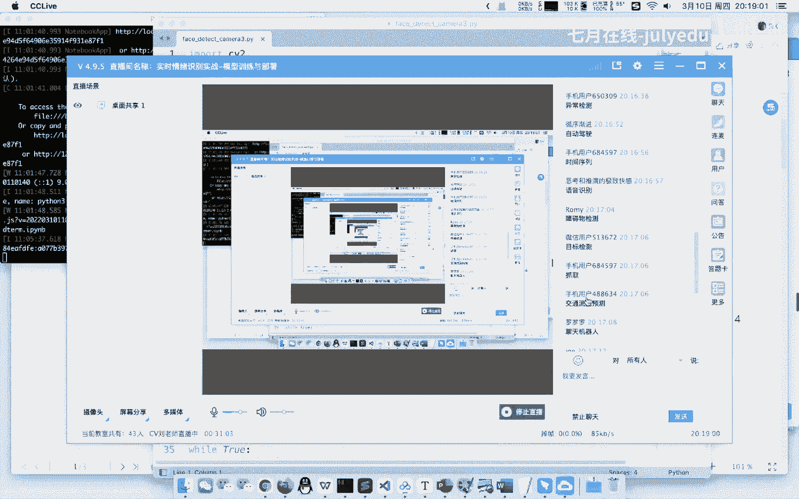


### 全连接网络

一个典型的全连接网络由输入层、隐藏层和输出层组成。隐藏层可以有多层。
*   **输入层**：接收原始输入数据。
*   **隐藏层**：接收前一层的输入，进行计算后输出给下一层。
*   **输出层**：输出最终结果。

在全连接网络中，每一层的所有节点都与下一层的所有节点相连。层内的节点之间没有连接。

### 神经元与矩阵计算

单个神经元的计算过程可以看作是输入与权重的线性加权求和，再加上偏置，最后通过一个激活函数得到输出。

用公式表示如下：
`输出 = 激活函数( (X1 * W1 + X2 * W2 + ... + Xn * Wn) + B )`

这个计算过程本质上就是矩阵乘法。因此，全连接层的计算可以通过矩阵乘法来实现。理解这个计算过程至关重要，因为这不仅是使用深度学习框架的基础，也是未来可能需要自定义网络层所必备的知识。

### 深度学习的应用场景

深度学习非常适合处理非结构化数据，例如：
*   **图像类**：人脸识别、车牌识别、动物识别、红绿灯检测。
*   **文本类**：机器翻译、客服对话机器人。

相比之下，结构化数据（如表格数据）更适合用传统的机器学习方法处理。

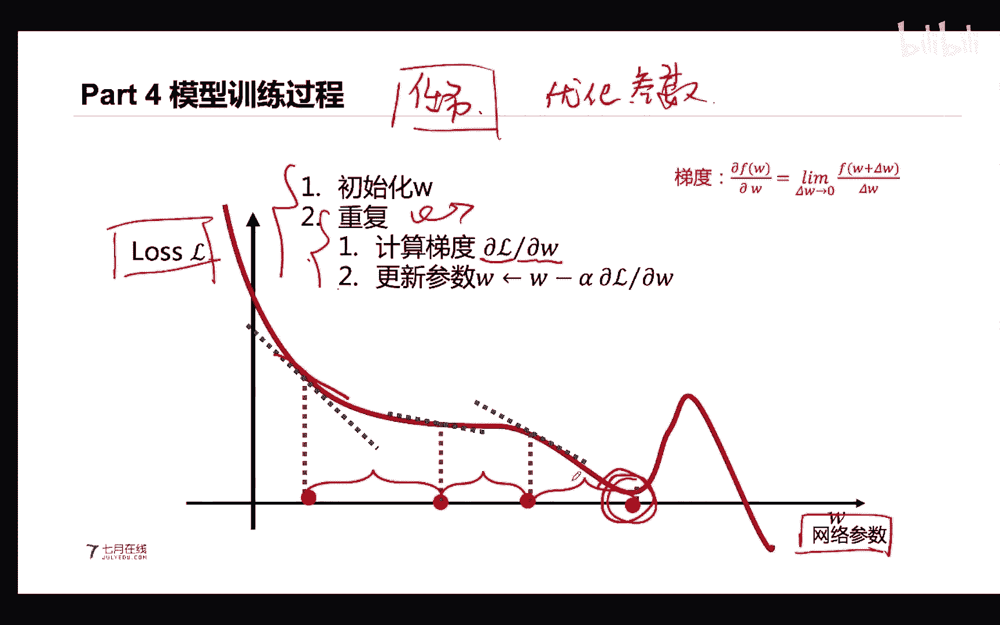

---

## 第三部分：手动实现与模型训练 🔧

### 手动实现全连接层

我们可以使用矩阵乘法来手动模拟一个全连接层。以手写数字数据集MNIST为例，其输入是28x28的灰度图。首先需要将二维图像数据展平为一维向量（784维）。

以下是定义两层全连接网络参数的核心思想：
1.  第一层：输入维度784，隐藏层维度256。这对应一个 `784x256` 的权重矩阵 `W1` 和一个 `256` 维的偏置向量 `B1`。
2.  第二层：输入维度256，输出维度10（对应10个数字类别）。这对应一个 `256x10` 的权重矩阵 `W2` 和一个 `10` 维的偏置向量 `B2`。

训练时，进行前向传播计算：
`输出 = ((输入 * W1 + B1) * W2 + B2)`
这里的乘法均为矩阵乘法。

### 模型训练与梯度下降

训练深度学习模型需要一个目标函数（损失函数）来衡量预测值与真实标签的差异。然后通过优化算法（如随机梯度下降）来更新模型参数，以最小化损失。

随机梯度下降的步骤如下：
1.  初始化模型参数 `W`。
2.  重复以下过程：
    *   计算当前参数下损失函数的梯度（偏导数）。
    *   沿着梯度的反方向更新参数：`W = W - 学习率 * 梯度`。

梯度指示了损失函数增长最快的方向，因此反向更新可以使损失下降。

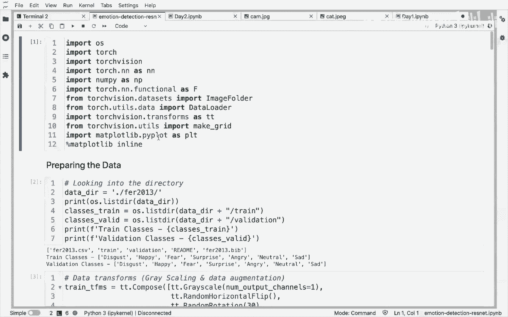

### 使用PyTorch自动求导

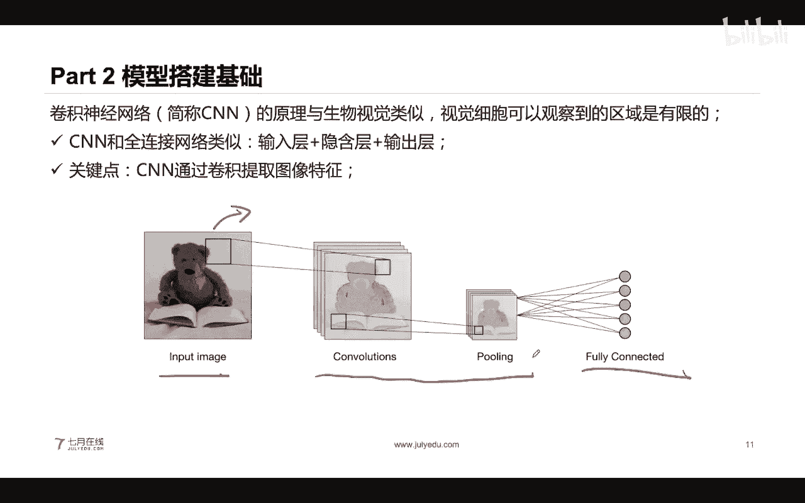

在实际中，我们使用PyTorch等框架，它们可以自动计算梯度。例如：
```python
import torch
x = torch.tensor([[1, 2], [3, 4]], requires_grad=True)
y = x + 2
z = y * y * 3
out = z.mean()
out.backward() # 自动计算out对x的梯度
print(x.grad) # 查看梯度值
```
`backward()` 方法会自动计算并累积梯度。在参数更新前，通常需要用 `optimizer.zero_grad()` 清空上一轮的梯度，防止累积。

### 线性回归示例

以下是一个使用PyTorch实现线性回归的简化流程：
1.  生成模拟数据（如 `Y = -3X + 4` 加噪声）。
2.  定义参数 `W` 和 `B`，并设置为需要梯度。
3.  定义损失函数（如均方误差MSE）。
4.  在循环中：
    *   前向传播计算预测值：`预测 = X * W + B`
    *   计算损失：`loss = MSE(预测, 真实Y)`
    *   反向传播计算梯度：`loss.backward()`
    *   使用优化器更新参数：`optimizer.step()`
    *   清空梯度：`optimizer.zero_grad()`

**学习率**是一个重要的超参数。过小会导致收敛慢，过大会导致在最优解附近震荡。

---

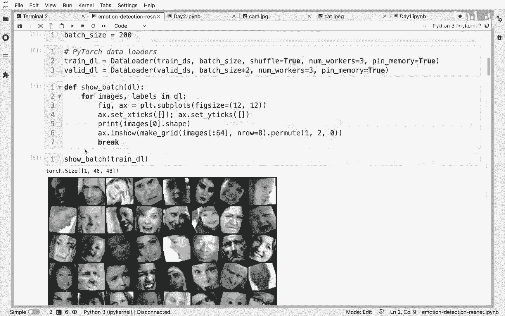

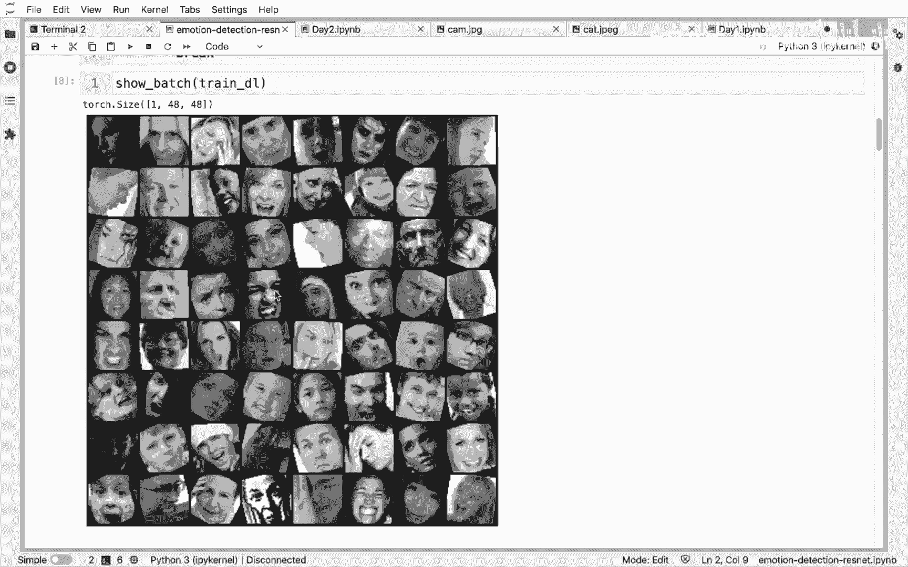

## 第四部分：卷积神经网络与情绪识别实战 🎭

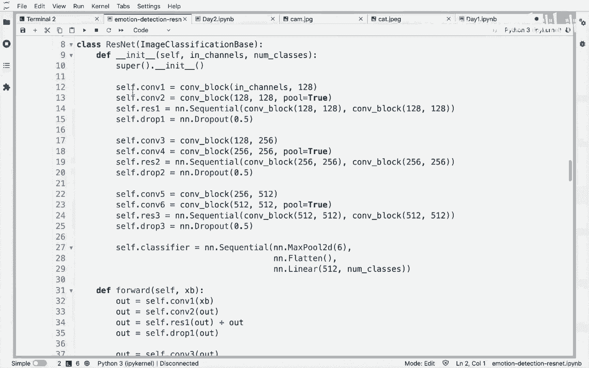

上一节我们介绍了全连接网络和训练基础，本节我们将使用更强大的卷积神经网络（CNN）来完成情绪识别任务。

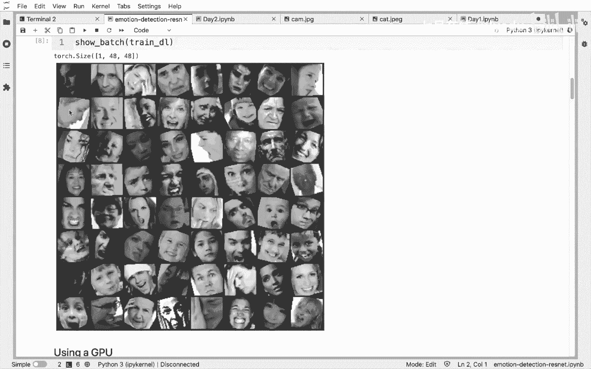

### 卷积神经网络简介

卷积神经网络仿生了生物的视觉机制。其核心是使用**卷积层**自动提取图像的特征，再通过池化层和全连接层得到最终输出。CNN的关键在于使用卷积核（滤波器）在图像的局部区域进行计算，从而捕获空间特征。

### 实战步骤分解

对于初学者，完成一个深度学习项目通常会在数据读取这一步遇到困难。整个流程可分为三步：
1.  **读取与处理数据**
2.  **定义模型**
3.  **训练模型**

#### 1. 数据读取与处理

对于按文件夹分类存储的图像数据集（例如，每个子文件夹代表一种情绪类别），可以使用PyTorch的 `ImageFolder` 来方便地加载。

同时，需要定义 `transforms` 来进行数据转换和增强，例如调整尺寸、转为灰度图、随机翻转、旋转等，这有助于提升模型的泛化能力。

```python
from torchvision import datasets, transforms

# 定义数据转换（包括增强）
transform = transforms.Compose([
    transforms.Grayscale(),
    transforms.RandomHorizontalFlip(),
    transforms.ToTensor(),
])

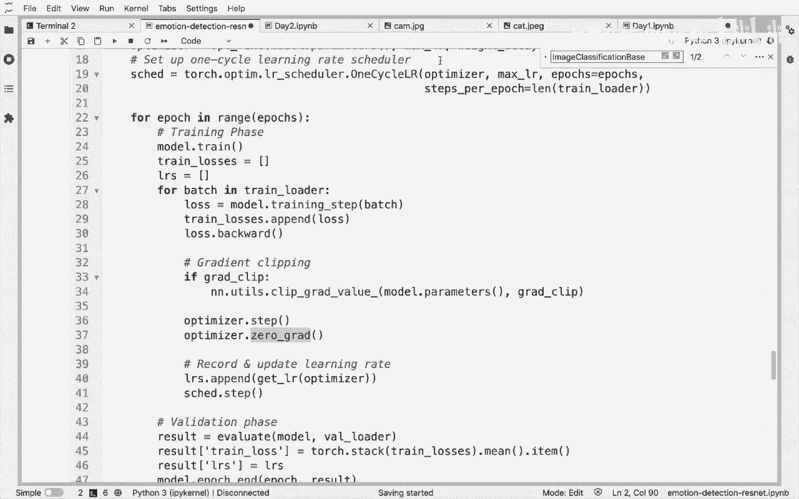


# 使用ImageFolder加载数据集
train_dataset = datasets.ImageFolder(root='path/to/train_data', transform=transform)

# 创建DataLoader，用于批量读取数据
train_loader = torch.utils.data.DataLoader(train_dataset, batch_size=32, shuffle=True)
```

#### 2. 定义情绪识别CNN模型

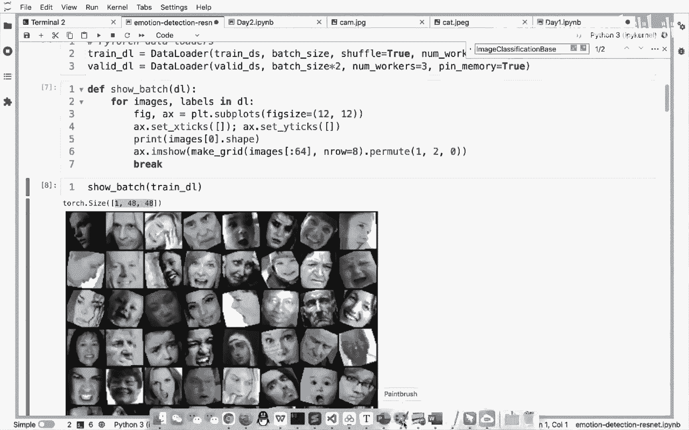

模型定义通常继承自 `torch.nn.Module`，并重写 `__init__`（初始化层）和 `forward`（定义前向传播逻辑）两个函数。

一个简单的情绪识别CNN模型结构如下：
*   **前端**：由多个卷积块（卷积层 + 批归一化层 + 激活函数 + 池化层）堆叠而成，用于特征提取。
*   **后端**：将提取的特征展平后，接入全连接层，最终输出对应各类情绪的概率。

在PyTorch中，可以直接使用 `nn.Conv2d`, `nn.Linear` 等预定义层，无需手动创建权重矩阵。


#### 3. 训练模型

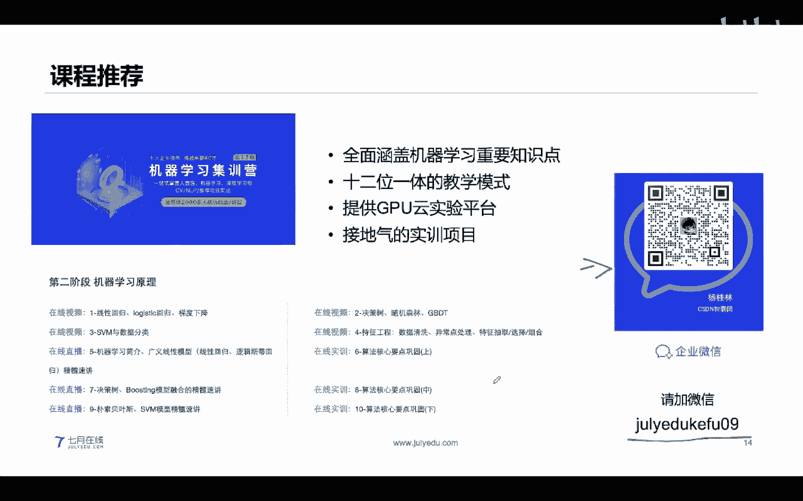

训练循环的代码与之前的线性回归示例结构类似，但使用了更便捷的优化器：
```python
model = EmotionCNN() # 实例化模型
criterion = nn.CrossEntropyLoss() # 定义损失函数（分类任务常用交叉熵损失）
optimizer = torch.optim.Adam(model.parameters(), lr=0.001) # 定义优化器

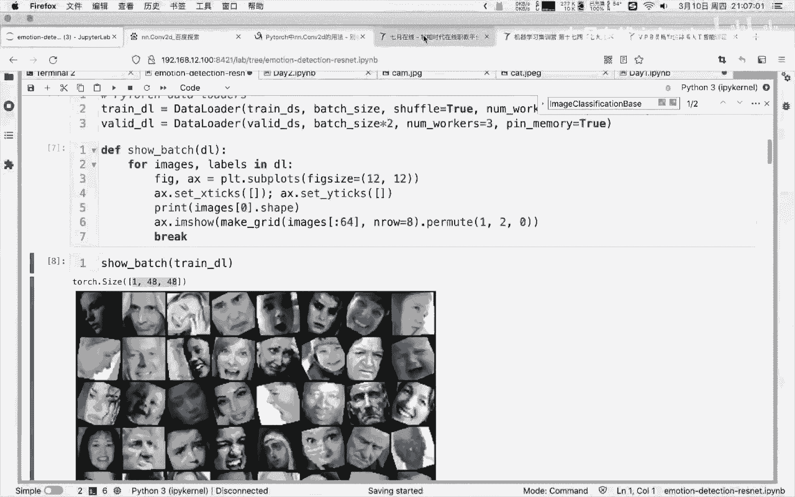


for epoch in range(num_epochs):
    for images, labels in train_loader:
        # 前向传播
        outputs = model(images)
        loss = criterion(outputs, labels)

        # 反向传播与优化
        optimizer.zero_grad() # 清空梯度
        loss.backward() # 计算梯度
        optimizer.step() # 更新参数
```
`optimizer.step()` 会根据计算出的梯度自动更新模型中的所有参数。

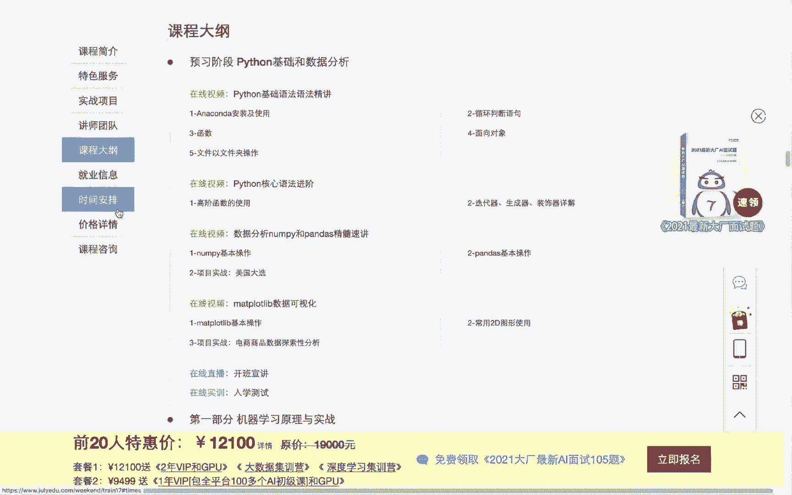

#### 4. 模型部署


模型部署的本质就是进行**前向传播**。以实时摄像头情绪识别为例：
1.  使用人脸检测算法（如OpenCV的Haar级联或Dlib）从视频流中检测并截取人脸区域。
2.  将人脸区域图像进行与训练时相同的预处理（如缩放、归一化）。
3.  将处理后的图像输入到训练好的模型中，进行前向传播，得到情绪分类结果。
4.  将结果可视化在视频画面上。

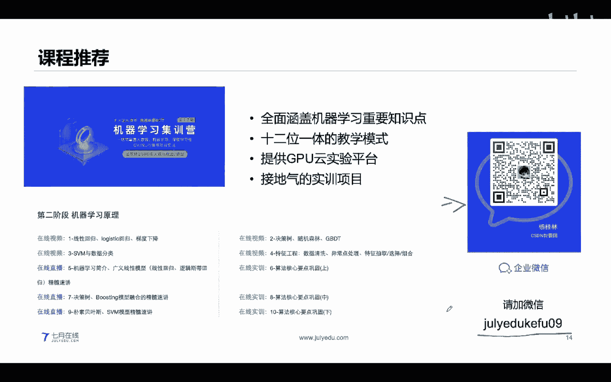

---


## 课程总结 🎯


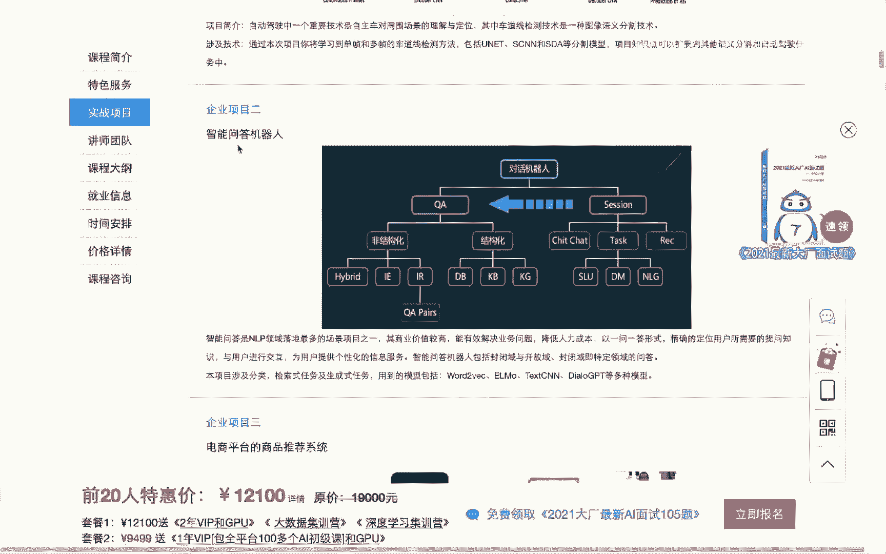

本节课我们一起学习了深度学习的核心知识：
1.  **概念基础**：理解了深度学习与机器学习的关系与区别，以及深度学习端到端和有向计算图的特点。
2.  **网络原理**：学习了全连接网络和神经元的基础计算，认识到矩阵乘法是实现神经网络的基础。
3.  **训练过程**：掌握了模型训练的核心——通过损失函数和梯度下降算法优化参数，并使用PyTorch框架简化了梯度计算和参数更新流程。
4.  **项目实战**：通过情绪识别项目，串联了从数据加载、CNN模型构建、训练循环到模型部署的完整深度学习应用流程。


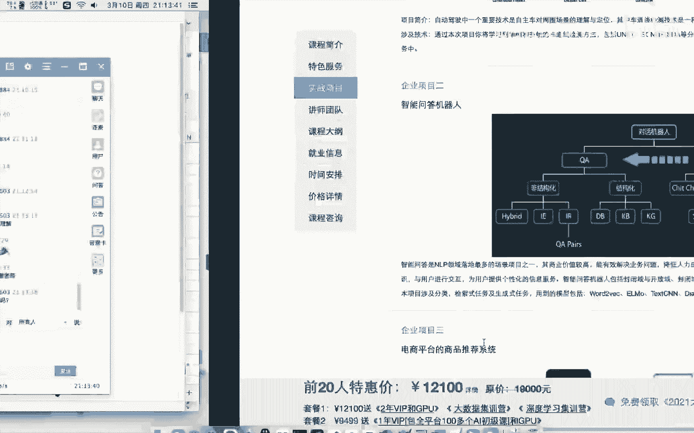

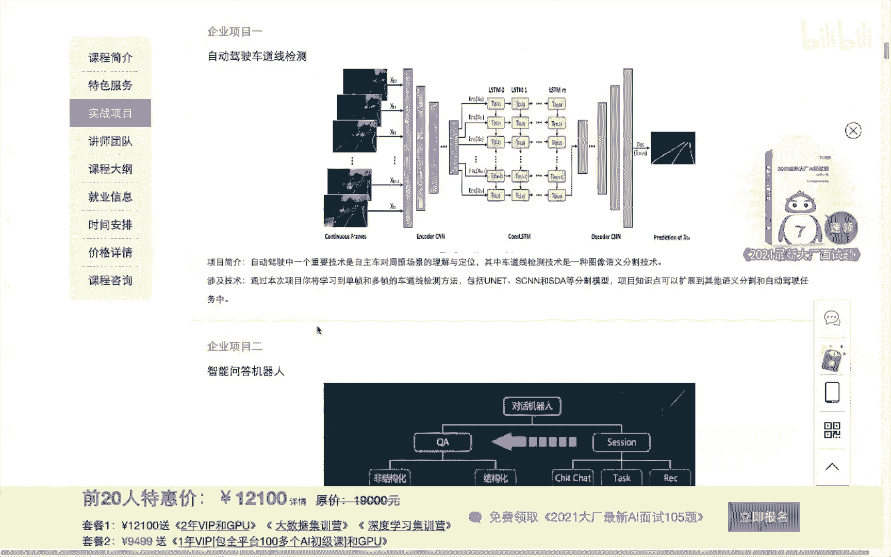

希望本教程能帮助你打下坚实的深度学习基础，并具备动手实现一个完整CV项目的能力。


---
*注：教程中涉及的代码框架、数据集处理及模型部署细节，可根据提供的配套代码进行进一步实践。*