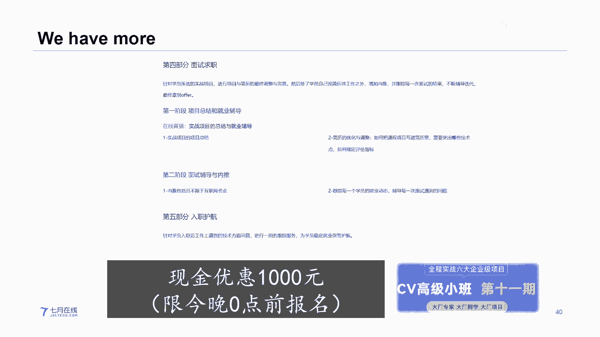

# 人工智能—计算机视觉CV公开课（七月在线出品） - P22：凭什么，Transformer在CV领域这么火 🚀


在本节课中，我们将要学习Transformer模型为何能在计算机视觉领域取得巨大成功。我们将回顾其起源，探讨其核心思想，并重点分析Vision Transformer及其重要变体Swin Transformer的工作原理和优势。

---

## 课程概述 📖

Transformer模型最初在自然语言处理领域大放异彩，但如今已成功进军计算机视觉领域，并展现出强大的潜力。本节课将解析Transformer的核心机制，并探讨其如何克服传统视觉模型的局限，最终成为CV领域的重要基石。

---

## Transformer的起源与核心思想

上一节我们概述了课程内容，本节中我们来看看Transformer的起源。

Transformer并非起源于计算机视觉领域。它大约在2020年左右在自然语言处理领域大放异彩。在Transformer之前，NLP领域主要依赖循环神经网络。

例如，在处理一段包含代词的长文本时，人类能轻松理解代词所指代的对象，即使它们相隔很远。但对于RNN模型来说，捕捉这种长距离依赖关系非常困难。

Transformer的出现解决了这个问题。其核心思想是**注意力机制**，它允许序列中的每个元素（如单词）关注序列中所有其他元素，从而建立全局依赖关系。

Transformer的基本结构遵循编码器-解码器范式。其核心公式是**多头自注意力机制**：

```python
# 多头注意力机制的简化表示
Attention(Q, K, V) = softmax(Q * K^T / sqrt(d_k)) * V
```

其中，`Q`（查询）、`K`（键）、`V`（值）是由输入序列通过线性变换得到的矩阵。`d_k`是键向量的维度。

---

## Transformer进军计算机视觉的挑战

上一节我们介绍了Transformer在NLP中的成功，本节中我们来看看它最初应用于CV时面临的挑战。

将Transformer直接应用于图像处理存在两大主要障碍：
1.  **输入形式不同**：NLP的输入是离散的、具有高级语义的单词序列（Token）。而图像的输入是连续的、低级的像素点网格。
2.  **序列长度与计算量**：NLP的序列长度相对较短（如128或256个词）。而图像的像素点数量极其庞大（如224x224=50176），直接对每个像素点应用自注意力机制会导致计算复杂度呈平方级增长，难以承受。

---

## Vision Transformer：破局之道

面对上述挑战，研究者提出了Vision Transformer。

ViT的核心创新在于改变了输入形式。它不再将图像视为像素网格，而是将其分割成固定大小的图像块（Patch）。

以下是ViT处理图像的步骤：
1.  **图像分块**：将输入图像分割成N个大小为PxP的Patch。
2.  **线性投影**：将每个Patch展平为一个向量，并通过一个可学习的线性层映射到Transformer的嵌入维度。
3.  **添加位置编码**：为每个Patch向量添加位置编码，以保留其在原始图像中的空间信息。
4.  **输入Transformer**：将得到的Patch序列（加上一个特殊的[CLS]分类令牌）输入标准的Transformer编码器。

通过这种方式，图像被转化为一个序列，从而能够利用Transformer强大的全局建模能力。

---

## Swin Transformer：更高效的视觉Transformer

上一节我们介绍了ViT如何将Transformer引入CV，本节中我们来看看一个更高效的变体——Swin Transformer。

Swin Transformer在2021年ICCV会议上获得了最佳论文奖。它旨在设计一个通用的视觉骨干网络，并解决ViT的两个问题：计算复杂度高以及缺乏像CNN那样的层次化特征表示。

Swin Transformer的核心创新是**滑动窗口**和**层级设计**。

以下是Swin Transformer的关键特性：

1.  **层级特征图**：像CNN一样，Swin Transformer构建了层次化的特征图。随着网络加深，特征图尺寸减小，通道数增加，从而捕获不同尺度的信息。
2.  **基于窗口的自注意力**：为了降低计算复杂度，Swin Transformer将自注意力计算限制在每个不重叠的局部窗口内。这大大减少了计算量。
3.  **移位窗口**：为了在保持计算效率的同时实现跨窗口连接，Swin Transformer在连续的Transformer块中交替使用规则窗口划分和移位窗口划分。移位窗口机制允许前一层的非相邻窗口在下一层进行交互，从而实现了全局建模能力。

基于窗口的自注意力计算复杂度公式为：
`Ω(MSA) = 4hwC² + 2(hw)²C`
而基于滑动窗口的自注意力计算复杂度为：
`Ω(W-MSA) = 4hwC² + 2M²hwC`
其中，`h`和`w`是特征图大小，`C`是通道数，`M`是窗口大小。当`M`固定时（如7），复杂度从与`hw`的平方相关变为线性相关，显著提升了效率。

---

## 总结与展望

本节课中我们一起学习了Transformer在计算机视觉领域兴起的原因和关键技术。

我们从Transformer在NLP中的起源讲起，理解了其核心的注意力机制。随后，我们探讨了将其应用于图像所面临的输入形式和计算复杂度挑战。Vision Transformer通过将图像分块转化为序列，巧妙地解决了第一个挑战。而Swin Transformer则通过引入滑动窗口和层级结构，在保持强大建模能力的同时，显著降低了计算成本，使其成为更实用的视觉骨干网络。

Transformer的成功不仅体现在图像分类上，更在目标检测、分割等下游任务中展现出强大潜力，其设计思想正在重塑计算机视觉的研究范式。




---
*本教程根据七月在线CV公开课P22内容整理，聚焦于技术原理讲解，已省略课程相关的推广与互动信息。*