# 人工智能—计算机视觉CV公开课（七月在线出品） - P3：计算机视觉技术跨平台应用实践 🚀

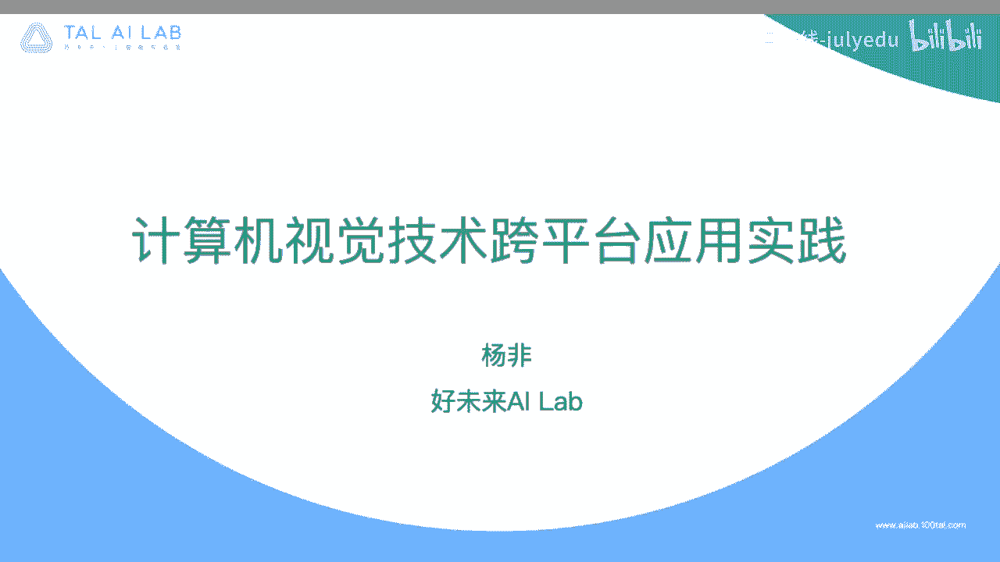

在本节课中，我们将学习计算机视觉技术如何从理论走向实际产品，涵盖大规模后台服务构建、移动端模型部署以及AI在教育场景中的应用实践。我们将探讨从模型选择、系统设计到具体落地所面临的挑战与解决方案。

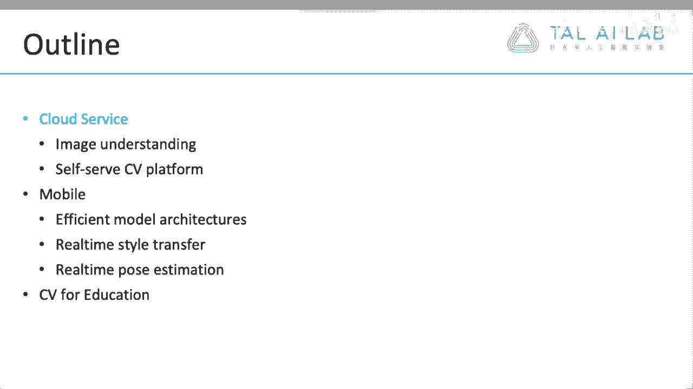

---

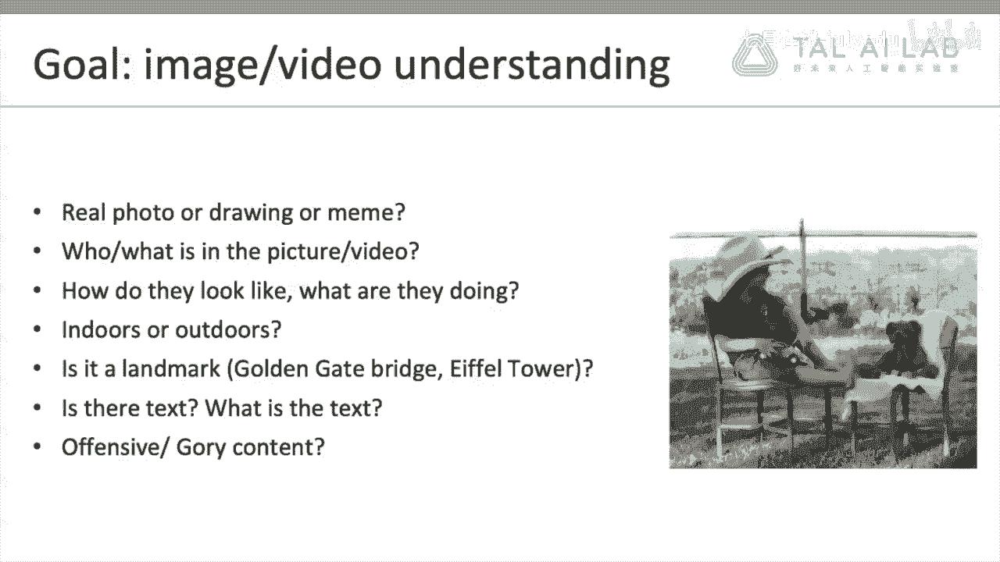

## 课程概述 📋

本次分享将围绕计算机视觉技术的跨平台应用展开。内容不专注于单一问题或方法，而是涉及多个方面，包括如何构建大规模后台云服务、如何在移动端开发和部署计算机视觉模型，以及如何将AI技术应用到教育场景中。课程将结合行业现状、讲者自身及同事的工作经验，讨论实际产品中遇到的问题和挑战。

---

## 一、 图像理解与卷积神经网络发展

对于互联网公司及许多行业，我们拥有海量的图片和视频数据。从这些数据出发，我们常常希望回答一些关于数据的问题。例如，一张图片是照片还是素描？包含人还是物体？物体看起来是什么样子？在做什么事情？是室内还是室外场景？是风景名胜吗？包含文本信息吗？文本是什么？同时，很多产品也关心图片是否含有不良内容，以便从互联网平台过滤掉。

这里会用到很多AI技术，特别是卷积神经网络，用于图片分类和物体检测。

### 卷积神经网络发展简史

大家应该对卷积神经网络的发展历史相当熟悉，这里可以快速总结一下。

*   **LeNet (1998)**: 第一个成功应用的卷积神经网络，由Yann LeCun开发。它是一个只有5层的简单网络，包含卷积层、下采样层和全连接层，输出是数字0到9的类别标签。该算法曾运行在ATM自动取款机上。
*   **AlexNet (2012)**: 第一个大规模卷积神经网络，赢得了2012年ImageNet图片识别比赛冠军，并大幅领先传统方法。它有5个卷积层和3个全连接层，使用ReLU做非线性激活。与之前算法相比，精度提高了20%以上。
*   **VGGNet (2014)**: 由牛津大学提出。与AlexNet相比，网络深度从8层提高到了16层或19层。它叠加了多个3x3的卷积层。将多个3x3卷积层叠加，其感受野等价于更大的卷积核（如3个3x3等价于1个7x7），同时网络更深，非线性运算更多，参数更少，更适合图片分类。
*   **GoogLeNet (2014)**: 赢得了当年ImageNet比赛冠军。它是一种更深的网络结构（22层），使用了称为Inception的模块。Inception模块包含多个分支（1x1, 3x3, 5x5卷积），通过并行连接输出，并使用1x1的瓶颈层降低维度。与AlexNet和VGG相比，参数量大幅减少（仅500万参数，比AlexNet小12倍），效果也有提升。
*   **ResNet (2015)**: 由何恺明提出。研究发现，简单地叠加更多层数只会使模型性能变差，主要原因是梯度消失。ResNet设计了残差网络结构，引入了跨层连接，使网络不再直接拟合输出Y，而是拟合残差Y-X。这使得网络更容易训练，深度可达150层甚至1000层。ResNet赢得了2015年ImageNet和COCO竞赛冠军，也是2016年CVPR最佳论文。

### 模型对比分析

我们可以将上述模型进行对比。在一幅图中，Y轴表示图像识别精度，X轴表示运行模型时的实际计算量（单位：10亿次加乘运算），圆圈面积表示模型大小（参数量）。

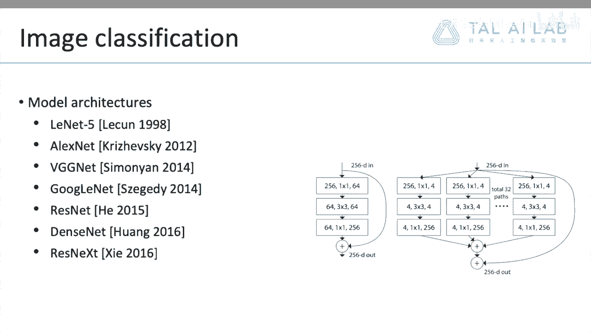

*   **AlexNet** 位于左下角，参数量大，计算量小，精度相对较低。
*   **Inception** 和 **ResNet** 位于图的上方，精度高，模型大小和运算量适中。
*   **VGG-16/19** 位于图的最右侧，模型非常大，计算量巨大，精度优于AlexNet但不及Inception和ResNet。

### ResNet的改进工作

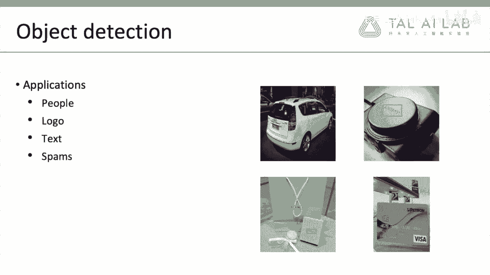

ResNet之后有两个重要的改进工作，效果很好且易于使用。

*   **DenseNet (2017 CVPR最佳论文)**: 在层与层之间增加了更多连接。每一层的输入是前面所有层的输出，而不仅仅是前一层的输出。DenseNet采用模块化设计，只有模块内部的层才密集连接。这种设计使得信息流动更高效，在同样精度下，DenseNet可以使用更少的参数和计算量。
*   **ResNeXt**: 采用分组卷积的方式。它将卷积操作分成多个组（例如将128个通道分为32个组），增加了神经元的数量（宽度）以提高模型精度，但由于分组，计算量与原始的ResNet模块保持一致。

---

上一节我们回顾了图像分类的主流模型发展，本节中我们来看看用于物体检测的常见方法。

## 二、 物体检测方法

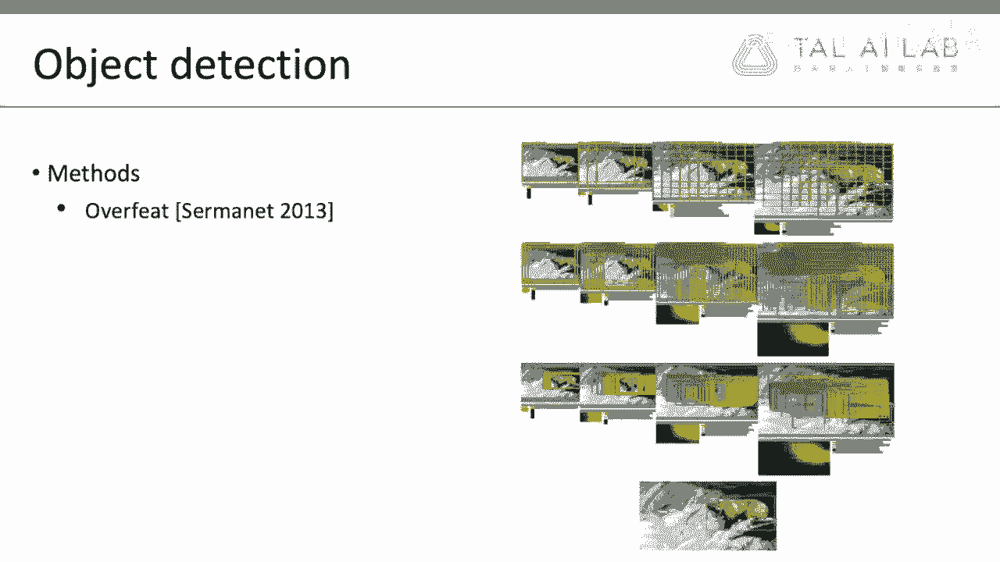

物体检测与图片分类不同。对于图片分类，我们只需要给出一个类别标签（例如，这是一张猫的图片）。对于物体检测，除了要知道图片中有猫，还需要知道猫在图片中的具体位置，通常用一个矩形框（Bounding Box）圈出。一张图片中可能包含多个属于相同或不同类别的物体，都需要用不同的矩形框标出。

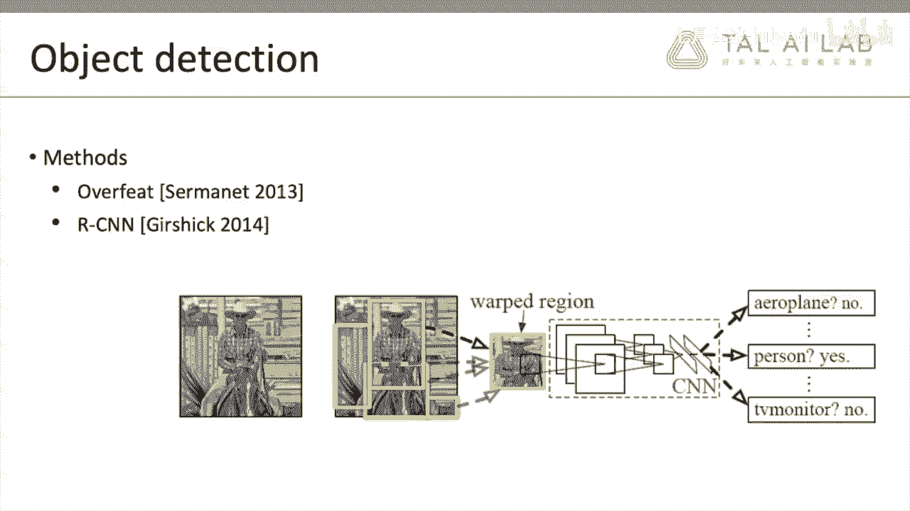

### 传统方法与挑战

传统的物体检测方法（如人脸检测）通常采用滑动窗口法。给定一张图片，我们选取一个窗口，提取特征并与模型比较。为了检测出图片中所有可能位置、大小的人脸，需要设置各种尺寸、长宽比的窗口在图片上滑动，对每个窗口提取特征并进行匹配。这种方法计算开销巨大。

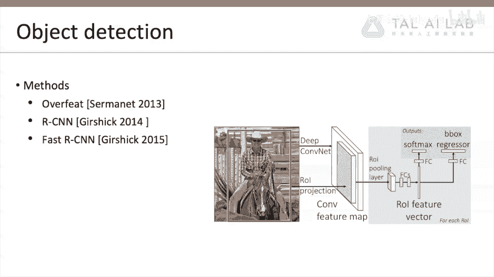

当使用深度学习模型时，如果直接对每个窗口提取深度特征，计算量将无法承受。因此，后续很多检测方法的核心都是设计模型以减少检测所需的计算量。

以下是几种重要的物体检测方法：

*   **OverFeat (2013)**: 充分利用卷积特征，只运行一次模型即可实现与滑动窗口等价的效果。方法直观：首先将分类模型（如AlexNet）中的全连接层全部替换为卷积层，使网络可以接受任意尺寸的输入。最终输出是一个二维的特征图，该图上每个点对应原始输入的一个矩形框区域和一个类别预测向量。通过找到得分高于阈值的类别，即可得到对应的物体位置。这种方法受限于卷积的填充（Padding）和池化（Pooling）操作，精度会受到影响。
*   **R-CNN (Region-based CNN)**: 首先使用选择性搜索（Selective Search）等算法从图片中预选出约2000个可能包含物体的候选窗口（Region Proposal），大大减少了窗口数量。然后对每个候选窗口区域运行一个CNN模型进行分类。这比滑动窗口法计算量小，但仍需对每个候选区域单独运行CNN，计算量依然很大。
*   **Fast R-CNN**: 针对R-CNN的改进。它先对整个输入图片运行一次CNN，提取完整的特征图。然后，将选择性搜索得到的候选区域映射到该特征图上，并在特征图上提取每个区域的特征（通过RoI Pooling层）。这样，基础的CNN特征提取只需计算一次，大大降低了计算量。
*   **Faster R-CNN**: 由任少卿、何恺明、孙剑等人提出。它将选择候选窗口的算法和检测算法合并到一个模型中。模型有两个分支：一个分支是区域提议网络（RPN），从CNN特征图中预测出候选窗口；另一个分支则利用这些候选窗口从特征图中提取特征，并进行分类和边框回归。这种端到端的设计进一步提高了性能。
*   **SSD (Single Shot MultiBox Detector, 2016)**: 由刘伟博士提出。它完全放弃了预选候选窗口的步骤，是一个单一的网络。SSD允许从CNN网络的不同层输出中直接预测物体检测结果，底层特征用于预测小物体，上层特征用于预测大物体。其结构清晰简洁，应用广泛。
*   **YOLO系列**: 与SSD相比，YOLO专门设计了网络结构来优化检测速度和精度，包括YOLO v2 (YOLO9000)、YOLO v3等。

---

了解了学术界和工业界采用的分类与检测方法后，我们来看看当我们将这些技术用于构建实际产品时会遇到哪些新问题。

## 三、 从模型到产品：实际问题与挑战

当我们确定了分类方法（如ResNet），并可以利用开源框架和公开数据集训练模型后，下一步想将其做成产品时，会遇到许多新问题。

以下是构建图像理解产品时可能遇到的一些关键问题：

*   **数据与类别定义**: 需要判定哪些类别？这些类别如何精确定义？例如，判断“苹果”时，完整的红苹果、绿苹果、切开的苹果、苹果块、苹果沙拉、结满苹果的树，是否都符合产品所需的“苹果”定义？这是实际工作中首先要花费大量时间解决的问题。
*   **数据需求量**: 训练模型达到所需精度需要多少数据？例如，训练“苹果”类别可能需要5000张图片，这是一个合理的数字吗？
*   **数据搜集途径**: 如何搜集训练和测试图片？搜集的数据必须尽可能接近线上产品实际面对的数据分布。如果只搜集素描苹果图片，模型对真实苹果照片的性能就会很差。
*   **高质量标注**: 如何获得高质量的标注结果？标注是体力劳动，存在疲劳和不认真的情况。如何确保标注数据的可靠性和精度？
*   **数据不平衡**: 如何处理不平衡数据？某些类别（如“苹果”）图片容易搜集，数量巨大；而稀有类别（如某种蜥蜴）图片很难找到。在训练中如何处理这种类别间数据量差异巨大的情况？
*   **长尾类别**: 如何处理出现频率极低、难以搜集数据的类别？
*   **类别重叠**: 如何处理两个类别有重叠的情况？例如，某些样本可能同时属于两个类别。此时，使用简单的Softmax（N选一）结构可能无法得到理想结果。
*   **增量学习**: 如果已经训练好一个包含1000个类别的模型，现在需要增加一个新类别，是应该从头开始重新训练，还是在已有模型基础上进行扩展？

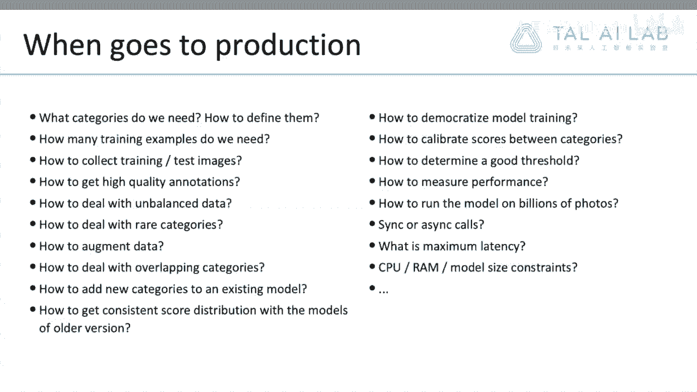

---

面对这些挑战，一个稳健的后台服务架构至关重要。接下来，我们看看如何部署一个大规模的图像理解服务。

## 四、 大规模图像理解服务架构

这里主要介绍两种服务部署方案：同步服务和异步服务。

### 同步服务架构

这是一种实时服务模式。用户发送包含图片的请求到后台。后台将图片存入数据仓库，同时向图像理解服务集群发起一个同步RPC请求。负载均衡器从集群中（例如1000台服务器）选择一台机器，将请求分发过去。该机器运行训练好的CNN模型，将结果存入数据库并返回。

这种架构需要考虑的问题包括：
*   **超时设置**: 运行CNN模型耗时较长（CPU机器可能每秒仅处理几个请求），需要设置合理的超时时间。
*   **负载均衡策略**: 当单机处理能力有限时，简单的随机选择可能无法平衡负载。需要设计适合长处理任务的负载均衡策略。
*   **跨区域部署**: 如果服务器部署在不同区域或大洲，如何进行跨区域的负载均衡。

同步方案结构简单，但存在资源利用率问题。线上请求通常有高峰和低谷。如果按峰值配置服务器，在低谷时会有大量服务器闲置，导致利用率低下。

### 异步服务架构

为了解决资源利用率问题，可以采用异步方案。用户请求不再直接发给后台服务，而是先放入一个队列。后台服务器在处理完当前任务后，主动从队列中拉取下一个请求。可以设置多个优先级队列，优先处理高优先级任务。

这种方案的好处是无需按峰值配置资源，可以用更少的机器提供服务。但它不是实时模式，而是异步处理模式。

在实际场景中，通常需要同时满足同步和异步的需求，因此会采用混合部署模型。

---

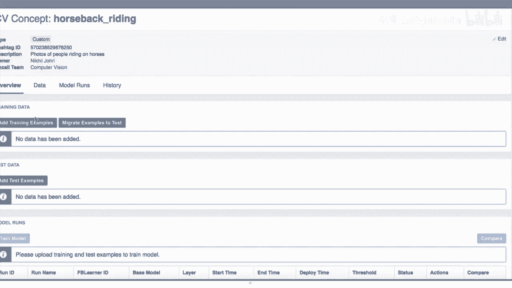

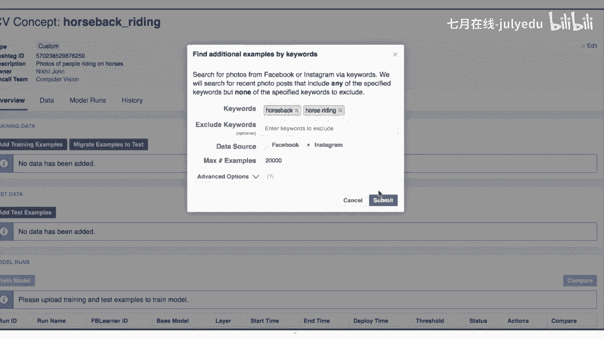

介绍完服务架构，我们来看一个具体的例子：如何设计和搭建一个自助式的AI模型训练与部署平台。

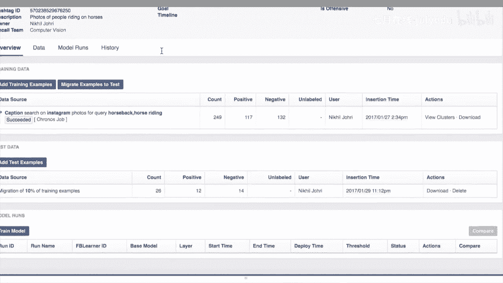

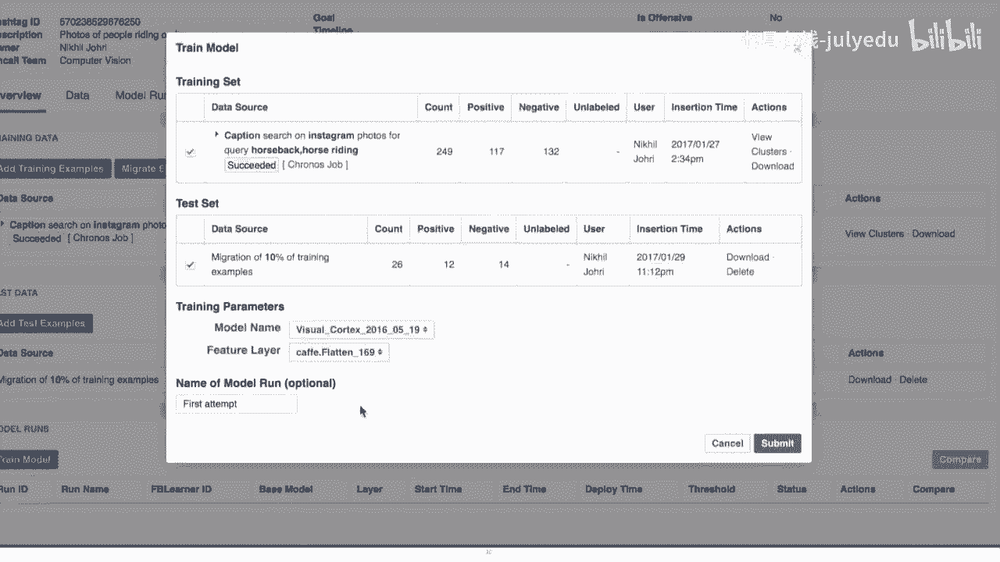

## 五、 自助式AI平台实践：以Facebook的Lumos为例

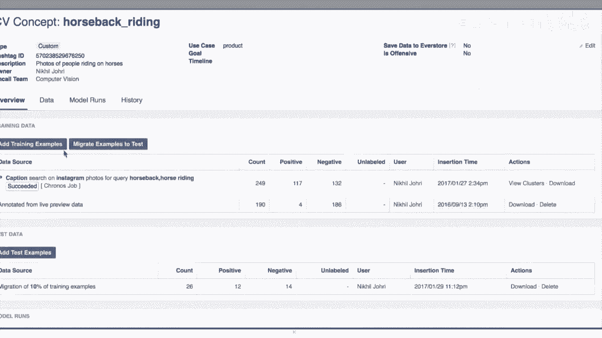

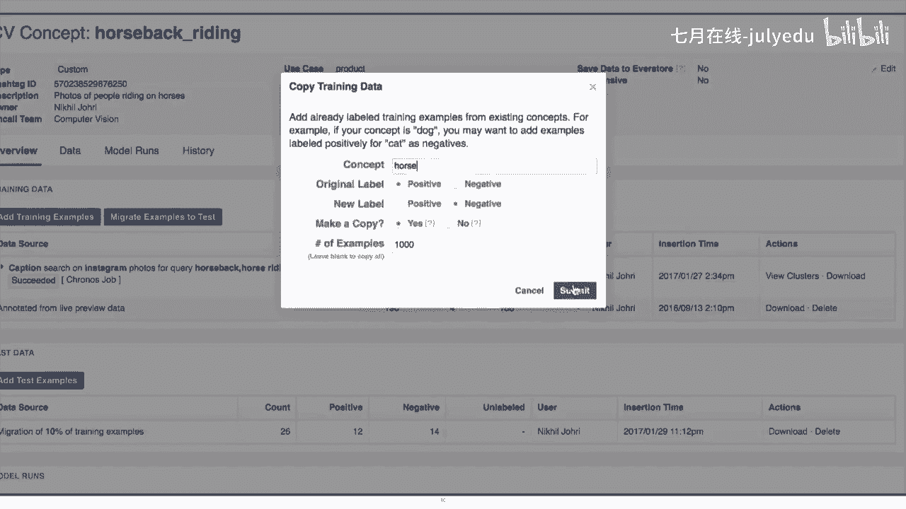

这种自助式平台（在Facebook内部称为Lumos）每天处理数十亿张图片。它帮助产品团队描述图片内容、为视障人士提供语音描述、筛选值得纪念的老照片/视频、提升图片/视频搜索效果以及过滤不良内容。

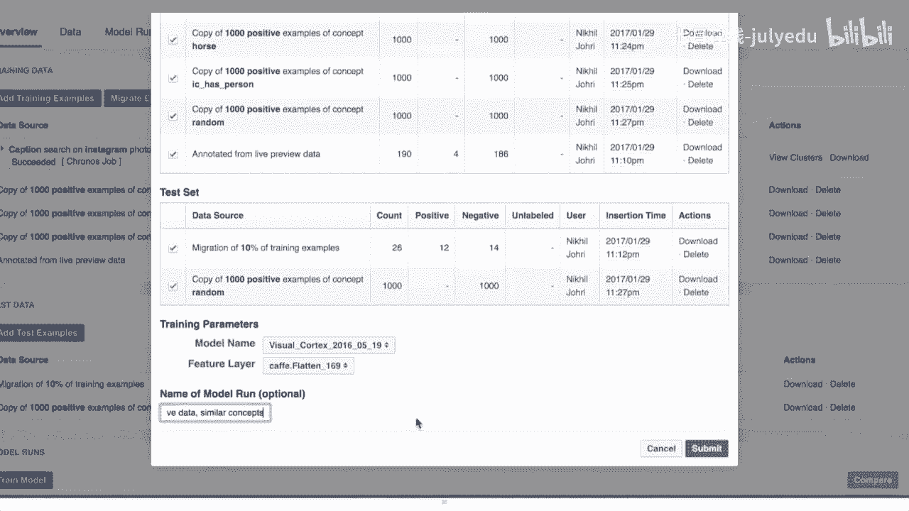

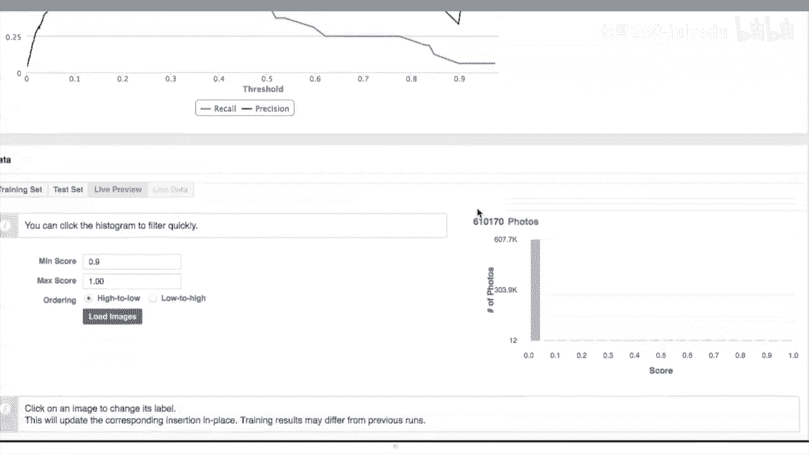

平台的核心价值在于，当平台搭建完成后，算法团队无需为每个产品需求单独训练模型，产品团队或客户可以直接在平台上使用自己的数据训练所需模型。

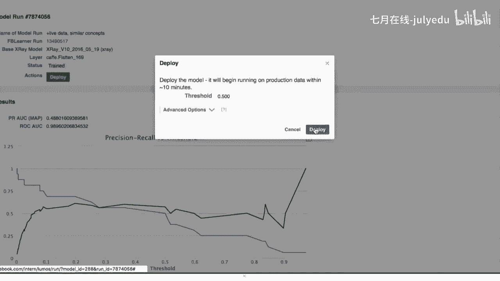

### 平台工作原理

以图像识别为例，平台后端可能运行多种主流模型（如ResNet）。训练一个ResNet模型通常需要数小时甚至数天。如果每个应用场景都单独训练模型，请求会越来越多，算法团队将无法承受。

解决方案是：
1.  使用海量数据（千万或亿级别）预先训练一个强大的主模型。
2.  当有新训练任务时，不是从头训练，而是利用主模型提供的图像表征（特征）进行迁移学习。

用户可以在平台上选择从主模型的哪一层提取特征：
*   **选择较前的层**: 特征更偏向图像底层信息，后续需要添加较大的模型进行训练，训练相对不便，但针对特定场景可能获得更高精度。
*   **选择最后的层（如倒数第二层）**: 特征已经是高维语义信息，后续可能只需加一个线性分类器。训练负担极轻（几分钟即可完成），但性能可能因未针对数据优化而受影响。

这本质上是精度与速度/便利性的权衡。

### 平台使用演示

以下是一个用户使用该平台训练“人骑马”分类模型的简化流程：
1.  **创建模型**: 用户创建一个名为“人骑马”的新模型。
2.  **搜集数据**: 从社交平台根据标签搜索相关图片。
3.  **数据聚类与标注**: 系统对搜索到的图片进行聚类，将相似图片分组。用户只需对聚类中心进行标注（如“正样本：人骑马”、“负样本：只有马”），大大提升了标注效率。
4.  **提交训练**: 用户选择特征层（例如最后一层），提交训练任务。由于模型简单，训练在一分钟内完成。
5.  **评估与迭代**: 系统展示模型在测试集上的性能（如准确率、ROC曲线）。用户可以将模型部署到线上测试，将识别错误的样本加入训练集，重新训练以提升模型性能。
6.  **搜集负样本**: 为了提升模型区分度，可以专门搜索“马”的标签，将这些图片作为负样本加入训练。
7.  **模型上线**: 设定合适阈值后，将模型部署上线，与其他视觉模型一起处理海量图片。

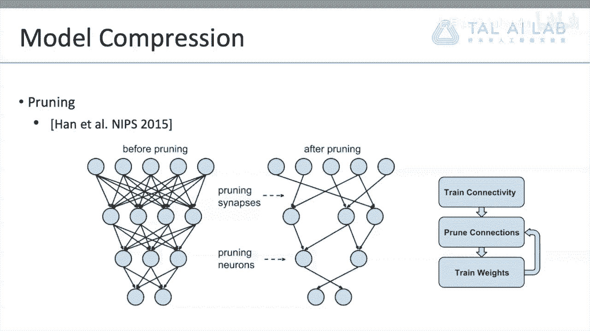

---

之前我们介绍了后台云服务，接下来我们看看如何将视觉模型部署到资源受限的移动端。

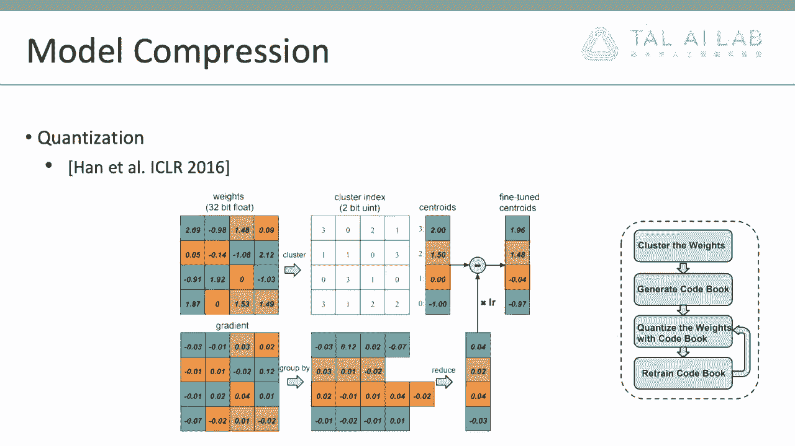

## 六、 移动端计算机视觉模型部署

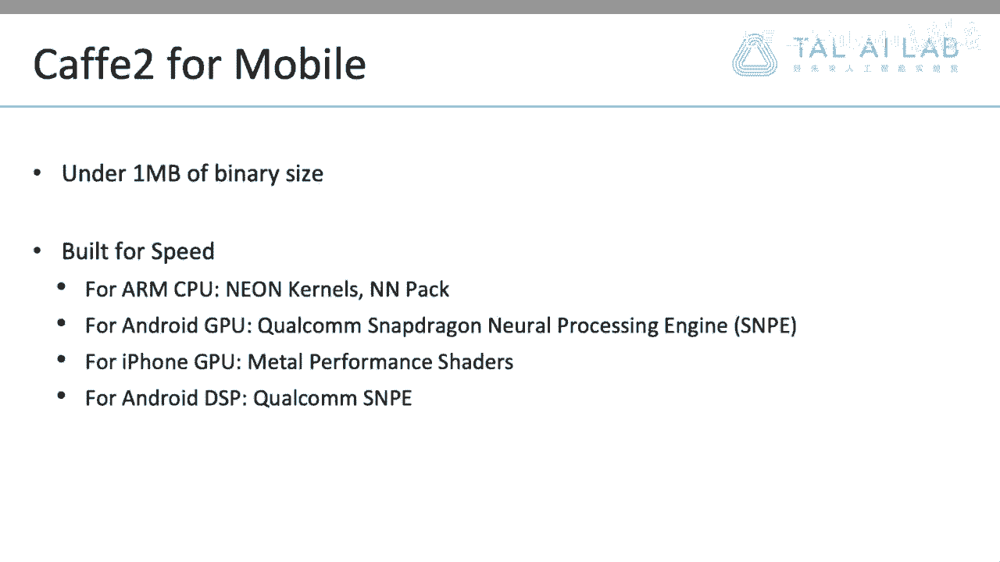

在手机上运行神经网络模型与在GPU服务器上有很大不同，受限于CPU、内存和功耗。近年来大部分深度学习研究集中在提高模型精度，这些模型并非为手机设计，无法直接移植。

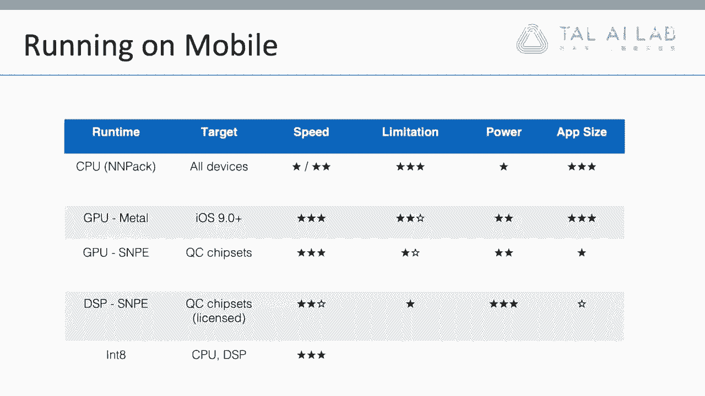

例如，ResNet-50有50层卷积和全连接层，对一张图片需要进行数十亿次运算，其大小和计算量都无法在手机上运行。因此，我们需要专门为移动端设计小而高效的网络结构，在速度和精度间取得平衡。

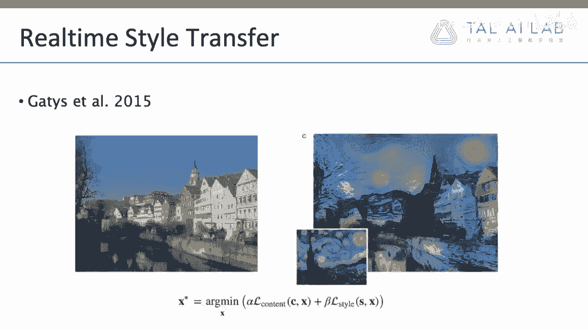

### 高效的移动端网络结构

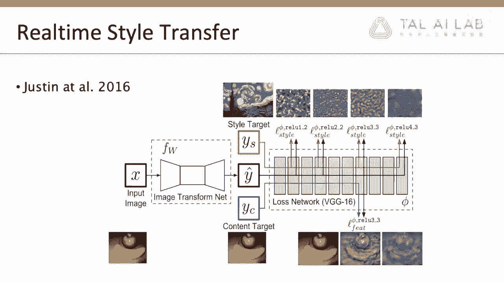

以下是几种专为移动端设计的高效模型：
*   **SqueezeNet (2016)**: 包含称为“Fire Module”的结构，由1x1和3x3卷积组成。模型大小仅为AlexNet的1/50，但能达到相近的精度。
*   **MobileNet (Google)**: 使用深度可分离卷积，将标准卷积分解为：
    1.  **逐通道卷积**: 对每个输入通道单独进行卷积。
    2.  **逐点卷积**: 使用1x1卷积核融合各通道信息。
    这种方法能极大减少计算量和模型大小。标准卷积计算量涉及6个维度参数，逐通道卷积减少到5个，逐点卷积减少到4个。将二者结合，计算量远小于标准卷积。
*   **ShuffleNet (旷视科技)**: 使用分组卷积，并通过“通道重排”操作来促进组间信息交流，防止分组导致的信息隔离，从而在保持小模型的同时获得良好效果。
后续还有MobileNet V2, ShuffleNet V2等一系列改进工作。

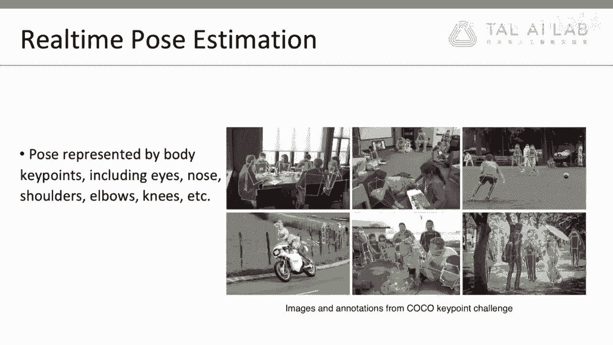

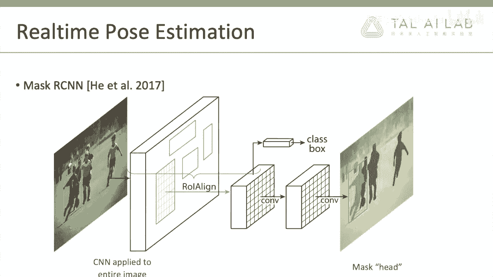

### 模型压缩技术

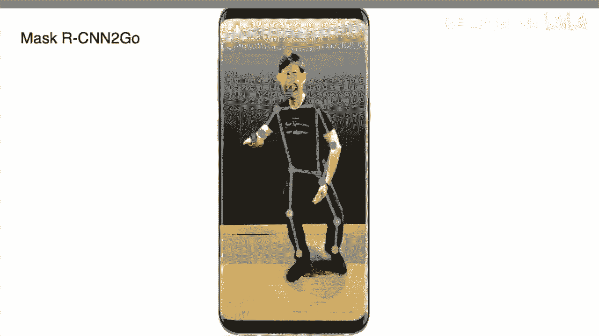

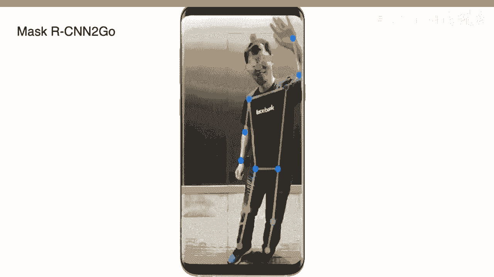

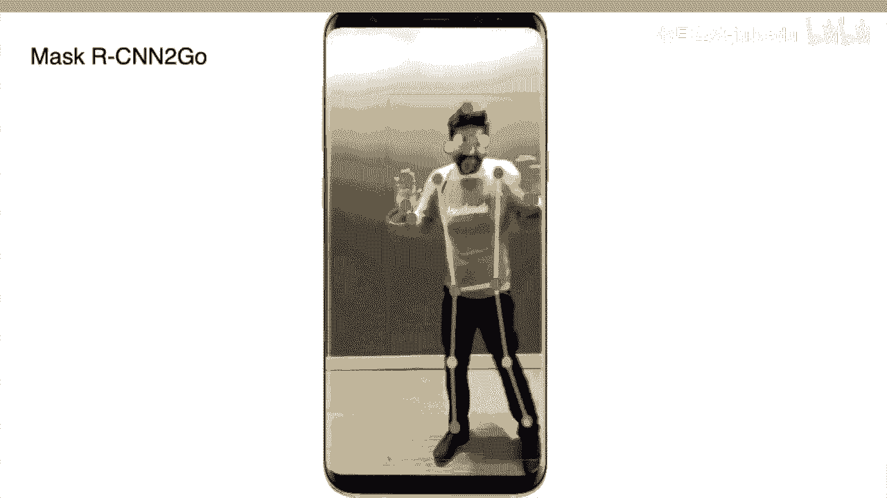

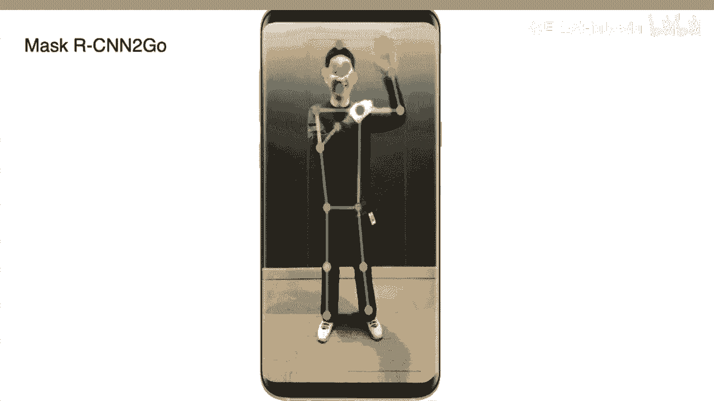

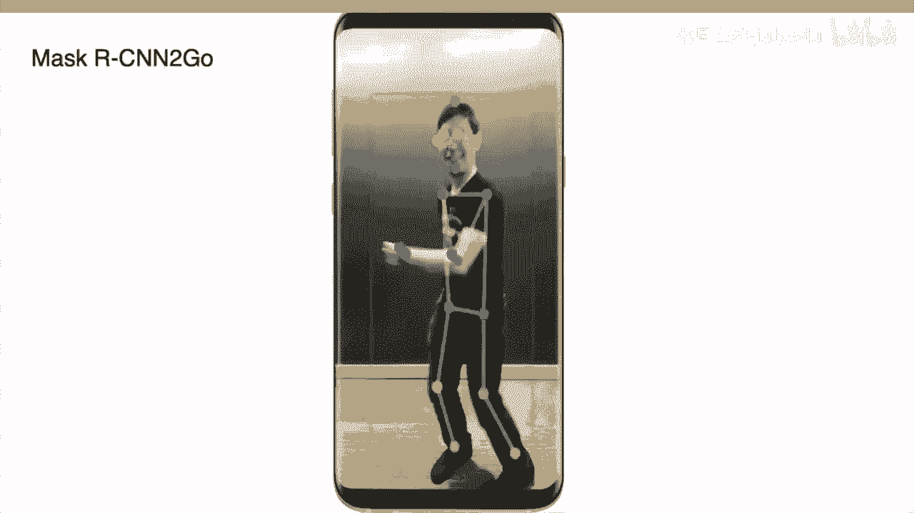

除了设计小模型，还可以对已有大模型进行压缩。

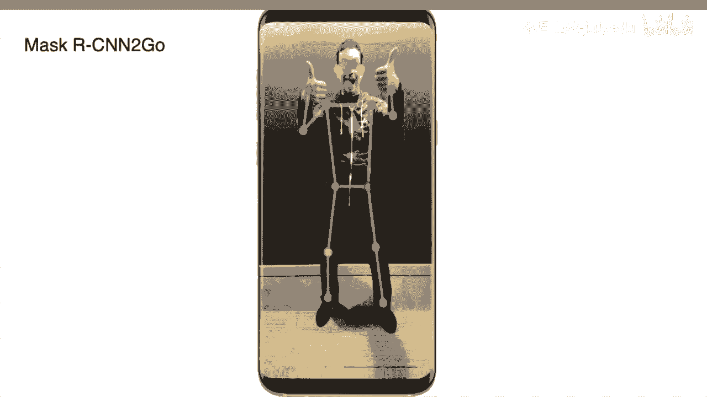

*   **网络剪枝**: 移除网络中不重要的连接。例如，首先训练一个完整网络，然后将接近于零的权重剪掉，再对剪枝后的网络进行微调，通过迭代得到既保持精度又大幅减少参数量的模型。
*   **量化**: 将网络权重从32位浮点数转换为8位整数。虽然会损失一定精度，但通过聚类、码本等技术，许多模型在8位量化后仍能保持近似原始精度。量化能将模型大小压缩至原来的1/4。
    *   **结合使用**: 可以同时使用剪枝和量化，在实验中可将模型压缩至原来的1/8且精度不变。

### 移动端推理框架与实践

在实际产品中，可以使用专为移动端优化的框架，如**Caffe2**。Caffe2的安装包小于1MB，非常轻量。在手机端，模型可以选择在CPU、GPU或DSP上运行。
*   **CPU**: 可使用NNPACK等库加速。
*   **GPU (iOS)**: 使用Apple的Metal Performance Shaders。
*   **GPU/DSP (Android, 高通芯片)**: 使用高通提供的Snapdragon Neural Processing Engine (SNPE)。
使用DSP进行推理能耗非常低，适合长时间运行神经网络模型（如监控、持续预测）。

### 移动端应用实例

以下是两个在手机上实时运行的计算机视觉应用例子：
1.  **实时风格迁移**: 基于Justin Johnson等人2016年的方法（Image Transform Net），通过模型和底层工程优化，在手机上对720P图片实现了接近实时的艺术风格转换。
2.  **实时人体姿态估计**: 检测人体关键点（如眼睛、肩膀、手肘、手腕）来描述姿态。采用基于Mask R-CNN（何恺明，2017）的网络结构，它是一个通用框架，可同时完成物体检测、特征提取和分割。通过SNPE优化，在三星Galaxy S7等设备上实现了实时姿态估计。

---

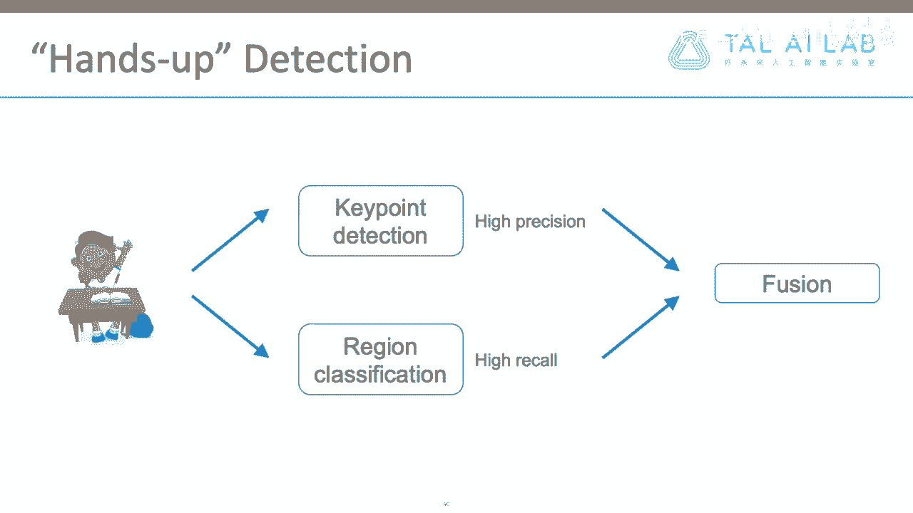

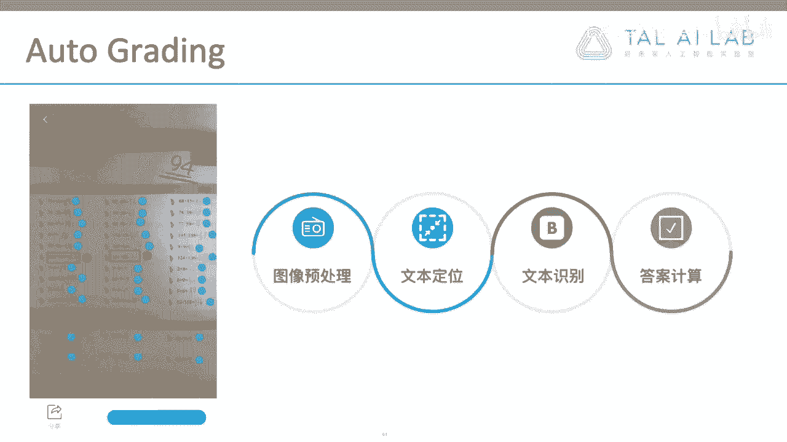

最后，我们将视角转向一个特定的垂直领域，看看计算机视觉技术如何与教育场景深度融合。

## 七、 AI在教育行业的应用实践

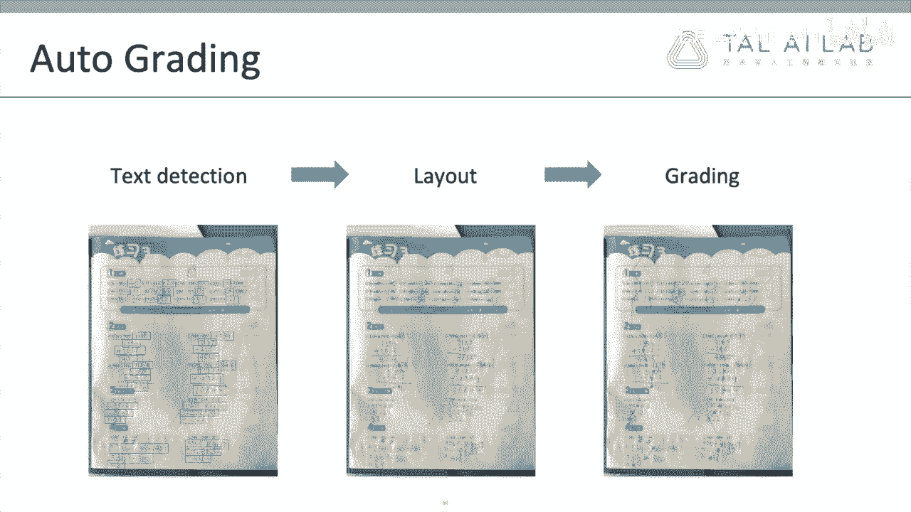

教育行业的核心痛点在于优质教育资源稀缺。AI技术可以融入传统教育场景，提升教学效率和效果。

### AI技术在教育中的应用方向

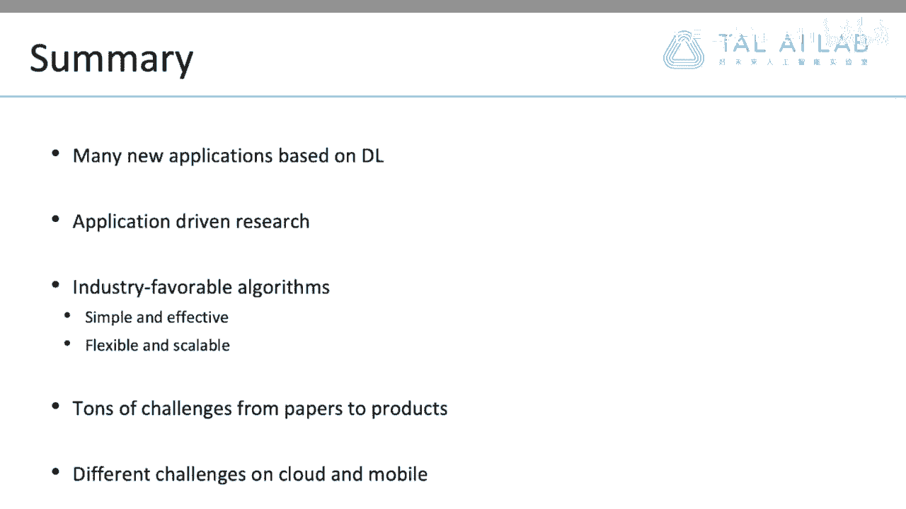

*   **计算机视觉**: 人脸分析、人体姿态与动作分析、手势识别、OCR自动判题/阅卷。
*   **语音技术**: 语音识别、语音合成、基于对话的语音评测（尤其用于非母语学生的语言练习）。
*   **自然语言处理**: 语义理解、作文自动评分。
*   **数据挖掘**: 个性化学习路径推荐、自适应练习设计。

### 智慧课堂：重新定义课堂40分钟

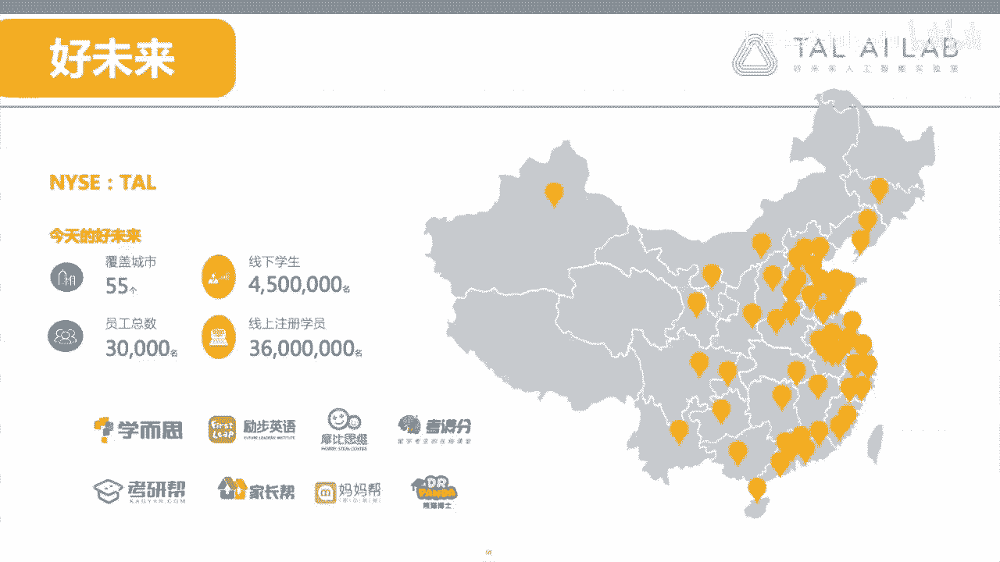

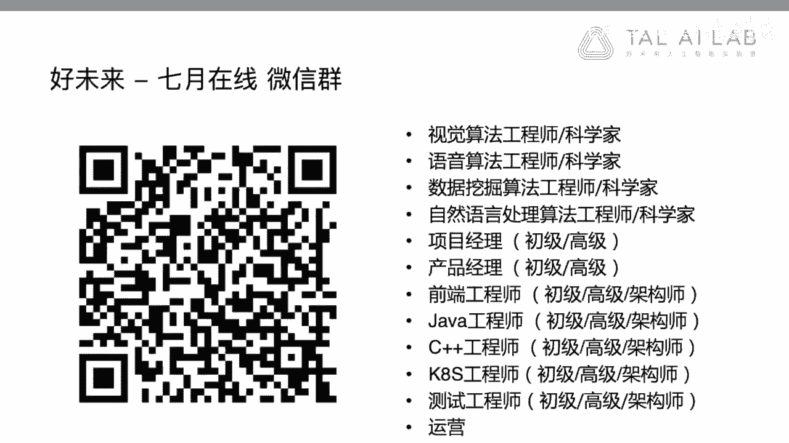

目标是将AI技术融入课堂互动，为每个学生提供个性化的关注和互动，并提供