# 🎯 人工智能—计算机视觉CV公开课（七月在线出品） - P5：目标检测这些年的那些事

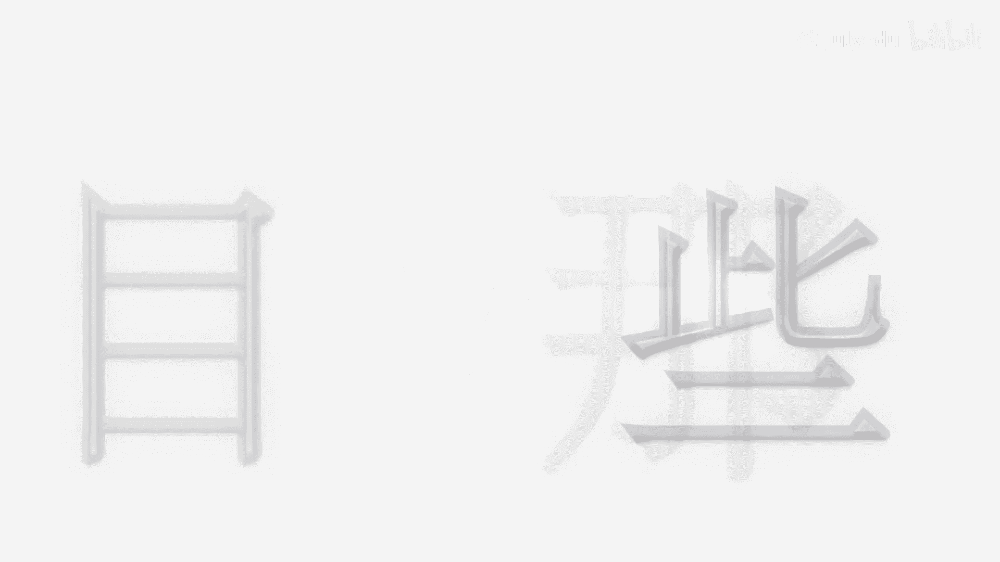

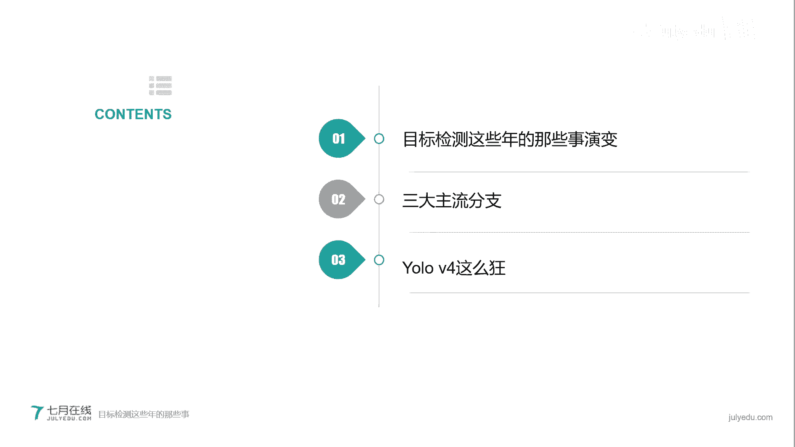

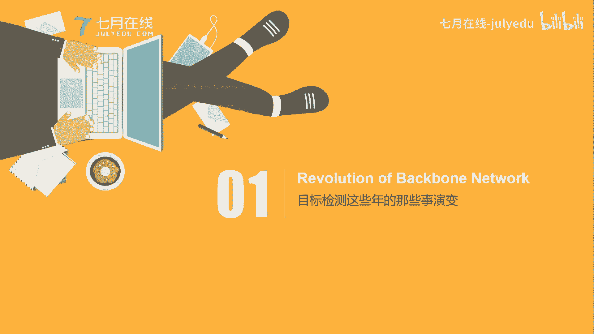

在本节课中，我们将要学习目标检测技术在过去几年的发展历程。我们将从骨架网络的演变开始，了解目标检测的基础。接着，我们会探讨目标检测的三大主流分支及其经典框架。最后，我们会分析近期大热的YOLOv4，了解其成功的原因。

## 🦴 第一部分：骨架网络的演变

目标检测的演变，很大程度上依赖于其骨架网络的进步。骨架网络通常指用于提取图像特征的卷积神经网络。

上一节我们介绍了课程概述，本节中我们来看看目标检测的基石——卷积神经网络是如何演进的。

### 卷积神经网络与目标识别

卷积神经网络主要解决目标识别问题，即图像分类问题。例如，区分台式机、笔记本电脑和平板电脑都属于电脑大类，但需要根据大小、形状等特征细分为不同小类。

计算机通过寻找目标的特征来进行识别。常见的特征包括：

*   **颜色特征**：例如用RGB（红、绿、蓝）通道表示图像，每个通道取值范围为0-255或0-1。
*   **形状特征**：例如图像中的线条、角点等结构。
*   **纹理特征**：例如图像中重复的图案，如六边形网格。

CNN之所以适用于图像识别，是因为它能在图像的不同区域发现相同的特征。例如，识别不同鸟类时，都可以用专门的神经元来检测“鸟嘴”这一特征，并且这些神经元可以共享参数。

### 从AlexNet到ResNet：深度与梯度消失

随着网络层数加深，模型识别能力似乎会增强。从AlexNet（8层）到VGG（19层），再到GoogLeNet（22层），模型的错误率在不断下降。

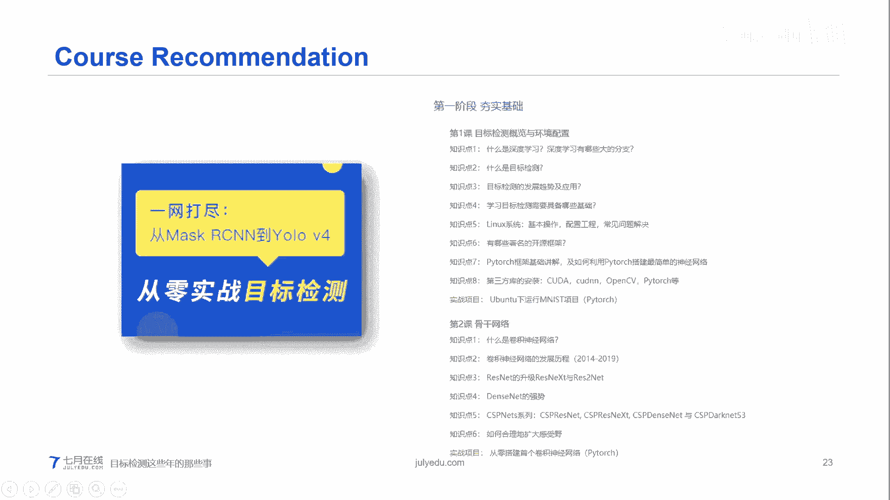

然而，无限制地增加网络深度会导致**梯度消失**问题，即在反向传播过程中，梯度变得极小，使得网络无法有效学习。

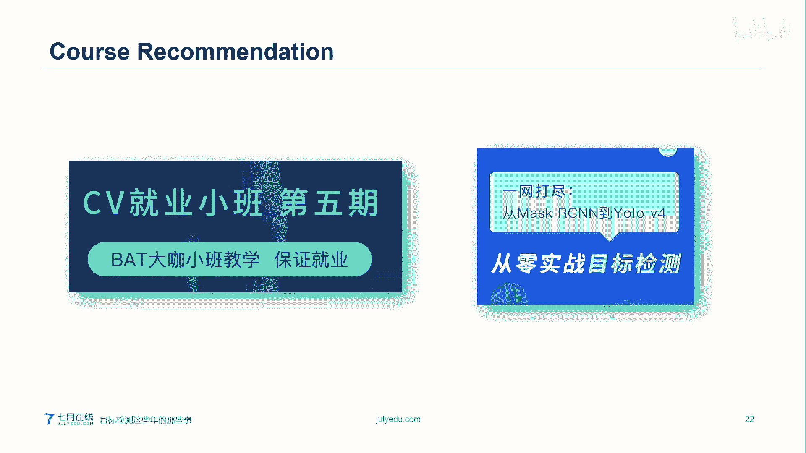

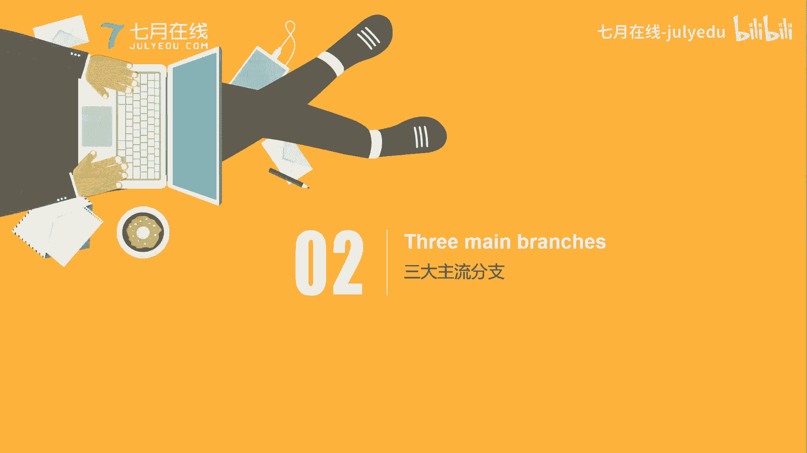

ResNet（残差网络）通过引入**残差连接** 解决了这个问题。其核心思想是在进行非线性变换前，将输入直接加到输出上。公式可以表示为：
`输出 = F(x) + x`
其中，`x`是输入，`F(x)`是网络学习到的残差映射。这种方式确保了梯度能够有效传播，即使网络很深（如152层），也能有效训练。

### DenseNet与CSPNet：更高效的特征传递

在ResNet之后，DenseNet提出了更密集的连接方式。它不仅将前一层的输出引到后一层，还将前面所有层的特征图都连接到后面每一层的输入。这通过**拼接（Concatenation）** 操作实现，而非像素相加。

DenseNet能更有效地利用特征，并在一定程度上减少参数量。

CSPNet则是一种网络设计思想，而非单一网络。它针对如DenseNet等网络进行改进。其核心思想是将输入特征图**分割（Partition）** 为两部分：一部分直接传递到网络末端，另一部分进行密集的卷积计算。最后再将两部分特征融合。

CSPNet这样做的好处是增加了梯度路径的多样性，同时减少了计算量。

## 🔍 第二部分：目标检测的主流分支

在了解了骨架网络的发展后，我们来看看目标检测本身是如何演进的。目标检测不仅要识别图像中的物体是什么（分类），还要找出它们的具体位置（定位）。

### 目标检测的核心思想

目标检测的输出通常是一个包含多个信息的向量。例如，对于一张图，我们不仅要知道有没有“狗”，还要用一个**边界框（Bounding Box）** 框出狗的位置，并用坐标`(Bx, By, Bw, Bh)`表示这个框的中心点和宽高。

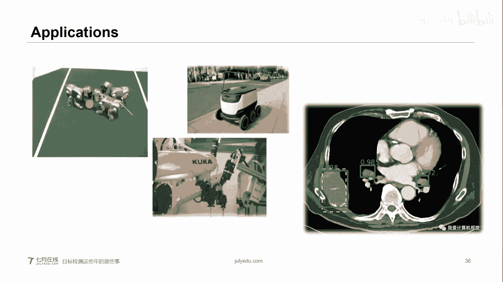

整个过程的优化目标是最小化**损失函数（Loss Function）**，即让网络预测的边界框和类别无限接近人工标注的真实值。

评估预测框好坏的一个关键指标是**交并比（IoU）**，其公式为：
`IoU = 交集面积 / 并集面积`
IoU值越高，说明预测框与真实框重叠越好。我们通常设置一个阈值（如0.5），只保留IoU高于阈值的预测框，并采用**非极大值抑制（NMS）** 等方法筛选出最终的最佳预测框。

### 应用领域

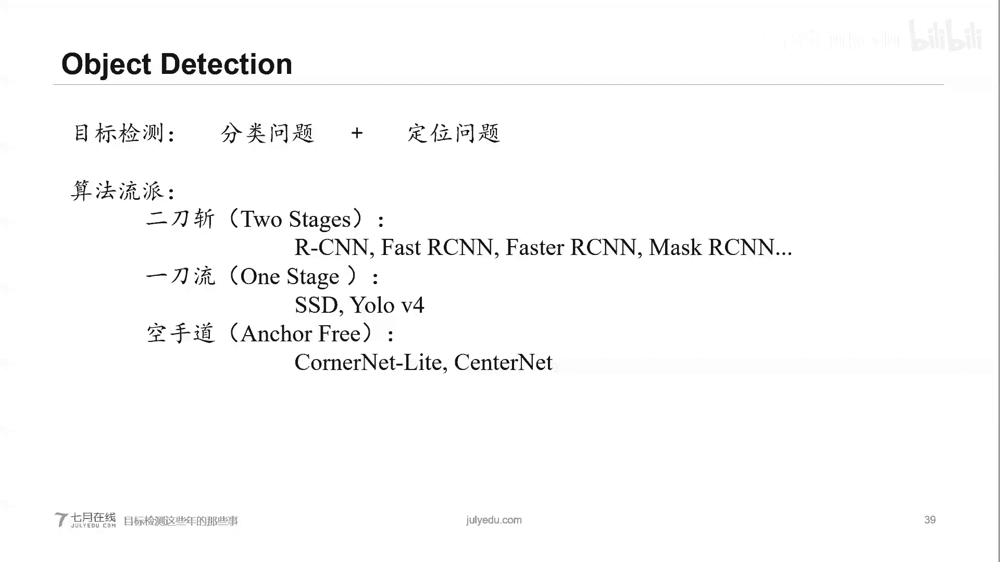

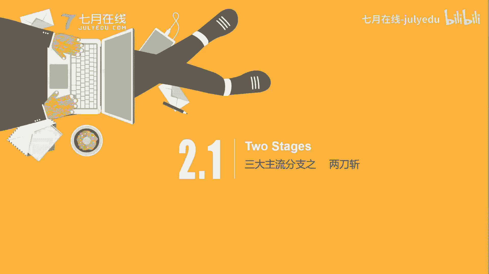

目标检测技术已广泛应用于多个领域：
*   **车牌识别**：成熟的传统CV与深度学习结合的应用。
*   **自动驾驶**：检测车辆、行人、交通标志等。
*   **安防监控**：行人检测、人流统计、逃犯追踪。
*   **图像搜索**：通过拍照识别建筑物或地标。
*   **工业自动化**：物流分拣机器人、机械臂抓取等。
*   **医疗影像**：在CT等影像中定位病灶区域。

### 三大算法流派

目标检测算法主要分为三大流派：

1.  **两阶段检测器（Two-Stage）**：如Faster R-CNN。先由区域提议网络（RPN）生成可能存在目标的候选区域（Region Proposals），再对这些区域进行分类和边框回归。精度高，速度相对慢。
2.  **一阶段检测器（One-Stage）**：如YOLO、SSD。将目标检测视为回归问题，直接在图像上预测边界框和类别。速度快，精度通常略低于两阶段方法。
3.  **Anchor-Free检测器**：如CornerNet、CenterNet。摒弃了预设锚框（Anchor）的设计，通过预测目标的关键点（如角点、中心点）来构成边界框。是近年来的研究热点。

#### 两阶段检测器代表：Mask R-CNN

Mask R-CNN是在Faster R-CNN基础上的扩展，增加了一个**掩码分支（Mask Branch）**，用于进行**实例分割**——不仅框出物体，还能精确勾勒出物体的像素级轮廓。

其骨干网络常采用**特征金字塔网络（FPN）**，通过融合深层的高语义特征和浅层的高分辨率特征，来同时检测大目标和小目标。

在RPN阶段，会使用预定义的**锚框（Anchor）** 来在图像上滑动，初步判断每个位置是否有目标（二分类）以及初步的边框位置（回归）。这些锚框的大小和长宽比通常通过对训练数据集中所有真实框进行**K-Means聚类** 来确定。

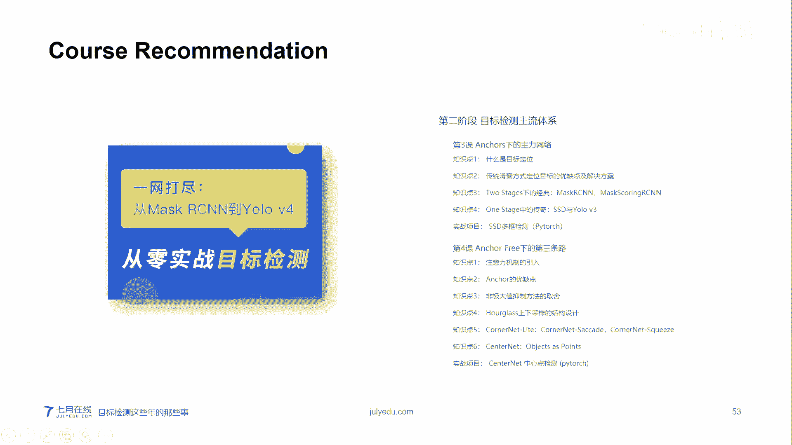

#### 一阶段检测器代表：SSD

SSD的核心思想非常直接：**特征提取 + 多尺度检测**。它直接在VGG等骨干网络提取的不同层特征图上，使用小卷积核进行密集预测。

例如，在某个38x38的特征图上，每个单元格（Cell）会基于多个预定义锚框预测21个类别的分数（20个目标类+1个背景类）和4个边框坐标偏移量。SSD在多个不同尺度的特征图上进行预测，浅层特征图负责检测小物体，深层特征图负责检测大物体。

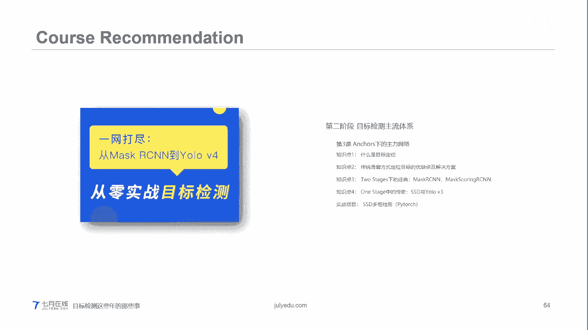

#### Anchor-Free检测器代表：CornerNet 与 CenterNet

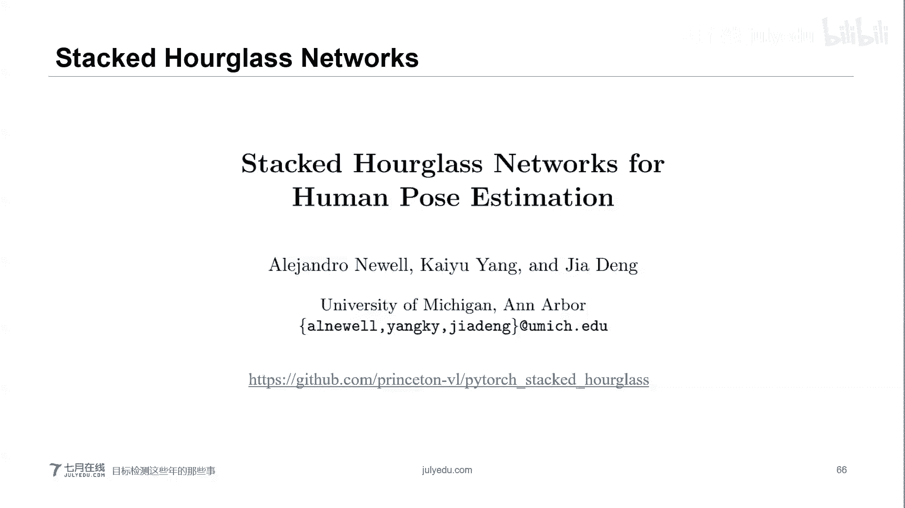

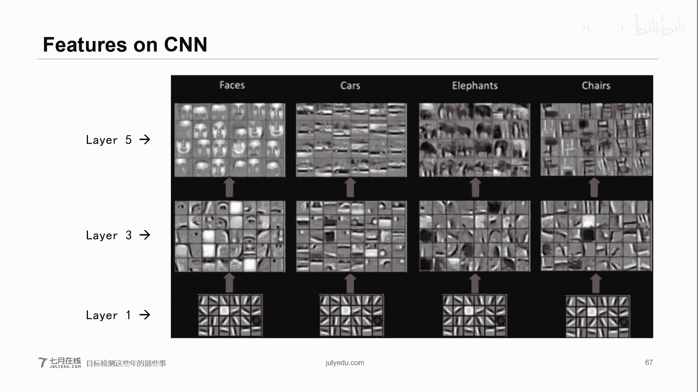

**CornerNet** 放弃了锚框，改为预测目标框的**左上角**和**右下角**两个关键点。对于每个角点，网络不仅预测其位置的热力图（Heatmap），还预测一个**嵌入向量（Embedding）**。通过计算两个角点嵌入向量的相似度，将属于同一个目标的角点配对，从而形成边界框。

**CenterNet** 则进一步提出，只预测角点可能无法感知目标内部信息。因此，它在预测角点的同时，额外预测一个**中心点**。如果预测的边界框的中心点也落在目标区域内，则认为该预测更可靠。CenterNet将CornerNet的单阶段结构改进为了两阶段结构。

## ⚡ 第三部分：YOLOv4 为什么这么“狂”？

最后，我们来聊聊现象级的YOLOv4。在学术界，YOLOv4被广泛认可为YOLO系列的当前最新里程碑版本。

YOLOv4的贡献更像是一份详尽的“**调参手册**”和“**技巧宝典**”。其论文系统性地总结了大量能提升CNN性能的“免费赠品（Bag of Freebies）”和“特别技巧（Bag of Specials）”。

*   **Bag of Freebies**：指那些仅增加训练成本而不影响推理速度的方法，如数据增强（CutMix, Mosaic）、正则化（DropBlock）、损失函数设计（CIoU Loss）等。
*   **Bag of Specials**：指那些轻微增加推理成本但能显著提升精度的方法，如特殊的注意力模块、激活函数（Mish）、后处理方法（DIoU-NMS）等。

YOLOv4的核心结构由三部分组成：
1.  **骨干网络（Backbone）**：采用CSPDarknet53，结合了CSPNet的思想和Darknet架构。
2.  **颈部网络（Neck）**：采用SPP（空间金字塔池化）和PANet（路径聚合网络），用于增强特征融合。
3.  **检测头（Head）**：沿用YOLOv3的检测头。

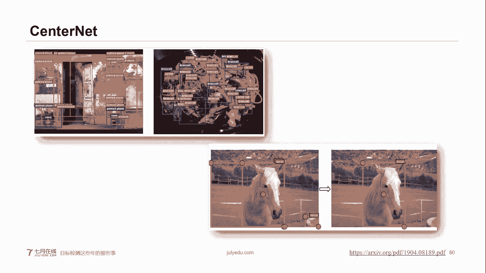

YOLOv4并非在算法结构上有颠覆性创新，而是通过**精妙的工程集成与实验验证**，将当时各种最有效的技巧融合到一个框架中，从而在速度和精度上达到了极佳的平衡，**落地应用能力非常强**。

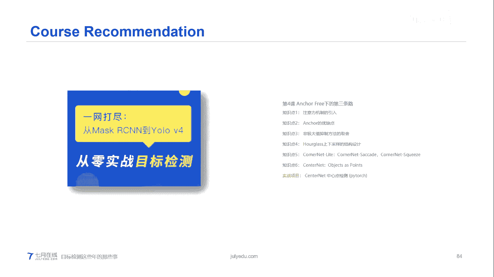

## 📚 总结

本节课中我们一起学习了目标检测技术的发展脉络。

我们首先回顾了作为目标检测基础的骨架网络，从AlexNet、VGG到ResNet、DenseNet和CSPNet，看到了网络如何通过结构创新解决深度带来的梯度消失问题，并实现更高效的特征传递。

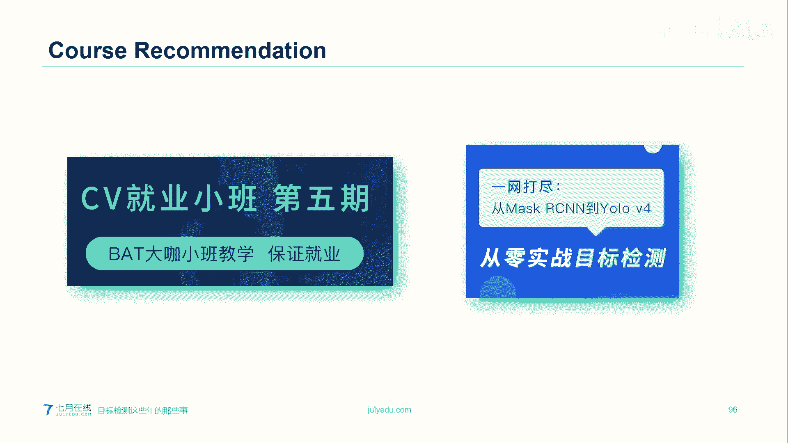

接着，我们深入探讨了目标检测的三大主流分支：追求高精度的**两阶段检测器**（如Mask R-CNN），追求高效率的**一阶段检测器**（如SSD），以及摒弃锚框、思路新颖的**Anchor-Free检测器**（如CornerNet, CenterNet）。我们了解了它们各自的核心思想、工作流程和代表性框架。

最后，我们分析了**YOLOv4**成功的原因。它通过系统性地集成大量经过验证的训练技巧和网络模块，在工程实践上达到了新的高度，成为目标检测领域一个非常实用和强大的工具。

希望本教程能帮助你勾勒出目标检测领域的演进画卷，并为你的进一步学习打下基础。